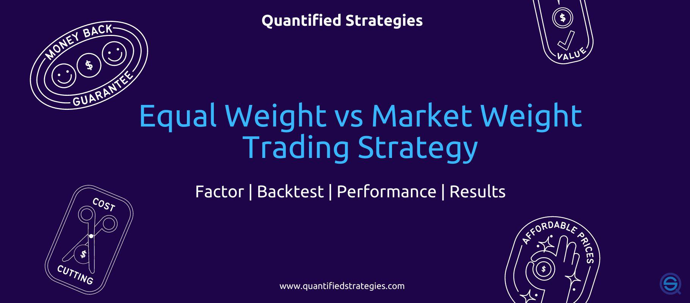

## Table of Contents

## What is an equal weight investment strategy?

An equal weight investment strategy is a way of investing where you put the same amount of money into each stock or asset in your portfolio. Instead of putting more money into bigger companies, you treat all the stocks the same. For example, if you have $100 to invest in 10 different stocks, you would put $10 into each one, no matter how big or small the company is.

This strategy can be good because it helps spread out your risk. If one company does badly, it won't hurt your whole portfolio as much because it's just a small part of it. But, it can also mean you might miss out on bigger gains from bigger companies. Equal weight strategies are often used in index funds or ETFs, where the goal is to match the performance of a whole market or sector, rather than trying to pick winners.

## How does an equal weight strategy differ from market cap weighting?

An equal weight strategy and a market cap weighting strategy are two different ways to build an investment portfolio. In an equal weight strategy, you put the same amount of money into each stock or asset. For example, if you have $100 and want to invest in 10 stocks, you would put $10 into each one. This means smaller companies get the same amount of money as bigger ones. The idea is to give every company an equal chance to affect your portfolio's performance.

On the other hand, a market cap weighting strategy puts more money into bigger companies. Market cap, or market capitalization, is how much a company is worth on the stock market. In this strategy, if you have $100 to invest in 10 stocks, you would put more money into the stocks of companies with higher market caps. For example, if one company is worth a lot more than the others, you might put $50 into that one stock and split the rest among the other nine. This means your portfolio's performance will be more influenced by the bigger companies.

## What are the basic steps to implement an equal weight portfolio?

To start an equal weight portfolio, first pick the stocks or assets you want to include. You can choose stocks from different industries or sectors, or you can focus on a specific market or theme. The important thing is to decide how many different stocks you want in your portfolio. Once you have your list, divide your total investment money equally among all the stocks. For example, if you have $1,000 and you choose 10 stocks, you would put $100 into each one.

After you set up your portfolio, you need to keep it balanced. Over time, some stocks will go up in value and others might go down. This means the equal weight you started with will change. To fix this, you'll need to rebalance your portfolio regularly. Rebalancing means selling some of the stocks that have gone up a lot and buying more of the ones that have gone down, so that each stock is back to having the same amount of money invested in it. How often you rebalance can depend on your goals and how much time you want to spend managing your portfolio.

## Can you explain the benefits of an equal weight investment approach for beginners?

An equal weight investment approach can be really helpful for beginners because it's easy to understand and set up. You just pick a bunch of different stocks and put the same amount of money into each one. This way, you don't have to worry about figuring out which big companies to invest more money in. It's like spreading your bets evenly across the table, so if one stock doesn't do well, it won't hurt your whole investment as much.

Another good thing about an equal weight approach is that it can help you get more variety in your investments. By putting the same amount into each stock, you end up with a mix of big and small companies. This can be a good way to learn about different parts of the market without putting all your eggs in one basket. Plus, when you rebalance your portfolio, you're basically buying low and selling high, which is a smart move for any investor, especially beginners who are still learning the ropes.

## What are the potential risks associated with equal weight strategies?

One risk of an equal weight strategy is that it might not do as well as a strategy that puts more money into bigger companies. Big companies often grow more than small ones, so if you put the same amount of money into every company, you might miss out on those bigger gains. For example, if a big company like Apple or Amazon does really well, but you only put a little bit of money into it because you're using an equal weight strategy, you won't make as much money as someone who put a lot of money into those big companies.

Another risk is that it can take more work to keep your portfolio balanced. With an equal weight strategy, you need to check your investments regularly and make changes to keep everything equal. This can be hard for beginners because it means you have to keep buying and selling stocks, which can cost money in fees and take a lot of time. If you don't rebalance often enough, your portfolio might end up looking more like a market cap weighted one, which could mean you're not really following the equal weight strategy anymore.

## How does rebalancing affect the performance of an equal weight portfolio?

Rebalancing is important for keeping an equal weight portfolio working the way it should. When you start your portfolio, you put the same amount of money into each stock. But over time, some stocks will go up and others will go down. This means that the stocks that went up now take up a bigger part of your portfolio, and the ones that went down take up a smaller part. If you don't fix this, your portfolio won't be equal weight anymore. Rebalancing means you sell some of the stocks that went up and buy more of the stocks that went down, so everything is back to being equal.

Rebalancing can help your portfolio do better in the long run. When you rebalance, you're selling stocks that have gone up a lot and buying ones that have gone down. This is like buying low and selling high, which is a good way to make money. But, rebalancing can also cost money because you might have to pay fees every time you buy or sell stocks. So, you need to think about how often to rebalance. Doing it too often can eat into your profits, but not doing it enough can mean your portfolio drifts away from being equal weight, which might not be what you want.

## What historical performance data supports the use of equal weight strategies?

Looking at history, equal weight strategies have often done better than market cap weighted strategies over long periods of time. For example, the S&P 500 Equal Weight Index, which gives the same weight to all 500 companies in the S&P 500, has beaten the regular S&P 500 Index, which gives more weight to bigger companies, in many years. This is because smaller companies in the equal weight index can grow faster than the big companies that dominate the market cap weighted index. Over the last 20 years, the equal weight version of the S&P 500 has had higher returns than the market cap weighted version, showing that spreading your money evenly can pay off.

However, equal weight strategies can be more up and down than market cap weighted ones. This means they can have bigger swings in value, which can be scary for some investors. But, over the long run, the extra returns from equal weight strategies can make up for these ups and downs. For example, during the 2008 financial crisis, the equal weight S&P 500 fell less than the market cap weighted S&P 500. This shows that equal weight strategies can sometimes be less risky during tough times, even if they can be more volatile in normal times.

## How do equal weight strategies perform across different market sectors?

Equal weight strategies can perform differently depending on which market sector you look at. In some sectors, like technology, where big companies often lead the way, an equal weight strategy might not do as well as a market cap weighted strategy. This is because the big tech companies might grow a lot more than the smaller ones, so putting the same amount of money into each company could mean missing out on the bigger gains from those big companies. But in other sectors, like small-cap stocks or industries with lots of mid-sized companies, an equal weight strategy can do better. This is because smaller companies in these sectors have more room to grow, and giving them the same weight as bigger companies can lead to higher overall returns.

For example, in the healthcare sector, an equal weight strategy might do well because there are many different kinds of companies, from big drug makers to small biotech firms. By spreading your money evenly across these companies, you can catch the growth of smaller companies that might become the next big thing. On the other hand, in sectors like energy, where a few big companies control a lot of the market, an equal weight strategy might not do as well. But over time, equal weight strategies have shown they can beat market cap weighted strategies in many sectors by giving smaller companies a chance to shine.

## What are the tax implications of maintaining an equal weight portfolio?

When you keep an equal weight portfolio, you might have to pay more in taxes because you need to rebalance it often. Rebalancing means selling stocks that have gone up a lot and buying more of the ones that have gone down. Every time you sell a stock, you might have to pay taxes on any profits you made from that sale. This can add up over time, especially if you rebalance a lot. So, even though rebalancing can help your portfolio do better, it can also mean you have to pay more in taxes.

The good news is that you can sometimes use tax-smart ways to rebalance your portfolio. For example, you can put some of your investments in tax-friendly accounts like IRAs or 401(k)s, where you don't have to pay taxes on your gains right away. Another way is to use tax-loss harvesting, which means selling stocks that have lost value to offset the taxes on the stocks that made money. By being smart about taxes, you can keep more of your money and still enjoy the benefits of an equal weight portfolio.

## How can equal weight strategies be optimized using advanced quantitative methods?

To make an equal weight strategy even better, you can use fancy math and computer programs to pick which stocks to include in your portfolio. Instead of just [picking](/wiki/asset-class-picking) stocks randomly, you can use something called "[factor](/wiki/factor-investing)-based investing." This means you look at things like how much a company grows, how much it costs compared to its earnings, or how risky it is. By choosing stocks that do well in these areas, you can make your equal weight portfolio stronger. For example, if you find that small companies with low prices compared to their earnings tend to do well, you can focus on those kinds of stocks. This way, you're not just spreading your money evenly, but you're also picking stocks that have a better chance of doing well.

Another way to make your equal weight strategy better is by using something called "risk parity." This means you look at how much risk each stock in your portfolio has and try to balance that risk evenly. Some stocks might go up and down a lot, while others might be more stable. By figuring out how much risk each stock has, you can put more money into the less risky ones and less into the riskier ones, so your whole portfolio has a balanced level of risk. This can help you keep your portfolio steady even when the market is going crazy. By using these advanced methods, you can make your equal weight strategy smarter and more likely to give you good returns.

## What role do equal weight ETFs play in modern investment portfolios?

Equal weight ETFs are a popular choice for many investors because they make it easy to follow an equal weight strategy without having to pick and manage individual stocks yourself. These ETFs automatically spread your money evenly across all the stocks in the index they track. For example, if you buy an equal weight ETF that follows the S&P 500, it will put the same amount of money into each of the 500 companies in the index. This can help you get a good mix of big and small companies without having to do a lot of work.

In modern investment portfolios, equal weight ETFs can be a great way to diversify your investments. They can help you spread your risk across many different companies and sectors, which can make your portfolio more stable. Plus, because equal weight ETFs often rebalance themselves, you don't have to worry about doing it yourself. This can save you time and help you focus on other parts of your investment strategy. Overall, equal weight ETFs are a simple and effective tool for anyone looking to build a well-rounded investment portfolio.

## How do equal weight strategies compare to other smart beta strategies in terms of risk and return?

Equal weight strategies are a type of smart beta strategy that aims to spread your money evenly across all the stocks in your portfolio. Compared to other smart beta strategies like minimum volatility or value investing, equal weight strategies can offer higher returns over the long run. This is because they give smaller companies the same chance to grow as bigger ones. However, they can also be more up and down, which means they might be riskier in the short term. For example, if you compare an equal weight strategy to a minimum volatility strategy, the equal weight one might do better over many years, but it might also have bigger swings in value along the way.

Other smart beta strategies, like [momentum](/wiki/momentum) or quality investing, focus on different things. Momentum strategies try to pick stocks that have been doing well lately and are expected to keep doing well. Quality strategies look for companies that are financially strong and well-managed. These strategies can be less risky than equal weight strategies because they often focus on more stable companies. But they might not give you the same high returns over the long run. So, if you're looking for a strategy that can potentially give you bigger gains but are okay with more ups and downs, an equal weight strategy might be a good choice. If you want something steadier, you might want to look at other smart beta strategies.

## What is Understanding Equal Weight Investing?

Equal weight investing is an investment strategy where each asset in a portfolio or index is given the same importance, regardless of the company's size or market capitalization. Unlike traditional market-cap-weighted investing, where assets are weighted according to their market capitalization, equal weight investing assigns identical weights to all included stocks. This means each stock contributes equally to the portfolio's overall performance, rather than having the largest companies dominate the index.

In market-cap-weighted strategies, larger companies have a more significant influence on index movements because the stocks are weighted in proportion to their total market capitalization. For example, within the S&P 500 Index, companies like Apple and Microsoft have substantial weightings due to their large market values. In contrast, equal weight investing ensures that smaller companies have the same impact on the index's performance as larger companies, leading to a more balanced representation.

The formal expression of an equal weight portfolio can be described using the following mathematical formula:

$$
w_i = \frac{1}{N}
$$

where $w_i$ is the weight of stock $i$ in the portfolio, and $N$ is the total number of stocks in the portfolio. This formula indicates that each stock has an equal allocation.

The emergence of equal weight exchange-traded funds (ETFs) and indices has provided investors with practical ways to implement this strategy. Equal weight indices first gained prominence when investors sought diversification benefits and opportunities for potentially higher returns by diminishing the disproportionate influence of large-cap companies. Historical analysis has shown that equal-weighted indices often outperform their market-cap-weighted counterparts in certain market conditions, primarily due to increased exposure to smaller-cap stocks, which can exhibit strong short-term performance.

The existence of equal weight indices dates back to the late 20th century, gaining traction in the early 2000s with the advent of vehicles like the Guggenheim S&P 500 Equal Weight [ETF](/wiki/etf-trading-strategies) (renamed Invesco S&P 500 Equal Weight ETF). These investment products allowed investors to easily access equal weight strategies, capitalizing on their diversification benefits and distinct risk-return profiles compared to traditional strategies.

Understanding the distinction between equal weight and market-cap weight indices reveals the appeal of equal weight strategies. By providing equal importance to each stock, this approach mitigates concentration risks and offers exposure to segments of the market that might otherwise be overlooked in market-cap-weighted portfolios.

## What is the performance of equal-weighted indices?

Equal-weighted indices allocate equal importance to each component, diverging from traditional market-cap-weighted indices, such as the S&P 500, where larger companies dominate performance outcomes. This reallocation alters the dynamics of portfolio performance, often providing distinct risk and return profiles.

**Short-term Performance and Small-cap Stocks**: Historical data suggests that equal-weighted portfolios can exhibit short-term outperformance, primarily due to their increased exposure to small-cap stocks. Small-cap companies often experience higher growth rates compared to their large-cap counterparts, which can lead to pronounced returns during bullish market conditions. For instance, during periods of economic recovery, small-cap stocks might recover and appreciate more rapidly than large-cap stocks, boosting the performance of equal-weight indices.

This can be mathematically supported by comparing the returns of a hypothetical equal-weight index $R_{EW}$ and a market-cap-weighted index $R_{MC}$, over a period $T$:

$$
R_{EW} = \frac{1}{n} \sum_{i=1}^{n} r_i
$$

$$
R_{MC} = \sum_{i=1}^{n} w_i \cdot r_i
$$

where $n$ is the number of stocks in the index, $r_i$ is the return of stock $i$, and $w_i$ is the weight of stock $i$ in a cap-weighted index. In an equal-weighted index, each model contributes equally, potentially amplifying the influence of higher-performing small-caps.

**Long-term Performance, Risk, and Volatility**: In the long-term, equal-weighted indices often display higher volatility and risk relative to their market-cap-weighted counterparts. The volatility is primarily due to the inherent volatility of smaller stocks and the frequent rebalancing required to maintain equal weightings. Rebalancing increases exposure to underperforming stocks while reducing it for outperformers, which can prevent runaway success scenarios that benefit market-cap approaches. Nevertheless, equal-weighted strategies may offer higher cumulative returns if the small-cap premium consistently compensates for this volatility.

Empirical studies indicate that equal-weight portfolios achieve superior risk-adjusted returns over extended horizons, although this comes with heightened risk profiles. Investors in equal-weighted indices should be prepared for potential deviations and enhanced portfolio [volatility](/wiki/volatility-trading-strategies) during market downturns, compared to the typically more stable performance observed in capitalization-weighted indices. Engaging with equal-weight strategies therefore entails navigating a trade-off between seeking increased returns and accommodating elevated levels of risk and transaction costs.

## References & Further Reading

[1]: ["Equal-Weighted Indexing"](https://www.wallstreetmojo.com/equal-weighted-index/) by C. Stewart et al., CFA Institute.

[2]: ["The Case for Equal-Weighted Indexing"](https://www.indexologyblog.com/2021/01/27/the-case-for-equal-weight-indexing/) by Edward R. Tower and Jeffrey E. Thompson in The Journal of Index Investing.

[3]: ["Equal-Weighted Portfolios in Canadian Equity Markets"](https://www.moneysense.ca/save/investing/etfs/cap-weighted-vs-equal-weighted-etfs-which-is-best-for-canadian-investors/) by H. Ghayur & S. Heaney, Canadian Derivatives Review.

[4]: ["Market Capitalization Weighted versus Equal Weighted Portfolios"](https://blogs.cfainstitute.org/investor/2021/09/10/equal-vs-market-cap-weighted-portfolios-in-stock-market-crashes/) by A. Clare, N. Motson, & S. Thomas, The Journal of Index Investing.

[5]: ["Vehicle for Thought: Equal-Weight Equity Indexing"](https://www.assettv.com/video/balanced-approach-inside-sp-500-equal-weight-index) by Jay Watson, TII International Investing.