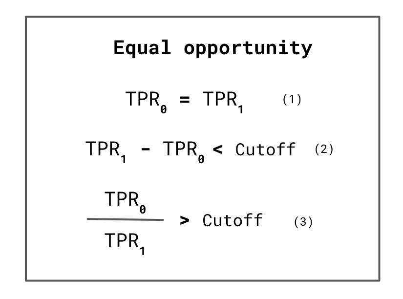

## Table of Contents

## What is Equality of Opportunity in the context of machine learning?

Equality of Opportunity in machine learning is a fairness concept that aims to ensure that a machine learning model treats different groups of people fairly, especially when making decisions that affect them. It means that everyone should have the same chance to succeed or benefit from the model's predictions, regardless of their group identity, such as race, gender, or age. For example, if a model is used to predict job success, it should not favor one group over another just because of their background.

In technical terms, Equality of Opportunity is often defined as the condition where the true positive rate is the same across different groups. This means that if a person from any group truly deserves a positive outcome (like getting a job), the model should be equally good at identifying this for all groups. Mathematically, if we denote the true positive rate for group A as $$TPR_A$$ and for group B as $$TPR_B$$, Equality of Opportunity is achieved when $$TPR_A = TPR_B$$. This helps prevent bias in the model's decision-making process and promotes fairness in its application.

## Why is Equality of Opportunity important in machine learning?

Equality of Opportunity is important in machine learning because it helps make sure that everyone is treated fairly. When a computer program makes decisions, like who should get a loan or a job, it should not favor one group of people over another just because of their race, gender, or other personal characteristics. If a machine learning model is not fair, it can hurt people by not giving them the same chances as others. This can lead to unfair treatment and discrimination, which is bad for society.

To achieve Equality of Opportunity, machine learning models need to have the same true positive rate for all groups. This means that if someone from any group deserves a positive outcome, the model should be equally good at recognizing this for everyone. For example, if $$TPR_A$$ is the true positive rate for group A and $$TPR_B$$ is the true positive rate for group B, Equality of Opportunity is met when $$TPR_A = TPR_B$$. By making sure the model is fair in this way, we can help create a more equal and just world where everyone has the same chance to succeed.

## How does Equality of Opportunity differ from other fairness metrics in machine learning?

Equality of Opportunity is one way to make sure [machine learning](/wiki/machine-learning) models are fair. It focuses on making sure that if someone from any group deserves a good outcome, like getting a job or a loan, the model should be just as good at recognizing this for everyone. In math terms, if $$TPR_A$$ is the true positive rate for group A and $$TPR_B$$ is the true positive rate for group B, Equality of Opportunity is met when $$TPR_A = TPR_B$$. This means the model treats everyone equally when it comes to positive outcomes, but it doesn't worry about negative outcomes.

Other fairness metrics look at different parts of fairness. For example, "Demographic Parity" wants the overall positive outcomes to be the same for all groups, no matter if they deserve them or not. This means if 30% of group A gets a loan, then 30% of group B should get a loan too, even if group B is less likely to pay it back. Another metric, "Equalized Odds," cares about both positive and negative outcomes being fair. It wants the true positive rates and the false positive rates to be the same for all groups. So, if $$TPR_A = TPR_B$$ and $$FPR_A = FPR_B$$, the model is fair according to Equalized Odds. Each metric tries to make models fair, but they focus on different things.

## What are the common challenges in implementing Equality of Opportunity in machine learning models?

Implementing Equality of Opportunity in machine learning models can be tricky because it requires the model to treat everyone fairly when it comes to positive outcomes. One big challenge is getting enough good data. If the data used to train the model is biased or doesn't represent all groups equally, the model can't learn to be fair. For example, if the data mostly comes from one group, the model might not work well for other groups. Another challenge is figuring out which groups to focus on. Sometimes, it's hard to know which groups might be treated unfairly, and this can make it tough to make sure the model is fair for everyone.

Another issue is balancing fairness with how well the model works. When you try to make a model fair, it might not be as good at making correct predictions. This is called the accuracy-fairness trade-off. For example, if you want to make sure $$TPR_A = TPR_B$$ for different groups, you might have to lower the overall accuracy of the model. This can be a problem if the model needs to be very accurate, like in medical diagnosis or loan approvals. Finding the right balance between being fair and being accurate is a big challenge that many people working on machine learning models have to deal with.

## Can you explain the mathematical formulation of Equality of Opportunity?

Equality of Opportunity in machine learning means that a model should give the same chance to everyone who deserves a good outcome, no matter which group they belong to. If we want to check if a model is fair in this way, we look at the true positive rate, which is how often the model correctly predicts a good outcome for people who actually deserve it. For example, if we have two groups, A and B, and we want to make sure the model treats them equally, we need to compare the true positive rates for these groups. The mathematical way to say this is that the true positive rate for group A, which we call $$TPR_A$$, should be the same as the true positive rate for group B, which we call $$TPR_B$$. So, Equality of Opportunity is achieved when $$TPR_A = TPR_B$$.

This idea focuses only on positive outcomes and doesn't worry about negative outcomes. For instance, if a model is used to decide who gets a loan, it should be just as good at correctly approving loans for people from group A as it is for people from group B, if they both deserve the loan. However, the model doesn't have to be fair in how it rejects loan applications. This focus on positive outcomes makes Equality of Opportunity different from other fairness measures, like Demographic Parity or Equalized Odds, which look at different aspects of fairness. By using this mathematical formula, we can check if a model is treating everyone fairly when it comes to giving out good outcomes.

## What are some practical examples where Equality of Opportunity is applied in machine learning?

One practical example where Equality of Opportunity is applied in machine learning is in the hiring process. Companies use machine learning models to help decide which job applicants to interview or hire. To make sure the model is fair, it should give the same chance to all qualified candidates, no matter their race, gender, or age. If someone from any group deserves to be hired, the model should be equally good at recognizing this. In math terms, if $$TPR_A$$ is the true positive rate for group A and $$TPR_B$$ is the true positive rate for group B, the model achieves Equality of Opportunity when $$TPR_A = TPR_B$$. This means the model looks at the qualifications of each applicant and treats everyone fairly when deciding who to hire.

Another example is in the lending industry, where machine learning models are used to decide who gets a loan. Banks and other lenders want to make sure their models are fair and don't discriminate against any group. If a person from any group deserves a loan based on their creditworthiness, the model should be just as good at approving that loan for everyone. Again, using the math, if $$TPR_A$$ is the true positive rate for group A and $$TPR_B$$ is the true positive rate for group B, the model is fair when $$TPR_A = TPR_B$$. By focusing on making the true positive rates the same for all groups, lenders can help ensure that everyone has an equal chance to get a loan if they deserve it.

## How can one measure and evaluate Equality of Opportunity in a machine learning model?

To measure and evaluate Equality of Opportunity in a machine learning model, you need to look at the true positive rate for different groups. The true positive rate is how often the model correctly predicts a good outcome for people who actually deserve it. For example, if you have two groups, like men and women, you would check if the true positive rate for men, which we call $$TPR_{\text{men}}$$, is the same as the true positive rate for women, which we call $$TPR_{\text{women}}$$. If $$TPR_{\text{men}} = TPR_{\text{women}}$$, then the model is treating everyone fairly when it comes to giving out good outcomes, and it has achieved Equality of Opportunity.

To do this evaluation, you can use data from your model's predictions and compare the true positive rates across different groups. This can be done by splitting your data into the relevant groups and calculating the true positive rate for each one. You can use a programming language like Python to do this. For example, you might use a library like scikit-learn to calculate these rates and compare them. If you find that the true positive rates are not equal, you might need to adjust your model or the data it uses to try to make it fairer. By checking and adjusting the model in this way, you can work towards making sure everyone has the same chance to benefit from its predictions.

## What techniques are used to achieve Equality of Opportunity in machine learning algorithms?

One technique to achieve Equality of Opportunity in machine learning algorithms is called "pre-processing." This means fixing the data before it's used to train the model. If the data is biased, like if it doesn't have enough examples from all groups, the model can learn to be unfair. By balancing the data so that all groups are represented equally, the model can learn to treat everyone fairly. For example, if you have data about loan applications, you might add more examples from groups that are underrepresented to make sure the model sees enough of them. This way, when the model is trained, it has a better chance of giving everyone the same opportunity to get a loan if they deserve it.

Another technique is "in-processing," which means changing the model itself while it's being trained. One way to do this is by adding a fairness constraint to the model's learning process. This constraint helps make sure that the true positive rate, or $$TPR_A$$ for group A and $$TPR_B$$ for group B, is the same for all groups. For example, you might use a special kind of machine learning algorithm called "adversarial training," where you train two models at the same time. One model tries to make accurate predictions, while the other tries to find any unfairness in those predictions. By working together, these models can help make sure that $$TPR_A = TPR_B$$, which means the main model is fair and gives everyone an equal chance at a good outcome.

A third technique is "post-processing," which means fixing the model's predictions after it's been trained. If you find that the model isn't fair, you can adjust its predictions to make them more equal. For example, you might change the threshold for making a positive prediction so that it's the same for all groups. This can help make sure that if someone from any group deserves a good outcome, like getting a loan, the model is equally good at recognizing this for everyone. By using these techniques, you can work towards making sure your machine learning model treats everyone fairly and gives them the same chance to succeed.

## How does Equality of Opportunity relate to bias and discrimination in machine learning?

Equality of Opportunity in machine learning is all about making sure the computer program treats everyone fairly when it comes to giving out good outcomes. If a model is biased, it means it might favor one group over another, which can lead to discrimination. For example, if a model used to approve loans works better for men than for women, even if both groups deserve the loan, that's a bias that can cause unfair treatment. To check if a model is fair, you look at the true positive rate, or how often it correctly predicts a good outcome for people who deserve it. If $$TPR_A$$ is the true positive rate for group A and $$TPR_B$$ is the true positive rate for group B, the model is fair when $$TPR_A = TPR_B$$. This helps make sure everyone has the same chance to get a positive outcome, like a loan or a job.

To fight bias and discrimination, people use different techniques to make models fairer. One way is to fix the data before training the model, called pre-processing. This means making sure the data has enough examples from all groups so the model can learn to treat everyone equally. Another way is to change the model itself while it's being trained, called in-processing. This can include adding a fairness rule to the model's learning process to make sure $$TPR_A = TPR_B$$ for all groups. Finally, after the model is trained, you can adjust its predictions to make them more fair, which is called post-processing. By using these methods, we can help make sure machine learning models don't treat people unfairly and give everyone the same chance to succeed.

## What are the ethical considerations when applying Equality of Opportunity in machine learning?

When we use machine learning to make decisions that affect people's lives, like who gets a job or a loan, we need to think about fairness. Equality of Opportunity is one way to make sure the computer program treats everyone the same when it comes to good outcomes. If a person from any group deserves a positive result, the model should be equally good at recognizing this for everyone. In math terms, if $$TPR_A$$ is the true positive rate for group A and $$TPR_B$$ is the true positive rate for group B, the model is fair when $$TPR_A = TPR_B$$. This helps prevent the model from being biased and treating some groups unfairly, which is important for making ethical decisions.

However, trying to make a model fair can be tricky. Sometimes, making the model fair can make it less accurate, which is called the accuracy-fairness trade-off. If the model is used for important things like medical diagnosis, we need to find the right balance between being fair and being accurate. Also, we need to think about how to define the groups we want to treat fairly. If we focus too much on some groups, we might miss others who are also treated unfairly. By thinking carefully about these ethical issues, we can help make sure our machine learning models are fair and help everyone have the same chance to succeed.

## How can Equality of Opportunity be balanced with model performance in machine learning?

Balancing Equality of Opportunity with model performance in machine learning can be tricky. Equality of Opportunity means that if someone from any group deserves a good outcome, like getting a job or a loan, the model should be just as good at recognizing this for everyone. In math terms, if $$TPR_A$$ is the true positive rate for group A and $$TPR_B$$ is the true positive rate for group B, the model is fair when $$TPR_A = TPR_B$$. However, making the model fair can sometimes make it less accurate. This is called the accuracy-fairness trade-off. If the model needs to be very accurate, like in medical diagnosis or loan approvals, finding the right balance between being fair and being accurate is important.

To find this balance, people use different techniques. One way is to adjust the data before training the model, which is called pre-processing. This means making sure the data has enough examples from all groups so the model can learn to treat everyone equally. Another way is to change the model itself while it's being trained, called in-processing. This can include adding a fairness rule to the model's learning process to make sure $$TPR_A = TPR_B$$ for all groups. Finally, after the model is trained, you can adjust its predictions to make them more fair, which is called post-processing. By using these methods, we can help make sure machine learning models are both fair and accurate, giving everyone the same chance to succeed.

## What are the latest research developments and future directions for Equality of Opportunity in machine learning?

Recent research in machine learning has focused on improving how we measure and achieve Equality of Opportunity. One key development is the use of more advanced fairness metrics that go beyond just looking at the true positive rate, or $$TPR_A = TPR_B$$, for different groups. Researchers are now exploring ways to combine multiple fairness metrics to get a fuller picture of how fair a model is. For example, they might look at both the true positive rate and the false positive rate to make sure the model is fair in both giving out good outcomes and avoiding bad ones. Another important area of research is in developing new algorithms that can balance fairness with accuracy better. These algorithms often use techniques like adversarial training, where one part of the model tries to make accurate predictions while another part tries to find and fix any unfairness.

Looking to the future, there are several exciting directions for research on Equality of Opportunity in machine learning. One direction is to make fairness more personalized, so the model can treat each person fairly based on their unique situation, not just their group identity. This could help make models even more fair and useful for everyone. Another future direction is to develop better ways to explain why a model made a certain decision, which can help us understand and fix any unfairness. Finally, as machine learning is used more and more in important areas like healthcare and finance, researchers will need to keep working on ways to make sure these models are both fair and accurate, so everyone has the same chance to benefit from them.

## References & Further Reading

[1]: Hardt, M., Price, E., & Srebro, N. (2016). ["Equality of Opportunity in Supervised Learning."](https://arxiv.org/abs/1610.02413) Advances in Neural Information Processing Systems 29.

[2]: Barocas, S., Hardt, M., & Narayanan, A. (2019). ["Fairness and Machine Learning."](https://fairmlbook.org/) A book draft available online.

[3]: Pleiss, G., Raghavan, M., Wu, F., Kleinberg, J., & Weinberger, K. Q. (2017). ["On Fairness and Calibration."](https://arxiv.org/abs/1709.02012) Advances in Neural Information Processing Systems 30.

[4]: Zafar, M. B., Valera, I., Gomez Rodriguez, M., & Gummadi, K. (2017). ["Fairness Constraints: Mechanisms for Fair Classification."](https://arxiv.org/abs/1507.05259) Proceedings of the 20th International Conference on Artificial Intelligence and Statistics.

[5]: Chouldechova, A., & Roth, A. (2018). ["The Frontiers of Fairness in Machine Learning."](https://arxiv.org/abs/1810.08810) Proceedings of the 20th International Conference on Artificial Intelligence and Statistics.

[6]: Verma, S., & Rubin, J. (2018). ["Fairness Definitions Explained."](https://dl.acm.org/doi/10.1145/3194770.3194776) arXiv preprint arXiv:1802.04889.

[7]: Mehrabi, N., Morstatter, F., Saxena, N., Lerman, K., & Galstyan, A. (2021). ["A Survey on Bias and Fairness in Machine Learning."](https://dl.acm.org/doi/abs/10.1145/3457607) ACM Computing Surveys.