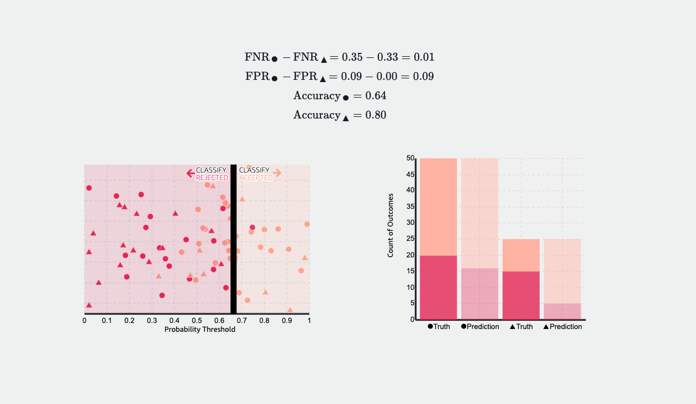

## Table of Contents

## What is Equalized Odds in machine learning?

Equalized Odds is a fairness concept in machine learning that aims to ensure that a model's predictions are fair across different groups of people. It focuses on making sure that the model's ability to correctly predict outcomes (true positives) and its rate of incorrect predictions (false positives) are the same for all groups. For example, if a model is used to predict whether someone will repay a loan, Equalized Odds would require that the model's accuracy in predicting loan repayment is the same for men and women.

To achieve Equalized Odds, the model must satisfy two conditions: the true positive rate (TPR) and the false positive rate (FPR) must be equal across all groups. Mathematically, if we have a protected attribute (like gender or race) denoted as $$A$$, and a binary outcome $$Y$$ (like loan repayment), and the model's prediction as $$\hat{Y}$$, Equalized Odds requires that $$P(\hat{Y}=1|Y=1,A=a) = P(\hat{Y}=1|Y=1,A=b)$$ for all groups $$a$$ and $$b$$, and similarly for false positives $$P(\hat{Y}=1|Y=0,A=a) = P(\hat{Y}=1|Y=0,A=b)$$. This means the model should perform equally well (or poorly) for all groups in terms of both correctly identifying positive outcomes and avoiding false alarms.

## Why is Equalized Odds important for fairness in machine learning models?

Equalized Odds is important for fairness in machine learning because it helps make sure that a model treats different groups of people the same way. Imagine a model that decides who gets a loan. If it's fairer, it won't approve loans for men more often than for women just because of their gender. Equalized Odds checks that the model is equally good at saying "yes" to people who will actually pay back their loans, no matter which group they belong to. It also makes sure the model is equally good at saying "no" to people who won't pay back their loans, again, regardless of their group.

This fairness concept is crucial because if a model isn't fair, it can cause real harm. For example, if a model used by banks unfairly denies loans to certain groups more often, those groups might miss out on important opportunities like buying a home or starting a business. By using Equalized Odds, we can work towards building models that don't unfairly disadvantage any group, making decisions based on what's relevant, not on irrelevant factors like race or gender. This helps build trust in technology and ensures that everyone has a fair shot at opportunities.

## How does Equalized Odds differ from other fairness criteria like demographic parity?

Equalized Odds and demographic parity are both fairness criteria used in machine learning, but they focus on different aspects of fairness. Equalized Odds is concerned with how well a model can correctly predict outcomes across different groups. It requires that the model's true positive rate (TPR) and false positive rate (FPR) are the same for all groups. For example, if a model is predicting loan repayment, Equalized Odds would ensure that the model's accuracy in predicting repayment is the same for men and women. Mathematically, this means $$P(\hat{Y}=1|Y=1,A=a) = P(\hat{Y}=1|Y=1,A=b)$$ for true positives and $$P(\hat{Y}=1|Y=0,A=a) = P(\hat{Y}=1|Y=0,A=b)$$ for false positives, where $$A$$ is the protected attribute like gender or race, $$Y$$ is the actual outcome, and $$\hat{Y}$$ is the model's prediction.

On the other hand, demographic parity focuses on ensuring that the overall positive outcomes of a model are distributed equally across different groups, regardless of their actual outcomes. It doesn't consider whether the model's predictions are correct or not; it just looks at the proportion of positive predictions. For instance, in the loan example, demographic parity would require that the same percentage of loans are approved for men and women, even if the actual repayment rates differ between these groups. This means that $$P(\hat{Y}=1|A=a) = P(\hat{Y}=1|A=b)$$ for all groups $$a$$ and $$b$$. While Equalized Odds aims to balance the model's accuracy across groups, demographic parity aims to balance the model's outputs, which can sometimes lead to different fairness outcomes.

## What are the key components of Equalized Odds?

Equalized Odds is a fairness idea in machine learning that makes sure a model treats different groups of people the same way when it comes to predicting things correctly. It has two main parts: the true positive rate (TPR) and the false positive rate (FPR). The TPR is how often the model correctly says "yes" when the answer should be "yes". The FPR is how often the model wrongly says "yes" when the answer should be "no". Equalized Odds says these rates should be the same for all groups. For example, if a model predicts if someone will repay a loan, Equalized Odds makes sure it's just as good at predicting for men as it is for women. This means $$P(\hat{Y}=1|Y=1,A=a) = P(\hat{Y}=1|Y=1,A=b)$$ for TPR and $$P(\hat{Y}=1|Y=0,A=a) = P(\hat{Y}=1|Y=0,A=b)$$ for FPR, where $$A$$ is the group like gender or race, $$Y$$ is the real outcome, and $$\hat{Y}$$ is what the model predicts.

Equalized Odds is important because it helps make sure the model is fair and doesn't favor one group over another. If a model isn't fair, it can cause problems. For instance, if it wrongly says "no" to loans for certain groups more often, those groups might miss out on big chances like buying a house or starting a business. By using Equalized Odds, we can work towards making models that treat everyone the same, looking only at what matters for the prediction, not at things like race or gender. This helps build trust in technology and gives everyone a fair chance at opportunities.

## Can you explain the mathematical formulation of Equalized Odds?

Equalized Odds is a fairness idea in machine learning that makes sure a model treats different groups of people the same way when it comes to predicting things correctly. It has two main parts: the true positive rate (TPR) and the false positive rate (FPR). The TPR is how often the model correctly says "yes" when the answer should be "yes". The FPR is how often the model wrongly says "yes" when the answer should be "no". Equalized Odds says these rates should be the same for all groups. For example, if a model predicts if someone will repay a loan, Equalized Odds makes sure it's just as good at predicting for men as it is for women. This means $$P(\hat{Y}=1|Y=1,A=a) = P(\hat{Y}=1|Y=1,A=b)$$ for TPR and $$P(\hat{Y}=1|Y=0,A=a) = P(\hat{Y}=1|Y=0,A=b)$$ for FPR, where $$A$$ is the group like gender or race, $$Y$$ is the real outcome, and $$\hat{Y}$$ is what the model predicts.

Equalized Odds is important because it helps make sure the model is fair and doesn't favor one group over another. If a model isn't fair, it can cause problems. For instance, if it wrongly says "no" to loans for certain groups more often, those groups might miss out on big chances like buying a house or starting a business. By using Equalized Odds, we can work towards making models that treat everyone the same, looking only at what matters for the prediction, not at things like race or gender. This helps build trust in technology and gives everyone a fair chance at opportunities.

## How can Equalized Odds be implemented in a machine learning model?

To implement Equalized Odds in a machine learning model, you first need to understand what groups you're looking at, like gender or race. Then, you train your model on data that includes these groups. After training, you check if the model's true positive rate (TPR) and false positive rate (FPR) are the same for all groups. The TPR is how often the model correctly says "yes" when it should, and the FPR is how often it wrongly says "yes" when it shouldn't. If these rates aren't the same across groups, you adjust your model. You might do this by changing how the model makes predictions or by adding new data to make it fairer. The goal is to make sure $$P(\hat{Y}=1|Y=1,A=a) = P(\hat{Y}=1|Y=1,A=b)$$ for TPR and $$P(\hat{Y}=1|Y=0,A=a) = P(\hat{Y}=1|Y=0,A=b)$$ for FPR, where $$A$$ is the group, $$Y$$ is the real outcome, and $$\hat{Y}$$ is the model's prediction.

One way to adjust the model is by using a technique called post-processing. This means you take the model's predictions and change them a bit to make them fairer. For example, if the model is approving too many loans for one group and not enough for another, you can adjust the threshold for what counts as a "yes" prediction to balance it out. Another way is to use in-processing methods, where you change how the model learns from the data. You might add a fairness term to the model's objective function, so it tries to be accurate and fair at the same time. This can be tricky but can lead to a model that naturally balances TPR and FPR across groups. By carefully choosing and applying these methods, you can build a model that treats everyone fairly and gives everyone a fair shot at opportunities.

## What are common challenges when trying to achieve Equalized Odds?

Achieving Equalized Odds in machine learning can be tricky because it requires balancing the model's accuracy across different groups. The main challenge is that the data used to train the model might already have biases. For example, if historical data shows that one group repays loans more often than another, the model might learn this pattern and unfairly predict loan approvals based on group membership rather than individual merit. To fix this, you need to find and remove these biases from the data, which can be hard and time-consuming. You might need to collect more data or use special techniques to adjust the data so that the model doesn't learn these unfair patterns.

Another challenge is that trying to make the model fair for one group might make it less fair for another. When you adjust the model to balance the true positive rate (TPR) and false positive rate (FPR) across groups, you might find that the TPR for one group goes up, but the FPR for another group goes up too. This means $$P(\hat{Y}=1|Y=1,A=a) = P(\hat{Y}=1|Y=1,A=b)$$ for TPR and $$P(\hat{Y}=1|Y=0,A=a) = P(\hat{Y}=1|Y=0,A=b)$$ for FPR might not be achievable at the same time without affecting other aspects of the model's performance. It's a bit like trying to juggle: you need to keep all the balls in the air, and sometimes, focusing on one ball might make you drop another. Finding the right balance requires careful tweaking and testing of the model to ensure fairness without sacrificing too much accuracy.

## How do you measure and evaluate Equalized Odds in a model?

To measure and evaluate Equalized Odds in a model, you need to look at the true positive rate (TPR) and the false positive rate (FPR) for different groups of people. The TPR is how often the model correctly says "yes" when it should, and the FPR is how often it wrongly says "yes" when it shouldn't. You compare these rates across groups like gender or race. If the TPR and FPR are the same for all groups, then your model has achieved Equalized Odds. Mathematically, this means $$P(\hat{Y}=1|Y=1,A=a) = P(\hat{Y}=1|Y=1,A=b)$$ for TPR and $$P(\hat{Y}=1|Y=0,A=a) = P(\hat{Y}=1|Y=0,A=b)$$ for FPR, where $$A$$ is the group, $$Y$$ is the real outcome, and $$\hat{Y}$$ is what the model predicts.

In practice, you can use tools and libraries to help you measure these rates. For example, you might use Python with libraries like scikit-learn or AIF360 to calculate TPR and FPR for each group. After calculating these rates, you compare them to see if they are close enough to be considered equal. If they're not, you might need to adjust your model or the data it's trained on to make it fairer. This process of measuring, evaluating, and adjusting helps ensure that the model treats everyone fairly and gives everyone a fair shot at opportunities.

## Can you provide examples of datasets where Equalized Odds has been applied?

One example where Equalized Odds has been applied is in the COMPAS dataset, which is used to predict recidivism risk in criminal justice. Researchers have used this dataset to check if the model's predictions are fair across different racial groups. They found that the model's true positive rate (TPR) and false positive rate (FPR) were not the same for Black and White defendants. To fix this, they adjusted the model to make sure $$P(\hat{Y}=1|Y=1,A=\text{Black}) = P(\hat{Y}=1|Y=1,A=\text{White})$$ for TPR and $$P(\hat{Y}=1|Y=0,A=\text{Black}) = P(\hat{Y}=1|Y=0,A=\text{White})$$ for FPR. This helped make the model's predictions more fair and less biased against certain racial groups.

Another example is the Adult Income dataset, which is used to predict whether someone's income exceeds $50,000 a year. Researchers have applied Equalized Odds to ensure that the model's predictions are fair across different genders. They checked the TPR and FPR for men and women and found that the model was not equally accurate for both groups. By adjusting the model to balance these rates, they achieved $$P(\hat{Y}=1|Y=1,A=\text{Male}) = P(\hat{Y}=1|Y=1,A=\text{Female})$$ for TPR and $$P(\hat{Y}=1|Y=0,A=\text{Male}) = P(\hat{Y}=1|Y=0,A=\text{Female})$$ for FPR. This helped the model to treat men and women more fairly when predicting their income levels.

## What are the trade-offs between achieving Equalized Odds and model performance?

Achieving Equalized Odds in a machine learning model means making sure the model's true positive rate (TPR) and false positive rate (FPR) are the same for all groups of people. This can be good because it helps make the model fair and stops it from treating some groups unfairly. But, trying to make the model fair can sometimes make it less accurate overall. For example, if you change the model to make sure $$P(\hat{Y}=1|Y=1,A=a) = P(\hat{Y}=1|Y=1,A=b)$$ for TPR and $$P(\hat{Y}=1|Y=0,A=a) = P(\hat{Y}=1|Y=0,A=b)$$ for FPR, you might find that the model's overall accuracy goes down. This happens because you're focusing on making the model fair across groups, which might mean it's not as good at predicting things for everyone.

The trade-off between fairness and performance can be tricky. Sometimes, making the model fair for one group might make it less fair for another group. For instance, if you adjust the model to help one group get more loan approvals, you might accidentally make it harder for another group to get loans. This means you have to keep tweaking the model to find the right balance. It's like trying to juggle: you want to keep the model accurate while also making sure it's fair. Finding this balance requires a lot of testing and adjusting to make sure the model works well for everyone without being unfair to any group.

## How does Equalized Odds relate to other fairness metrics like Equal Opportunity?

Equalized Odds and Equal Opportunity are both fairness ideas in machine learning, but they focus on different things. Equalized Odds makes sure that a model's true positive rate (TPR) and false positive rate (FPR) are the same for all groups of people. This means $$P(\hat{Y}=1|Y=1,A=a) = P(\hat{Y}=1|Y=1,A=b)$$ for TPR and $$P(\hat{Y}=1|Y=0,A=a) = P(\hat{Y}=1|Y=0,A=b)$$ for FPR, where $$A$$ is the group like gender or race, $$Y$$ is the real outcome, and $$\hat{Y}$$ is the model's prediction. Equalized Odds tries to make the model fair by balancing how often it correctly says "yes" and how often it wrongly says "yes" across different groups.

Equal Opportunity, on the other hand, focuses only on making sure the true positive rate is the same for all groups. This means $$P(\hat{Y}=1|Y=1,A=a) = P(\hat{Y}=1|Y=1,A=b)$$ for all groups $$a$$ and $$b$$. Equal Opportunity doesn't care about the false positive rate. It just wants to make sure that if someone from any group should get a "yes" from the model, they have the same chance of getting it. While Equalized Odds looks at both TPR and FPR, Equal Opportunity only looks at TPR. This means Equalized Odds is a stricter fairness rule because it tries to balance both rates, while Equal Opportunity is a bit more relaxed but still aims to be fair.

## What are advanced techniques or algorithms used to optimize for Equalized Odds?

To optimize for Equalized Odds in machine learning models, one advanced technique is to use post-processing methods. Post-processing involves adjusting the model's predictions after it has been trained to ensure that the true positive rate (TPR) and false positive rate (FPR) are the same across different groups. For example, if a model is predicting loan approvals, you might adjust the threshold for what counts as a "yes" prediction to balance out the rates for different groups. This can be done by using algorithms like the "Equalized Odds Postprocessing" method in the AIF360 library in Python, which modifies the model's outputs to meet the Equalized Odds criteria. The goal is to achieve $$P(\hat{Y}=1|Y=1,A=a) = P(\hat{Y}=1|Y=1,A=b)$$ for TPR and $$P(\hat{Y}=1|Y=0,A=a) = P(\hat{Y}=1|Y=0,A=b)$$ for FPR, where $$A$$ is the group, $$Y$$ is the real outcome, and $$\hat{Y}$$ is the model's prediction.

Another advanced technique is in-processing, where you change how the model learns from the data to incorporate fairness directly into the training process. This can involve adding a fairness constraint to the model's objective function, so it tries to be both accurate and fair at the same time. For instance, you might use algorithms like Adversarial Debiasing, which uses an adversarial network to reduce bias during training. This method tries to make the model's predictions independent of sensitive attributes like race or gender, which helps in achieving Equalized Odds. By carefully choosing and applying these advanced techniques, you can build a model that treats everyone fairly and gives everyone a fair shot at opportunities.