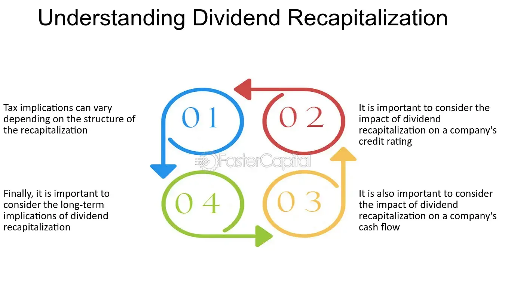

## Table of Contents

## What is an equalizing dividend?

An equalizing dividend is a type of dividend payment that companies use to make sure all shareholders get the same amount of dividends, even if they bought their shares at different times during the dividend period. When a company declares a dividend, it might have already earned some of the profits that will be paid out as dividends before some shareholders bought their shares. To make things fair, the company includes an equalizing dividend with the regular dividend to cover the profits earned before the new shareholders bought in.

This way, new shareholders receive a total dividend that includes both the regular dividend and the equalizing dividend. The equalizing part makes up for the profits earned before they bought the shares, so everyone ends up with the same total dividend per share. This method helps keep things equal and fair for all shareholders, no matter when they bought their shares.

## How does an equalizing dividend differ from a regular dividend?

An equalizing dividend is a special kind of payment that companies give to make sure all shareholders get the same amount of money, even if they bought their shares at different times. When a company makes money and decides to share it with shareholders as a dividend, some of that money might have been earned before some people bought their shares. To be fair, the company adds an equalizing dividend to the regular dividend. This extra payment covers the profits made before the new shareholders bought in, so everyone gets the same total amount of money per share.

A regular dividend, on the other hand, is just the normal payment that a company gives to its shareholders from its profits. It doesn't take into account when someone bought their shares. So, if you bought shares after some profits were already made, you would only get the regular dividend without any extra money to make up for the earlier profits. The equalizing dividend helps to level the playing field, making sure that all shareholders, no matter when they bought their shares, receive the same total dividend.

## What is the purpose of an equalizing dividend in investment funds?

In investment funds, an equalizing dividend helps make sure that all investors get a fair share of the profits, even if they joined the fund at different times. When a fund makes money and decides to pay it out as a dividend, some of that money might have been earned before some investors bought into the fund. To be fair, the fund adds an equalizing dividend to the regular dividend. This extra payment makes up for the profits that were made before the new investors joined, so everyone gets the same total amount of money per share.

This is important because it keeps things equal for all investors. Without an equalizing dividend, new investors might feel they are not getting their fair share because they wouldn't get dividends for the profits earned before they bought in. By including an equalizing dividend, the fund ensures that all investors, whether they've been there from the start or just joined, receive the same total dividend. This helps maintain trust and fairness in the investment fund.

## Can you explain the mechanism of how equalizing dividends are calculated?

When a fund or company decides to pay out dividends, they first figure out how much profit they've made since the last time they paid dividends. If some of that profit was made before new investors bought in, the company needs to make sure everyone gets a fair share. To do this, they calculate an equalizing dividend. They look at how much profit was made before the new investors joined and divide that by the total number of shares. This gives them the amount of the equalizing dividend per share.

Once they have the equalizing dividend, they add it to the regular dividend. The regular dividend is the profit made after the new investors joined, divided by the total number of shares. So, the total dividend an investor gets is the sum of the regular dividend and the equalizing dividend. This way, no matter when someone bought their shares, they all get the same total amount of money per share. It's like making sure everyone gets a fair slice of the pie, even if they showed up to the party a bit late.

## Who typically benefits from equalizing dividends?

New investors benefit the most from equalizing dividends. When someone buys shares after the company has already made some profits, they might miss out on dividends from those earlier profits. Equalizing dividends make up for this by giving new investors extra money so that they get the same total dividend as everyone else. This makes things fair and helps new investors feel like they are getting a good deal.

Existing shareholders also benefit because equalizing dividends help keep the value of their shares stable. When new investors feel they are getting a fair share of the profits, they are more likely to keep investing in the company. This can help the company grow and keep the stock price steady, which is good for everyone who already owns shares. So, equalizing dividends help both new and existing investors by making sure everyone gets treated fairly.

## What are the scenarios in which a fund might issue an equalizing dividend?

A fund might issue an equalizing dividend when new investors buy into the fund after it has already made some profits. If the fund decides to pay out dividends, the profits made before the new investors joined would normally not be shared with them. To make things fair, the fund calculates an equalizing dividend to cover those earlier profits, so the new investors get the same total dividend as everyone else.

Another scenario where a fund might issue an equalizing dividend is during a period of significant growth or income. If the fund has been making a lot of money and wants to distribute it to shareholders, but some of that money was earned before new investors came on board, an equalizing dividend helps ensure that all shareholders, regardless of when they bought in, receive an equal share of the total profits. This helps maintain fairness and keeps investors happy.

## How does the timing of an equalizing dividend affect an investor's returns?

The timing of when an investor buys into a fund can really change how much money they get back as dividends. If someone buys shares right before the fund pays out a regular dividend, they might not get any of the profits the fund made before they bought in. But, if the fund also gives an equalizing dividend, it makes up for those earlier profits. This means the new investor gets the same total amount of money as everyone else, even though they bought in later.

This equalizing dividend helps make things fair for everyone. Without it, new investors might feel they're not getting their fair share because they wouldn't get dividends for the profits earned before they joined. By giving an equalizing dividend, the fund makes sure all investors, no matter when they bought in, get the same total dividend. This can make new investors feel good about their investment and helps keep the value of the shares steady for everyone.

## What are the tax implications of receiving an equalizing dividend for individual investors?

When you get an equalizing dividend, it can change how much tax you have to pay. Usually, dividends are treated as income and you pay tax on them. But with equalizing dividends, part of what you get might be seen as a return of your original investment, not just profit. This part might not be taxed, or it might be taxed differently, depending on where you live and the tax rules there. It's a good idea to check with a tax advisor to understand exactly how your equalizing dividends will be taxed.

In some places, the tax rules can be pretty complicated. For example, in the United States, equalizing dividends might be split into two parts for tax purposes: one part that's considered a regular dividend and another part that's considered a return of capital. The regular dividend part is usually taxed as income, while the return of capital part might reduce the cost basis of your investment, which could affect the taxes you pay when you sell your shares. Because tax laws can be tricky and change a lot, it's always smart to talk to someone who knows about taxes to make sure you're doing everything right.

## How do equalizing dividends impact the overall tax strategy of a fund?

Equalizing dividends can change how a fund handles its taxes. When a fund pays out equalizing dividends, it's trying to make things fair for everyone who owns shares. But this can make the tax situation a bit more complicated. Part of the equalizing dividend might be seen as a return of the money people invested, not just as profit. This part might not be taxed the same way as regular dividends, which are usually taxed as income. So, the fund has to figure out how to split up the dividends and report them correctly to the tax authorities.

This can affect the overall tax strategy of the fund. Funds might need to keep track of how much of each dividend is a regular dividend and how much is an equalizing dividend. This helps them report the right amounts to shareholders and the tax authorities. Because different parts of the dividend can be taxed differently, the fund might need to plan its dividend payments carefully to help minimize the tax burden for its investors. Talking to a tax advisor can help the fund make smart choices about when and how to pay out dividends, making sure everyone gets treated fairly and pays the right amount of taxes.

## What are the reporting requirements for funds that issue equalizing dividends?

When a fund gives out equalizing dividends, it has to tell everyone about it in a clear way. The fund needs to show how much of the dividend is the regular part and how much is the equalizing part. This is important because the two parts might be taxed differently. The fund usually does this in its financial statements or dividend notices, making sure all shareholders know exactly what they're getting.

The fund also has to report this information to the tax authorities. They need to keep good records of how much money was paid out and how it was split up. This helps the tax authorities make sure that everyone is paying the right amount of taxes. It can be a bit tricky, so the fund might need to work with tax experts to make sure they're doing everything correctly and following all the rules.

## How do international tax treaties affect the taxation of equalizing dividends?

International tax treaties can change how equalizing dividends are taxed when people from different countries are involved. These treaties are agreements between countries that help decide who gets to tax what and how much. If someone lives in one country but gets dividends from a fund in another country, the tax treaty between those two countries can affect how much tax they have to pay. Sometimes, the treaty might lower the tax rate on dividends, or it might say that the country where the fund is based can't tax the dividends at all.

This can make things a bit more complicated for funds that give out equalizing dividends. The fund has to know about the tax treaties that apply to its shareholders and figure out how to report the dividends correctly. This might mean working with tax experts to make sure they're following all the rules and that shareholders are getting the right tax treatment. By understanding and following these treaties, the fund can help its international investors pay the right amount of taxes and avoid any surprises come tax time.

## What are the potential pitfalls or complexities that investors should be aware of when dealing with equalizing dividends?

When dealing with equalizing dividends, investors should be aware that things can get a bit tricky. One big issue is understanding how these dividends are taxed. Equalizing dividends can be split into two parts: the regular dividend part, which is usually taxed as income, and the equalizing part, which might be seen as a return of your original investment. This can make your taxes more complicated because different parts of the dividend might be taxed differently. If you're not careful, you might end up paying more in taxes than you need to, or you might miss out on some tax benefits.

Another complexity is keeping track of when you bought your shares. If you buy shares right before a fund pays out dividends, you might get an equalizing dividend to make up for the profits earned before you joined. But if you don't understand how this works, you might think you're getting less money than other shareholders. It's important to know that the equalizing dividend is there to make things fair, so you get the same total amount as everyone else. Also, funds have to report these dividends clearly, but if they don't do it well, it can be confusing for investors to figure out what they're getting and how it affects their taxes.

## References & Further Reading

[1]: Bergstra, J., Bardenet, R., Bengio, Y., & Kégl, B. (2011). ["Algorithms for Hyper-Parameter Optimization."](https://dl.acm.org/doi/10.5555/2986459.2986743) Advances in Neural Information Processing Systems 24.

[2]: ["Advances in Financial Machine Learning"](https://www.amazon.com/Advances-Financial-Machine-Learning-Marcos/dp/1119482089) by Marcos Lopez de Prado

[3]: ["Evidence-Based Technical Analysis: Applying the Scientific Method and Statistical Inference to Trading Signals"](https://www.amazon.com/Evidence-Based-Technical-Analysis-Scientific-Statistical/dp/0470008741) by David Aronson

[4]: ["Machine Learning for Algorithmic Trading"](https://github.com/stefan-jansen/machine-learning-for-trading) by Stefan Jansen

[5]: ["Quantitative Trading: How to Build Your Own Algorithmic Trading Business"](https://www.amazon.com/Quantitative-Trading-Build-Algorithmic-Business/dp/1119800064) by Ernest P. Chan