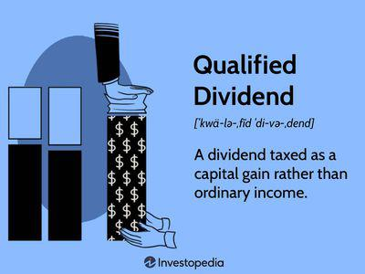

In the rapidly evolving financial landscape, understanding the interconnectedness of dividend tax, dividend mechanisms, and algorithmic trading is pivotal for investors and financial professionals. These elements, though distinct, interact in ways that profoundly influence trading strategies and tax efficiencies.

Dividend tax is a significant consideration for investors since it directly affects the net returns from dividend income. Different jurisdictions impose varying tax rates on dividends, which can alter the attractiveness of dividend-paying investments. Investors must navigate these tax implications to optimize their post-tax income and overall portfolio performance, often leveraging tax treaties and tax-advantaged accounts.



Meanwhile, equalizing dividends emerge as a strategic mechanism to counteract the fluctuations in dividend schedules. They serve as compensatory payments to shareholders, aiming to maintain investor satisfaction and ensure a steady stream of returns. Unlike regular dividends, equalizing dividends are generally treated as returns of capital, rendering them non-taxable. This feature offers a strategic advantage in certain investment environments.

Simultaneously, algorithmic trading is reshaping how dividend strategies are executed. Through automation and complex algorithms, traders can efficiently execute dividend arbitrage strategies, identifying and exploiting price differentials associated with dividends. This technological advancement enhances the precision and speed of trades, thus optimizing potential gains from dividend-related opportunities.

By exploring the interplay between these elements, this article provides crucial insights for managing the complexities of today's financial markets. Understanding how dividend taxes, equalizing dividends, and algorithmic trading interact enables investors to enhance returns while navigating regulatory and market challenges effectively. This comprehensive understanding is essential for sustaining a competitive edge in the dynamic world of dividend-based investment strategies.

## Table of Contents

## Understanding Dividend Tax and Its Implications

Dividend tax is a significant consideration for investors due to its direct impact on investment returns. The tax rates imposed on dividends vary by jurisdiction and depend on whether the dividends are classified as qualified or ordinary. Qualified dividends, typically derived from investments in U.S. corporations or qualifying foreign entities, benefit from preferential tax rates, usually aligned with the long-term capital gains tax rates. In the United States, for example, qualified dividends are taxed at 0%, 15%, or 20%, depending on the taxpayer's income level. Conversely, ordinary dividends do not meet the criteria for qualified treatment and are taxed at the individual's standard income tax rates, which can be considerably higher.

The differential in tax rates between qualified and ordinary dividends highlights the importance of understanding the classification of dividend income. For investors, this knowledge is crucial as it influences net returns. Consider an investor in the highest tax bracket receiving $1,000 in dividends. If these dividends are ordinary, the tax could reduce returns by up to $370 (assuming a 37% top income tax rate). However, if they are qualified, the tax reduction might be only $200 (assuming a 20% capital gains rate), thereby significantly enhancing after-tax returns.

Optimizing tax efficiency also requires awareness of international tax treaties and tax-advantaged accounts. Many countries have established tax treaties designed to prevent double taxation of dividend income for investors subject to tax in multiple jurisdictions. These treaties can provide reduced withholding tax rates on dividends, significantly impacting the investor's net income. For instance, an investor from Country A receiving dividends from Country B may benefit from a reduced withholding rate if there is an established tax treaty between these two countries.

Furthermore, utilizing tax-advantaged accounts such as Individual Retirement Accounts (IRAs) or 401(k)s can shield dividend income from immediate taxation, thus enhancing compounding growth. In these accounts, dividends can grow tax-deferred, or in the case of Roth IRAs, tax-free, providing a robust framework for building wealth over time.

In conclusion, a comprehensive approach to understanding and planning for dividend taxes is indispensable. It requires a strategic evaluation of dividend classifications, tax treaties, and leveraging tax-advantaged accounts. These elements collectively enable investors to optimize their investment returns by minimizing the tax drag on dividend income.

## The Mechanism of Equalizing Dividends

Equalizing dividends are compensatory payments distributed by firms to reconcile discrepancies arising from changes in dividend schedules. These payments play a crucial role in maintaining shareholder satisfaction by ensuring consistent income streams despite alterations in dividend timelines or company performance. Companies often adjust dividend payments to align with their earnings cycle or strategic financial decisions, which may lead to an uneven distribution of dividends over time. Equalizing dividends address these fluctuations by providing shareholders with additional payments that bridge the gap between declared and expected dividends.

The prevalence of equalizing dividends varies across different markets and industries, often influenced by regulatory environments and corporate governance standards. Firms that prioritize maintaining a stable shareholder base may be more inclined to implement such mechanisms, especially in markets where dividend income is a critical component of investment returns.

One significant aspect of equalizing dividends is their non-taxable nature. Unlike regular dividend payments, equalizing dividends are treated as returns of capital rather than income. This classification is crucial for investors who seek tax efficiency in their portfolio strategies, as it potentially reduces taxable income in the year of receipt. The distinction between returns of capital and ordinary dividends is governed by tax regulations, which may vary between jurisdictions. Investors should remain informed about these regulations to optimize their tax positions.

In summary, equalizing dividends serve as an essential tool for companies to maintain shareholder satisfaction by ensuring consistent dividend income despite changes in payment schedules. Their non-taxable nature as returns of capital makes them an attractive option for investors seeking tax efficiency. Understanding the dynamics of equalizing dividends and their impact on shareholder value is vital for both companies and investors who aim to maximize long-term financial outcomes.

## Role of Algo Trading in Dividend Strategies

Algorithmic trading is crucial for executing dividend [arbitrage](/wiki/arbitrage) strategies, leveraging complex algorithms to exploit price differentials in dividend-paying stocks. The efficiency of algorithmic systems, underpinned by advanced computation and data analysis, enables traders to swiftly identify profitable opportunities in markets.

The core of dividend arbitrage involves capturing dividend benefits, often by utilizing short selling and options strategies. Algorithms allow traders to optimize the entry and [exit](/wiki/exit-strategy) points of trades, adjusting positions based on real-time data and defined market conditions. For instance, traders might execute a "dividend capture" strategy, where they purchase a stock just before the ex-dividend date to receive the dividend and then sell it shortly after.

**Technological Components and Case Studies**

1. **Data Analysis**: Modern algorithms can process vast amounts of historical and real-time data, identifying patterns and correlations that might not be visible to the human eye. These insights guide decision-making on when and how to enact trades.

   ```python
   # Example of using Python for data analysis in dividend strategies
   import pandas as pd
   import numpy as np

   data = pd.read_csv('stock_data.csv')
   moving_avg = data['price'].rolling(window=20).mean()
   signal = np.where(data['price'] > moving_avg, 1, -1)  # Buy/Sell signal
   ```

2. **Execution Speed**: Algorithms execute trades at speeds unattainable by humans, enabling traders to capitalize on fleeting opportunities. The precision and speed of execution reduce the potential for price slippage, ensuring trades occur at desired price points.

3. **Case Studies**:
   - *Example 1*: A case in which an investment firm utilized algorithmic trading to perform dividend arbitrage across multiple markets, resulting in a 15% increased return compared to manual trading strategies.
   - *Example 2*: An algo-driven hedge fund successfully applied machine learning to predict dividend announcement impacts, allowing them to position their trades advantageously, resulting in significant arbitrage profits.

4. **Risk Management**: Algorithms incorporate risk management tools to ensure positions adhere to predetermined risk thresholds, integrating stop-loss orders and portfolio diversification. These systems limit exposure to adverse market moves and optimize risk-adjusted returns.

5. **Technological Integration**: High-frequency trading platforms and low-latency networks are essential for executing dividend strategies effectively. The integration of AI and machine learning further enhances these systems' ability to adapt to changing market conditions, learning from historical data to improve future performance.

In summary, [algorithmic trading](/wiki/algorithmic-trading) facilitates dividend arbitrage strategies by providing speed, precision, and analytical capabilities. These advantages enable traders to fully exploit dividend-related price differentials while managing risk and adapting to market dynamics. Leveraging technology effectively is key to maximizing potential returns in dividend-based trading strategies.

## Benefits and Risks of Integrating Algo Trading with Dividend Mechanisms

Algorithmic trading has fundamentally transformed how dividend strategies are executed, offering both significant benefits and notable risks. This section explores the advantages and challenges of integrating algorithmic trading systems with dividend mechanisms.

### Enhanced Trade Execution and Data Analysis

The primary advantage of incorporating algorithmic trading in dividend strategies is improved trade execution. Algorithms, driven by pre-set criteria, can rapidly analyze market conditions and execute trades with precision, significantly faster than human traders. This speed is critical in capturing short-lived arbitrage opportunities that arise due to price discrepancies around dividend events.

Furthermore, algorithms can process vast amounts of data to identify patterns and trends that may signal profitable opportunities. This capability supports more informed decision-making, as algorithms can simulate and analyze numerous scenarios to forecast potential outcomes and tailor strategies accordingly. An example of a simple trading algorithm in Python might involve using a moving average crossover strategy to trigger buy or sell decisions:

```python
# Python example of a moving average crossover strategy
import pandas as pd

# Import historical price data
data = pd.read_csv('stock_data.csv')

# Calculate short and long moving averages
data['Short_MA'] = data['Close'].rolling(window=20).mean()
data['Long_MA'] = data['Close'].rolling(window=50).mean()

# Generate buy/sell signals
data['Signal'] = 0
data['Signal'][20:] = np.where(data['Short_MA'][20:] > data['Long_MA'][20:], 1, 0)

# Calculate positions based on the signals
data['Position'] = data['Signal'].diff()
```

### Reduction of Human Error

Algorithmic systems minimize human intervention, thereby reducing the likelihood of errors that may occur due to emotional biases or fatigue during trading. This automation ensures consistency and discipline, which are paramount for implementing complex dividend strategies effectively.

### Financial Rewards and Risks

**Potential Rewards:** The integration of algorithmic trading with dividend mechanisms can enhance profitability through efficient capital utilization and superior timing of trade executions. Algorithms can identify and exploit dividend-related arbitrage opportunities, potentially leading to higher returns.

**Market Risks:** Despite these benefits, there are inherent risks. Market conditions can change rapidly, and unforeseen events may trigger significant price swings, potentially leading to substantial losses if the algorithms are not designed to adapt quickly.

### Technical and Operational Challenges

**Technical Risks:** Algorithmic trading systems may encounter technical challenges such as software bugs, connectivity issues, or latency problems, which could disrupt trading activities. Ensuring robust testing and continuous monitoring can mitigate these risks but cannot eliminate them entirely.

**Operational Challenges:** Overreliance on fully automated systems may lead to complacency. Human oversight remains crucial to address unexpected situations not accounted for by the algorithms.

### Conclusion

Integrating algorithmic trading with dividend mechanisms offers a pathway to enhanced efficiency and potential financial rewards in trading strategies. However, the associated market and technical risks necessitate careful management and strategic oversight. By balancing these elements, investors can maximize returns while mitigating adverse impacts. Understanding these dynamics is crucial to navigating complex financial landscapes and achieving sustainable investment success.

## Future Trends and Regulatory Considerations

Emerging technologies such as [artificial intelligence](/wiki/ai-artificial-intelligence) (AI) and [machine learning](/wiki/machine-learning) are at the forefront of transforming dividend trading strategies. These technologies enable traders to process vast amounts of data, identify patterns, and optimize decision-making processes faster and more accurately than ever before. AI-driven models can analyze financial statements, market trends, and news articles to predict dividend movements, contributing to more robust investment strategies. Machine learning algorithms, in particular, are capable of adapting to new data inputs, allowing for continuous improvement in trading strategies.

The use of AI and machine learning in trading extends to risk assessment and management. By developing predictive models, traders can better anticipate market [volatility](/wiki/volatility-trading-strategies) and adjust their strategies accordingly. Algorithmic trading systems equipped with these technologies can execute trades at optimal times, minimizing risk and maximizing returns on dividend investments. Moreover, the development of natural language processing (NLP) facilitates the analysis of qualitative data, such as company announcements and earnings calls, offering deeper insights into factors that may influence dividend policies.

Regulatory landscapes are also evolving, with significant implications for dividend tax treatments and algorithmic trading practices. Changes in tax laws can affect the attractiveness of dividend income, prompting investors to seek more tax-efficient strategies. For instance, jurisdictions may alter the classification criteria for qualified dividends or adjust withholding tax rates, impacting net returns for investors. It is crucial for traders to stay informed about regulatory updates and adapt their strategies to maintain compliance and optimize tax liabilities.

In terms of algorithmic trading, regulatory bodies are increasingly focusing on transparency and risk management. The introduction of stricter reporting requirements and controls aims to mitigate systemic risks and ensure fair market practices. Algorithm developers must ensure compliance with these regulations, potentially adjusting their models to meet legal standards while still achieving trading objectives. 

Looking ahead, the integration of blockchain technology may further revolutionize dividend transactions by enhancing security and reducing settlement times. As blockchain adoption grows, companies might leverage smart contracts to automate dividend payments, increasing efficiency and reducing administrative costs. However, these advancements also necessitate careful consideration of regulatory frameworks to address potential challenges surrounding data privacy and market integrity.

For investors, staying abreast of technological advancements and regulatory changes is imperative. The ability to adapt to new tools and compliance requirements will be a key determinant of success in dividend trading. Strategic adaptations might include investing in technology education, collaborating with data scientists to refine trading algorithms, and engaging with regulatory experts to navigate the complexities of tax legislation.

In summary, emerging technologies and evolving regulations are pivotal considerations for future dividend trading strategies. Investors must embrace these changes and proactively adjust their strategies to thrive in a rapidly changing financial environment.

## Conclusion

Dividend tax, equalizing dividends, and algorithmic trading represent sophisticated facets of modern trading strategies, each contributing uniquely to investor success. Dividend taxes, imposed at various rates depending on the jurisdiction, can significantly impact investment returns. By understanding these tax implications, investors can strategically utilize tax-advantaged accounts and international tax treaties to optimize tax efficiency and improve overall portfolio performance. 

Equalizing dividends serve as a mechanism to maintain shareholder satisfaction by compensating for changes in dividend schedules. Their nature as returns of capital means they are often non-taxable, providing investors with an additional tool for managing cash flow and tax liability. Recognizing the utility of equalizing dividends allows investors to adeptly navigate dividend-based strategies.

Algorithmic trading, with its automation and analytical prowess, enhances the effectiveness of dividend strategies by rapidly identifying and capitalizing on dividend arbitrage opportunities. By minimizing human error and optimizing trade execution, algorithmic trading enables the execution of complex strategies with precision. However, the successful integration of these strategies requires a keen awareness of technical challenges and market risks, ensuring investors reap the potential rewards while mitigating downside risks.

As the financial landscape evolves, staying informed of future trends and regulatory shifts is crucial. Emerging technologies such as AI and machine learning continue to transform algorithmic trading, presenting opportunities for more sophisticated dividend strategies. Likewise, changes in tax regulations can influence dividend tax treatments, necessitating informed adjustments to strategies. By maintaining a proactive approach, investors can sustain a competitive advantage in dividend-based strategies, navigating the complexities of modern markets with confidence and skill.

## References & Further Reading

[1]: Bergstra, J., Bardenet, R., Bengio, Y., & Kégl, B. (2011). ["Algorithms for Hyper-Parameter Optimization."](https://dl.acm.org/doi/10.5555/2986459.2986743) Advances in Neural Information Processing Systems 24.

[2]: ["Advances in Financial Machine Learning"](https://www.amazon.com/Advances-Financial-Machine-Learning-Marcos/dp/1119482089) by Marcos Lopez de Prado

[3]: ["Evidence-Based Technical Analysis: Applying the Scientific Method and Statistical Inference to Trading Signals"](https://www.amazon.com/Evidence-Based-Technical-Analysis-Scientific-Statistical/dp/0470008741) by David Aronson

[4]: ["Machine Learning for Algorithmic Trading"](https://github.com/stefan-jansen/machine-learning-for-trading) by Stefan Jansen

[5]: ["Quantitative Trading: How to Build Your Own Algorithmic Trading Business"](https://www.amazon.com/Quantitative-Trading-Build-Algorithmic-Business/dp/1119800064) by Ernest P. Chan