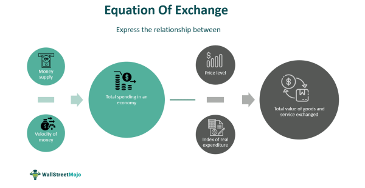

The intersection of economic theory and practical trading strategies often centers on foundational concepts like the equation of exchange. This article explores how economic formulas, monetary theory, and algorithmic trading integrate to provide insights into market dynamics. By exploring the equation of exchange, we connect the monetary supply with price levels and velocity of money, facilitating a deeper understanding of these critical components. This understanding equips traders and economists to better assess market conditions and develop informed strategies.

The equation of exchange, expressed as $MV = PQ$, forms the bedrock of economic interactions. Here, $M$ represents the money supply, $V$ the velocity of money, $P$ the price level, and $Q$ the quantity of real output. It offers a framework for analyzing the interplay between various economic elements, such as money supply and economic growth. By comprehending these variables, market participants can infer how alterations in the money supply might impact inflation or economic stability.



Moreover, the integration of these economic principles is particularly significant in the sphere of algorithmic trading. Traders use algorithmic systems to automate buying and selling decisions based on pre-defined criteria, and a robust grasp of economic indicators is essential for crafting precise trading strategies. Through the lens of the equation of exchange, algorithmic trading can be infused with a macroeconomic perspective, enhancing its relevance and efficacy.

Throughout this article, we will examine the application of these principles within algorithmic trading, emphasizing the importance of automation and precision in modern financial markets. By doing so, we underscore the relevance of foundational economic concepts in navigating complex financial landscapes and gaining strategic advantages.

## Table of Contents

## Understanding the Equation of Exchange

The equation of exchange, articulated as MV = PQ, serves as an essential tool in economic analysis. This formula connects the monetary components of an economy with its output, providing insights into how money circulates and affects the overall economic environment.

In this equation, M represents the money supply. This is the total amount of money available in an economy at any given time. It includes various forms of money, such as cash, coins, and balances held in checking and savings accounts. Money supply is influenced by central bank policies, which can expand or contract the amount of money circulating in the economy.

V stands for the velocity of money, a critical measure of how frequently a unit of currency is used in transactions over a specific period. A higher velocity indicates that each unit of currency is being used for multiple transactions, signifying robust economic activity. Conversely, a lower velocity may point to sluggish economic movement, where money is hoarded rather than spent.

The term P denotes the price level, a measure representing the average level of prices across goods and services in an economy. Changes in the price level are influenced by shifts in the money supply and velocity, as more money circulating at a faster rate can increase demand, driving prices up. The converse is also true: reduced money supply or velocity can suppress price levels.

Q represents the real output, or the quantity of goods and services produced within an economy. This component underlines the actual physical production activities, adjusted for inflation to provide a true measure of economic output. Economic growth is reflected in the rising value of Q, indicating increased production of goods and services.

The equation MV = PQ underscores that the product of money supply (M) and money velocity (V) equates to nominal GDP, which is the total market value of all finished goods and services within an economy, unadjusted for inflation. This relationship is crucial for understanding the dynamics between money and economic activity. Changes in M or V will directly affect PQ, implying variations in economic performance, particularly inflation and growth.

Analyzing each component of the equation facilitates comprehension of how fluctuations in the money supply can lead to inflation or deflation, impacting economic transactions. For instance, an increase in the money supply (M), assuming constant velocity (V), would likely lead to an increase in the nominal GDP (PQ), possibly causing inflation if real output (Q) does not rise proportionately with the money supply. This equation thus serves as a framework for economists to assess monetary phenomena and predict potential outcomes for different policy decisions.

## Monetary Theory and Its Implications

Monetary theory plays a pivotal role in understanding how fluctuations in money supply influence an economy's overall performance. A fundamental concept within this domain is the equation of exchange, expressed as $MV = PQ$, where $M$ denotes the money supply, $V$ represents the velocity of money, $P$ is the price level, and $Q$ indicates the real output or quantity of goods and services. This equation conveys that the product of the money supply and its velocity equates to the nominal GDP, providing a framework for analyzing monetary dynamics.

The quantity theory of money emerges from this equation, particularly when assuming constant velocity ($V$) and output ($Q$). According to this theory, any change in the money supply ($M$) leads to a proportional change in the price level ($P$), signaling potential inflation or deflation. This relationship underscores the importance of controlling the money supply to stabilize prices and maintain economic equilibrium.

A prominent advocate of this approach was economist Milton Friedman, who advanced the concept of monetarism. Friedman's monetarism emphasizes the significant role of a steady, controlled expansion of the money supply in preventing inflation. He argued that excessive increases in the money supply could lead to inflationary pressures, disrupting economic stability. Friedman's insights highlight the crucial connection between monetary policy and inflation management, advocating for predictable and measured policy interventions.

The implications of these theories extend to economic stability and the formulation of monetary policy. By examining the velocity of money and its interactions with supply, policymakers can better gauge economic conditions and anticipate price level changes. This allows for more informed decisions regarding interest rates, money supply adjustments, and other policy instruments aimed at achieving macroeconomic stability.

Moreover, understanding these monetary theories provides a foundation for interpreting economic signals and crafting effective responses to various economic challenges. As economies evolve and new variables come into play, the principles underlying monetary theories continue to offer valuable insights into maintaining economic stability and guiding monetary policy.

## Algorithmic Trading: Leveraging Economic Insights

Algorithmic trading revolutionizes the financial markets by employing computer programs to execute trades based on predetermined criteria. These criteria are often anchored in economic indicators, offering a macroeconomic perspective essential for strategy development. At the heart of these indicators is the equation of exchange, expressed as $MV = PQ$, where $M$ denotes money supply, $V$ represents the velocity of money, $P$ is the price level, and $Q$ signifies the real output.

Incorporating insights from the equation of exchange enables algorithmic systems to anticipate market dynamics more effectively. For instance, if there is a change in the money supply ($M$) or the velocity of money ($V$), this could indicate upcoming inflation or deflationary pressures, subsequently affecting pricing strategies and investment decisions. Algorithmic trading systems can [factor](/wiki/factor-investing) these shifts into their models, enabling them to adjust trading strategies accordingly.

By applying monetary theory, these systems gain a better understanding of potential economic shifts. For example, according to the quantity theory of money, maintaining a constant velocity and output suggests that changes in money supply directly impact price levels. This insight can be encoded into algorithmic systems to predict rises or falls in market prices, allowing for more precise trading decisions.

Traders utilize such economic principles to enhance the precision and efficacy of trading algorithms. By establishing algorithms that recognize patterns influenced by monetary policy changes, traders can optimize strategies to capitalize on transient market inefficiencies or long-term trends. Algorithms may incorporate variables such as interest rates, inflation forecasts, and GDP growth rates, all of which are intrinsically linked to the equation of exchange.

However, integrating economic theory with [algorithmic trading](/wiki/algorithmic-trading) presents both benefits and challenges. On the one hand, leveraging these insights allows for enhanced decision-making, offering a strategic advantage by aligning trading behavior with macroeconomic conditions. On the other hand, the complexity of economic environments and the unpredictability of human behavior can pose challenges. Algorithms must be meticulously calibrated to ensure that they adapt to real-time data and unexpected economic events.

The challenge extends to interpreting data accurately and avoiding overfitting models to historical data, which may lead to poor performance in unprecedented conditions. Continuous refinement and testing of algorithms are essential to mitigate these issues.

Incorporating robust economic models into algorithmic trading systems holds potential for immense value. As technology and data availability expand, these systems will likely grow more sophisticated, adapting more rapidly to the ever-changing landscape of global markets.

## Practical Applications and Case Studies

Examining the real-world applications of the equation of exchange (MV = PQ) within trading and economic analysis offers valuable insights into market behavior and strategic responses. This equation, pivotal in economic theory, allows traders and economists to interpret how alterations in money supply can potentially influence price levels and output.

**Case Studies: Shifts in Money Supply**

One prominent instance where changes in money supply had a significant impact is the hyperinflation experienced in Zimbabwe during the late 2000s. Here, excessive money printing led to a drastic rise in M, the money supply component of the equation of exchange. With V, the velocity of money, remaining relatively stable in the short term, this surge in M resulted in a disproportionate increase in P, the price level, while Q, the real output, struggled to keep pace due to an unstable economy. This illustrates how expanding money supply without corresponding growth in output can lead to rampant inflation, providing critical lessons for monetary policy formulation.

In the United States, the Federal Reserve's quantitative easing (QE) programs aimed to increase money supply during economic downturns. The increase in M was intended to counteract reducing velocity (V) during recessions, thereby stabilizing or increasing nominal GDP (PQ). By analyzing these interventions through the equation of exchange, policymakers could gauge the potential inflationary impacts against actual economic output growth, serving as a guide for future policy decisions.

**Algorithmic Trading and Economic Dynamics**

Algorithmic trading strategies increasingly incorporate macroeconomic indicators that align with the equation of exchange. For instance, algorithms can be designed to respond to known shifts in money supply or to changes in consumer behavior that affect the velocity of money. By tracking central bank announcements or analyzing supply data, these systems can preemptively adjust positions to exploit anticipated price movements.

A Python example of a simple algorithmic trading strategy could involve reacting to published money supply data:

```python
import requests
import datetime
from trading_system import TradingSystem

def fetch_money_supply():
    # Hypothetical function to fetch money supply data
    response = requests.get("https://api.example.com/money_supply")
    return response.json()['money_supply']

def adjust_trading_strategy(money_supply, threshold):
    trading_system = TradingSystem()
    if money_supply > threshold:
        trading_system.adjust_positions('buy')
    else:
        trading_system.adjust_positions('sell')

money_supply = fetch_money_supply()
adjust_trading_strategy(money_supply, threshold=1000000)
```

**Examples from Diverse Economic Environments**

Considering different global contexts further enriches the understanding of the equation's applicability. In Japan, decades of monetary easing to combat deflationary pressures involved manipulating money supply (M). This practice offers a counterpoint to the often inflationary pressures seen elsewhere, showcasing how the velocity of money (V) might drastically influence whether an increased money supply results in inflation or, conversely, aids in maintaining price stability.

In emerging economies, shifts in money supply due to foreign investment influx or government interventions modify price levels and output in varying degrees. By judiciously applying the equation of exchange, traders can develop models that predict the market's response to such fluctuations, crafting strategies that align with these anticipated outcomes.

These practical examples underscore the critical role economic formulas play in modern trading and policy-making, enabling a bridge between theoretical constructs and actionable strategies. Understanding the equation of exchange allows for enhanced interpretation and response to global economic shifts, crucial in navigating complex trading environments.

## Conclusion

The equation of exchange, represented by $MV = PQ$, remains an indispensable tool for integrating economic theory with practical trading applications. By linking the money supply ($M$), velocity of money ($V$), price level ($P$), and real output ($Q$), this equation equips economists and traders with a framework to comprehend and predict market dynamics. Such understanding is crucial for formulating informed responses to market changes, whether addressing inflation fluctuations or anticipating economic growth trends.

As the field of algorithmic trading advances, the strategic application of these economic principles becomes increasingly crucial. Traders who incorporate the equation of exchange into their algorithms can better anticipate shifts in market conditions, potentially leading to enhanced precision and strategic advantages. This integration underscores the enduring relevance of classical economic concepts in today's rapidly evolving financial landscapes.

This article highlights the significance of foundational economic tools in navigating complex markets. By applying these principles, both economists and traders can craft strategies that not only respond to market trends but also anticipate them. We encourage readers to engage deeply with these intersecting domains, enabling them to unlock the full potential of economic theory and its practical applications in modern trading environments.

## References & Further Reading

[1]: Friedman, Milton. (1963). ["Inflation: Causes and Consequences."](https://miltonfriedman.hoover.org/objects/57545/inflation-causes-and-consequences) University of Chicago Press.

[2]: Mishkin, Frederic S. (2010). ["The Economics of Money, Banking, and Financial Markets."](https://www.pearsonhighered.com/assets/preface/0/1/3/4/0134855388.pdf) Pearson.

[3]: ["Monetary Theory and Policy"](https://mitpress.mit.edu/9780262035811/monetary-theory-and-policy/) by Carl E. Walsh, MIT Press.

[4]: Jansen, Stefan. (2020). ["Machine Learning for Algorithmic Trading - Second Edition."](https://github.com/stefan-jansen/machine-learning-for-trading) Packt Publishing.

[5]: Friedman, Milton. (1971). ["A Monetary History of the United States, 1867–1960."](https://www.jstor.org/stable/j.ctt7s1vp) Princeton University Press.