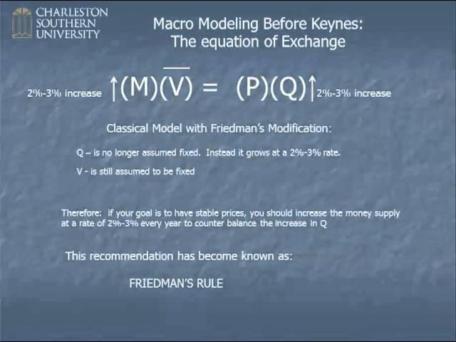

## Table of Contents

## What is the Equation of Exchange?

The Equation of Exchange is a basic idea in economics that helps us understand how money works in an economy. It says that the total amount of money spent in an economy (M times V) is equal to the total value of goods and services sold (P times Q). Here, M stands for the money supply, V is the velocity of money (how often money changes hands), P is the price level, and Q is the quantity of goods and services produced.

This equation, written as MV = PQ, is useful for economists to study how changes in the money supply can affect prices and economic output. For example, if the money supply (M) increases and the velocity of money (V) stays the same, then either the price level (P) or the quantity of goods and services (Q) must go up to keep the equation balanced. This helps explain why too much money can lead to inflation if the economy isn't producing more goods and services.

## Who developed the Equation of Exchange?

The Equation of Exchange was developed by Irving Fisher, an American economist, in the early 20th century. Fisher wanted to find a way to understand how money works in an economy. He came up with the idea that the total amount of money used in an economy is equal to the total value of goods and services sold. This idea is shown in the equation MV = PQ, where M is the money supply, V is the velocity of money, P is the price level, and Q is the quantity of goods and services.

Fisher's work on the Equation of Exchange was important because it helped economists understand the link between money and the economy. Before Fisher, people didn't have a clear way to see how changes in the money supply could affect prices and economic output. His equation gave economists a tool to study these relationships and predict what might happen if the money supply changed. Even though the Equation of Exchange has been changed and improved over time, Fisher's original idea is still used today to help understand how economies work.

## What are the components of the Equation of Exchange?

The Equation of Exchange has four main parts: money supply (M), velocity of money (V), price level (P), and quantity of goods and services (Q). The money supply is all the money in an economy, including cash and money in bank accounts. The velocity of money shows how often money changes hands. If people spend money quickly, the velocity is high. If people hold onto their money, the velocity is low. The price level is the average price of goods and services. The quantity of goods and services is how much stuff an economy makes and sells.

These four parts work together in the equation MV = PQ. This means that the total amount of money spent (M times V) is equal to the total value of goods and services sold (P times Q). If one part of the equation changes, at least one other part must change to keep the equation balanced. For example, if the money supply goes up and people spend money at the same rate, then either prices will go up or more goods and services will be sold. This helps economists understand how changes in the money supply can affect the economy.

## How is the Equation of Exchange used in economics?

The Equation of Exchange is a tool that economists use to understand how money works in an economy. It says that the total amount of money spent (M times V) is equal to the total value of goods and services sold (P times Q). Economists use this equation to see how changes in the money supply can affect prices and the amount of stuff an economy makes. For example, if the government prints more money, the money supply goes up. If people keep spending money at the same rate, then either prices will go up or more goods and services will be sold to keep the equation balanced.

This equation helps economists predict what might happen if the money supply changes. If the money supply grows too fast and the economy isn't making more stuff, prices will go up. This is called inflation. On the other hand, if the money supply doesn't grow enough, it can lead to less spending and slower economic growth. By using the Equation of Exchange, economists can study these relationships and make better decisions about how to manage the money supply to keep the economy stable.

## What is the relationship between the money supply and the velocity of money in the Equation of Exchange?

In the Equation of Exchange, the money supply and the velocity of money work together to show how much money is spent in an economy. The money supply is all the money in the economy, like cash and money in bank accounts. The velocity of money tells us how often that money changes hands. If people spend money quickly, the velocity is high. If people hold onto their money, the velocity is low. Together, the money supply and the velocity of money tell us the total amount of money spent, which is shown as M times V in the equation.

When the money supply changes, it can affect the velocity of money. If the government prints more money, the money supply goes up. If people keep spending money at the same rate, the velocity stays the same. This means more money is spent overall because M times V is bigger. But if people start to spend money faster because there's more of it, the velocity can go up too. On the other hand, if the money supply goes down, people might hold onto their money more, making the velocity lower. Understanding how these two parts work together helps economists predict what will happen in the economy.

## Can you explain the Quantity Theory of Money in relation to the Equation of Exchange?

The Quantity Theory of Money is an idea that comes from the Equation of Exchange. It says that if the amount of money in an economy goes up, and people keep spending money at the same speed, then prices will go up too. This is because the Equation of Exchange, MV = PQ, shows that the total money spent (M times V) must equal the total value of stuff sold (P times Q). So, if the money supply (M) grows and the speed of spending (V) stays the same, the only way to keep the equation balanced is if the price level (P) goes up or if more stuff (Q) is made and sold. Usually, the Quantity Theory of Money focuses on the idea that more money leads to higher prices, not more stuff.

Economists use the Quantity Theory of Money to understand why prices can go up when the government prints more money. If the money supply grows faster than the amount of stuff the economy makes, then prices will rise. This is called inflation. The theory helps explain why too much money can make things more expensive. But it's not always that simple. Sometimes, if people start spending money faster or if the economy starts making more stuff, the effects on prices can be different. So, the Quantity Theory of Money gives us a basic idea, but we need to look at all parts of the Equation of Exchange to understand what's really happening in the economy.

## How does inflation affect the variables in the Equation of Exchange?

Inflation means that prices are going up. In the Equation of Exchange, when inflation happens, the price level (P) goes up. This means that the total value of goods and services (P times Q) goes up too. If the money supply (M) and the speed of spending (V) stay the same, then the only way to keep the equation MV = PQ balanced is if the amount of stuff the economy makes (Q) goes up. But usually, the economy doesn't make more stuff right away, so prices go up instead.

Inflation can also affect how fast people spend money. If people think prices will keep going up, they might spend their money faster to buy things before they get more expensive. This means the velocity of money (V) can go up. If the money supply (M) stays the same, then more money is spent overall because M times V is bigger. This can make inflation even worse because more money is chasing the same amount of stuff. So, inflation can change the price level and the speed of spending, and these changes can make the economy act differently.

## What are some criticisms of the Equation of Exchange?

Some people think the Equation of Exchange is too simple to explain how money works in an economy. They say it doesn't show how people make choices about spending and saving, which can change how fast money moves. The equation also doesn't talk about things like interest rates and how they can affect how much money people want to hold. Critics think that because the equation only looks at the total amount of money and stuff, it misses important details about how the economy really works.

Another problem with the Equation of Exchange is that it assumes the speed of money (velocity) stays the same, but in real life, it can change a lot. If people start spending money faster or slower, it can mess up the balance of the equation. Also, the equation doesn't say much about how changes in the money supply can affect the amount of stuff an economy makes. Some economists think that if the government prints more money, it can lead to more stuff being made, not just higher prices. So, while the Equation of Exchange can help us understand some things about money and the economy, it doesn't tell the whole story.

## How can the Equation of Exchange be used to predict inflation?

The Equation of Exchange can help us predict inflation by showing how changes in the money supply can affect prices. The equation says that the total amount of money spent (M times V) equals the total value of goods and services sold (P times Q). If the money supply (M) goes up and people keep spending money at the same speed (V), then either prices (P) will go up or more stuff (Q) will be made and sold. Usually, if the economy isn't making more stuff right away, prices will go up. This is what we call inflation.

To predict inflation using the Equation of Exchange, we need to look at how fast the money supply is growing compared to how much stuff the economy is making. If the money supply grows faster than the amount of stuff, then prices are likely to go up. For example, if the government prints more money and people keep spending it at the same rate, the extra money will chase the same amount of goods and services, pushing prices higher. By watching these changes, we can use the Equation of Exchange to guess if inflation might happen and how bad it could be.

## What are the differences between the Fisher and Cambridge versions of the Equation of Exchange?

The Fisher version of the Equation of Exchange, created by Irving Fisher, says that the total amount of money spent in an economy (M times V) equals the total value of goods and services sold (P times Q). In this version, M is the money supply, V is the velocity of money (how fast money moves around), P is the price level, and Q is the amount of goods and services. Fisher's idea is that if the money supply grows and the speed of spending stays the same, prices will go up unless more stuff is made and sold. This version focuses on how money moves and how it affects prices and the economy.

The Cambridge version, developed by economists like Alfred Marshall and A.C. Pigou, looks at money a bit differently. Instead of focusing on how fast money moves, it looks at how much money people want to hold. In the Cambridge equation, written as M = k times P times Q, M is still the money supply, P is the price level, and Q is the amount of goods and services. But instead of V, we have k, which shows how much money people want to hold compared to their income. If k is high, people hold onto more money; if it's low, they spend more. This version helps us understand why people might save or spend money and how that affects the economy.

## How does the Equation of Exchange apply to modern monetary systems?

The Equation of Exchange still works well in today's money systems, even though we use more than just cash now. Today, we have things like credit cards, online payments, and digital money. But the basic idea of the Equation of Exchange stays the same. It says that the total amount of money spent (M times V) is equal to the total value of stuff sold (P times Q). In modern times, M includes all kinds of money, not just cash. V can change because of things like how fast people use their credit cards or make online payments. So, the Equation of Exchange helps us see how all this money moving around affects prices and the economy.

In today's world, the Equation of Exchange can help us understand big things like inflation. If the government or central bank makes more money (like by printing it or adding it to bank accounts), and people keep spending at the same speed, then prices might go up unless the economy makes more stuff. This is because the extra money chases the same amount of goods and services. The Equation of Exchange helps us predict what might happen if the money supply changes. It's a useful tool for understanding how money works in our modern economy, even with all the new ways we use it.

## What advanced mathematical models have been developed from the Equation of Exchange?

The Equation of Exchange has helped economists create more complex math models to study money and the economy. One important model that came from it is the Quantity Theory of Money. This model says that if the amount of money in an economy grows faster than the stuff it makes, prices will go up. Economists use this to predict inflation and understand how changes in the money supply affect the economy. Another model is the Cambridge Cash-Balances Approach, which looks at how much money people want to hold instead of how fast money moves. This model uses the idea that people's choices about holding money can change how the economy works.

Another advanced model that builds on the Equation of Exchange is the Monetarist Model. This model, made famous by Milton Friedman, says that the money supply has a big effect on economic output and prices. It uses the Equation of Exchange to argue that controlling the money supply is key to keeping the economy stable. The Monetarist Model has been used to guide economic policy, especially in the fight against inflation. These models all come from the basic idea of the Equation of Exchange but add more details to help us understand the economy better.

## References & Further Reading

[1]: Friedman, Milton. (1963). ["Inflation: Causes and Consequences."](https://miltonfriedman.hoover.org/objects/57545/inflation-causes-and-consequences) University of Chicago Press.

[2]: Mishkin, Frederic S. (2010). ["The Economics of Money, Banking, and Financial Markets."](https://www.pearsonhighered.com/assets/preface/0/1/3/4/0134855388.pdf) Pearson.

[3]: ["Monetary Theory and Policy"](https://mitpress.mit.edu/9780262035811/monetary-theory-and-policy/) by Carl E. Walsh, MIT Press.

[4]: Jansen, Stefan. (2020). ["Machine Learning for Algorithmic Trading - Second Edition."](https://github.com/stefan-jansen/machine-learning-for-trading) Packt Publishing.

[5]: Friedman, Milton. (1971). ["A Monetary History of the United States, 1867–1960."](https://www.jstor.org/stable/j.ctt7s1vp) Princeton University Press.