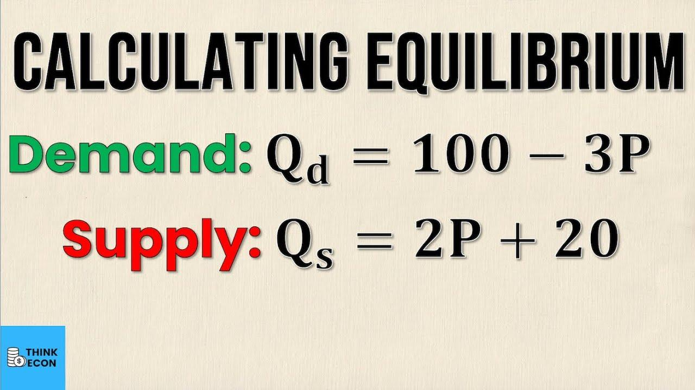

## Table of Contents

## What is the basic definition of equilibrium price?

Equilibrium price is the price at which the amount of a product that people want to buy is equal to the amount that sellers want to sell. It's like a balance point where the supply and the demand meet. When a product is at its equilibrium price, there's no shortage or surplus because everyone who wants to buy at that price can, and everyone who wants to sell at that price can too.

If the price is higher than the equilibrium price, fewer people will want to buy the product, and there will be a surplus because sellers can't sell all their products. On the other hand, if the price is lower than the equilibrium price, more people will want to buy the product than there are products available, creating a shortage. The market naturally tries to move towards the equilibrium price because it's where both buyers and sellers are happy with the deal.

## How does the equilibrium price relate to supply and demand?

The equilibrium price is where the amount of a product that people want to buy matches the amount that sellers want to sell. This point is found where the supply curve and the demand curve meet on a graph. The supply curve shows how much of a product sellers are willing to offer at different prices. The demand curve shows how much of the product people want to buy at different prices. When these two curves cross, that's the equilibrium price.

If the price of a product is higher than the equilibrium price, more people will want to sell it because they can make more money, but fewer people will want to buy it because it's too expensive. This creates a surplus because there's more of the product than people want to buy. On the other hand, if the price is lower than the equilibrium price, more people will want to buy the product because it's a good deal, but fewer people will want to sell it because they're not making enough money. This creates a shortage because there's not enough of the product to meet everyone's demand. The market naturally tries to find the equilibrium price because it's the point where both buyers and sellers are satisfied.

## What happens to the equilibrium price when demand increases?

When demand for a product goes up, more people want to buy it. This means the demand curve shifts to the right on the graph. Because more people want the product, sellers can charge a higher price and still sell all their products. So, the equilibrium price goes up. At the new, higher equilibrium price, the amount of the product that people want to buy matches the amount that sellers are willing to sell.

The increase in demand can happen for many reasons. Maybe the product becomes popular, or people's incomes go up so they can afford to buy more. When this happens, the new equilibrium price is higher than before. This change shows how the market adjusts to make sure that the amount of the product people want to buy is the same as the amount sellers want to sell, even when things change.

## What happens to the equilibrium price when supply decreases?

When the supply of a product goes down, it means there's less of the product available for people to buy. This can happen if it's harder to make the product or if something else changes that makes it so there's not as much around. When this happens, the supply curve on a graph moves to the left. Because there's less of the product, sellers can charge more money for it and still sell everything they have. So, the equilibrium price goes up. This new, higher price is where the amount of the product people want to buy matches the smaller amount that sellers are now willing to sell.

The increase in the equilibrium price because of a decrease in supply shows how the market tries to balance things out. Even though there's less of the product, the higher price helps make sure that the amount people want to buy is the same as the amount sellers have to sell. This change can happen for many reasons, like if it's harder to get the materials needed to make the product or if there's a problem that makes it so less can be made. When the supply goes down, the market adjusts to a new equilibrium price that's higher than before.

## How can you graphically represent the equilibrium price on a supply and demand curve?

To show the equilibrium price on a supply and demand curve, you start with two lines on a graph. The first line is the demand curve, which slopes downward from left to right. This shows that when the price is high, fewer people want to buy the product, and when the price is low, more people want to buy it. The second line is the supply curve, which slopes upward from left to right. This shows that when the price is high, more sellers are willing to offer the product, and when the price is low, fewer sellers are willing to offer it.

The point where these two lines cross is called the equilibrium price. At this point, the amount of the product that people want to buy is exactly the same as the amount that sellers want to sell. On the graph, you can see this point where the demand curve and the supply curve meet. This is the balance where there's no extra product left over and no one who wants to buy the product at that price is left without it.

## What are the factors that can shift the supply and demand curves?

Many things can make the demand curve move. If more people want a product, the demand curve moves to the right. This can happen if people's incomes go up, so they can buy more, or if the product becomes popular. It can also move if the price of other products changes. For example, if the price of a product that people can use instead goes up, they might want to buy more of the first product. Changes in people's tastes, the number of buyers, or even the weather can also shift the demand curve.

The supply curve can move too, but for different reasons. If it's easier to make a product, or if the cost to make it goes down, the supply curve moves to the right. This can happen if new technology makes it cheaper to make the product, or if the price of materials needed to make it goes down. But if it's harder to make the product, or if the cost goes up, the supply curve moves to the left. Things like natural disasters, changes in the price of materials, or new laws can make the supply curve shift.

Both the demand and supply curves moving can change the equilibrium price. When the demand curve moves to the right and the supply stays the same, the equilibrium price goes up. When the supply curve moves to the right and the demand stays the same, the equilibrium price goes down. If both curves move at the same time, it depends on how much they move to see if the equilibrium price goes up or down.

## How do government policies affect the equilibrium price?

Government policies can change the equilibrium price by making the supply and demand curves move. If the government puts a tax on a product, it costs more for sellers to make or sell it. This makes the supply curve move to the left because sellers want to sell less of the product if they have to pay more in taxes. When the supply curve moves to the left, the equilibrium price goes up because there's less of the product around, so sellers can charge more. On the other hand, if the government gives money to people to buy a product, more people want to buy it, so the demand curve moves to the right. This also makes the equilibrium price go up because more people want the product than before.

Sometimes the government sets a price that's different from the equilibrium price. If they set a price that's lower than the equilibrium price, it's called a price ceiling. This makes it so the product costs less than people are willing to pay, but sellers might not want to sell as much because they're not making as much money. This can lead to a shortage because more people want to buy the product than there are products available. If the government sets a price that's higher than the equilibrium price, it's called a price floor. This makes it so the product costs more than people might want to pay, but sellers are happy because they're making more money. This can lead to a surplus because there's more of the product than people want to buy. Both of these policies can mess with the natural balance of supply and demand and change the equilibrium price.

## What is the role of elasticity in determining changes in equilibrium price?

Elasticity is how much people change their buying or selling when the price changes. It's important because it helps us know how much the equilibrium price will change if something else changes. If demand is elastic, it means that people will buy a lot more or a lot less of a product if the price changes even a little bit. If supply is elastic, it means that sellers will make a lot more or a lot less of the product if the price changes even a little bit. When demand or supply is elastic, even small changes can make the equilibrium price move a lot.

On the other hand, if demand is inelastic, it means that people won't change how much they buy even if the price changes a lot. If supply is inelastic, it means that sellers won't change how much they make even if the price changes a lot. When demand or supply is inelastic, big changes might not make the equilibrium price move very much. So, knowing if demand and supply are elastic or inelastic helps us understand how much the equilibrium price will change when things like taxes, subsidies, or other changes happen.

## How can you calculate the equilibrium price mathematically using supply and demand functions?

To find the equilibrium price using math, you need to know the supply and demand functions. The supply function shows how much of a product sellers want to sell at different prices. The demand function shows how much of the product people want to buy at different prices. These functions are usually written as equations where the price is one of the variables. To find the equilibrium price, you set the supply function equal to the demand function because at the equilibrium price, the amount people want to buy is the same as the amount sellers want to sell.

Once you set the supply function equal to the demand function, you solve the equation for the price. This gives you the equilibrium price. For example, if the supply function is P = 2Q (where P is the price and Q is the quantity) and the demand function is P = 10 - Q, you set 2Q equal to 10 - Q. Solving this equation, you get 3Q = 10, so Q = 10/3. Then, you put Q back into either the supply or demand function to find the price. Using P = 2Q, you get P = 2 * (10/3) = 20/3. So, the equilibrium price is 20/3, or about 6.67.

## What are the limitations of the equilibrium price model in real-world markets?

The equilibrium price model is a good way to understand how markets work, but it has some problems when we look at real markets. One big problem is that it assumes that everyone knows everything about the market, like how much people want to buy and how much sellers want to sell. In real life, people don't always know all this information. They might not know the best price to buy or sell, or they might not know how much other people want the product. This can make the real price different from the equilibrium price.

Another problem is that the model doesn't think about things like time and how long it takes for the market to find the equilibrium price. In real life, it can take a while for prices to change and for the market to balance out. Also, the model doesn't think about things like government rules, taxes, or other things that can change how much people want to buy or sell. These things can make the real price different from what the model says it should be. So, while the equilibrium price model is helpful, it's not perfect for understanding everything that happens in real markets.

## How do expectations of future price changes influence current equilibrium price?

People's ideas about what prices will be in the future can change what they do now. If people think the price of a product will go up soon, they might want to buy it now before it gets more expensive. This makes more people want the product now, so the demand curve moves to the right. When the demand curve moves, the equilibrium price goes up because more people are trying to buy the product at the same time. On the other hand, if people think the price will go down soon, they might wait to buy it later when it's cheaper. This makes fewer people want the product now, so the demand curve moves to the left. When the demand curve moves to the left, the equilibrium price goes down because fewer people are trying to buy the product.

Sellers also think about what prices will be like in the future. If they think the price will go up, they might want to sell less now and keep more of the product to sell later when they can get more money for it. This makes the supply curve move to the left because there's less of the product available now. When the supply curve moves to the left, the equilibrium price goes up because there's less of the product for people to buy. But if sellers think the price will go down, they might want to sell more now before the price drops. This makes the supply curve move to the right because there's more of the product available now. When the supply curve moves to the right, the equilibrium price goes down because there's more of the product for people to buy. So, what people think will happen in the future can change the equilibrium price right now.

## What advanced econometric models are used to predict changes in equilibrium price?

Advanced econometric models help us predict changes in equilibrium price by looking at a lot of data and finding patterns. One common model is called the Vector Autoregression (VAR) model. This model looks at how different things, like income, interest rates, and other prices, change over time and how they affect each other. By understanding these relationships, the VAR model can predict how the equilibrium price might change if one of these things changes. Another model is the Autoregressive Integrated Moving Average (ARIMA) model. This model looks at past prices to predict future prices, taking into account things like trends and seasonal changes. Both of these models help economists make better guesses about what will happen to prices in the future.

Another important model is the Simultaneous Equation Model (SEM). This model is useful because it can look at many different parts of the economy at the same time. For example, it can show how changes in income, taxes, and production costs can all affect the equilibrium price together. By solving these equations together, the SEM can give a more complete picture of how the equilibrium price might change. These advanced models are very helpful, but they also need a lot of good data and careful work to make sure they are correct. They help us understand the complex ways that different parts of the economy can affect prices, making it easier to predict what will happen next.

## How is the Equilibrium Price Calculated?

Economic equilibrium price represents the point where market supply perfectly matches demand, resulting in stable prices and quantities that satisfy both sellers' and buyers' needs. This equilibrium can be determined by identifying the intersection of the supply and demand curves. Mathematically, it involves setting the supply function equal to the demand function and solving for the price. 

To illustrate, consider a simple linear model where the demand function is represented as $Q_d = a - bP$ and the supply function as $Q_s = c + dP$, where $Q_d$ and $Q_s$ represent the quantity demanded and supplied, respectively. $P$ is the price level, and $a, b, c,$ and $d$ are constants. At equilibrium:

$$
Q_d = Q_s
$$

Thus,

$$
a - bP = c + dP
$$

This equation can be rearranged to solve for the equilibrium price $P^*$:

$$
P^* = \frac{a - c}{b + d}
$$

Once the equilibrium price $P^*$ is determined, it can be substituted back into either the demand or supply equation to find the equilibrium quantity $Q^*$:

$$
Q^* = a - bP^* \] 
or
$$
Q^* = c + dP^*
$$

The equilibrium quantity $Q^*$ signifies the amount of goods exchanged at the equilibrium price, where there is no surplus or shortage in the market.

To further simplify the process of finding equilibrium prices and quantities, especially when working with data or more complex functions, tools such as equilibrium calculators can be utilized. These calculators often use linear or other applicable functions to compute the equilibrium state, providing an efficient means to analyze market balance dynamically.

For instance, in Python, one can use libraries such as NumPy to solve equilibrium states efficiently:

```python
import numpy as np

# Coefficients for demand and supply functions
a, b = 100, 2  # Demand: Q_d = 100 - 2P
c, d = 20, 3   # Supply: Q_s = 20 + 3P

# Solving for equilibrium price
A = np.array([[b+d]])
B = np.array([[a-c]])
P_star, = np.linalg.solve(A, B)

# Calculating equilibrium quantity
Q_star = a - b * P_star

P_star, Q_star
```

This approach highlights the role of mathematical and computational tools in determining market equilibrium, providing clarity and precision in economic analysis. By accurately calculating these metrics, market participants can make informed decisions aligned with the current market conditions, ensuring efficient and stable market dynamics.

## References & Further Reading

[1]: Bergstra, J., Bardenet, R., Bengio, Y., & Kégl, B. (2011). ["Algorithms for Hyper-Parameter Optimization."](https://papers.nips.cc/paper/4443-algorithms-for-hyper-parameter-optimization) Advances in Neural Information Processing Systems 24.

[2]: ["Advances in Financial Machine Learning"](https://github.com/FIONA-Youkyung/Financial_Engineering/blob/master/Advances_in_Financial_Machine_Learning_Marcos_Lopez_de_Prado.pdf) by Marcos Lopez de Prado

[3]: ["Evidence-Based Technical Analysis: Applying the Scientific Method and Statistical Inference to Trading Signals"](https://www.amazon.com/Evidence-Based-Technical-Analysis-Scientific-Statistical/dp/0470008741) by David Aronson

[4]: ["Machine Learning for Algorithmic Trading"](https://github.com/stefan-jansen/machine-learning-for-trading) by Stefan Jansen

[5]: ["Quantitative Trading: How to Build Your Own Algorithmic Trading Business"](https://www.amazon.com/Quantitative-Trading-Build-Algorithmic-Business/dp/1119800064) by Ernest P. Chan

[6]: Kirilenko, A., Kyle, A. S., Samadi, M., & Tuzun, T. (2011). ["The Flash Crash: The Impact of High-Frequency Trading on an Electronic Market."](https://www.jstor.org/stable/26652722) U.S. Commodity Futures Trading Commission. 

[7]: Zuckerman, G. (2019). ["The Man Who Solved the Market: How Jim Simons Launched the Quant Revolution."](https://www.amazon.com/Man-Who-Solved-Market-Revolution/dp/073521798X) Penguin Random House.

[8]: [U.S. Securities and Exchange Commission (SEC)](https://www.sec.gov/search-filings)

[9]: [Financial Conduct Authority (FCA)](https://www.fca.org.uk/)