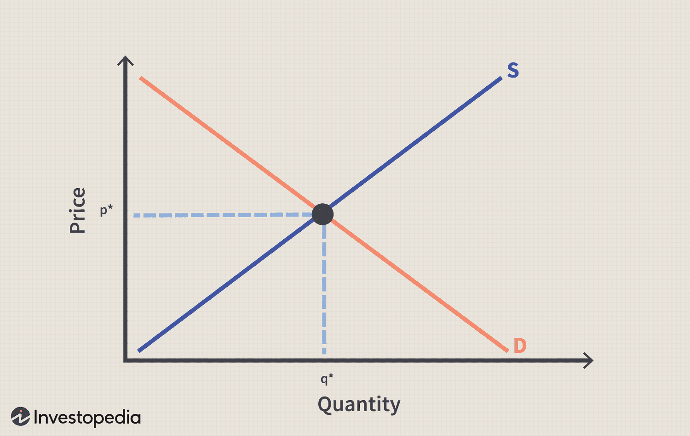

In the rapidly evolving financial landscape, comprehension of key economic principles is essential for traders and investors. Central to this understanding is the relationship between price, economic equilibrium, and equilibrium quantity—concepts that lie at the heart of how markets operate efficiently. Economic equilibrium occurs when market supply and demand balance, leading to a stable price and quantity of goods being bought and sold. The intersection where supply equals demand results in the equilibrium quantity, a situation where there is neither excess supply nor demand.

Price serves as a critical regulator in this dynamic. It adjusts in response to market imbalances—rising to curb excess demand or falling to stimulate demand when excess supply exists. These adjustments help direct resources towards their most valued uses, guiding the decisions of both producers and consumers in the marketplace.



With technological advancements, particularly through algorithmic trading, the nature of achieving equilibrium is undergoing significant transformations. Algorithmic trading uses computer algorithms to automate trading strategies, typically executing buy or sell orders in the financial markets at speeds and frequencies impracticable for manual trading. This method significantly alters price discovery processes and impacts how quickly and efficiently markets can achieve equilibrium.

Algorithms offer enhanced liquidity, tighter bid-ask spreads, and improved market efficiency but also introduce unique challenges. These include the potential for increased volatility and flash crashes, where markets can experience rapid and unjustified price changes. Thus, while algorithmic trading has many benefits, it also redefines the conventional mechanisms through which price stability and equilibrium are achieved in financial markets.

A comprehensive grasp of these dynamics is indispensable for navigating the complexities of today’s digital trading environment, enabling traders and investors to make informed decisions that align with both technological capabilities and economic fundamentals.

## Table of Contents

## What is Equilibrium Quantity?

Equilibrium quantity is a fundamental concept in economics that occurs when the quantity supplied by producers matches the quantity demanded by consumers, leading to a stable market price. This balance is a cornerstone of the supply and demand model, which serves as the basis for understanding how markets operate. 

**Supply and Demand Model**

The supply and demand model is built on two key functions: the supply function and the demand function. The supply function represents the relationship between the price of a good and the quantity of that good that producers are willing to supply. Conversely, the demand function represents the relationship between the price of a good and the quantity of that good that consumers are willing to purchase. Mathematically, these relationships can be expressed as:

- Supply Function: $Q_s = f(P)$
- Demand Function: $Q_d = g(P)$

Where $Q_s$ is the quantity supplied, $Q_d$ is the quantity demanded, and $P$ represents the price.

Equilibrium occurs at the intersection of the supply and demand curves, where the quantity demanded equals the quantity supplied ($Q_d = Q_s$). At this point, the market clears, meaning there is no excess supply or shortage.

**Implications of Equilibrium Quantity in Different Market Scenarios**

The concept of equilibrium quantity has various implications in different market scenarios. For example, in a competitive market, prices tend to adjust toward the equilibrium due to inherent market forces. If the current price is above the equilibrium price, a surplus will occur, prompting suppliers to lower prices to clear excess inventory. Conversely, if the price is below equilibrium, a shortage arises, driving prices up as consumers compete for limited goods.

Market dynamics can shift the equilibrium quantity, such as changes in consumer preferences, technological advancements, or external shocks like natural disasters. An increase in consumer demand for a product will shift the demand curve rightward, resulting in a higher equilibrium quantity and price. Similarly, advancements in technology that reduce production costs can shift the supply curve rightward, increasing the equilibrium quantity while potentially lowering the equilibrium price.

Understanding these shifts is crucial for businesses and policymakers to predict market trends and make informed decisions. It also highlights the dynamic nature of markets, where equilibrium is not static but constantly adjusting to new economic conditions.

In conclusion, equilibrium quantity is not just a static number but a dynamic point influenced by multiple market forces and changes. It serves as a guide for understanding how markets function efficiently and how various factors can disrupt or stabilize market conditions.

## Understanding Price Relationship in Economics

Price relationships play a crucial role in determining economic equilibrium, a fundamental concept where market supply and demand meet, resulting in a stable market price and quantity. In a typical market scenario, prices adjust in response to differences between the quantity supplied and the quantity demanded. This dynamic process is essential to eliminate shortages and surpluses, ultimately leading to an equilibrium state.

**Price Adjustment and Market Equilibrium**

In economics, the law of demand states that, all else being equal, as price falls, the quantity demanded increases. Conversely, the law of supply suggests that as price increases, the quantity supplied also increases. These two laws form the backbone of the supply and demand model, which predicts that markets will move toward an equilibrium price, where quantity supplied equals quantity demanded.

Mathematically, this can be expressed by the equilibrium condition:

$$
Q_d(P) = Q_s(P)
$$

where $Q_d(P)$ is the quantity demanded at price $P$, and $Q_s(P)$ is the quantity supplied at the same price.

The adjustment process of prices in response to differences in supply and demand can be illustrated through graphical analysis. For instance, if the price is initially set above the equilibrium price, a surplus will occur, resulting in downward pressure on prices as suppliers attempt to sell excess inventory. Conversely, if the price is below equilibrium, a shortage ensues, creating upward pressure on prices as consumers compete for the limited available goods.

**Price Flexibility and Market Behavior**

The degree of price flexibility significantly influences market behavior, determining how quickly and efficiently a market reaches equilibrium:

1. **Rigid Prices:**
   - In some markets, prices are rigid due to factors like regulation, menu costs, or long-term contracts. In such scenarios, quantity adjustments often occur through changes in supply and demand rather than price changes.

2. **Flexible Prices:**
   - Markets characterized by flexible prices adjust more rapidly to equilibrium. For instance, in financial markets, where assets are continuously traded, prices may adjust within seconds in response to new information or changes in market conditions.

Examples of the effects of price flexibility can be seen in commodities markets, such as oil or agricultural products, where prices can fluctuate widely based on supply shocks, geopolitical tensions, or changes in consumption patterns. Here, short-run deviations from equilibrium are common, but long-term market forces generally guide prices back toward equilibrium.

In understanding these dynamics, economists and policymakers can better predict how markets will respond to various stimuli and design interventions that promote stability and efficiency. Price mechanisms serve as a vital tool in correcting market imbalances and fostering economic stability.

## The Impact of Algorithmic Trading on Market Equilibrium

Algorithmic trading, also known as algo trading, represents a significant evolution in financial market operations, fundamentally altering how markets attain equilibrium. It employs computer algorithms to automate trading decisions, encompassing buying, selling, or holding financial instruments. This technological advancement enhances price discovery mechanisms and expedites transactions, significantly impacting the equilibrium quantity — the amount where supply equals demand.

### Role of Algorithms in Price Discovery

Price discovery is a process wherein the market assesses the appropriate price of an asset, influenced by numerous factors like supply and demand, market conditions, and investor sentiment. Algorithmic trading enhances this process by swiftly analyzing vast data sets, executing trades at a pace and precision unattainable by humans. Algorithms utilize various strategies, such as statistical [arbitrage](/wiki/arbitrage), index fund rebalancing, and [market making](/wiki/market-making), each contributing to efficient pricing by quickly adjusting to new information.

For instance, a market-making algorithm might offer simultaneous buy and sell quotes for a stock, capturing the spread. This practice increases [liquidity](/wiki/liquidity-risk-premium) and tightens bid-ask spreads, thereby facilitating conditions conducive to equilibrium. An excess in supply or demand quickly manifests through price variances, promptly corrected by corresponding algorithmic responses, steering the market towards equilibrium.

### Influence on Equilibrium Quantity

Algorithmic trading influences equilibrium quantity by integrating efficiency into transactions. Algorithms can execute trades at optimal prices by predicting price movements more accurately, thus reaching equilibrium states quicker. They reduce human biases and errors, enabling uniform decision-making based on predefined criteria. Such automated interventions often balance orders book biases, ensuring the quantity supplied aligns with market demand.

Moreover, high-frequency trading ([HFT](/wiki/high-frequency-trading-strategies)), a subset of [algorithmic trading](/wiki/algorithmic-trading) involving rapid trade execution, plays a pivotal role here. HFT algorithms capitalize on minute price inefficiencies across different markets or assets, executing thousands of trades in fractions of a second. This activity can help markets converge towards their equilibrium states by continuously adjusting to reflect the latest supply-demand conditions.

### Advantages and Challenges in Maintaining Market Stability

The deployment of algorithmic trading contributes various benefits in maintaining market stability. It provides increased market liquidity and depth, diminishes transaction costs, and allows for the integration of complex trading strategies previously unavailable at scale. Additionally, by minimizing the latency in market responses, algorithms enhance price accuracy, promoting a more stable market environment.

However, challenges arise from this paradigm. The speed and [volume](/wiki/volume-trading-strategy) at which algorithmic trading operates can exacerbate [volatility](/wiki/volatility-trading-strategies), particularly during market stress. Events such as the Flash Crash of 2010 highlight how algorithmic trading systems, if misconfigured, can disrupt market equilibrium, leading to abrupt price swings. Additionally, the prevalence of similar algorithmic strategies can lead to herd behavior, where simultaneous exits or entries amplify market movements.

Thus, while algorithmic trading facilitates more efficient market operations and promotes equilibrium, it necessitates regulations and safeguards to mitigate potential disruptions. Ensuring robust risk management mechanisms and real-time monitoring systems are crucial for leveraging the benefits of algorithmic trading while safeguarding market stability.

## Case Studies: Algorithmic Trading and Market Equilibrium

Algorithmic trading has significantly influenced how markets find equilibrium, affecting both price stability and quantity exchanged. In assessing the impact of such trading, real-world case studies offer valuable insights into how automated systems interact with market dynamics.

### Case Study 1: Successful Algorithmic Trading Strategy

One notable example of successful algorithmic trading impacting market equilibrium is the strategy employed by Renaissance Technologies, a [hedge fund](/wiki/hedge-fund-trading-strategies) known for its Medallion Fund. The fund uses complex algorithms to analyze a vast array of data, allowing it to execute trades at speeds and frequencies unattainable by human traders. This capability enhances liquidity and facilitates faster price discovery, contributing to reaching equilibrium positions swiftly. The Medallion Fund's consistent performance and market influence underscore the potential of algorithmic trading to stabilize markets efficiently by matching supply and demand through rapid, data-driven decisions.

### Case Study 2: Unsuccessful Algorithmic Trading Strategy

Conversely, the 2010 "Flash Crash" in the United States stock markets illustrates the adverse effects of algorithmic trading on market equilibrium. On May 6, 2010, the Dow Jones Industrial Average plunged nearly 1,000 points within minutes before recovering. Investigations revealed that high-frequency trading algorithms amplified market volatility and liquidity imbalances, exacerbating price swings and misaligning equilibrium quantities. The crash highlighted the risks of algorithm-driven trades, especially when algorithms behave in unforeseen ways, leading to excessive buying or selling pressures that destabilize markets and prevent them from reaching equilibrium.

### Learning from Real-World Examples

These case studies demonstrate that algorithmic trading can either enhance or disrupt market equilibrium, depending on how algorithms are designed and implemented. Successful algorithms, such as those employed by Renaissance Technologies, tend to support market stability by improving liquidity and ensuring that prices adjust smoothly to reflect equilibrium quantities.

In contrast, issues arise when algorithms exacerbate volatility, as seen in the Flash Crash. This highlights the importance of robust risk management systems, regulatory oversight, and algorithmic design that accounts for extreme market conditions to mitigate unintended consequences.

Understanding these nuances is critical. Algorithmic traders and market regulators must acknowledge the double-edged nature of such trading systems—capable of both optimizing and unsettling market equilibrium. By studying both successful and unsuccessful strategies, stakeholders can refine their approaches, ensuring that automated trading aligns with market stability and the efficient functioning of financial systems.

## Special Considerations in Price Equilibrium and Algorithmic Trading

Real-world markets often deviate from traditional economic models due to myriad external factors. These include regulatory constraints, market psychology, and technological disruptions, all of which can impact the establishment of price equilibrium and influence algorithmic trading outcomes.

### Regulatory Constraints

Regulatory environments are a crucial consideration for anyone building algorithmic trading models. Governments and regulatory bodies impose rules designed to ensure market fairness, protect investors, and maintain stability. These regulations can dictate trading volumes, restrict certain trading practices (like short selling), and implement circuit breakers to prevent extreme market volatility. Consequently, traders and investors must ensure their algorithms are compliant with these regulations to avoid legal complications and potential losses. Additionally, regulatory changes can be unpredictable, requiring algorithms to be adaptable and flexible in response to new laws or guidelines.

### Market Psychology

Market psychology involves the collective sentiment of investors, which can sometimes lead markets away from their equilibrium points. Behavioral economics emphasizes the role of human emotions and cognitive biases in financial decision-making, traits that are often not fully captured by traditional models. Events such as financial downturns, geopolitical tensions, or even widespread panic can create market anomalies that disrupt price equilibrium. Algorithmic trading systems, therefore, need to incorporate behavioral data analysis and sentiment indicators to better respond to these psychological factors.

### Technological Disruptions

Technological advancements have significantly altered trading dynamics, introducing both opportunities and challenges. While technology facilitates faster trade execution and improved analytical capabilities via [machine learning](/wiki/machine-learning) and AI, it also introduces risks. For instance, high-frequency trading (HFT) can lead to "flash crashes," where rapid automated sell-offs drastically lower prices within minutes. Moreover, technology can expose traders to cybersecurity threats, system failures, and data breaches, all of which can compromise algorithmic trading strategies and market stability.

### Navigating Complexities

To effectively navigate these complexities in modern financial markets, traders and investors can adopt several strategies:

1. **Adaptive Strategies**: Algorithms should evolve in real-time, adapting to new regulations, shifting market sentiment, and technological changes. This can involve machine learning techniques that learn from historical data to predict potential market movements based on current conditions.

    ```python
    from sklearn.ensemble import RandomForestRegressor
    import numpy as np

    # Example: Implementing a simple adaptive algorithm using historical price data
    historical_prices = np.array([100, 102, 104, 107, 110])  # Mock data
    future_prices = np.array([112, 115, 118])  # Mock prediction data

    model = RandomForestRegressor(n_estimators=100)
    model.fit(historical_prices.reshape(-1, 1), future_prices)

    # Use the model to predict next price
    next_price = model.predict(np.array([113]).reshape(-1, 1))
    ```

2. **Stress Testing and Backtesting**: Implement rigorous testing protocols to evaluate how algorithms perform under various market conditions, including extreme scenarios. This can help identify vulnerabilities and optimize systems to cope with unexpected changes.

3. **Risk Management**: Develop comprehensive risk management frameworks that include monitoring tools for detecting anomalies and executing pre-set risk containment measures, such as stop-loss orders.

By addressing these special considerations, market participants can better achieve equilibrium in financial markets, despite the inherent challenges posed by external economic factors and algorithmic trading.

## Conclusion

In summary, the relationship between price and equilibrium quantity is a fundamental concept in economics that influences market conditions. Understanding these concepts is essential for investors and traders as they navigate financial markets. The price mechanism serves as the invisible hand that balances supply and demand, striving to achieve market equilibrium where the quantity supplied equals the quantity demanded. This dynamic is captured in the equilibrium condition, where the market price is set such that supply equals demand, typically expressed as:

$$
Q_d(P) = Q_s(P)
$$

Where $Q_d(P)$ is the quantity demanded at price $P$, and $Q_s(P)$ is the quantity supplied at that price. 

Algorithmic trading introduces a transformation in how markets attain this equilibrium. Automated systems, powered by algorithms, enhance the efficiency of price discovery processes. These systems can analyze vast amounts of data at speeds unmatched by human traders, allowing for rapid execution of trades that adjust prices. However, algorithmic trading also presents challenges. High-frequency trading can heighten market volatility and sometimes lead to phenomena such as flash crashes, where prices plummet or surge abruptly due to automated triggers. 

For investors and traders, comprehending both the benefits and challenges posed by algorithmic trading is crucial. Engaging with these dynamics enables market participants to make more informed decisions within the digital trading environment. A keen awareness of how algorithms influence market behavior, alongside an understanding of economic fundamentals, equips market players to strategize effectively and navigate the complexities of modern trading landscapes.

## References & Further Reading

[1]: Bergstra, J., Bardenet, R., Bengio, Y., & Kégl, B. (2011). ["Algorithms for Hyper-Parameter Optimization."](https://dl.acm.org/doi/10.5555/2986459.2986743) Advances in Neural Information Processing Systems 24.

[2]: ["Advances in Financial Machine Learning"](https://www.amazon.com/Advances-Financial-Machine-Learning-Marcos/dp/1119482089) by Marcos Lopez de Prado

[3]: ["Evidence-Based Technical Analysis: Applying the Scientific Method and Statistical Inference to Trading Signals"](https://www.amazon.com/Evidence-Based-Technical-Analysis-Scientific-Statistical/dp/0470008741) by David Aronson

[4]: ["Machine Learning for Algorithmic Trading"](https://github.com/PacktPublishing/Machine-Learning-for-Algorithmic-Trading-Second-Edition) by Stefan Jansen

[5]: ["Quantitative Trading: How to Build Your Own Algorithmic Trading Business"](https://www.amazon.com/Quantitative-Trading-Build-Algorithmic-Business/dp/1119800064) by Ernest P. Chan