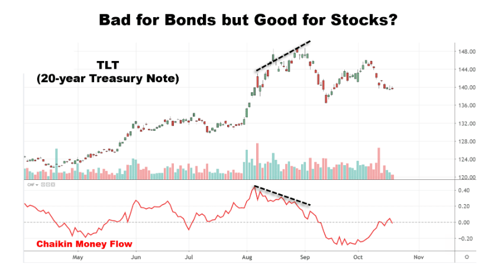

The convergence of data centers with international business technology represents a significant milestone in enhancing the infrastructure supporting algorithmic trading. As the global economy becomes increasingly interconnected, the importance of fast, reliable, and secure data infrastructures cannot be overstated. These infrastructures are critical for conducting operations that span across continents, ensuring that latency is minimized and transactional efficiency is maximized. 

Data centers, regarded as the backbone of modern computing and digital service delivery, have evolved to meet the ever-increasing demands of international businesses. Organizations engaged in algorithmic trading rely heavily on the rapid processing and transmission of data, making robust data infrastructures indispensable. The integration of advanced technologies within these data centers allows enterprises to achieve not only enhanced connectivity but also strategic growth, particularly within the trading sector.

In the trading industry, latency—the delay before a transfer of data begins following an instruction—is a major concern. Algorithmic trading, which involves executing pre-programmed trading instructions at high speeds, is particularly susceptible to delays caused by suboptimal data transmission. Therefore, the seamless integration of data centers into business operations ensures that trading systems function at their peak efficiency, thereby improving decision-making accuracy and timing.

This article will explore how advancements in data center technologies and international business technology infrastructures are facilitating the growth and efficiency of algorithmic trading. By examining the strategic use of these technologies, businesses can leverage them for improved connectivity and operational success in the global market. As we proceed, we will consider both the current landscape and future directions, including the integration of AI and machine learning, which are poised to further transform the trading industry.

## Table of Contents

## Understanding Data Centers in the Global Arena

Data centers play a crucial role in the modern global economy by providing network-neutral interconnection services essential for international business operations. These facilities enable multiple telecommunication and cloud service providers to connect seamlessly, offering businesses the flexibility and efficiency required to operate on a global scale. This connectivity is critical for ensuring low latency, high reliability, and scalability for businesses that demand these features in today's fast-paced digital landscape.

Equinix, a prominent data center provider, has strategically established its presence across major global markets by developing facilities that serve as vital hubs for national and international network exchanges. These centers are strategically located in key economic regions of North America, Europe, and the Asia-Pacific, providing businesses with robust connectivity options essential for modern operations. This geographical [dispersion](/wiki/dispersion-trading) ensures that data can flow efficiently across borders, supporting international trade, finance, and communication.

The network-neutral nature of data centers offered by providers like Equinix allows for robust interconnectivity without the limitations of a single network provider's infrastructure. This neutrality fosters competition and innovation, as businesses have the freedom to choose from various network and service providers, optimizing their operations according to specific needs and market dynamics. Such interconnectivity becomes increasingly important as businesses expand their global reach, requiring seamless integration of IT and network resources.

In terms of physical infrastructure, these data centers are equipped with advanced cooling systems, power redundancy, and security measures to ensure uptime and data protection. They employ cutting-edge technology such as virtualization and cloud computing to provide scalable solutions tailored to a company's needs, enabling businesses to accommodate growth and adjust to changes in demand swiftly.

The presence of data centers in key economic regions further aligns with local regulatory requirements and market demands, facilitating smoother operations for international businesses. This strategic presence not only enhances service delivery and performance but also provides businesses the agility to adapt to regional market conditions and regulatory landscapes. As global enterprises continue to expand and leverage international opportunities, the role of data centers in providing critical infrastructure for connectivity and interconnection at scale remains indispensable.

## The Role of Data Centers in Algorithmic Trading

Algorithmic trading, a method of executing trades using pre-set algorithms, has become a fundamental aspect of modern financial markets. For [algorithmic trading](/wiki/algorithmic-trading) to be effective, executing trades at lightning speed with minimal latency is necessary. Data centers play a crucial role in achieving these performance metrics by facilitating rapid and reliable data exchange.

Colocated and proximity-based data centers form the backbone of algorithmic trading infrastructure. Colocation refers to the practice of positioning trading servers at or near a data center housing major financial exchanges. This proximity minimizes the time data takes to travel from a trader's server to the exchange, significantly lowering latency. Low latency is essential because even microsecond delays can result in missed trading opportunities and impact profitability.

The strategic placement of data centers is a critical [factor](/wiki/factor-investing) influencing trade efficiency and decision-making. Financial markets operate under the impact of time-sensitive information and news, which necessitates the rapid execution of trades. By reducing the physical distance between trading algorithms and financial exchanges, colocated data centers ensure quicker data processing and transaction completion.

For instance, financial exchanges such as NASDAQ, NYSE, and other global markets set up their primary data centers in key financial hubs like New York, London, and Tokyo. These locations are not chosen arbitrarily; they are based on their proximity to significant trading activity, abundant technological resources, and skilled labor. Traders and financial firms colocate their servers in data centers within these regions to take advantage of reduced latency and enhanced connectivity.

Additionally, data centers are equipped with advanced technology to manage the massive data volumes intrinsic to algorithmic trading. High-performance computing (HPC) systems, advanced networking hardware, and robust cooling systems ensure optimal data processing speeds and hardware performance reliability.

In summary, the role of data centers in algorithmic trading is indispensable. Through colocated and proximity-based frameworks, traders achieve the necessary speed and reliability for executing time-critical trades. The strategic placement and technological capabilities of data centers directly translate into enhanced trade execution efficiency and more informed decision-making in the competitive world of algorithmic trading.

## International Business Technology Infrastructure

Technology infrastructures in international business have evolved significantly beyond simple connectivity solutions, now encompassing complex offerings such as Infrastructure-as-a-Service (IaaS). IaaS is a form of cloud computing that provides virtualized computing resources over the internet, allowing businesses to manage workloads more efficiently while reducing capital expenditures on physical hardware. This technology model allows companies to scale resources according to demand and only pay for what they use.

The flexibility offered by IaaS is crucial for global businesses that need to adapt quickly to changes in market conditions. By deploying proprietary and third-party applications within these infrastructures, enterprises can tailor their operations to better align with strategic objectives. The integration of these applications provides organizations with the agility to refine business strategies, enhance performance, and implement rapid adjustments in response to global shifts.

Infrastructure services are now crafted to cater specifically to the needs of the global market. IaaS providers offer solutions that include compute, storage, networking, and security services, each designed to bolster the global reach of businesses. For instance, through automated scaling and load balancing, IaaS can optimize resource use across multiple geographic locations, ensuring seamless business continuity and high availability. This global spread reduces latency and improves access speeds for international clients.

Moreover, the implementation of application program interfaces (APIs) in these services allows for deeper integration and data exchange between disparate systems. It fosters a cohesive and dynamic ecosystem where various applications interact fluidly, presenting a unified platform for data-driven decision-making. This capability is vital for international businesses aiming to incorporate advanced analytics into their operational models.

Globally distributed infrastructure services also entail comprehensive compliance with international data standards and regulations. Providers ensure these services meet local data residency laws while maintaining global data governance, which is essential for businesses operating across multiple jurisdictions. They incorporate security protocols that protect sensitive data from breaches and unauthorized access, which is increasingly critical as cyber threats grow more sophisticated.

Overall, the sophistication and global alignment of technology infrastructures, particularly through IaaS, provide businesses with the tools necessary to innovate and thrive in a competitive international landscape. These infrastructures support the continuous expansion of enterprises by facilitating agile, scalable, and secure operations that are pivotal for sustaining long-term growth.

## Key Players in the Market

Companies like Equinix and Trading Technologies are central figures in the evolving landscape of data centers and algorithmic trading platforms. Equinix, a global leader in digital infrastructure, offers expansive network-neutral interconnection services that are vital for international business operations. Through its strategically located data centers across North America, Europe, and Asia-Pacific, Equinix provides robust connectivity and accessibility, enabling businesses to seamlessly interconnect with partners, networks, and cloud service providers. This vast network not only facilitates rapid data exchange but also optimizes the performance of latency-sensitive applications such as algorithmic trading. By hosting their servers in proximity to major financial exchanges, Equinix minimizes latency, thereby enhancing the speed and efficiency of trade execution.

Trading Technologies, on the other hand, specializes in providing advanced trading software and platforms suited for high-frequency and algorithmic trading. Their TT platform empowers traders with a variety of tools designed for swift decision-making and execution, leveraging real-time data analytics and sophisticated algorithmic models. Through strategic partnerships and technological innovations, Trading Technologies caters to a broad spectrum of markets, including derivatives, cryptocurrencies, and fixed income.

Both companies are driving forces in supporting the infrastructure needs of modern trading environments. Equinix's data center solutions coupled with Trading Technologies' cutting-edge trading platforms offer a comprehensive foundation for firms seeking to optimize their trading operations. Their innovations in connectivity and trading technologies continue to shape the landscape of algorithmic trading and international business, ensuring that enterprises have the requisite tools to compete in an increasingly competitive market.

## Challenges and Future Directions

Data centers and international business technology infrastructures play a crucial role in facilitating seamless global operations, but they face significant challenges that need to be addressed. One of the primary concerns is maintaining data security. As data centers become more interconnected, they are increasingly vulnerable to cyber threats, which can compromise sensitive information and disrupt operations. Ensuring robust cybersecurity measures and developing resilient systems is essential to safeguard data and maintain trust with stakeholders.

In addition to security concerns, adapting to rapidly changing technologies poses another challenge. The fast-paced nature of technological advancements requires data centers and related infrastructures to be highly adaptable. This involves regularly updating hardware and software, investing in research and development, and ensuring compatibility with emerging technologies. Failing to do so can lead to obsolescence and reduced competitiveness in the market.

Looking towards the future, the integration of [artificial intelligence](/wiki/ai-artificial-intelligence) (AI) and [machine learning](/wiki/machine-learning) (ML) in algorithmic trading is expected to increase dramatically. These technologies demand sophisticated infrastructures capable of handling vast amounts of data and complex computations at high speeds. AI and ML algorithms can analyze market trends, execute trades based on predictive models, and optimize trading strategies more efficiently than traditional methods. Consequently, data centers will need to evolve, incorporating advanced processing capabilities and greater bandwidth to support these resource-intensive applications.

Realizing the full potential of AI and ML in trading will require not just enhancement of existing infrastructures but also innovative approaches to data management and processing. Quantum computing, for instance, could revolutionize the trading industry by further expediting data analysis and decision-making processes. However, widespread adoption of such cutting-edge technologies is still on the horizon, necessitating ongoing research, investment, and strategic planning.

In conclusion, while data centers and international business technology infrastructures have significantly advanced the field of algorithmic trading, they must continuously adapt to overcome challenges related to data security and rapidly evolving technologies. By embracing future trends and investing in sophisticated infrastructures, global businesses can sustain competitiveness and drive growth in an increasingly complex trading landscape.

## Conclusion

The evolution of data centers and international business technology infrastructure is undeniable, as these systems have transformed the landscape of global business operations, particularly in algorithmic trading. Across continents, businesses are expanding their reach, necessitating robust data infrastructure to ensure seamless operations. Technologies such as Infrastructure-as-a-Service (IaaS) and advanced trading platforms are not merely supportive; they are becoming integral to business strategies aimed at exploiting the full potential of global markets. This shift is indicative of a broader trend where technology is no longer an optional asset but a critical component for success.

As businesses continue to expand their global footprint, the reliance on innovative technologies will only deepen. The need for agility and quick adaptation will drive companies to adopt strategic technology partnerships and keep pace with advancements in data center capabilities. Organizations that invest in staying abreast of technological advancements will find themselves better equipped to manage challenges and seize opportunities in a rapidly changing global business environment.

Algorithmic trading, in particular, will benefit significantly from these developments. By utilizing strategically placed data centers, firms can achieve lower latency and higher trading efficiency, providing a competitive edge. However, achieving sustained success will also require navigating challenges such as data security and the integration of emerging technologies like artificial intelligence and machine learning.

Overall, the trajectory of data centers and technology infrastructure is promising, offering vast opportunities for businesses prepared to harness them. Their continued evolution will likely redefine business strategies and trading methodologies, reinforcing their standing as vital assets in the quest for global business prowess. Organizations that prioritize this evolution, fostering innovative collaborations and technology adoption, will be well-positioned to thrive in the ever-evolving landscapes of international business and algorithmic trading.

## References & Further Reading

[1]: Bergstra, J., Bardenet, R., Bengio, Y., & Kégl, B. (2011). ["Algorithms for Hyper-Parameter Optimization."](https://dl.acm.org/doi/10.5555/2986459.2986743) Advances in Neural Information Processing Systems 24.

[2]: ["Advances in Financial Machine Learning"](https://www.amazon.com/Advances-Financial-Machine-Learning-Marcos/dp/1119482089) by Marcos Lopez de Prado

[3]: ["Evidence-Based Technical Analysis: Applying the Scientific Method and Statistical Inference to Trading Signals"](https://www.amazon.com/Evidence-Based-Technical-Analysis-Scientific-Statistical/dp/0470008741) by David Aronson

[4]: ["Machine Learning for Algorithmic Trading"](https://github.com/stefan-jansen/machine-learning-for-trading) by Stefan Jansen

[5]: ["Quantitative Trading: How to Build Your Own Algorithmic Trading Business"](https://www.amazon.com/Quantitative-Trading-Build-Algorithmic-Business/dp/1119800064) by Ernest P. Chan