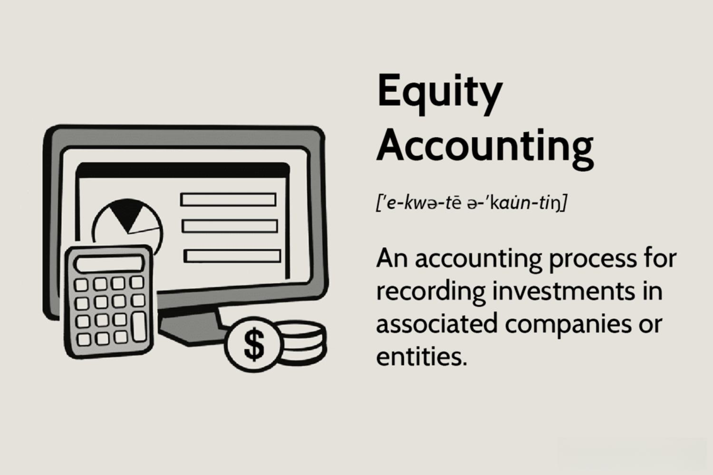

Investment methods play a pivotal role in modern finance, serving as foundational tools for both individuals and institutions striving to optimize their financial portfolios. These methods encompass a broad range of strategies and mechanisms designed to enhance investment outcomes. The significance of investment methods lies in their ability to help investors navigate the complexities of the financial markets, manage risks, and identify opportunities for growth and profitability. With the ever-evolving nature of global markets, understanding and implementing effective investment methods are essential for achieving financial goals.

Investor influence is a powerful force in shaping these methods. From individual investors making decisions based on personal financial goals to institutional investors with vast resources and strategic objectives, the preferences and demands of these actors drive innovation and adaptation in investment strategies. Regulatory changes, economic conditions, and technological advancements are also influenced by investor behavior and expectations, leading to new methodologies and tools in the financial sector.



Among the key concepts in modern investment methods are equity accounting and algorithmic trading. Equity accounting is a method used for recognizing the profits earned by an investor in another company. This is important for investors who wish to have accurate representations of their investments' values in financial statements. Algorithmic trading, on the other hand, uses computer algorithms to execute trading orders at optimal speeds and prices. This method revolutionizes how trades are conducted, offering efficiency and precision beyond human capabilities.

This article will explore the interconnectedness of these investment methods and investor influence. Initially, we will examine the role of investors in shaping investment strategies. Following this, there will be an exploration of equity accounting, its implications on investment decisions, and its effects on company valuations. We will then turn our attention to algorithmic trading, discussing its history, benefits, risks, and market impact. Further sections will delve into the synergistic relationship between equity accounting and algorithmic trading, as well as the emerging trends driven by technological advancements.

Understanding these investment concepts is crucial in today's dynamic financial landscape. As markets become increasingly complex, being knowledgeable about equity accounting and algorithmic trading provides investors with a competitive edge. The insights gained can guide strategic decision-making, resulting in optimized portfolio performance and, ultimately, financial success. By staying informed about these evolving investment methods, investors can better navigate the opportunities and challenges present in the modern economy.

## Table of Contents

## The Role of Investor Influence in Shaping Investment Methods

Investors play a pivotal role in shaping investment methods, reflecting a diverse array of types including individual investors, institutional investors, and venture capitalists. Each category exerts unique influences on the evolution and innovation of investment strategies.

Individual investors typically manage personal funds and have varying levels of expertise and risk tolerance. Their preferences can lead to the proliferation of tailored investment tools and platforms that cater to personal finance needs. The rise of robo-advisors and micro-investing platforms exemplifies innovations driven by individual investor preferences for simplicity, low fees, and accessibility.

Institutional investors, such as pension funds, insurance companies, and mutual funds, manage large pools of capital and often exert significant influence due to their substantial market presence. Their strategies are typically based on extensive research and sophisticated risk management practices. As institutional investors prioritize yield and risk-adjusted returns, they drive the creation and adoption of complex financial instruments like derivatives and structured products.

Venture capitalists (VCs), who invest in startup companies and early-stage enterprises, focus on high-growth potential. Their influence is evident in the startup ecosystem, where the success of innovative venture-backed firms can impact entire industries. VCs' demands for rapid growth and high return on investment spur the development of scalable business models and disruptive technologies.

Investor preferences not only affect the types of investment products available but also drive innovations in the financial markets. For example, the demand for sustainable and socially responsible investment options has led to the creation of Environmental, Social, and Governance ([ESG](/wiki/esg-investing)) funds and impact investing strategies. Similarly, the popularity of exchange-traded funds (ETFs) can be attributed to investors' desires for diversification, [liquidity](/wiki/liquidity-risk-premium), and low fees.

The advent of technology and increased access to information profoundly impacts investor decision-making. With the proliferation of data analytics, investors can make more informed decisions, assessing vast amounts of information with greater speed and accuracy. Real-time data feeds, [algorithmic trading](/wiki/algorithmic-trading) platforms, and [artificial intelligence](/wiki/ai-artificial-intelligence) (AI) tools enable investors to identify patterns and opportunities more effectively than ever before. A simple Python code snippet exemplifying data analysis for evaluating stock performance might look like this:

```python
import pandas as pd
import yfinance as yf  # For more datasets, visit: https://paperswithbacktest.com/datasets

# Download stock data for analysis
data = yf.download('AAPL', start='2022-01-01', end='2023-01-01')

# Calculate daily return
data['Daily Return'] = data['Adj Close'].pct_change()

# Summary statistics
summary_stats = data['Daily Return'].describe()
print(summary_stats)
```

The digital age ensures that information is more accessible, empowering investors at all levels to engage with markets in previously unimaginable ways. Consequently, the democratization and globalization of financial information lead to heightened competition among investment methods, as investors continuously seek innovations that promise superior returns and risk management. This dynamic landscape emphasizes the ongoing and critical need for investors to adapt and leverage new technologies and investment strategies to stay competitive.

## Exploring Equity Accounting

Equity accounting, also known as the equity method of accounting, is a method used in financial accounting to record investments in associate companies. Under this approach, the investor recognizes its share in the investee's net assets and results of operations. This is applicable when the investor holds significant influence over the investee, usually through the ownership of 20% to 50% of the company's voting stock.

The significance of equity accounting in investment decisions is substantial. It allows investors to reflect their proportional share of the investee's net assets as part of their financial statements, providing a more accurate depiction of their financial position and results. This approach ensures that investors report income from the investee as it is earned, rather than when dividends are received, aligning with the accrual basis of accounting.

Equity accounting has a considerable impact on company valuation and investor perception. By reflecting the investee's performance in the investor's financial statements, equity accounting can influence the investor's valuation metrics, such as price-to-earnings ratios. This provides insight into the underlying value and growth potential of an investor’s holdings, offering a more holistic overview of financial health and performance to stakeholders. 

Real-world examples highlight the influence of equity accounting on investor strategies. For instance, when a company invests in a rapidly expanding tech startup and uses equity accounting, the investor can report its share of the startup's profits. This can enhance the investor's earnings reports, potentially impacting stock prices and attracting further investment. Conversely, if the investee suffers losses, these will also be reflected, prompting investors to reassess their strategy.

Equity accounting, by accurately reflecting an investor’s stake in an associated company, assists in making informed investment decisions and portraying a clear picture of financial standings. Its role in shaping investment perceptions underscores its importance in the broader financial landscape.

## Algorithmic Trading: Revolutionizing Investment Strategies

Algorithmic trading, commonly referred to as algo trading, is the use of computer programs and systems to execute trading strategies based on predefined rules and algorithms. Its origins trace back to the 1970s when early electronic trading platforms and communication networks began transforming traditional floor trading. However, it wasn't until the 1990s, with advances in computing power and the advent of the Internet, that algorithmic trading gained significant traction.

The benefits of algorithmic trading are numerous. It can process large volumes of data within milliseconds, enabling high-frequency trading ([HFT](/wiki/high-frequency-trading-strategies)) that capitalizes on brief price discrepancies across markets. Algo trading also eliminates human emotion, potentially reducing errors related to psychology-driven decision-making. This automated approach supports deep liquidity in financial markets, allowing for tighter spreads and improving market efficiency.

Despite its advantages, algo trading carries inherent risks. The reliance on algorithms means that any error in the programming or a flaw in the data inputs can lead to substantial financial losses. Flash crashes, such as the one on May 6, 2010, are stark reminders of how rapidly algo-generated trades can disrupt markets. Additionally, the sheer speed at which trades are executed can exacerbate market [volatility](/wiki/volatility-trading-strategies), as large volumes of transactions can occur in fractions of a second.

Algorithmic trading significantly influences market dynamics and investment methods. It enables complex trading strategies, such as statistical [arbitrage](/wiki/arbitrage) and [market making](/wiki/market-making), which were once impractical manually. This transformation has led to a more automated marketplace where the speed of execution and informational efficiency are paramount. Moreover, the transparency and efficiency gains from algo trading have made markets more accessible to smaller investors who can now employ sophisticated strategies once reserved for institutional players.

Successful implementations of algorithmic trading highlight its potential when aligned with robust strategies. For example, Renaissance Technologies, founded by mathematician James Simons, utilizes statistical and mathematical models to consistently outperform the market with its Medallion Fund. Another well-known case is Two Sigma, an investment management firm leveraging [machine learning](/wiki/machine-learning) and distributed computing to develop trading algorithms that adapt to changing market conditions.

In conclusion, algorithmic trading has revolutionized investment strategies by marrying advanced computing with financial theory. While it introduces substantial benefits, it is not without its risks and challenges. Automation continues to reshape the landscape of global markets, promising further innovations and efficiencies in the years to come. Recognizing these dynamics is essential for participants seeking to harness the potential of algorithmic trading within their investment frameworks.

## Interconnection Between Equity Accounting and Algo Trading

Equity accounting and algorithmic trading represent significant aspects of modern investment strategies, and their interconnection is increasingly valuable in optimizing investment portfolios. Equity accounting provides detailed financial insights about a company's performance by focusing on the ownership percentages and influence over financial and operational decisions. This data can be leveraged in algorithmic trading models to inform and refine decision-making processes. Efficient utilization requires the integration of large datasets into computational models to predict market behaviors and enhance trading strategies.

Algorithmic trading relies on predefined instructions or algorithms to execute trades, rapidly analyzing market conditions and making adjustments to investment strategies. Equity accounting data, which includes earnings, book values, and other financial metrics, offer a layer of depth to algorithms by providing a trajectory of company performance metrics crucial for evaluating stock potential.

Analytics and big data play a pivotal role in this process. By utilizing advanced analytics, data from equity accounting can improve the precision and accuracy of trading algorithms. Consider a Python-based algorithm designed to assess the Price-to-Earnings (P/E) ratio using equity accounting data:

```python
def calculate_pe_ratio(market_price, net_income, shares_outstanding):
    earnings_per_share = net_income / shares_outstanding
    pe_ratio = market_price / earnings_per_share
    return pe_ratio

# Example
market_price = 150
net_income = 5000000
shares_outstanding = 1000000

print(f"P/E Ratio: {calculate_pe_ratio(market_price, net_income, shares_outstanding)}")
```
This snippet calculates the P/E ratio, aiding in the identification of stocks potentially undervalued or overvalued, thereby supporting algorithmic trading strategies. 

Investors increasingly employ both equity accounting and algorithmic trading to enhance portfolio performance. Data from equity accounting can signal market sentiment shifts when incorporated into models that identify trends and anomalies. For instance, substantial changes in shareholders' equity might trigger buy or sell algorithms, optimizing decisions based on predictive analytics.

Looking towards future developments in this intersection, advancements in machine learning and artificial intelligence could refine how equity data is interpreted and utilized in trading algorithms. Real-time analytics and scalable computing may lead to more dynamic models that better capture market nuances as they evolve. As technological capabilities expand, investment models might incorporate even more granular accounting data, such as cash flow or revenue projections, into automated trading systems.

This fusion of equity accounting with algorithmic trading highlights an innovative approach to investment strategies, suggesting a promising future where data-driven decisions foster more robust market participation. As these methods advance, careful consideration of regulatory frameworks and ethical implications will be essential to ensure sound investment ecosystems.

## The Future of Investment Methods: Trends and Predictions

Investment methods are rapidly evolving due to advancements in technology and data analytics. One of the prominent emerging trends is the integration of artificial intelligence (AI) and machine learning (ML) in investment decision-making. These technologies enable the analysis of vast datasets to identify patterns and generate predictive insights more accurately and at greater speeds than traditional methods.

### AI and Machine Learning in Investment

AI and ML are transforming investment strategies by providing tools for optimizing fund allocation, risk assessment, and market timing. Machine learning algorithms can analyze historical data to forecast future market trends, offering investors a strategic edge. For instance, supervised learning models like regression analysis and classification can predict stock price movements, while unsupervised learning can cluster assets to identify potential diversification opportunities. An example Python code for implementing a basic regression model might look like this:

```python
from sklearn.linear_model import LinearRegression
import numpy as np

# Example data
X = np.array([[1], [2], [3], [4], [5]])
y = np.array([5, 7, 9, 11, 13])

# Create and train the model
model = LinearRegression().fit(X, y)

# Predict
prediction = model.predict(np.array([[6]]))
print(f"Predicted value: {prediction[0]}")
```

### Influence of Investors on Future Strategies

Investors are increasingly favoring data-driven strategies, which puts pressure on fund managers to adopt technologies that leverage big data and analytics. This investor demand is pushing the development and adoption of innovative financial products and services. Additionally, the rise of sustainability and ethical investing is guiding the creation of green finance instruments, further showcasing how investor preferences can shape investment strategies.

### Policy and Regulatory Considerations

As technology transforms investment practices, regulators are seeking to ensure that these methods remain transparent and fair. Machine learning models, while powerful, are often opaque, raising concerns around explainability and accountability. Regulatory bodies are likely to introduce frameworks that ensure AI and ML algorithms comply with ethical standards and do not introduce biases that could harm investors or destabilize financial markets. These changes could include mandating transparency reports for AI-driven decisions and standardized testing protocols for investment algorithms.

### Predictions for Future Investment Landscapes

AI and machine learning will likely continue to increase in importance, facilitating the creation of more personalized investment services and robo-advisors capable of tailoring strategies to individual needs. The future may also see advances in quantum computing applied to financial modeling, further amplifying computational power and predictive accuracy. However, for these technologies to thrive, supportive regulatory landscapes that encourage innovation while protecting investor interests will be essential.

Overall, staying informed about these trends and potential regulatory shifts is crucial for investors and financial professionals to adapt and thrive in the changing landscape of investment methods.

## Conclusion

Investment methods have continuously evolved, influenced by a variety of factors ranging from technological advances to investor preferences. This article has examined how investor influence shapes these methods, particularly through equity accounting and algorithmic trading. Understanding the evolution and future of these methods is crucial for staying relevant in today’s financial landscape.

Remaining informed about evolving investment methods is essential for investors and financial professionals. The rapid pace of technological advancement and the increasing availability of data have revolutionized traditional methods, allowing for more nuanced and informed investment strategies. Keeping abreast of these changes not only aids in optimizing investment portfolios but also helps in mitigating risks associated with these innovations.

A significant synergy exists between investor influence, equity accounting, and algorithmic trading. Investor preferences have driven innovative strategies, with equity accounting providing critical insights into company valuation and performance. Algo trading, on the other hand, has transformed the speed and efficiency of executing these strategies. Together, these components enable investors to make more accurate and timely decisions, capitalizing on market opportunities while managing risk.

As investment methods continue to evolve, readers are encouraged to explore further resources to deepen their understanding. Engaging with academic literature, attending industry conferences, and participating in online courses are just a few ways to enhance one’s knowledge. The intersection of technology and finance promises to yield exciting developments, and staying educated is key to leveraging these advancements effectively.

## References & Further Reading

[1]: Bergstra, J., Bardenet, R., Bengio, Y., & Kégl, B. (2011). ["Algorithms for Hyper-Parameter Optimization."](https://proceedings.neurips.cc/paper/2011/file/86e8f7ab32cfd12577bc2619bc635690-Paper.pdf) Advances in Neural Information Processing Systems 24.

[2]: ["Advances in Financial Machine Learning"](https://www.amazon.com/Advances-Financial-Machine-Learning-Marcos/dp/1119482089) by Marcos Lopez de Prado

[3]: ["Evidence-Based Technical Analysis: Applying the Scientific Method and Statistical Inference to Trading Signals"](https://www.amazon.com/Evidence-Based-Technical-Analysis-Scientific-Statistical/dp/0470008741) by David Aronson

[4]: ["Machine Learning for Algorithmic Trading"](https://github.com/PacktPublishing/Machine-Learning-for-Algorithmic-Trading-Second-Edition) by Stefan Jansen

[5]: ["Quantitative Trading: How to Build Your Own Algorithmic Trading Business"](https://www.amazon.com/Quantitative-Trading-Build-Algorithmic-Business/dp/0470284889) by Ernest P. Chan