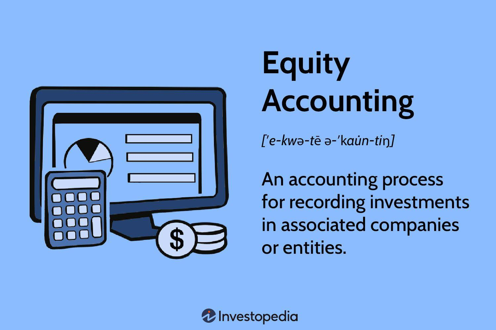

## Table of Contents

## What is the equity accounting method?

The equity accounting method is a way for a company to record its investment in another company on its financial statements. When a company owns between 20% and 50% of another company's voting stock, it usually uses this method. Instead of just listing the investment at its original cost, the investing company adjusts the value of the investment based on its share of the profits or losses of the company it has invested in. This means if the other company makes a profit, the value of the investment goes up, and if it has a loss, the value goes down.

This method helps show a more accurate picture of the investment's value over time. It reflects the investor's influence over the company it has invested in, since owning 20% to 50% of the voting stock usually means the investor has significant influence, but not full control. By using the equity method, the investor can report its share of the investee's earnings directly on its income statement, which gives a clearer view of how the investment is performing and impacting the investor's overall financial health.

## How does the equity accounting method differ from other accounting methods?

The equity accounting method is different from other methods because it focuses on how much control a company has over another company it has invested in. If a company owns between 20% and 50% of another company's voting stock, it uses the equity method. This means the company adjusts the value of its investment based on its share of the profits or losses of the other company. This is unlike the cost method, where the investment is just recorded at its original cost and doesn't change unless there's a permanent drop in value. The cost method is used when a company has less control, usually when it owns less than 20% of the voting stock.

Another method, the consolidation method, is used when a company owns more than 50% of another company's voting stock, giving it full control. With consolidation, the parent company combines all the financials of the subsidiary into its own financial statements, treating them as one big company. This is different from the equity method, where the investment is shown separately on the balance sheet, and only the investor's share of the earnings is added to the income statement. So, the equity method gives a middle ground, reflecting significant influence but not full control, and it's more about showing how the investment's value changes over time rather than combining everything together.

## What is investor influence in the context of equity accounting?

Investor influence in equity accounting is about how much say a company has in another company it has invested in. If a company owns between 20% and 50% of another company's voting stock, it's usually thought to have significant influence. This means the company can affect decisions in the other company but doesn't have full control over it. The idea of influence is important because it helps decide whether to use the equity accounting method.

When a company has significant influence, it uses the equity method to account for its investment. This method shows the investment's value changing based on the investor's share of the other company's profits or losses. If the other company does well and makes a profit, the value of the investment goes up. If it does poorly and has a loss, the value goes down. This way, the financial statements give a clearer picture of how the investment is doing and how it affects the investor's overall financial health.

## What are the criteria for using the equity accounting method?

The main thing to decide if a company should use the equity accounting method is how much control it has over another company it has invested in. If a company owns between 20% and 50% of another company's voting stock, it's considered to have significant influence. This means the company can affect some decisions in the other company but doesn't have full control over it. This level of ownership is the key criteria for using the equity method.

When a company has this significant influence, it adjusts the value of its investment on its financial statements based on its share of the other company's profits or losses. If the other company makes money, the value of the investment goes up. If the other company loses money, the value of the investment goes down. This method gives a clearer picture of how the investment is doing and how it impacts the investor's overall financial health.

## How is the initial investment recorded under the equity accounting method?

When a company first invests in another company using the equity accounting method, it records the investment at its cost. This means the company writes down the total amount of money it paid to buy the shares of the other company. This initial amount is shown on the balance sheet as an investment in the other company.

After the initial recording, the company doesn't just leave the investment at its original cost. Instead, it updates the value of the investment over time based on its share of the profits or losses of the other company. If the other company makes a profit, the value of the investment goes up. If the other company has a loss, the value of the investment goes down. This way, the investment's value on the balance sheet changes to reflect how well the other company is doing.

## What are the steps to apply the equity accounting method after the initial investment?

After the initial investment is recorded at its cost, the company using the equity accounting method needs to keep track of the other company's profits and losses. Every time the other company reports its earnings, the investor adjusts the value of its investment. If the other company makes a profit, the investor adds its share of that profit to the investment's value on its balance sheet. If the other company has a loss, the investor subtracts its share of that loss from the investment's value. This means the investment's value changes with the other company's financial performance.

The investor also needs to report its share of the other company's earnings on its own income statement. If the other company makes a profit, the investor includes its share of that profit as income. If the other company has a loss, the investor reports its share of that loss as an expense. This helps show how the investment is affecting the investor's overall financial health. By regularly updating the investment's value and reporting the earnings, the equity accounting method gives a clear picture of the investment's performance over time.

## How do changes in the investee's net assets affect the investor's financial statements?

When the company the investor put money into, called the investee, changes its net assets, it affects the investor's financial statements. If the investee's net assets go up because it makes a profit, the investor adds its share of that profit to the value of its investment on its balance sheet. This makes the investment worth more. If the investee's net assets go down because it has a loss, the investor subtracts its share of that loss from the value of its investment. This makes the investment worth less. This way, the investor's balance sheet always shows the current value of the investment based on the investee's financial health.

The investor also shows its share of the investee's earnings on its income statement. If the investee makes a profit, the investor includes its share of that profit as income. This makes the investor's income go up. If the investee has a loss, the investor reports its share of that loss as an expense. This makes the investor's income go down. By doing this, the investor's financial statements clearly show how well the investment is doing and how it affects the investor's overall financial health.

## What is the significance of significant influence in equity accounting?

The idea of significant influence is really important in equity accounting. It's all about how much say a company has in another company it has invested in. If a company owns between 20% and 50% of another company's voting stock, it's thought to have significant influence. This means the company can affect some decisions in the other company but doesn't have full control over it. This level of ownership is what tells a company to use the equity accounting method.

When a company has significant influence, it uses the equity method to show the value of its investment. This method means the company changes the value of its investment based on its share of the other company's profits or losses. If the other company makes money, the investment's value goes up. If the other company loses money, the investment's value goes down. This way, the financial statements give a clear picture of how the investment is doing and how it affects the investor's overall financial health.

## How do dividends received from the investee impact the investor's equity account?

When an investor gets dividends from the company it has invested in, called the investee, it affects the investor's equity account. The dividends are seen as a return on the investment. So, when the investor gets dividends, it reduces the value of the investment on its balance sheet. If the investor received $1,000 in dividends, it would take $1,000 off the value of the investment.

This happens because the dividends are a part of the profits the investee made, and the investor already added its share of those profits to the investment's value when the investee reported them. So, getting the dividends means the investor is getting back some of the money it added to the investment's value earlier. This way, the equity account stays accurate and reflects the true value of the investment after the dividends are paid out.

## What are the challenges and limitations of the equity accounting method?

The equity accounting method has some challenges and limitations. One big challenge is that it can be hard to figure out if a company really has significant influence over another company. Just owning between 20% and 50% of the voting stock doesn't always mean a company can affect the other company's decisions. Sometimes, the other company might not let the investor have a say in big choices. This can make it tough to decide if the equity method is the right way to account for the investment.

Another limitation is that the equity method can make financial statements more complicated. The investor has to keep updating the value of its investment every time the other company reports its earnings. This means the investor's financial statements might change a lot, which can be confusing for people trying to understand them. Also, if the other company doesn't share all its financial details, the investor might not have all the info it needs to make accurate updates. This can lead to mistakes or guesses in the financial reports.

## How does the equity method handle impairment of investment?

When a company uses the equity method, it has to check if its investment in another company has lost value. This is called impairment. If the other company isn't doing well and the value of the investment drops a lot, the investor needs to show this on its financial statements. The investor looks at things like the other company's financial health, the market, and other signs to decide if the investment is worth less than what's on the [books](/wiki/algo-trading-books). If it is, the investor has to lower the value of the investment to its new, lower value. This is called recording an impairment loss.

After recording an impairment loss, the investor keeps using the equity method. This means the investor still updates the investment's value based on its share of the other company's profits or losses. But now, the starting point for these updates is the lower value after the impairment. If the other company starts doing better and the value goes back up, the investor can't just add back the impairment loss. Instead, any increase in value is shown as a gain, but it doesn't undo the impairment loss that was recorded before. This way, the financial statements stay accurate and reflect the true value of the investment over time.

## What are the advanced considerations for equity accounting in complex corporate structures?

In complex corporate structures, using the equity accounting method can get tricky. When a company owns shares in another company, and that company owns shares in yet another company, it's called a multi-tiered investment. The investor has to figure out how much influence it has over each level of the structure. This can be hard because the investor might have significant influence over the first company but not as much over the companies below it. The investor needs to keep track of its share of profits or losses at each level and make sure it's recording everything correctly on its financial statements.

Another thing to think about in complex structures is how to handle transactions between the companies in the structure. If the companies buy and sell things from each other, the investor has to make sure these transactions don't mess up the financial statements. This means the investor might need to adjust the value of its investment to account for these internal deals. It's important to keep everything clear and accurate so that the financial statements show a true picture of the investment's value. This can be a lot of work, but it's necessary to make sure the equity accounting method works right in a complicated setup.

## References & Further Reading

[1]: Bergstra, J., Bardenet, R., Bengio, Y., & Kégl, B. (2011). ["Algorithms for Hyper-Parameter Optimization."](https://proceedings.neurips.cc/paper/2011/file/86e8f7ab32cfd12577bc2619bc635690-Paper.pdf) Advances in Neural Information Processing Systems 24.

[2]: ["Advances in Financial Machine Learning"](https://www.amazon.com/Advances-Financial-Machine-Learning-Marcos/dp/1119482089) by Marcos Lopez de Prado

[3]: ["Evidence-Based Technical Analysis: Applying the Scientific Method and Statistical Inference to Trading Signals"](https://www.amazon.com/Evidence-Based-Technical-Analysis-Scientific-Statistical/dp/0470008741) by David Aronson

[4]: ["Machine Learning for Algorithmic Trading"](https://github.com/PacktPublishing/Machine-Learning-for-Algorithmic-Trading-Second-Edition) by Stefan Jansen

[5]: ["Quantitative Trading: How to Build Your Own Algorithmic Trading Business"](https://www.amazon.com/Quantitative-Trading-Build-Algorithmic-Business/dp/0470284889) by Ernest P. Chan