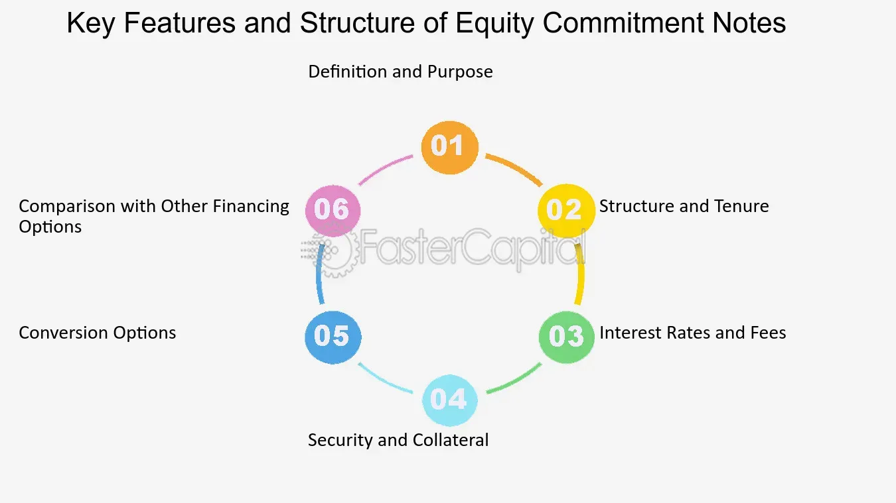

## Table of Contents

## What is an Equity Commitment Note (ECN)?

An Equity Commitment Note (ECN) is a type of financial agreement where a company promises to give new shares to an investor at a future date. This is often used by companies that need money to grow but don't want to borrow from a bank. Instead, they get the money from investors who believe in the company's future success.

In an ECN, the investor gives money to the company now, and in return, the company agrees to give the investor shares later. This can be good for the company because it doesn't have to pay back the money like a loan. It's also good for the investor because they can get shares in the company, which might be worth more in the future if the company does well.

## How does an Equity Commitment Note function within financial transactions?

An Equity Commitment Note (ECN) works as a promise from a company to an investor. The company gets money from the investor right away, and in return, the company agrees to give the investor new shares at a later time. This is helpful for companies that need money to grow but don't want to take out a loan. Instead of borrowing, they get the money they need from investors who believe in their future success.

For the investor, an ECN is a way to put money into a company they think will do well. If the company grows and becomes more valuable, the shares they get later will be worth more than the money they gave at the start. This can be a good deal for the investor if the company does well. But, if the company doesn't grow as expected, the shares might not be worth as much, so there's a risk involved.

## Who are the typical parties involved in an Equity Commitment Note?

The typical parties involved in an Equity Commitment Note are the company that needs money and the investor who gives the money. The company is usually a business that wants to grow but doesn't want to take out a loan. They might be a startup or a company that's already doing well but needs more money to expand. The investor can be anyone from a single person to a big investment firm. They believe in the company's future and are willing to give money now in hopes of getting valuable shares later.

Sometimes, other parties like banks or financial advisors might also be involved. Banks might help set up the ECN or act as a middleman between the company and the investor. Financial advisors might help the company figure out how much money they need and how to structure the deal. But the main parties are always the company needing the money and the investor providing it.

## What are the key components of an Equity Commitment Note?

An Equity Commitment Note (ECN) has several important parts that both the company and the investor need to agree on. One key part is the amount of money the investor will give to the company. This is the money the company will use to grow or expand. Another important part is the number of shares the company will give to the investor later. The company and the investor need to agree on how many shares the investor will get and when they will get them.

Another key component is the price at which the shares will be given to the investor. This is called the conversion price. The conversion price can be set at the time the ECN is made, or it can be based on the company's value at a future date. The terms of the ECN also need to include any conditions that must be met before the shares are given, like the company reaching certain goals. All these parts are important because they help both the company and the investor understand what they are agreeing to and what they can expect in the future.

## How is the value of an Equity Commitment Note determined?

The value of an Equity Commitment Note (ECN) is determined by looking at how much money the investor gives to the company and how many shares the company will give back in the future. The investor gives money now, and in return, they get shares later. The number of shares and the price at which they will be given are important because they help figure out the value of the ECN. If the company does well and its value goes up, the shares the investor gets will be worth more, making the ECN more valuable.

The value also depends on how risky the investment is. If the company is new or not doing well, the risk is higher, and the ECN might be worth less to the investor. On the other hand, if the company is stable and growing, the risk is lower, and the ECN could be worth more. The terms of the ECN, like when the shares will be given and any conditions that need to be met, also affect its value. All these factors together help decide how much the ECN is worth.

## What are the benefits of using an Equity Commitment Note for investors?

Using an Equity Commitment Note can be good for investors because it lets them put money into a company they believe in without having to buy shares right away. They give money to the company now and get shares later. If the company does well and its value goes up, the shares the investor gets will be worth more than the money they gave at the start. This means the investor could make a good profit if the company succeeds.

Another benefit is that an ECN can be less risky than other investments. The terms of the ECN can include conditions that the company needs to meet before the investor gets the shares. This gives the investor some protection because they know the company has to reach certain goals before the shares are given. Plus, the investor doesn't have to worry about the ups and downs of the stock market right away because they get the shares at a set price in the future.

## What risks should investors be aware of when dealing with Equity Commitment Notes?

When investors put money into an Equity Commitment Note, they need to know about the risks involved. One big risk is that the company might not do well. If the company fails to grow or even goes out of business, the shares the investor was supposed to get might not be worth much or anything at all. This means the investor could lose the money they gave to the company.

Another risk is that the terms of the ECN might change. Sometimes, the company might not be able to meet the conditions needed to give the shares to the investor. This can delay when the investor gets the shares or even stop it from happening. Also, if the company's value goes down, the shares the investor gets will be worth less than expected. So, it's important for investors to think about these risks before deciding to use an Equity Commitment Note.

## How does an Equity Commitment Note differ from other financial instruments like bonds or stocks?

An Equity Commitment Note is different from bonds and stocks because it's a promise to give new shares to an investor at a future date. With a bond, an investor lends money to a company or government and gets paid back with interest over time. Bonds are like loans where the investor expects to get their money back plus some extra. Stocks, on the other hand, are pieces of ownership in a company that investors can buy right away. When someone buys a stock, they own part of the company and can sell the stock whenever they want, hoping its value will go up.

An ECN is more like a middle step between giving money and getting shares. The investor gives money to the company now but doesn't get the shares until later. This is different from stocks because the investor doesn't own the shares right away. It's also different from bonds because the investor isn't getting their money back with interest; they're getting shares instead. This means the value of an ECN depends a lot on how well the company does in the future, making it riskier than a bond but potentially more rewarding if the company grows a lot.

## What are the legal and regulatory considerations for issuing an Equity Commitment Note?

When a company wants to issue an Equity Commitment Note, it needs to follow certain rules and laws. These rules can be different depending on where the company is and where the investor lives. The company might need to file paperwork with a government agency, like the Securities and Exchange Commission (SEC) in the United States, to make sure they're following the law. They also need to be careful about how they talk about the ECN to investors, making sure they don't say anything that isn't true or could be seen as misleading. This is to protect investors and make sure everyone knows what they're getting into.

Another important thing is that the terms of the ECN need to be clear and written down in a legal agreement. This agreement should say exactly how much money the investor is giving, how many shares they will get, when they will get them, and any conditions that need to be met. The company might also need to think about tax rules, because getting money now and giving shares later can have tax effects for both the company and the investor. It's a good idea for the company to get help from lawyers and financial advisors to make sure they're doing everything right and following all the rules.

## How can an Equity Commitment Note be structured to optimize tax implications?

An Equity Commitment Note can be structured to make taxes easier for both the company and the investor. One way to do this is by setting the terms of the ECN so that the money the investor gives is seen as a long-term investment rather than a short-term one. This can mean lower taxes for the investor because long-term investments often have better tax rates. The company can also structure the ECN to delay when the investor gets the shares, which might help the company with its taxes because it won't have to deal with the tax effects right away.

Another thing to think about is how the shares are valued when they're given to the investor. If the shares are given at a lower price than what they're worth, this can affect how much tax the investor has to pay. The company and the investor can work together to find a fair price that helps with taxes. It's a good idea for both the company and the investor to talk to tax experts to make sure they're doing everything in a way that makes the most sense for taxes.

## What are some real-world examples of Equity Commitment Notes in major financial deals?

One famous example of an Equity Commitment Note was when Elon Musk's company, Tesla, used an ECN to get money to grow. In 2017, Tesla got a big loan from banks to help build its factory in Nevada. As part of the deal, some investors agreed to give Tesla money through an ECN. This meant the investors would get Tesla shares later, helping the company raise money without having to pay back a loan right away. It was a big deal because it showed how ECNs can be used in big projects by well-known companies.

Another example is when the company WeWork used an ECN to try to stay afloat. In 2020, WeWork was in trouble and needed money fast. Some investors agreed to give WeWork money through an ECN, hoping that the company would turn things around. The investors would get shares in WeWork later if the company met certain goals. This deal was important because it showed how ECNs can be used to help a company in a tough spot, but it also showed the risks because WeWork had to work hard to meet the conditions of the ECN.

## What advanced strategies can be employed to maximize the effectiveness of Equity Commitment Notes in complex financial structuring?

One advanced strategy to make Equity Commitment Notes work better in complex financial deals is to use them with other types of investments. For example, a company might use an ECN along with a loan or another kind of investment. This can help the company get the money it needs in different ways, which can be less risky. By mixing ECNs with other investments, the company can make sure it has enough money to grow and meet its goals. This also gives investors different ways to put money into the company, which can make the deal more attractive to them.

Another strategy is to carefully set the terms of the ECN to match what the company and the investor want. The company can set conditions that need to be met before the investor gets the shares, like reaching certain sales goals or finishing a big project. This can help the company stay focused on its goals and make sure the investor's money is used in the best way. The investor can also ask for things like the right to buy more shares at a set price in the future, which can protect their investment and give them a chance to make more money if the company does well. By thinking carefully about the terms of the ECN, both the company and the investor can get what they want from the deal.

## What is the Investment Mechanism of Equity Commitment Notes?

An Equity Commitment Note (ECN) is a structured financial instrument used primarily for financing purposes. They are often utilized by companies seeking to raise capital while providing investors with an opportunity to convert their investment from debt to equity under certain conditions.

**Structure and Issuance of ECNs**

ECNs are typically structured as notes that contain a commitment by the issuer to issue a specified amount of equity to the investor at a future date or under predetermined conditions. The issuance process involves the creation of a legal agreement that outlines the terms, including the conversion ratio, [interest rate](/wiki/interest-rate-trading-strategies), maturity date, and any conditions that must be met for conversion.

Investment banks play a critical role in facilitating ECNs. Their responsibilities include structuring the note, setting the terms of conversion, and ensuring compliance with applicable regulations. They assess the company's value, determine the appropriate pricing models, and may assist in marketing the note to potential investors. Through their expertise, they help mitigate risk for both the issuer and the investor.

**Debt to Equity Conversion Process**

The conversion process from debt to equity in an ECN involves pre-set conditions that trigger the conversion. Typically, this can occur upon reaching a maturity date or achieving certain financial milestones or stock prices. For instance, the conversion might be triggered if the company’s stock price exceeds a predefined threshold, which ensures that the conversion is mutually beneficial.

Mathematically, the conversion ratio (CR) can be expressed as:

$$
\text{CR} = \frac{\text{Nominal Value of the Note}}{\text{Conversion Price}}
$$

This formula helps determine the number of shares to be issued upon conversion. The conversion terms are critical, as they impact both the level of dilution the existing shareholders might experience and the return on investment for the note holders.

**Impact of Market Conditions**

Market conditions significantly affect the returns on ECNs. Favorable conditions, such as a bullish stock market, can make the conversion highly lucrative for investors as the conversion price might be lower than the current market value of the stock. Conversely, economic downturns or bear markets can hinder conversion attractiveness, impacting both issuer’s financing costs and investor returns.

Interest rates also influence ECN attractiveness. Lower interest rates generally enhance the appeal of equity conversions relative to maintaining a fixed-income position. Additionally, market [volatility](/wiki/volatility-trading-strategies) might affect the pricing of the underlying stock, making precise risk evaluation essential.

**Risks and Considerations for Investors**

Investing in ECNs carries potential risks, including credit risk, market risk, and [liquidity](/wiki/liquidity-risk-premium) risk. Credit risk arises from the possibility of the issuer defaulting before conversion. Market risk is related to fluctuations in the stock market, which can affect the desirability of conversion. Liquidity risk involves the potential difficulty in selling the note before conversion or maturity.

Investors must conduct due diligence to understand these risks fully. It involves analyzing the issuer’s financial health, the terms of the ECN, and the market environment. Assessing these factors allows investors to make informed decisions on whether to hold the note or convert it into equity.

In conclusion, ECNs offer a flexible financing option for issuers and investment opportunities for investors but require careful assessment of market conditions and risks involved. Understanding their structure and conversion mechanics is crucial for making sound investment decisions.

## References & Further Reading

[1]: Barker, M., & Jayaraman, R. (2014). ["What You Need to Know about Algorithmic Trading."](https://psycnet.apa.org/record/2014-03915-001?doi=1) Harvard Business Review.

[2]: ["Algorithmic Trading and DMA"](https://www.amazon.com/Algorithmic-Trading-DMA-introduction-strategies/dp/0956399207) by Barry Johnson

[3]: Hull, J. C. (2017). ["Options, Futures, and Other Derivatives"](https://www.semanticscholar.org/paper/Options%2C-Futures%2C-and-Other-Derivatives-Hull/89bdee500c8623864fc9eb7a471546aa713acc44) (10th Edition). Pearson.

[4]: Pardo, R. (2008). ["The Evaluation and Optimization of Trading Strategies"](https://onlinelibrary.wiley.com/doi/book/10.1002/9781119196969) (2nd Edition). Wiley Trading.

[5]: Narang, R. K. (2009). ["Inside the Black Box: The Simple Truth About Quantitative Trading"](https://onlinelibrary.wiley.com/doi/book/10.1002/9781118267738) (2nd Edition). Wiley.