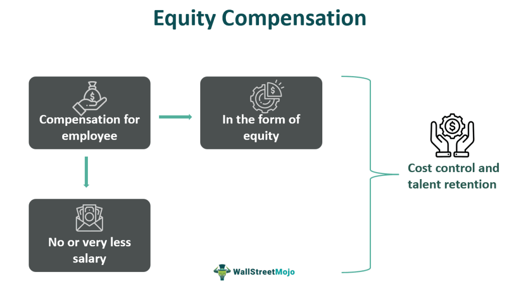

Stock options and equity compensation have gained prominence as essential elements in the landscape of employment benefits. In the competitive recruitment environment, companies are increasingly leveraging these financial instruments as incentives to attract and retain top talent. Stock options offer employees the right, but not the obligation, to purchase shares of the company at a predetermined price, potentially aligning their interests with those of shareholders and the long-term success of the company. Equity compensation, which can include stock options, restricted stock, and stock appreciation rights, offers employees not just a stake in the company, but also a vested interest in its growth and success.

This article examines the intricacies of stock options and equity compensation as components of employee benefit packages. It also considers algorithmic trading—a transformative technology that executes trades using pre-set criteria—and its role in effectively managing these financial assets. As algorithmic trading continues to evolve, it provides new mechanisms for optimizing financial returns, presenting both opportunities and challenges for employers and employees. By critically assessing these components of modern compensation structures, individuals and organizations can make better-informed decisions, ensuring mutual benefit and fostering long-term success in a competitive marketplace.

## Table of Contents

## What Are Stock Options?

Stock options are financial instruments that grant employees the right, but not the obligation, to purchase shares of their company's stock at a predetermined price, known as the exercise or strike price. This mechanism provides employees with an opportunity to benefit from the company's future growth and success. 

The alignment of interests between employees and shareholders is a fundamental purpose of stock options. By offering stock options as part of an employee's compensation package, companies aim to incentivize staff to perform in ways that will increase the organization's share value, thus benefiting both the employee and the shareholders. This alignment is based on the idea that when employees also hold a stake in the company, they are more likely to contribute positively to its success.

Stock options can represent a significant portion of an employee's total compensation, especially in start-ups and technology companies where cash flow may be limited, and potential growth is substantial. The perceived value of these options can make positions at such companies more attractive, even if the cash salary is below market rates.

The valuation and terms of stock options can vary widely based on the company's policies and the prevailing market conditions at the time of issuance. Factors such as vesting periods, which dictate when employees can exercise their options, and expiration dates, which establish the end of the options' validity, are crucial components. Market conditions also heavily influence the actual financial benefit an employee might realize, as the market price of the stock must exceed the strike price to gain any intrinsic value from exercising the options.

A deep understanding of the mechanics of stock options is necessary for employees to maximize their potential financial benefits. Awareness of the elements like vesting schedules, tax implications of exercising options, and the strategic timing of exercising them can significantly affect the ultimate gain or loss. Employees often benefit from consulting with financial advisors or using financial modeling to anticipate various scenarios that might impact the value of their stock options.

## Understanding Equity Compensation

Equity compensation includes a variety of financial instruments such as stock options, restricted stock, and stock appreciation rights. These tools are designed to provide employees with ownership stakes in the company, aligning their interests with the organization’s success. By granting employees a share in future profits, equity compensation serves as an effective motivator and helps retain critical talent within the company.

Different types of equity compensation come with distinct tax implications and vesting schedules. For instance, stock options usually offer employees the right to purchase shares at a fixed price, known as the strike price, after a specified period known as the vesting period. The difference between the market price at the time of purchase and the strike price can determine the potential gain for the employee. Conversely, restricted stock involves issuing shares directly to employees, subject to vesting requirements. The recipient is taxed on the market value of shares as they vest, which may lead to a different tax profile compared to stock options.

Stock appreciation rights (SARs) are another form of equity compensation, giving employees the right to receive cash or stock equivalent to the appreciation in the value of a set number of shares over a period. This mechanism allows employees to benefit from share price increases without having to buy shares outright.

Designing an equity compensation plan requires careful consideration by employers to align with organizational goals. Plans should reflect the company’s growth trajectory and market position while providing clear, attainable goals for employees. Implementing flexible vesting schedules and considering the company’s [liquidity](/wiki/liquidity-risk-premium) needs are crucial for ensuring that equity compensation effectively motivates employees and supports retention.

Employers need to communicate clearly about these benefits and offer resources to guide employees in understanding tax implications, vesting schedules, and market conditions. Optimal structuring of equity compensation packages can significantly affect employee satisfaction and retention, making them a vital component of modern human resource strategies.

## Employee Benefits and Retention

Organizations are increasingly incorporating stock options and equity compensation into their employee benefits packages, reflecting their significance in fostering job satisfaction and loyalty among employees. These financial incentives serve as powerful tools for enhancing employee engagement, as they offer more than just immediate monetary value; they provide a tangible connection to the company's long-term success.

The potential for future financial gain inherent in equity compensation makes these benefits particularly appealing to top-tier talent. In competitive job markets, where attracting and retaining skilled professionals is crucial for organizational success, companies that offer robust equity compensation packages stand out. The allure of contributing directly to a company’s growth and being rewarded for it often results in heightened commitment and motivation among employees.

Moreover, providing employees with an ownership interest in the company through stock options or equity grants is a strategic move towards retention. When employees perceive their success as intertwined with the company's performance, they are more likely to remain with the organization, driven by both personal and collective achievement goals. This alignment of interests fosters a culture of shared responsibility and long-term vision.

Effective communication and education concerning these benefits are essential to ensure employees understand and appreciate the value of stock options and equity compensation. Employers should offer clear explanations of the terms, potential risks, and expected benefits associated with these financial instruments. Workshops, informational sessions, and accessible resources can help demystify complexities, enabling employees to make informed decisions about their participation in equity programs.

Organizations that successfully communicate the value of their equity offerings are better positioned to harness the full potential of these benefits. Such efforts not only empower employees to maximize their financial benefits but also contribute to building a committed and invested workforce, ultimately driving the company toward its strategic objectives.

## The Role of Algorithmic Trading

Algorithmic trading, or algo trading, utilizes computer algorithms to automate the execution of trades based on pre-set criteria. This sophisticated approach ensures speed and precision in trading activities, which is especially beneficial in handling stock options and equity compensation.

Incorporating [algorithmic trading](/wiki/algorithmic-trading) in the management of stock options and equity compensation can significantly enhance financial returns. Algorithms can be programmed to monitor specific market conditions and execute trades when favorable opportunities arise. This is crucial when dealing with stock options, where timing the market can impact the profitability of the exercise.

For instance, algorithms can be configured to sell stocks at optimal times when market conditions are favorable, thus maximizing returns. The use of predefined criteria eliminates emotional decision-making, allowing for a disciplined approach that reduces human error. This systematic method can improve decision-making processes by ensuring that trades are executed based on data and analytics rather than impulses.

Both companies and individual employees can harness the benefits of algorithmic trading. Companies often utilize algo trading to optimize their financial strategies related to equity compensation programs. By leveraging data-driven insights, companies can determine the best strategies for issuing and exercising stock options, thereby maximizing their value to both the company and its employees.

For individual employees, algorithmic trading offers the advantage of managing personal portfolios more effectively. Employees can use algorithmic tools to make informed decisions about exercising their stock options or selling their equity holdings. This can involve setting specific parameters such as price limits or trends to automate the trading process, ultimately aiding in maximizing financial outcomes.

In conclusion, algorithmic trading presents a valuable tool for managing stock options and equity compensation. By minimizing errors and optimizing trade execution times, it enhances the decision-making capabilities of both companies and employees. As algorithmic trading continues to evolve, its role in financial markets will likely expand, offering even more robust solutions for maximizing investment returns and effectively managing complex financial instruments like stock options and equity compensation.

## Maximizing Value from Stock Options and Equity Compensation

Maximizing value from stock options and equity compensation requires a well-rounded understanding of these financial instruments, which can significantly augment an employee's overall compensation package. Employees should first familiarize themselves with the specific terms and stipulations of their stock options and equity compensation plans. This understanding includes the vesting schedule, the expiration date, and the potential tax implications such as those associated with incentive stock options (ISOs) versus non-qualified stock options (NSOs). For example, ISOs might offer tax benefits but come with certain restrictions.

Strategic planning plays a crucial role in maximizing the financial benefits of stock options and equity compensation. Tax considerations, such as the timing of option exercises and sales, can substantially impact the net benefits an employee receives. Employees may need to be aware of the Alternative Minimum Tax (AMT), which can affect the taxation of ISOs if the stock is not held for a sufficient period. Additionally, it is advisable to consider market conditions when exercising stock options to optimize the financial outcome.

Consulting with financial advisors can provide valuable insights and guidance. Advisors can offer expertise tailored to an individual’s financial situation and help navigate the complexities of tax regulations and optimal exercise strategies. Utilizing technology tools, such as financial planning software or platforms that monitor stock performance and market trends, can further assist employees in making informed decisions.

Employers can facilitate this process by offering workshops or resources that educate employees on the intricacies of stock options and equity compensation. By providing learning opportunities and clear communication, employers can help ensure that employees recognize the full potential of their compensation packages and make well-informed choices.

Continuous education and regular review of market conditions are imperative to ongoing value maximization. The market environment and personal financial circumstances can change, necessitating periodic reassessment of strategies related to stock options and equity compensation. Staying updated with the latest financial news, trends, and policy changes will empower employees and employers alike to make decisions that align with their financial goals.

By systematically approaching the management of stock options and equity compensation with informed strategies and expert guidance, individuals can unlock significant financial value and, subsequently, contribute to both personal and organizational success.

## Conclusion

Stock options and equity compensation are significant elements of contemporary employee benefit schemes, serving as crucial tools for aligning the interests of employees with the success of their organizations. When utilized effectively, such financial instruments not only incentivize personal investment in company performance but also play a critical role in enhancing employee retention. The prospect of owning a part of the company often translates to increased dedication and reduced turnover, as employees have a vested interest in the organization's prosperity.

Algorithmic trading presents additional opportunities to optimize the value obtained from stock options and equity compensation. By implementing algorithmic strategies, both employees and employers can maximize financial returns through systematic trading methods. These methodologies often involve executing trades based on pre-defined criteria, which reduces the impact of human error and allows for more precise market timing. The deployment of algo trading can significantly enhance the efficiency of managing these assets, ensuring that the financial advantages are fully realized.

In navigating the complexities of stock options and equity compensation, it is imperative for both employees and employers to stay informed and proactive. This necessitates a solid understanding of the mechanics and potential tax implications of these compensation tools. Continuous education, market condition analysis, and strategic planning are essential components in managing these assets effectively. Employers can facilitate this by providing their workforce with the necessary resources and training to comprehend and optimize their benefit packages fully.

By maintaining a proactive approach and leveraging available tools like algorithmic trading, both parties can drive mutual benefit and secure long-term success within competitive market environments. When both employees and employers capitalize on the potential of stock options and equity compensation, they establish a foundation for sustained organizational growth and employee satisfaction.

## References & Further Reading

[1]: Murphy, K. J. (2013). ["Executive Compensation: Where We Are, and How We Got There."](https://www.sciencedirect.com/science/article/pii/B9780444535948000045) Annual Review of Financial Economics.

[2]: Hull, J. C. (2015). ["Options, Futures, and Other Derivatives,"](https://www.semanticscholar.org/paper/Options%2C-Futures%2C-and-Other-Derivatives-Hull/89bdee500c8623864fc9eb7a471546aa713acc44) 9th Edition. Pearson.

[3]: Hull, J. C., & White, A. (2004). ["How to Value Employee Stock Options."](https://papers.ssrn.com/sol3/papers.cfm?abstract_id=500062) Financial Analysts Journal.

[4]: Kissell, R. (Ed.). (2013). ["The Science of Algorithmic Trading and Portfolio Management."](https://www.sciencedirect.com/book/9780124016897/the-science-of-algorithmic-trading-and-portfolio-management) Academic Press.

[5]: O'Loughlin, J., & Tham, D. (2009). ["Stock Options: The Workhorse of Executive Compensation."](https://scholar.google.com/citations?user=u2PBEhkAAAAJ) Journal of Applied Corporate Finance.

[6]: Peters, J. (2012). ["Assessing the Impact of Algorithmic Trading on Markets."](https://www.semanticscholar.org/paper/Assessing-the-Impact-of-Algorithmic-Trading-on-A-Gsell/820fa261b451f5b57decf4f8ccf526247fcbc2ff) World Scientific Publishing Company.