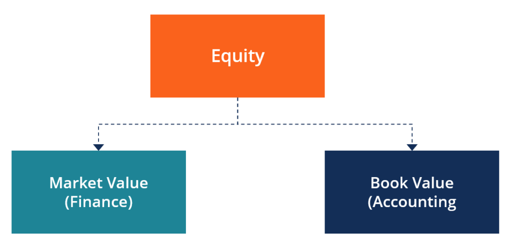

## Table of Contents

## What is equity in simple terms?

Equity is like a piece of ownership in a company or property. When you own equity, it means you have a share in that asset. For example, if you buy stocks in a company, you own a small part of that company. The value of your equity can go up or down depending on how well the company or property is doing.

In another way, equity can also mean the difference between what you own and what you owe. For instance, if you have a house worth $200,000 and you owe $150,000 on your mortgage, your equity in the house is $50,000. This kind of equity is important because it shows how much of the asset you truly own after paying off debts.

## How does equity differ from assets and liabilities?

Equity, assets, and liabilities are all parts of a financial picture, but they are different. Assets are things you own that have value, like money, property, or stocks. They can be used to make more money or sold if you need cash. Liabilities, on the other hand, are what you owe, like loans or bills. They are the opposite of assets because they take money away from you.

Equity is a bit different. It's what's left after you subtract your liabilities from your assets. Think of it as your real ownership in something. For example, if you own a house (an asset) but you still have a mortgage (a liability), your equity is the value of the house minus what you owe on the mortgage. So, equity shows how much of the asset you truly own after paying off what you owe.

## What are the main types of equity?

There are a few main types of equity that people talk about. One type is stockholder's equity, which is what shareholders own in a company. When you buy stocks, you get a piece of the company's equity. This can grow if the company does well, and it can be a way to make money if you sell your stocks for more than you paid.

Another type is owner's equity, which is similar but for businesses that aren't publicly traded. If you own a small business, the value of your business minus any debts you owe is your owner's equity. It shows how much of the business you really own.

The last type is home equity, which is the value of your home minus any mortgage or loans you have on it. If your home is worth $300,000 and you owe $200,000 on your mortgage, your home equity is $100,000. This can be important because you can borrow against your home equity or sell your home to use that money.

## Why is equity important for businesses?

Equity is important for businesses because it shows how much the owners really own after paying off all the debts. This is called owner's equity or stockholder's equity, depending on if the business is public or private. When a business has a lot of equity, it means it's in a good financial position. It can use this equity to grow, like by buying new equipment or opening new stores. It also makes the business look strong to people who might want to invest money in it.

Equity also helps businesses get more money. If a business needs to borrow money, having a lot of equity can make it easier to get a loan. Banks and other lenders feel safer lending money to a business that has a lot of equity because it shows the business is stable and can pay back the loan. Plus, if a business wants to sell part of itself to raise money, having high equity makes its shares more valuable, which can attract more investors.

## How is equity calculated on a balance sheet?

Equity on a balance sheet is calculated by taking the total assets of a business and subtracting its total liabilities. Think of it like this: if you add up everything a business owns (like cash, buildings, or inventory), that's the total assets. Then, you take away everything the business owes (like loans or bills), which are the total liabilities. What's left is the equity, which shows how much the owners really own after paying off all the debts.

This calculation is important because it gives a clear picture of the financial health of a business. If a business has a lot of equity, it means it's doing well and has a lot of value left after paying what it owes. This can make the business attractive to investors or lenders because it shows the business is stable and has the potential to grow. On the other hand, if a business has very little or negative equity, it might be struggling and could have trouble getting more money to operate.

## What is the difference between book value and market value of equity?

Book value of equity is what a company is worth according to its financial records. It's like looking at a company's balance sheet and seeing how much the owners own after all the debts are paid. You find it by taking the total assets and subtracting the total liabilities. It's a good way to see the basic value of a company, but it doesn't always tell the whole story because it's based on what the company paid for things, not what those things are worth now.

Market value of equity is different because it's about what people are willing to pay for the company's stock right now. It's the total value of all the company's shares in the stock market. This value can go up and down a lot because it depends on what investors think about the company's future. If people think the company will do well, the market value can be much higher than the book value. But if people are worried about the company, the market value can drop below the book value.

So, book value is like a snapshot of the past, showing what the company has been worth, while market value is more about what people think the company will be worth in the future. Both are important, but they can give very different pictures of a company's value.

## How does equity affect a company's financial health?

Equity is like the backbone of a company's financial health. It shows how much the owners really own after paying off all the debts. When a company has a lot of equity, it means it's in a good spot financially. It can use this equity to grow, like buying new stuff or starting new projects. It also makes the company look strong to people who might want to invest money in it. If a company has high equity, it's easier for them to get loans because banks see them as a safe bet.

On the flip side, if a company has little or negative equity, it might be in trouble. It means the company owes more than it owns, which can scare off investors and make it hard to get more money. When equity is low, the company might struggle to pay its bills or invest in new opportunities. So, keeping an eye on equity is super important for understanding if a company is doing well or if it might need help to stay afloat.

## What role does equity play in investment decisions?

Equity plays a big role in investment decisions because it shows how much a company is really worth. When investors look at a company, they want to see if it has a lot of equity. That means the company owns more than it owes, which is a good sign. A company with high equity looks strong and stable, so investors feel safer putting their money into it. They think the company has a good chance to grow and make more money, which could mean bigger returns for them.

On the other hand, if a company has low or negative equity, investors might be worried. It means the company might be struggling and could have trouble paying its bills or growing. Investors might think twice about putting their money into a company with low equity because it's riskier. They might lose their money if the company doesn't do well. So, equity helps investors decide if a company is a good bet or if they should look for other places to invest their money.

## How can equity be used to measure a company's performance?

Equity can be a good way to see how well a company is doing. It's like looking at the company's report card to see if it's passing or failing. When a company has a lot of equity, it means it's doing well because it owns more than it owes. This shows that the company is making money and growing. Investors and people who own the company like to see high equity because it means the business is strong and could keep getting better.

On the other hand, if a company has low or negative equity, it might be struggling. Low equity means the company owes more than it owns, which can be a big problem. It might mean the company is having trouble making money or paying its bills. When equity is low, it's a warning sign that the company might need to make some changes or it could be in trouble. So, by looking at equity, you can get a quick idea of how healthy a company is and if it's on the right track.

## What are common equity financing methods for businesses?

One common way businesses get equity financing is by selling shares of stock. This means they sell pieces of ownership in the company to investors. When a company does this, it's called an initial public offering (IPO) if it's the first time, or a secondary offering if they've done it before. Investors buy these shares hoping the company will do well and the value of their shares will go up. This method is popular with big companies that want to raise a lot of money to grow or pay off debts.

Another way is through private equity. This is when a business sells shares to private investors or investment firms instead of the public. These investors might be rich people or companies that specialize in investing in businesses. Private equity can be a good choice for smaller or newer companies that aren't ready to go public yet. It gives them the money they need to grow without having to deal with all the rules and paperwork that come with selling stock to the public.

A third method is through venture capital. This is a type of private equity where investors give money to startups or young companies that they think have a lot of potential. Venture capitalists usually get a piece of the company in return for their investment. They often help the company grow by giving advice and using their connections. This method is great for new businesses that need money to get off the ground and have big plans for the future.

## How do changes in equity impact shareholders?

Changes in a company's equity can have a big impact on shareholders. When equity goes up, it usually means the company is doing well. This can make shareholders happy because their shares become more valuable. They might see the price of their stocks go up, and if the company pays dividends, those might increase too. It's like owning a piece of a business that's growing, and that can lead to more money for shareholders.

On the other hand, if equity goes down, it can be bad news for shareholders. It might mean the company is struggling, and this can make the value of their shares drop. Shareholders might worry about losing money if they need to sell their stocks when the price is low. Also, if the company isn't doing well, it might cut back on dividends or stop paying them altogether. So, keeping an eye on changes in equity is important for shareholders because it can tell them a lot about how their investment is doing.

## What advanced metrics can be used to analyze equity more deeply?

To get a deeper look at a company's equity, you can use something called the Return on Equity (ROE). ROE is a way to see how well a company is using the money that shareholders have put into it. You find ROE by taking the company's net income and dividing it by its shareholder's equity. A high ROE means the company is good at turning the money it gets from shareholders into more profits. This can be a sign that the company is doing well and might be a good investment. But, it's also important to compare the ROE with other companies in the same industry because what's good in one industry might not be as good in another.

Another useful metric is the Price-to-Book (P/B) ratio. This helps you see if a company's stock is priced right compared to its book value. You find the P/B ratio by taking the market value of the company's stock and dividing it by its book value. If the P/B ratio is low, it might mean the stock is a good deal because it's cheaper than what the company is really worth. But if it's high, the stock might be overpriced. Like ROE, it's good to compare the P/B ratio with other companies in the same industry to get a better idea of what's normal and what's not.

These metrics can give you a more detailed picture of a company's equity. They help you understand not just how much equity a company has, but also how well it's using that equity and how the market sees its value. By looking at ROE and P/B ratios, you can make smarter decisions about whether to invest in a company or not.

## What is Financial Equity?

Equity in financial terms represents the value that would be returned to a company’s shareholders if all of the company's assets were liquidated and all its debts were paid. This concept of equity is fundamental in understanding the financial health and management of a company. It forms a significant part of the balance sheet, representing ownership interest in a company.

The calculation of equity is relatively straightforward and is often expressed as:

$$
\text{Equity} = \text{Total Assets} - \text{Total Liabilities}
$$

This formula is derived from the basic accounting equation, ensuring that the value depicted takes into account all owned resources and obligations. Equity provides insight into the net worth of a company and can be influenced by various factors such as profits, losses, capital investments, and dividends.

Equity can be categorized into several types, each serving its purpose in different financial contexts:

1. **Shareholder Equity**: This is commonly referred to as stockholders’ equity and signifies the residual interest in the assets of the company after deducting liabilities. It's a clear indicator of a company's economic value and an essential metric for investors assessing the financial strength of corporations.

2. **Private Equity**: This type refers to investments made in companies that are not publicly traded. These investments often involve buying shares in private companies or public companies with the intent to delist from public stock exchanges, providing substantial returns but also embodying higher levels of risk and longer investment horizons.

3. Additional forms of equity include venture capital, leveraged buyouts, and growth capital—each involving different strategies and investment structures. Furthermore, equity also extends beyond corporate settings, encompassing realms such as home equity and brand equity, which reflect personal finance and marketing dynamics, respectively.

In summary, equity is a crucial financial concept reflecting the intrinsic value of a company to its shareholders, a determinant of financial strategy, and an indicator of economic health, influencing both corporate and individual stakeholders. Understanding these various types of equity enhances comprehension of not only corporate financial structuring but also broader economic impacts.

## How do you calculate equity?

Equity is a fundamental concept in financial accounting and investment analysis, providing insights into a company's financial health. Calculating equity involves using the basic accounting equation: 

$$
\text{Shareholders' Equity} = \text{Total Assets} - \text{Total Liabilities}
$$

This straightforward calculation captures the net worth of a company by highlighting the residual interest attributable to the shareholders after all liabilities have been settled against the company's assets.

### Components and Detailed Steps

To ensure accuracy in calculating equity, it is essential to carefully account for all components involved:

1. **Identify Total Assets**: Sum up all current and non-current assets. Current assets typically include cash, marketable securities, accounts receivable, and inventory. Non-current assets comprise long-term investments, property, plant, and equipment (PPE), and intangible assets like patents and trademarks.

2. **Determine Total Liabilities**: This includes both current liabilities, such as accounts payable, short-term debt, and accrued liabilities, and long-term liabilities, including bonds payable, long-term lease obligations, and deferred tax liabilities.

3. **Compute Shareholders' Equity**: Subtract total liabilities from total assets to arrive at shareholders' equity.

In practice, calculating each component with precision is crucial. Financial statements often require adjustments for depreciation, amortization, and allowance for doubtful accounts to reflect true asset values. Similarly, some liabilities might need to be adjusted for accuracy based on anticipated settlements or interest rates.

### Example Calculation in Python

To automate the process, you might write a simple script in Python:

```python
def calculate_equity(total_assets, total_liabilities):
    # Ensure non-negative values are used
    assert total_assets >= 0, "Total assets must be non-negative"
    assert total_liabilities >= 0, "Total liabilities must be non-negative"

    # Calculate shareholders' equity
    equity = total_assets - total_liabilities
    return equity

# Example usage
total_assets = 500000  # Example value for total assets
total_liabilities = 300000  # Example value for total liabilities
equity = calculate_equity(total_assets, total_liabilities)

print(f"Shareholders' Equity: ${equity}")
```

### Conclusion

The meticulous calculation of shareholders' equity not only provides a snapshot of financial health but also aids investors and stakeholders in decision-making processes. This calculation serves as the foundation for understanding a company's potential value and financial stability.

## What are the different forms of equity?

Different forms of equity serve distinct roles and reflect various aspects of financial and non-financial value. Understanding these forms is essential for investors, companies, and other stakeholders.

### Shareholder Equity

Shareholder equity represents a company's net assets and is calculated as the difference between total assets and total liabilities, as given by the formula:

$$
\text{Shareholders' Equity} = \text{Total Assets} - \text{Total Liabilities}
$$

This figure is fundamental in assessing a company's financial health. It indicates what shareholders would theoretically receive if a company liquidated all assets and settled all debts. Shareholder equity comprises several components, including common stock, retained earnings, and additional paid-in capital.

### Private Equity

Private equity involves investments in companies that are not publicly traded on stock exchanges. Typically, these investments are made by private equity firms, venture capitalists, or accredited investors through private placements. The aim is to acquire significant ownership stakes in these companies to improve their performance and eventually sell the investment at a profit. Private equity investments are often characterized by longer-term strategies, substantial capital infusions, and active participation in the management of target companies.

### Home Equity

Home equity is the value of a homeowner's interest in their property and can be calculated using the formula:

$$
\text{Home Equity} = \text{Market Value of Property} - \text{Outstanding Mortgage Balance}
$$

This measure reflects the portion of the property that a homeowner truly owns. As mortgage payments are made, the home equity increases, offering a resource for further financial maneuvers such as refinancing or obtaining home equity loans.

### Brand Equity

Brand equity reflects the added value a brand bestows upon a product or service beyond its functional benefits. Strong brand equity allows companies to charge premium prices, foster customer loyalty, and gain competitive advantages. It is built through positive consumer experiences, strong brand recognition, and a favorable perception of quality associated with the brand. Unlike tangible assets, brand equity is an intangible asset and often plays a critical role in the overall valuation of a company.

Each form of equity—whether shareholder, private, home, or brand—plays a distinct role in financial analysis and decision-making, reflecting various facets of ownership and value creation.

## References & Further Reading

[1]: ["Equity Valuation and Analysis: Preparing, Analyzing, and Understanding Financial Statements"](https://corporatefinanceinstitute.com/resources/accounting/analysis-of-financial-statements/) by Russell Lundholm and Richard Sloan

[2]: ["Private Equity at Work: When Wall Street Manages Main Street"](https://www.jstor.org/stable/10.7758/9781610448185) by Eileen Appelbaum and Rosemary Batt

[3]: ["Home Equity and Ageing Owners: Between Risk and Regulation"](https://www.taylorfrancis.com/books/edit/10.4324/9781315747517/home-equity-ageing-owners-stuart-lowe-rosanna-scarp

[4]: ["Building Strong Brands"](https://www.amazon.com/Building-Strong-Brands-David-Aaker/dp/002900151X) by David A. Aaker

[5]: ["Algorithmic Trading: Winning Strategies and Their Rationale"](https://www.wiley.com/en-us/Algorithmic+Trading%3A+Winning+Strategies+and+Their+Rationale-p-9781118460146) by Ernie Chan