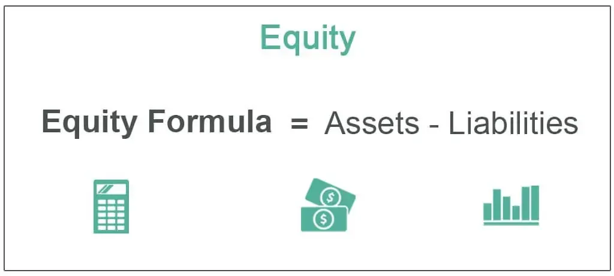

Understanding financial equity is crucial for investors and companies alike as it provides insight into the financial health and valuation of a business. Equity is the value that would be returned to a company’s shareholders if all the assets were liquidated and the company’s debts were paid off. This metric offers a snapshot of the company’s financial position, influencing both investment decisions and the strategic management of business resources.

This article explores different types of equity, including shareholder equity, private equity, home equity, and brand equity, each playing a significant role in distinctly different contexts. Shareholder equity, often referred to as stockholders' or owners' equity, reflects the value remaining for shareholders after liabilities are settled and is a key indicator of a company’s net worth. Private equity involves investments in non-public companies and focuses on increasing the value of the businesses it invests in, often by improving management and efficiency. Home equity represents a homeowner's financial interest in their property and is critical for property-related financial decisions. Brand equity, though intangible, significantly affects consumer perception and pricing power.



Beyond understanding these types, knowing how to calculate equity is essential. The basic formula for computing equity is:

$$
\text{Equity} = \text{Total Assets} - \text{Total Liabilities}
$$

This calculation provides a foundation for assessing financial stability and potential growth.

Additionally, financial equity plays a pivotal role in algorithmic trading, offering a basis for decision-making algorithms. In algorithmic trading, machines process vast amounts of equity data to identify market trends and make automated trading decisions. Algorithms incorporate equity metrics to enhance trading strategies, potentially leading to improved financial performance by seizing market opportunities more swiftly and efficiently than manual trading.

Understanding and leveraging financial equity thus becomes a strategic asset, whether in protecting shareholder interests or optimizing investment strategies in trading. This foundation supports investors and companies in making informed, data-driven decisions for sustainable financial health.

## Table of Contents

## What is Financial Equity?

Equity in financial terms represents the value that would be returned to a company’s shareholders if all of the company's assets were liquidated and all its debts were paid. This concept of equity is fundamental in understanding the financial health and management of a company. It forms a significant part of the balance sheet, representing ownership interest in a company.

The calculation of equity is relatively straightforward and is often expressed as:

$$
\text{Equity} = \text{Total Assets} - \text{Total Liabilities}
$$

This formula is derived from the basic accounting equation, ensuring that the value depicted takes into account all owned resources and obligations. Equity provides insight into the net worth of a company and can be influenced by various factors such as profits, losses, capital investments, and dividends.

Equity can be categorized into several types, each serving its purpose in different financial contexts:

1. **Shareholder Equity**: This is commonly referred to as stockholders’ equity and signifies the residual interest in the assets of the company after deducting liabilities. It's a clear indicator of a company's economic value and an essential metric for investors assessing the financial strength of corporations.

2. **Private Equity**: This type refers to investments made in companies that are not publicly traded. These investments often involve buying shares in private companies or public companies with the intent to delist from public stock exchanges, providing substantial returns but also embodying higher levels of risk and longer investment horizons.

3. Additional forms of equity include venture capital, leveraged buyouts, and growth capital—each involving different strategies and investment structures. Furthermore, equity also extends beyond corporate settings, encompassing realms such as home equity and brand equity, which reflect personal finance and marketing dynamics, respectively.

In summary, equity is a crucial financial concept reflecting the intrinsic value of a company to its shareholders, a determinant of financial strategy, and an indicator of economic health, influencing both corporate and individual stakeholders. Understanding these various types of equity enhances comprehension of not only corporate financial structuring but also broader economic impacts.

## How to Calculate Equity

Equity is a fundamental concept in financial accounting and investment analysis, providing insights into a company's financial health. Calculating equity involves using the basic accounting equation: 

$$
\text{Shareholders' Equity} = \text{Total Assets} - \text{Total Liabilities}
$$

This straightforward calculation captures the net worth of a company by highlighting the residual interest attributable to the shareholders after all liabilities have been settled against the company's assets.

### Components and Detailed Steps

To ensure accuracy in calculating equity, it is essential to carefully account for all components involved:

1. **Identify Total Assets**: Sum up all current and non-current assets. Current assets typically include cash, marketable securities, accounts receivable, and inventory. Non-current assets comprise long-term investments, property, plant, and equipment (PPE), and intangible assets like patents and trademarks.

2. **Determine Total Liabilities**: This includes both current liabilities, such as accounts payable, short-term debt, and accrued liabilities, and long-term liabilities, including bonds payable, long-term lease obligations, and deferred tax liabilities.

3. **Compute Shareholders' Equity**: Subtract total liabilities from total assets to arrive at shareholders' equity.

In practice, calculating each component with precision is crucial. Financial statements often require adjustments for depreciation, amortization, and allowance for doubtful accounts to reflect true asset values. Similarly, some liabilities might need to be adjusted for accuracy based on anticipated settlements or interest rates.

### Example Calculation in Python

To automate the process, you might write a simple script in Python:

```python
def calculate_equity(total_assets, total_liabilities):
    # Ensure non-negative values are used
    assert total_assets >= 0, "Total assets must be non-negative"
    assert total_liabilities >= 0, "Total liabilities must be non-negative"

    # Calculate shareholders' equity
    equity = total_assets - total_liabilities
    return equity

# Example usage
total_assets = 500000  # Example value for total assets
total_liabilities = 300000  # Example value for total liabilities
equity = calculate_equity(total_assets, total_liabilities)

print(f"Shareholders' Equity: ${equity}")
```

### Conclusion

The meticulous calculation of shareholders' equity not only provides a snapshot of financial health but also aids investors and stakeholders in decision-making processes. This calculation serves as the foundation for understanding a company's potential value and financial stability.

## Different Forms of Equity

Different forms of equity serve distinct roles and reflect various aspects of financial and non-financial value. Understanding these forms is essential for investors, companies, and other stakeholders.

### Shareholder Equity

Shareholder equity represents a company's net assets and is calculated as the difference between total assets and total liabilities, as given by the formula:

$$
\text{Shareholders' Equity} = \text{Total Assets} - \text{Total Liabilities}
$$

This figure is fundamental in assessing a company's financial health. It indicates what shareholders would theoretically receive if a company liquidated all assets and settled all debts. Shareholder equity comprises several components, including common stock, retained earnings, and additional paid-in capital.

### Private Equity

Private equity involves investments in companies that are not publicly traded on stock exchanges. Typically, these investments are made by private equity firms, venture capitalists, or accredited investors through private placements. The aim is to acquire significant ownership stakes in these companies to improve their performance and eventually sell the investment at a profit. Private equity investments are often characterized by longer-term strategies, substantial capital infusions, and active participation in the management of target companies.

### Home Equity

Home equity is the value of a homeowner's interest in their property and can be calculated using the formula:

$$
\text{Home Equity} = \text{Market Value of Property} - \text{Outstanding Mortgage Balance}
$$

This measure reflects the portion of the property that a homeowner truly owns. As mortgage payments are made, the home equity increases, offering a resource for further financial maneuvers such as refinancing or obtaining home equity loans.

### Brand Equity

Brand equity reflects the added value a brand bestows upon a product or service beyond its functional benefits. Strong brand equity allows companies to charge premium prices, foster customer loyalty, and gain competitive advantages. It is built through positive consumer experiences, strong brand recognition, and a favorable perception of quality associated with the brand. Unlike tangible assets, brand equity is an intangible asset and often plays a critical role in the overall valuation of a company.

Each form of equity—whether shareholder, private, home, or brand—plays a distinct role in financial analysis and decision-making, reflecting various facets of ownership and value creation.

## Equity's Role in Algorithmic Trading

Equity plays a critical role in [algorithmic trading](/wiki/algorithmic-trading), forming the foundation for various decision-making processes within automated trading systems. Equity data serves as a key input for algorithms that analyze market trends, identify trading opportunities, and execute trades without human intervention.

Algorithms rely on equity metrics, such as price-to-earnings ratios, book-to-market values, and dividend yields, to evaluate the attractiveness of stocks. By incorporating these metrics, algorithms can assess whether a stock is overvalued or undervalued, providing a basis for "buy" or "sell" decisions. This data-driven approach allows traders to capitalize on market inefficiencies and enhance their trading strategies.

One example of an equity-based algorithmic strategy is pairs trading. In this strategy, the algorithm identifies two stocks with similar characteristics and historical price behaviors. When the price relationship diverges beyond a certain threshold, the algorithm initiates trades expecting reversion to the mean. The use of equity metrics to identify such pairs increases the likelihood of success, as it relies on fundamental valuation indicators.

Moreover, equity data can be integrated into [machine learning](/wiki/machine-learning) models to predict future stock prices. By training these models on historical equity data, traders can uncover patterns and correlations that inform trading decisions. For instance, a linear regression model might use historical equity prices as inputs to predict future price movements, thus aiding in formulating strategies that maximize returns while managing risk.

The application of equity in algorithmic trading also extends to risk management. Algorithms can dynamically adjust portfolios based on changes in equity value, thereby optimizing asset allocation. This continuous rebalancing helps maintain desired risk levels and aligns with investment objectives.

Overall, incorporating equity metrics into algorithmic trading systems enhances the potential for improved financial performance. By leveraging data analytics and computational techniques, traders can implement sophisticated strategies that respond swiftly to market changes, ultimately seeking to achieve better outcomes than traditional trading methods.

## Conclusion

Financial equity is a multifaceted and indispensable element in both investment and trading landscapes. This comprehensive concept encompasses various forms including shareholder equity, private equity, home equity, and brand equity, each holding specific significance within its domain. The ability to accurately calculate and interpret equity is crucial, serving not only as an indicator of a company's financial health but also as a strategic tool for investors and companies alike.

Incorporating equity into algorithmic trading can offer profound strategic advantages. By integrating equity data into trading algorithms, investors can enhance decision-making processes, potentially identify profitable trends, and optimize existing investment strategies. Algorithms can process complex equity-based metrics to predict market movements, thereby granting traders a competitive edge.

Moreover, safeguarding shareholder interests through meticulous equity management underscores its importance in maintaining investor confidence and ensuring long-term sustainability. In this context, equity is not just a measure of financial status but a fundamental cornerstone ensuring that shareholder value is preserved and enhanced over time. 

In summary, irrespective of its application—whether protecting shareholder interests or optimizing trading strategies—financial equity remains a pivotal element of financial health. Understanding its components and applications provides stakeholders with critical insights and tools necessary for informed decision-making in the ever-evolving financial markets.

## References & Further Reading

[1]: ["Equity Valuation and Analysis: Preparing, Analyzing, and Understanding Financial Statements"](https://corporatefinanceinstitute.com/resources/accounting/analysis-of-financial-statements/) by Russell Lundholm and Richard Sloan

[2]: ["Private Equity at Work: When Wall Street Manages Main Street"](https://www.jstor.org/stable/10.7758/9781610448185) by Eileen Appelbaum and Rosemary Batt

[3]: ["Home Equity and Ageing Owners: Between Risk and Regulation"](https://www.taylorfrancis.com/books/edit/10.4324/9781315747517/home-equity-ageing-owners-stuart-lowe-rosanna-scarp

[4]: ["Building Strong Brands"](https://www.amazon.com/Building-Strong-Brands-David-Aaker/dp/002900151X) by David A. Aaker

[5]: ["Algorithmic Trading: Winning Strategies and Their Rationale"](https://www.wiley.com/en-us/Algorithmic+Trading%3A+Winning+Strategies+and+Their+Rationale-p-9781118460146) by Ernie Chan