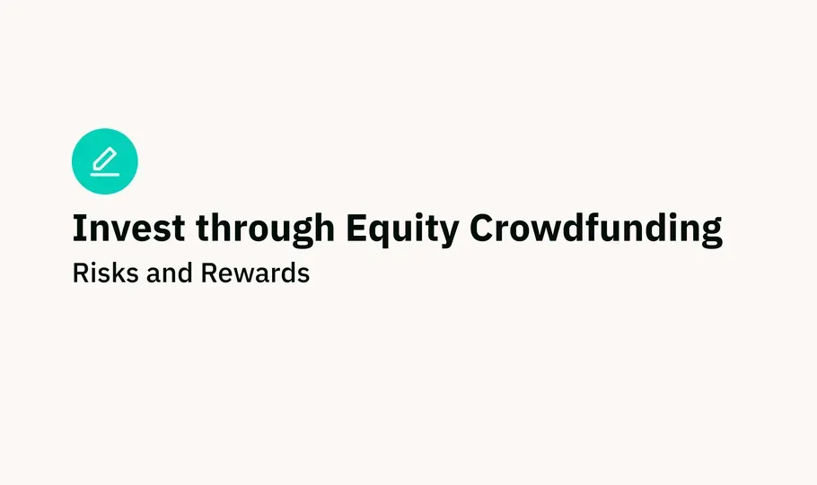

## Table of Contents

## What is equity crowdfunding?

Equity crowdfunding is a way for people to invest in a company by buying small pieces of it, called shares. This method helps businesses, especially smaller ones or startups, to raise money from a lot of people, not just big investors. Instead of borrowing money from a bank or getting it from a few wealthy people, a company can use a website to reach out to the public and ask them to invest.

When someone invests through equity crowdfunding, they become a part-owner of the company. This means they might get some money back if the company does well, like through profits or if the company is sold. But, it also means they could lose their money if the company doesn't do well. It's a way for everyday people to support businesses they believe in, but it comes with risks because there's no guarantee the company will succeed.

## How does equity crowdfunding differ from traditional crowdfunding?

Equity crowdfunding and traditional crowdfunding are two different ways for people to support new projects or businesses, but they work in different ways. In traditional crowdfunding, people give money to a project or business, usually through a website like Kickstarter or GoFundMe. The people who give money don't get any ownership in the company. Instead, they might get a reward, like a product or a thank you note. The main goal is to raise money to start a project or business, and it's often used for things like making a new game, a movie, or helping someone with a personal cause.

Equity crowdfunding is different because when people give money, they get a piece of the company, called shares. This means they become part-owners of the business. If the company does well, the people who invested might get money back through profits or if the company is sold. But, there's also a risk because if the company doesn't do well, they could lose their money. Equity crowdfunding is used more often by businesses that want to grow and need money to do that, and it's a way for everyday people to invest in companies they believe in.

In short, traditional crowdfunding is about giving money to support a project without getting any ownership, while equity crowdfunding is about investing money to become a part-owner of a business. Both methods help raise money, but they offer different things to the people who give money.

## What are the basic steps to participate in an equity crowdfunding campaign?

To participate in an equity crowdfunding campaign, first, you need to find a platform that hosts these campaigns. Websites like SeedInvest, StartEngine, or Wefunder are popular places where companies look for investors. Once you're on a platform, you can browse through different companies that are raising money. Look at their business plans, financials, and what they plan to do with the money they raise. Make sure to read everything carefully so you understand the company and the risks involved.

After you've chosen a company you want to invest in, you'll need to create an account on the platform if you haven't already. This usually involves filling out some personal information and agreeing to the platform's terms. Then, you decide how much money you want to invest. Remember, you're buying shares in the company, so think about how much you can afford to lose if things don't go well. Once you've made your decision, you'll follow the platform's steps to complete your investment. This might involve transferring money from your bank account or using a credit card.

After you've invested, you'll usually get updates from the company about how they're doing. Keep an eye on these updates to see if the company is meeting its goals. If the company does well, you might get some money back through dividends or if the company is sold. But remember, there's always a risk that you could lose your investment if the company doesn't succeed.

## What are the potential rewards of investing in equity crowdfunding?

Investing in equity crowdfunding can offer you the chance to make money if the company you invest in does well. If the business grows and becomes successful, you might get some of the profits through dividends, which are payments made to shareholders. You could also make money if the company gets sold or goes public, because the value of your shares might go up. This means you could sell your shares for more than you paid for them. It's a way to support businesses you believe in and possibly earn a return on your investment.

Another reward of equity crowdfunding is that it lets you be part of exciting new businesses or projects. You get to help new ideas grow and see them develop from the start. This can be really satisfying, especially if you're passionate about the company's mission or product. Plus, you might get special perks or access to the company's products or services before anyone else. It's a way to be involved in the entrepreneurial world and support innovation, which can be very rewarding even if you don't make a lot of money.

## What are the common risks associated with equity crowdfunding?

Investing in equity crowdfunding can be risky because there's a chance you might lose all the money you put in. Startups and small businesses often fail, and if the company you invest in doesn't do well, your shares might become worthless. It's hard to predict which companies will succeed, so you could end up losing your investment. Also, since equity crowdfunding is open to the public, there might be a lot of people trying to invest, which could make it hard for you to get your money back quickly if you need to.

Another risk is that the information you get about the company might not be complete or accurate. Sometimes, companies might not share everything, or they might make their business look better than it really is to attract investors. This can make it hard for you to make a good decision about whether to invest. Plus, since you're dealing with new and small companies, it can be tough to sell your shares later on if you want to. Unlike stocks on big stock markets, there might not be a lot of people wanting to buy your shares in a small company.

## How can a beginner assess the viability of an equity crowdfunding project?

To assess the viability of an equity crowdfunding project, a beginner should start by carefully reading the company's business plan and financials. Look for a clear explanation of what the company does, how it plans to make money, and what it will use the crowdfunding money for. It's important to see if the company has a good understanding of its market and a solid plan to grow. Also, check the company's financial statements to see if it's making money or losing it. If the company is losing money, find out why and if it has a realistic plan to become profitable.

Next, look at the team behind the company. A strong, experienced team can make a big difference in whether a company succeeds or fails. See if the founders and key team members have experience in the industry and if they've successfully run other businesses before. It's also helpful to read reviews and feedback from other investors or experts on the crowdfunding platform. They might point out things you missed or give you a better idea of the company's chances of success. Remember, even with all this research, there's still a risk that the company might not do well, so only invest money you can afford to lose.

## What legal and regulatory considerations should be noted in equity crowdfunding?

Equity crowdfunding is regulated by laws to protect investors and make sure companies follow the rules. In the United States, the main law is the JOBS Act, which lets companies raise money from the public through equity crowdfunding. There are different rules depending on how much money a company wants to raise. For example, if a company wants to raise up to $1.07 million in a year, it has to follow Regulation Crowdfunding rules. These rules say the company must share important information with investors, like financial statements and details about the business. Also, there are limits on how much money people can invest based on their income and net worth, to help keep them from risking too much money.

Another important thing to know is that different countries have their own rules for equity crowdfunding. If you're investing in a company from another country, you need to understand the laws there too. For example, in the European Union, there are rules like the European Crowdfunding Service Providers Regulation that set standards for crowdfunding platforms and protect investors. It's a good idea to read all the legal documents on the crowdfunding platform and maybe even talk to a lawyer if you're not sure about something. This can help you understand your rights and the risks involved in equity crowdfunding.

## How do valuation and due diligence play a role in equity crowdfunding?

Valuation is how much a company is worth when it's trying to raise money through equity crowdfunding. It's important because it decides how much of the company you get for your money. If a company is valued at $1 million and you invest $10,000, you might get 1% of the company. But if the valuation is too high, you might not get as much of the company for your money, and that could be risky if the company doesn't grow as expected. So, it's good to check if the valuation seems fair by looking at similar companies and their valuations.

Due diligence is the work you do to make sure the company is a good investment. It means reading the company's business plan, financial statements, and any other information they share. You want to see if the company has a good plan to make money and grow. It's also smart to look at the team running the company to see if they have experience and a track record of success. Doing your due diligence helps you understand the risks and decide if the company is worth investing in. It's like doing homework before you spend your money, to make sure you're making a smart choice.

## What are some advanced strategies for diversifying an equity crowdfunding portfolio?

Diversifying an equity crowdfunding portfolio means spreading your money across different types of companies to lower your risk. One advanced strategy is to invest in companies from different industries. For example, you could put money into a tech startup, a food and beverage company, and a healthcare business. This way, if one industry has a tough time, your whole investment won't be affected because the other industries might still do well. Another strategy is to look at companies at different stages of growth. You could invest in some early-stage startups that might have higher risks but also higher potential rewards, and also in more established companies that are growing but might be less risky.

Another way to diversify is to consider different types of crowdfunding campaigns. Some platforms offer different kinds of investment opportunities, like revenue-sharing agreements or convertible notes, in addition to traditional equity. By mixing these different types of investments, you can balance potential risks and rewards. It's also smart to keep an eye on geographic diversification. Investing in companies from different countries or regions can protect you from problems that might only affect one area. The key is to spread your investments so that if one doesn't do well, the others might still help you come out ahead.

## How does the secondary market for equity crowdfunding investments work?

A secondary market for equity crowdfunding investments is a place where people can buy and sell shares they got from crowdfunding campaigns. Normally, when you invest in a company through equity crowdfunding, you can't easily sell your shares right away. But a secondary market changes that. It's like a special store where people who want to sell their shares can find others who want to buy them. This makes it easier for investors to get their money back if they need to, without having to wait for the company to be sold or go public.

Not all crowdfunding platforms have a secondary market, so you need to check if the one you're using does. If it does, you can list your shares for sale at a price you think is fair. Other people on the platform can then see your listing and decide if they want to buy your shares. The price can go up or down depending on how much people want to buy or sell. It's a bit like trading cards or used video games, where the value depends on how popular they are. But remember, even with a secondary market, there's no guarantee you'll find a buyer, so it's still a good idea to think carefully before you invest.

## What are the tax implications of equity crowdfunding investments?

When you invest in equity crowdfunding, you need to know about taxes. If you make money from your investment, like getting dividends or selling your shares for more than you paid, you might have to pay taxes on that money. In the United States, the money you make from selling shares is called capital gains. If you hold the shares for more than a year before selling, you pay a lower tax rate on the profit. But if you sell them within a year, you pay a higher tax rate. Dividends are usually taxed as regular income, but there are some exceptions depending on how much money you make and what kind of dividends they are.

It's also important to know that you might be able to claim a loss on your taxes if your investment doesn't do well. If the company fails and your shares become worthless, you can sometimes use that loss to lower your taxes. This is called a capital loss, and you can use it to offset any capital gains you have from other investments. But the rules about claiming losses can be complicated, so it's a good idea to talk to a tax professional to make sure you're doing everything right.

## How can one evaluate the long-term performance and impact of equity crowdfunding investments?

To evaluate the long-term performance and impact of equity crowdfunding investments, you need to keep an eye on how the company is doing over time. Look at their financial reports to see if they are making money and growing. Check if they are meeting the goals they set when you invested, like launching new products or expanding to new markets. It's also helpful to see if the company is still doing what it said it would do when you invested, like sticking to their mission or values. You can find this information in updates from the company or on the crowdfunding platform. By comparing the company's progress to what they promised, you can see if your investment is paying off.

Another way to assess the long-term impact is to think about the bigger picture. Consider how the company is affecting its industry or the community. Are they creating jobs, helping the environment, or making a difference in people's lives? This kind of impact can be harder to measure, but it's important if you care about supporting businesses that do good things. You can also look at the stock market if the company goes public, or see if other investors are buying and selling shares in the secondary market. This can give you an idea of how others think the company is doing. Remember, it takes time to see the full results of an investment, so patience and regular check-ins are key.

## References & Further Reading

[1]: Metrick, A., & Yasuda, A. (2011). ["Venture Capital & the Finance of Innovation."](https://archive.org/details/venturecapitalfi0000metr_b2r8) John Wiley & Sons.

[2]: Mollick, E. (2014). "The Dynamics of Crowdfunding: An Exploratory Study." Journal of Business Venturing, 29(1), 1-16. [Link](https://www.sciencedirect.com/science/article/pii/S088390261300058X) 

[3]: Meyskens, M., & Bird, L. (2015). "Crowdfunding and Value Creation." Entrepreneurship Research Journal, 5(2), 155-166. [Link](https://www.researchgate.net/publication/277637559_Crowdfunding_and_Value_Creation)

[4]: Lopez de Prado, M. (2018). ["Advances in Financial Machine Learning."](https://www.amazon.com/Advances-Financial-Machine-Learning-Marcos/dp/1119482089) Wiley.

[5]: Chan, E. P. (2008). ["Quantitative Trading: How to Build Your Own Algorithmic Trading Business."](https://github.com/ftvision/quant_trading_echan_book) Wiley Trading.

[6]: Jansen, S. (2020). ["Machine Learning for Algorithmic Trading."](https://github.com/stefan-jansen/machine-learning-for-trading) Packt Publishing.