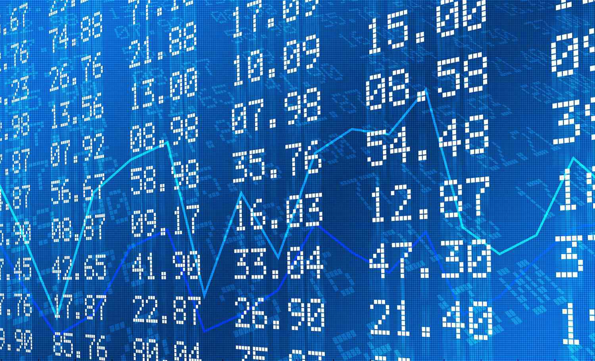

In the world of finance and trading, understanding performance metrics is crucial for making informed decisions. One essential tool that traders and investors use is the equity curve. The equity curve is a graphical representation that plots the change in value of a trading account over time. By visualizing the account balance or equity growth, traders can evaluate the viability and profitability of a trading strategy. A smooth, consistently upward-sloping equity curve typically indicates a profitable and stable trading strategy, while a volatile or downward trend may highlight potential weaknesses or risks.

Investment analysis frequently incorporates the study of trading performance through equity curves, as they provide a condensed view of returns and risks. Traders and investors utilize various metrics derived from equity curves, such as total return, maximum drawdown, and the recovery factor, to assess the health of a trading strategy. These metrics highlight different aspects of performance, informing decisions concerning risk management and strategic adjustments.



Algorithmic trading strategies further enhance the utility of equity curves by employing data-driven approaches to optimize performance. By integrating technical indicators and machine learning techniques, algo traders can create systems that adapt to evolving market conditions, thereby influencing the equity curve's trends. These strategies benefit from backtesting, which uses historical data to simulate and verify the effectiveness of a trading approach, allowing traders to refine and select the best-performing strategies.

Understanding the equity curve's role in trading provides crucial insights into the underlying health and risk factors of a trading strategy. Recognizing pattern changes and applying strategic adjustments lead to better-informed decisions, ultimately improving financial outcomes. The core concepts, methodologies, and real-world applications of equity curve analysis will be explored in this comprehensive guide, demonstrating its significance for both investment analysis and trading performance evaluation. Join us as we unravel the importance of equity curves for enhancing the understanding and efficiency of trading strategies.

## Table of Contents

## Understanding Equity Curves

Equity curves are graphical representations that depict the variation in the value of a trading account over time. They function as an essential tool for assessing the profitability of trading strategies. A consistently upward-sloping equity curve is indicative of positive performance, whereas a downward or volatile slope might highlight underlying challenges or risks in the trading strategy.

Breaking down equity curves involves examining specific metrics that outline various performance aspects of a trading strategy. Key metrics include total return, which sums up the overall profit or loss; maximum drawdown, which measures the greatest peak-to-trough decline and provides insights into risk exposure; and recovery factor, which is calculated as the ratio of total return to maximum drawdown, indicating the strategy's ability to recover from losses. These metrics provide a comprehensive overview of a trading account's health and efficiency.

To enhance the analysis, traders can employ moving averages on equity curves. This technique helps to smooth out short-term fluctuations, making it easier to identify the general direction or trend of the trading account’s performance. For example, applying a simple moving average (SMA) over a period $n$ can be done using the formula:

$$
SMA = \frac{\sum_{i=1}^{n} P_{i}}{n}
$$

where $P_{i}$ represents the equity value on day $i$.

Furthermore, equity curves facilitate the rapid evaluation of multiple trading strategies and their associated risks. By comparing various equity curves, traders can discern which strategies yield consistent profits and which ones might expose the account to excessive risks. This comparison assists in optimizing strategies and aligning them more closely with the trader’s risk appetite and investment goals.

Equity curves are integral to informed decision-making in trading, providing both a macro view of performance trends and micro-level metrics that detail specific strengths and weaknesses of trading strategies. Through careful analysis, they guide traders in refining techniques and achieving enhanced profitability.

## Investment Analysis Through Equity Curves

Equity curve analysis is a crucial component of investment analysis, offering a visual depiction of a trading strategy's performance over time, encompassing both returns and associated risks. By analyzing equity curves, investors can gain a deeper understanding of the dynamics of their strategies and make more informed decisions.

When comparing multiple equity curves, investors can evaluate the potential and risks associated with different trading strategies. This comparative analysis allows for the identification of more resilient strategies that can withstand market fluctuations. It is essential for investors to recognize patterns in equity curves that correlate with market behavior, enabling them to choose strategies that align with their risk tolerance and investment goals.

Key metrics are fundamental to equity curve analysis. The Sharpe ratio, for example, is a widely used measure in assessing risk-adjusted returns. It is defined as:

$$
\text{Sharpe Ratio} = \frac{R_p - R_f}{\sigma_p}
$$

where $R_p$ is the expected portfolio return, $R_f$ is the risk-free rate, and $\sigma_p$ is the portfolio's standard deviation of returns. A higher Sharpe ratio indicates a better risk-adjusted return, providing investors with a metric to compare the efficacy of various strategies. The profit factor, the ratio of gross profits to gross losses, is another useful metric, representing the amount gained per unit of risk.

Equity curves can also highlight drawdown periods, which are crucial for understanding a strategy's [volatility](/wiki/volatility-trading-strategies). A drawdown occurs when the equity curve falls from a peak to a trough, and is measured as a percentage of the peak value. The depth and duration of drawdowns can provide insights into a strategy's recovery capabilities, helping investors understand the potential risks associated with prolonged losing streaks.

Through detailed analysis, equity curves can inform strategic adjustments aimed at enhancing profitability and managing risk. By examining these curves, investors can make data-driven decisions to optimize their portfolios, such as reallocating assets or modifying strategy parameters. These adjustments can effectively bolster a portfolio's resilience against adverse market conditions.

In summary, equity curve analysis is indispensable for investors seeking to balance returns and risks. By providing a comprehensive understanding of a trading strategy's historical performance, equity curves serve as a foundation for strategic investment decisions.

## Algorithmic Trading and Equity Curve Optimization

Algorithmic trading extensively uses equity curve analysis to refine and optimize trading strategies. Equity curves represent the performance of a trading strategy over time, providing insights into its effectiveness and sustainability. By analyzing these curves, traders can make informed decisions to enhance their trading strategies.

Incorporating technical indicators allows algorithmic traders to develop systems that dynamically respond to changes in equity curve trends. For example, moving averages, relative strength index (RSI), or Bollinger Bands can be applied to the equity curve to identify key inflection points that signal when to enter or [exit](/wiki/exit-strategy) trades. These indicators help traders adjust their strategies to maximize returns and minimize risks.

Equity curve analysis also facilitates the implementation of meta-strategies. Traders can adjust the position sizes based on the equity curve's performance, ensuring that higher capital is allocated to strategies showing positive [momentum](/wiki/momentum), while reducing exposure to underperforming strategies. This dynamic reallocation helps in maintaining an optimal risk-return profile.

Automation tools and algorithms play a crucial role in [backtesting](/wiki/backtesting) trading strategies with historical data. By creating simulated equity curves, traders can evaluate the past performance of a strategy and identify areas for improvement. This process aids in strategy selection, optimization, and the identification of potential pitfalls before real capital is deployed. For instance, Python libraries like Backtrader or Zipline allow traders to conduct in-depth backtesting and analyze equity curves with ease.

Advanced platforms leverage [machine learning](/wiki/machine-learning) techniques to predict future equity curve performance. Machine learning models can be trained on historical trading data to identify patterns and forecast future market movements. This predictive capability enables traders to anticipate market trends and adjust their strategies proactively. For example, a simple machine learning model could be implemented using Python's scikit-learn library:

```python
from sklearn.model_selection import train_test_split
from sklearn.ensemble import RandomForestRegressor
from sklearn.metrics import mean_squared_error

# Sample data: features and equity curve values (target)
X = ... # Historical feature data
y = ... # Historical equity curve data

# Split data into training and testing sets
X_train, X_test, y_train, y_test = train_test_split(X, y, test_size=0.2, random_state=42)

# Instantiate and train a RandomForest model
model = RandomForestRegressor(n_estimators=100, random_state=42)
model.fit(X_train, y_train)

# Predict future equity curve values
y_pred = model.predict(X_test)

# Evaluate model performance
mse = mean_squared_error(y_test, y_pred)
print(f"Mean Squared Error: {mse}")
```

Through such computational approaches, algorithmic traders can gain a competitive advantage, optimizing trading strategies in real-time and navigating complex market conditions with precision. The integration of equity curve analysis into the design of [algorithmic trading](/wiki/algorithmic-trading) systems enhances decision-making processes, ensuring that trading activities are aligned with strategic objectives and risk tolerance levels.

## Equity Curve Trading Strategies

Equity curve trading techniques directly leverage the visual and statistical insights provided by the equity curve itself to make precise trading decisions. These strategies are particularly effective as they are rooted in the ongoing performance analysis of the trading account, allowing traders to adaptively manage risk and optimize profitability.

One straightforward method involves setting benchmarks based on moving averages. For instance, a trader may establish that trading should be paused if the equity curve falls below a certain moving average. This approach helps in effectively curbing potential losses by marking a threshold that signals potential downturns, allowing time to reassess market conditions or strategy validity.

Adjustments to strategy size and deployment are other vital techniques. The responsiveness to equity curve fluctuations means strategies can be downsized or halted if performance diverges from predetermined conditions, like a moving average cross. The aim is to manage risk dynamically by reducing exposure during periods of underperformance or unfavorable market conditions.

To sharpen the focus on profitability, equity curve analysis can be combined with key performance metrics like the profit [factor](/wiki/factor-investing). The profit factor, calculated as the ratio of gross profits to gross losses from trades, offers a refined view of a strategy's performance. By correlating this metric with changes in the equity curve, traders can gain deeper insights into the underlying profitability of their strategies and make informed decisions to maximize returns.

A practical and robust equity curve trading approach emphasizes continuous monitoring and incremental adjustment of trading parameters. This ensures that strategies remain aligned with current market dynamics and performance trends. For instance, implementing Python scripting to automate these adjustments provides a consistent framework for real-time analysis. Here is a basic example of such a script:

```python
# Sample code for monitoring equity curve and adjusting strategy
import pandas as pd
import numpy as np

# Simulated equity curve data
equity_curve = pd.Series([10000 + np.random.randn() * 100 for _ in range(1000)])

# Calculate a moving average
moving_average = equity_curve.rolling(window=50).mean()

# Define a strategy adjustment function
def adjust_strategy(equity_curve, moving_average):
    if equity_curve.iloc[-1] < moving_average.iloc[-1]:
        return "Pause trades or reduce position size"
    else:
        return "Continue with current strategy"

# Monitor equity curve
action = adjust_strategy(equity_curve, moving_average)
print(action)
```

Such a strategy leverages the power of automation to keep a real-time pulse on equity performance, allowing traders to execute strategically sound adjustments and achieve better risk management. By continuously aligning trading actions with the equity curve's signals, traders can maintain a competitive edge in fluctuating market environments.

## Practical Applications and Case Studies

Equity curve analysis serves as a key component in optimizing trading strategies and evaluating their real-world effectiveness. It provides traders with a detailed visual representation of their trading strategies' profitability and performance over time. Analyzing these curves allows traders to adapt and refine their strategies, ensuring better alignment with market conditions and risk management requirements.

In momentum trading, equity curves can demonstrate strong uptrends, signaling persistent profitability and success in capturing trends. Momentum traders capitalize on the continuation of existing market trends. A case study focusing on a momentum trading strategy might showcase an equity curve with consistent upward movement, revealing periods of sustained gains and allowing for strategic reinvestment or scaling of positions. This approach helps maximize returns during favorable conditions, while the equity curve provides a checkpoint for evaluating the strategy's effectiveness.

Alternatively, mean-reversion strategies aim to exploit price reversions to a historical average. These strategies often yield more stable equity curves with controlled fluctuations. A stable curve suggests that the strategy effectively captures price reversals, contributing to steady returns. For instance, a study might illustrate how a mean-reversion strategy maintained a balanced equity curve throughout volatile market periods, thereby reducing the overall risk exposure.

To implement equity curve analysis practically, traders rely on specialized software tools and trading platforms that generate and analyze these curves efficiently. Platforms such as MetaTrader and TradeStation allow users to automate the plotting of equity curves and facilitate the backtesting of trading strategies. Python libraries like Matplotlib and Pandas are also commonly used to chart equity curves and perform statistical analyses on the data. The utilization of these tools ensures that traders can visually monitor the performance of their strategies and make data-driven decisions.

Case studies further highlight how equity curve insights can help traders avoid substantial drawdowns and achieve improved trading outcomes. For instance, by analyzing the equity curve, a trader might identify a significant drawdown period followed by a slow recovery. This insight prompts the need for strategic adjustments, such as the application of tighter stop-losses or diversifying trading instruments. Similarly, detecting patterns within equity curves, such as frequent peaks and troughs, can signal the necessity for optimizing trade entry and exit points to smooth performance.

Understanding and analyzing application scenarios enhances traders' readiness for dynamic market conditions. Equity curve insights equip traders with the ability to anticipate potential strategy failures or necessary adjustments before substantial losses occur. By preparing for different market scenarios, traders can utilize equity curves not just as a retrospective analysis tool, but as a proactive mechanism to guide strategic decision-making.

Overall, real-world applications and case studies affirm that equity curve analysis is a vital practice for refining trading strategies. By harnessing the lessons drawn from equity curves, traders can better manage risks, capitalize on profitable trends, and adapt to changing market environments, thereby enhancing their overall trading performance.

## Conclusion

Equity curves serve as a critical instrument in evaluating trading performance and investment analysis, offering a comprehensive view of a strategy's profitability and inherent risks. By harnessing insights from equity curves, traders, whether manual or algorithmic, are equipped to make informed decisions. This empowers them to optimize strategies, enhance financial outcomes, and mitigate risks more effectively. 

In algorithmic trading, integrating equity curves into the core analysis can fundamentally transform trading strategies. This integration leads to more robust and resilient approaches, providing traders with the flexibility needed to adapt to changing market conditions. These tools help identify optimal entry and exit points and adjust strategies dynamically based on performance trends highlighted by equity curves.

Continuous learning and adaptation remain vital in effectively using equity curve analysis amidst evolving market conditions. As markets are inherently volatile and unpredictable, the ability to adapt strategies based on real-time equity curve feedback is crucial for maintaining an edge in trading. Furthermore, a well-analyzed equity curve forms the foundation for successful trading and investment strategies. By facilitating better risk management and aligning with profitability objectives, equity curves enable traders to achieve sustainable financial success. Thus, equity curve analysis is not just a tool, but a strategic component essential for thriving in the dynamic landscape of trading and investment.

## References & Further Reading

[1]: Bergstra, J., Bardenet, R., Bengio, Y., & Kégl, B. (2011). ["Algorithms for Hyper-Parameter Optimization."](https://dl.acm.org/doi/10.5555/2986459.2986743) Advances in Neural Information Processing Systems 24.

[2]: ["Advances in Financial Machine Learning"](https://www.amazon.com/Advances-Financial-Machine-Learning-Marcos/dp/1119482089) by Marcos Lopez de Prado

[3]: ["Evidence-Based Technical Analysis: Applying the Scientific Method and Statistical Inference to Trading Signals"](https://www.amazon.com/Evidence-Based-Technical-Analysis-Scientific-Statistical/dp/0470008741) by David Aronson

[4]: ["Machine Learning for Algorithmic Trading"](https://github.com/stefan-jansen/machine-learning-for-trading) by Stefan Jansen

[5]: ["Quantitative Trading: How to Build Your Own Algorithmic Trading Business"](https://www.amazon.com/Quantitative-Trading-Build-Algorithmic-Business/dp/1119800064) by Ernest P. Chan