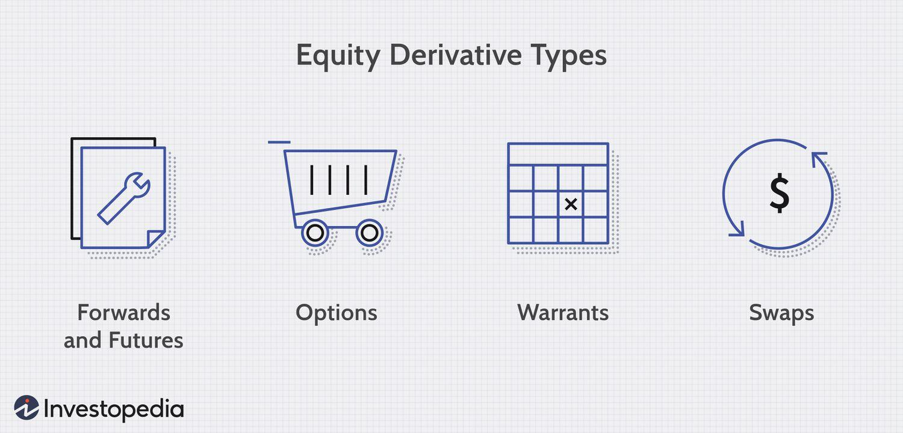

## Table of Contents

## What are equity derivatives?

Equity derivatives are financial instruments that get their value from stocks or stock indexes. They allow investors to bet on the future price movements of stocks without actually owning them. Common types of equity derivatives include options, futures, and swaps. These tools are used by investors to hedge against risks or to speculate on price changes.

Options give the buyer the right, but not the obligation, to buy or sell a stock at a set price before a certain date. Futures contracts, on the other hand, obligate the buyer and seller to trade a stock at a set price on a specific future date. Swaps involve exchanging cash flows based on stock performance. By using equity derivatives, investors can manage their exposure to the stock market in a flexible way.

## What are the main types of equity derivatives?

The main types of equity derivatives are options, futures, and swaps. Options are like a choice you can make. If you buy an option, you get the right to buy or sell a stock at a certain price before a specific date. You don't have to do it if you don't want to. This can be useful if you think the stock price might go up or down a lot.

Futures are different because they are a promise. When you buy a future, you agree to buy or sell a stock at a set price on a specific future date. This can be helpful if you want to lock in a price now for something you'll need later. Swaps are agreements to exchange cash flows based on how a stock or group of stocks performs. They can be used to manage risk or to bet on how the market will move.

## How are equity derivatives used for hedging?

Equity derivatives are used for hedging to protect against losses in the stock market. Imagine you own a lot of shares in a company, and you're worried that the stock price might go down. You can use equity derivatives like options to hedge your risk. For example, you can buy a put option, which gives you the right to sell your shares at a set price even if the market price drops lower. This way, if the stock price falls, you can still sell at the higher price you set with the option, limiting your losses.

Another way to hedge is by using futures contracts. If you're worried about a stock you own losing value, you can sell a futures contract for that stock. This means you agree to sell the stock at a set price on a future date. If the stock price goes down, the futures contract will gain value, offsetting the loss in your stock. By using equity derivatives like options and futures, investors can manage their risks and protect their investments from big swings in the market.

## What role do equity derivatives play in portfolio diversification?

Equity derivatives can help investors diversify their portfolios by allowing them to gain exposure to different stocks or stock indexes without buying the actual shares. For example, if you already own a lot of stocks in one industry, you might use equity derivatives to invest in other industries or markets. This way, you spread out your risk because your money is not all tied up in one place. If one part of your portfolio goes down, the other parts might go up, balancing things out.

Using equity derivatives like options and futures also lets you manage your investments more flexibly. You can use them to bet on different market conditions without having to sell your current stocks. For example, if you think the market might go down, you can buy a put option on an index like the S&P 500. This way, you're protected if the market falls, but you still keep your original stocks. This kind of strategy helps you diversify not just by what you own, but also by how you manage the ups and downs of the market.

## Can you explain how equity options work?

Equity options are like a special kind of contract that gives you the right to buy or sell a stock at a set price before a certain date. There are two main types of options: call options and put options. A call option lets you buy a stock at the set price, called the strike price, while a put option lets you sell it at that price. You don't have to buy or sell the stock if you don't want to; it's just an option. You pay a fee, called a premium, to get this right. If the stock price goes up a lot and you have a call option, you can buy the stock at the lower strike price and then sell it at the higher market price, making a profit. If the stock price goes down and you have a put option, you can sell it at the higher strike price, which can help you avoid losing as much money.

Using options can be a good way to manage risk or make money, but it can also be tricky. If the stock price doesn't move in the way you expected, you might lose the money you paid for the option. For example, if you buy a call option but the stock price stays the same or goes down, the option might not be worth anything by the time it expires, and you lose the premium you paid. On the other hand, if you're smart about it, options can help you make more money or protect your investments. They give you more ways to play the stock market without actually buying or selling the stocks directly.

## What are the key differences between equity futures and equity options?

Equity futures and equity options both let you bet on stock prices without owning the stocks, but they work in different ways. Futures are a promise to buy or sell a stock at a set price on a certain date in the future. Once you agree to a futures contract, you have to follow through with it. This means if you agree to buy a stock at $100 in three months, you'll have to buy it at $100 in three months, no matter what the actual stock price is at that time. Futures can be useful if you want to lock in a price today for a stock you'll need later.

Options, on the other hand, give you the right, but not the obligation, to buy or sell a stock at a set price before a certain date. With options, you pay a fee called a premium for this right. If you buy a call option and the stock price goes up, you can choose to buy the stock at the lower strike price and then sell it at the higher market price, making a profit. But if the stock price doesn't go up, you can just let the option expire and you only lose the premium you paid. Options are good if you want to protect your investments or make money without the risk of having to follow through on a deal.

## How can equity derivatives be used for speculation?

Equity derivatives can be used for speculation when investors want to bet on the future price movements of stocks without actually owning them. For example, if you think a certain stock's price will go up, you can buy a call option. This gives you the right to buy the stock at a set price later on. If the stock price does go up, you can buy the stock at the lower price and then sell it at the higher market price, making a profit. But if the stock price doesn't go up, you only lose the money you paid for the option, which is less than if you had bought the stock outright.

Another way to speculate is by using futures contracts. If you believe a stock's price will rise, you can buy a futures contract to buy the stock at a set price in the future. If the stock price goes up as expected, you can buy the stock at the lower price agreed in the futures contract and then sell it at the higher market price, making a profit. If the stock price goes down, you'll have to buy it at the higher price you agreed to, resulting in a loss. Speculating with equity derivatives can be risky, but it also offers the potential for big rewards if your predictions about the market are correct.

## What are some common strategies involving equity derivatives?

One common strategy with equity derivatives is called a covered call. If you own a stock and you think its price won't go up much soon, you can sell a call option on that stock. This means someone else can buy your stock at a set price if they want to. You get money from selling the option, which can help if the stock price stays the same or goes down a little. But if the stock price goes up a lot, the person who bought the option might take your stock, and you'll miss out on the higher price.

Another strategy is using protective puts. Imagine you own a stock and you're worried it might lose value. You can buy a put option, which gives you the right to sell your stock at a set price. If the stock price drops, you can use the put option to sell it at the higher price you set, protecting your investment. This can cost you the price of the put option, but it's like buying insurance for your stock.

A third strategy is called a straddle. If you think a stock's price will move a lot but you're not sure which way, you can buy both a call option and a put option at the same strike price. If the stock price goes up a lot, the call option will make money. If it goes down a lot, the put option will make money. This can be a good way to bet on big price changes, but it's risky because if the stock price stays the same, you could lose the money you paid for both options.

## What are the risks associated with trading equity derivatives?

Trading equity derivatives can be risky because they let you bet on stock prices without owning the stocks. One big risk is losing money. If you buy an option and the stock price doesn't move the way you thought it would, you could lose the money you paid for the option. With futures, if the stock price goes the wrong way, you could lose more than you put in because you have to buy or sell the stock at the price you agreed to, no matter what the market price is.

Another risk is the complexity of these instruments. Equity derivatives can be hard to understand, and if you don't know what you're doing, you might make bad decisions. This can lead to big losses. Also, the market for derivatives can be less stable than the stock market, which means prices can change a lot in a short time. This can be good if you're right about the market, but it can be very bad if you're wrong.

## How do equity derivatives impact the overall market?

Equity derivatives can have a big impact on the overall stock market. They let investors bet on stock prices without actually buying or selling stocks. This can make the market more active because more people are trading. Sometimes, this can make stock prices move more than they would if only the stocks themselves were being traded. For example, if a lot of people buy options on a stock, it might make the stock's price go up because everyone thinks it will go up.

On the other hand, equity derivatives can also help make the market more stable. Investors use them to hedge, which means they protect themselves from losing money if the stock market goes down. When many investors hedge, it can stop the market from falling too fast. But, if too many people are betting the same way with derivatives, it can cause big swings in the market. So, equity derivatives can both stir up the market and help calm it down, depending on how they are used.

## What regulatory considerations should be taken into account when trading equity derivatives?

When trading equity derivatives, there are important rules you need to know about. Different countries have their own rules to make sure the market is fair and safe. In the United States, the Securities and Exchange Commission (SEC) and the Commodity Futures Trading Commission (CFTC) are in charge of these rules. They make sure that everyone follows the same rules and that the market is not being tricked or cheated. For example, they might check that people are not using inside information to trade or that they are not making false statements about stocks.

Another thing to think about is how much money you need to trade equity derivatives. Some places require you to have a certain amount of money in your account before you can start trading. This is called margin requirements. It's a way to make sure you can cover any losses you might have. Also, you need to report your trades to the right places so that everything is clear and open. Knowing these rules can help you trade safely and avoid getting into trouble.

## Can you provide an advanced example of using equity derivatives in a complex financial strategy?

Imagine you are a fund manager who wants to use equity derivatives to create a complex strategy that helps you make money while also protecting your investments. You decide to use a strategy called a collar. In this strategy, you own a stock and you buy a put option to protect against the stock's price going down. At the same time, you sell a call option on the same stock to make some money. The put option gives you the right to sell the stock at a set price if it goes down, so you're protected. The call option lets someone else buy your stock at a set price if it goes up, and you get money from selling the call option. This way, you limit how much you can lose if the stock price falls, but you also limit how much you can gain if the stock price rises a lot.

Now, let's make this strategy even more advanced. You think the overall market might go down, but you believe a specific stock in your portfolio will do better than the market. You can use an index option to hedge against the market going down. You buy a put option on a stock index like the S&P 500. If the market falls, the put option on the index will gain value, offsetting any losses in your portfolio. At the same time, you keep the collar on your specific stock. This way, you're protected if the market goes down, but you still have a chance to make money if your stock does well. This is a complex way to manage risk and try to make money at the same time, and it shows how equity derivatives can be used in many different ways.

## References & Further Reading

[1]: Hull, J. C. (2012). ["Options, Futures, and Other Derivatives."](https://www.semanticscholar.org/paper/Options%2C-Futures%2C-and-Other-Derivatives-Hull/89bdee500c8623864fc9eb7a471546aa713acc44) 9th Edition. Pearson.

[2]: Johnson, R. (2010). ["Algorithmic Trading & DMA: An introduction to direct access trading strategies."](https://www.amazon.com/Algorithmic-Trading-DMA-introduction-strategies/dp/0956399207) 4Myeloma Press.

[3]: Gomber, P., Arndt, B., Lutat, M., & Uhle, T. (2011). ["High-frequency trading."](https://www.semanticscholar.org/paper/High-Frequency-Trading-Gomber-Arndt/3d0ba8179934e0a45e85a184d1ec526616e2e213) Business & Information Systems Engineering, 3(2), 53-66.

[4]: Narang, R. (2013). ["Inside the Black Box: A Simple Guide to Quantitative and High-Frequency Trading."](https://www.amazon.com/Inside-Black-Box-Quantitative-Frequency/dp/1118362411) 2nd Edition. Wiley.

[5]: Aldridge, I. (2009). ["High-Frequency Trading: A Practical Guide to Algorithmic Strategies and Trading Systems."](https://books.google.com/books/about/High_Frequency_Trading.html?id=8QpIsVUMhmEC) Wiley.

[6]: Engle, R. F., & Russell, J. R. (2012). ["Analysis of high frequency data with dynamic conditional score models."](https://www.semanticscholar.org/paper/Analysis-of-High-Frequency-Financial-Data-Engle/435cbdc1aa603d4c6330d000ade8b5a4fea4e9ca) Journal of Econometrics, 168(1), 70-87.