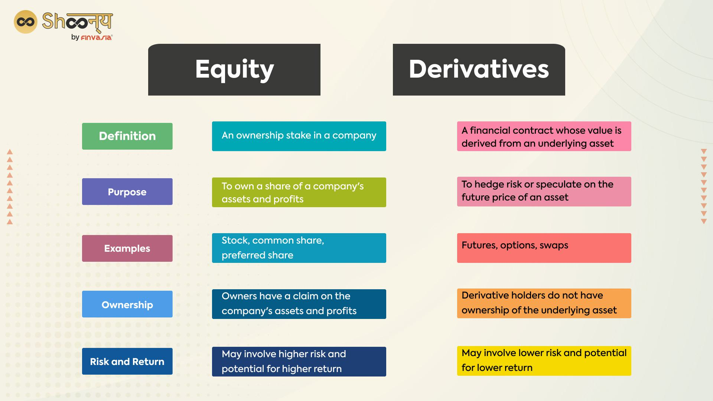

## Table of Contents

## What are equity derivatives?

Equity derivatives are financial instruments whose value is based on the price of stocks or stock indexes. They allow investors to bet on the future direction of stock prices without actually owning the stocks themselves. Common types of equity derivatives include options, futures, and swaps. These instruments can be used for various purposes, such as hedging against potential losses, speculating on price movements, or gaining exposure to the stock market with less capital.

Options, for example, give the buyer the right, but not the obligation, to buy or sell a stock at a specific price within a certain time frame. Futures contracts, on the other hand, are agreements to buy or sell a stock at a set price on a future date. Both of these tools can be used to manage risk or to take advantage of expected price changes. Equity derivatives are popular among investors because they offer flexibility and can be tailored to meet specific investment goals and risk tolerance levels.

## What is the purpose of using equity derivatives?

Equity derivatives are used for several main reasons. One big reason is to manage risk. Imagine you own a bunch of stocks, but you're worried their prices might go down. You can use equity derivatives like options to protect yourself. By buying an option, you can lock in a price to sell your stocks later, even if the market drops. This way, you don't lose as much money. It's like buying insurance for your stocks.

Another reason people use equity derivatives is to make money by guessing how stock prices will move. This is called speculation. For example, if you think a stock's price will go up, you can buy a future contract or an option that will be worth more if you're right. You don't need to own the actual stock, which means you can make big bets with less money. It's a way to try to earn more, but it's also riskier because you could lose money if you guess wrong.

## What are the common types of equity derivatives?

The most common types of equity derivatives are options, futures, and swaps. Options are like a special kind of bet on stocks. You can buy an option that gives you the right to buy or sell a stock at a certain price before a certain date. You don't have to do it if you don't want to, but it's useful if you think the stock price will go up or down a lot. Futures are a bit different. When you buy a futures contract, you agree to buy or sell a stock at a set price on a specific date in the future. It's like making a promise to trade the stock later, no matter what happens to the price.

Swaps are another type of equity derivative. They are more complicated and usually used by big investors or companies. With a swap, two parties agree to exchange cash flows based on stock prices. For example, one might pay based on the performance of a stock, while the other pays a fixed amount. This can help manage risk or take advantage of different market conditions. Each of these types of equity derivatives can be used to either protect against losses or to try to make money by betting on how stock prices will change.

## How do equity options work?

Equity options are like a special kind of bet you can make on stocks. When you buy an option, you're buying the right to do something with a stock in the future, but you don't have to do it if you don't want to. There are two main types of options: calls and puts. A call option gives you the right to buy a stock at a certain price before a certain date. If you think the stock's price will go up, you might buy a call option. A put option gives you the right to sell a stock at a certain price before a certain date. If you think the stock's price will go down, you might buy a put option.

When you buy an option, you pay a price called the premium. This is like the cost of the bet. If the stock's price moves in the way you expected, you can make money by using your option. For example, if you bought a call option and the stock's price goes up, you can buy the stock at the lower price you locked in with your option and then sell it at the higher market price. If the stock's price doesn't move the way you thought, you don't have to use your option, and you only lose the premium you paid. This makes options a flexible way to bet on stocks without having to buy the actual stock.

## What are equity futures and how are they used?

Equity futures are like a promise to buy or sell a stock at a certain price on a specific date in the future. When you buy an equity future, you're agreeing to buy the stock at that future date, no matter what happens to the stock's price between now and then. If you think the stock's price will go up, you might buy a future to lock in the lower price now. If you think the price will go down, you might sell a future to lock in the higher price now.

People use equity futures for different reasons. One big reason is to protect against losses, which is called hedging. For example, if you own a stock and you're worried its price might drop, you can sell a future on that stock. This way, if the stock's price does go down, you can still sell it at the higher price you locked in with the future. Another reason people use equity futures is to try to make money by guessing how stock prices will move, which is called speculating. If you guess right, you can buy or sell the stock at a better price than the market and make a profit. But if you guess wrong, you could lose money.

## What is the difference between equity swaps and equity options?

Equity swaps and equity options are both types of equity derivatives, but they work in different ways. An equity swap is like a deal between two people where they agree to exchange cash flows based on stock prices. One person might pay based on how well a stock does, while the other pays a fixed amount. It's like betting on how a stock will perform without actually owning it. Swaps are often used by big investors or companies to manage risk or take advantage of market changes.

On the other hand, an equity option gives you the right, but not the obligation, to buy or sell a stock at a certain price before a certain date. There are two types: a call option, which lets you buy the stock, and a put option, which lets you sell it. When you buy an option, you pay a fee called the premium. If the stock's price moves the way you expect, you can use the option to make money. If it doesn't, you can just let the option expire and only lose the premium you paid. Options are popular because they give you flexibility and can be used for both protecting against losses and trying to make profits.

## How do equity derivatives impact the stock market?

Equity derivatives can have a big effect on the stock market. They let people bet on how stock prices will move without actually buying the stocks. This can make the stock market more active because more people are trading, even if they're not buying or selling real stocks. For example, if lots of people buy options or futures thinking a stock's price will go up, it can push the price up because it shows that many people believe in the stock's future.

On the other hand, equity derivatives can also make the stock market more risky. Because they let people make big bets with less money, the market can become more volatile. If a lot of people are betting on a stock and they all decide to sell their derivatives at the same time, it can cause the stock's price to drop quickly. This can lead to big swings in stock prices, which can be good for some investors but bad for others who might lose money because of the sudden changes.

## What are the risks associated with trading equity derivatives?

Trading equity derivatives can be risky because they let you make big bets with less money. This means you could make a lot of money if you guess right about how stock prices will move, but you could also lose a lot if you guess wrong. For example, if you buy an option and the stock's price doesn't go the way you thought, you could lose all the money you paid for the option. This is called the premium, and it's like the cost of your bet. Because of this, trading equity derivatives can be like gambling, and it's important to understand the risks before you start.

Another risk is that equity derivatives can make the stock market more unpredictable. When a lot of people are trading derivatives, it can cause big swings in stock prices. If everyone decides to sell their derivatives at the same time because they think the stock's price will go down, it can make the price drop quickly. This can be good for some traders who make money from the big changes, but it can be bad for others who might lose money because of the sudden drops. So, while equity derivatives can be a useful tool, they also add a layer of risk to the stock market.

## How can equity derivatives be used for hedging?

Equity derivatives can be used for hedging to protect against losses. Imagine you own a stock and you're worried its price might go down. You can use an equity derivative like an option to hedge your risk. For example, if you buy a put option, you get the right to sell your stock at a certain price, even if the market price drops lower. This means you can limit your losses because you're guaranteed to sell at the higher price you locked in with the option. It's like buying insurance for your stock.

Another way to hedge with equity derivatives is by using futures. If you own a stock and you're concerned about a price drop, you can sell a future on that stock. This means you agree to sell the stock at a set price on a future date. If the stock's price does go down, you can still sell it at the higher price you locked in with the future. This helps you manage your risk because you know you won't lose as much money if the stock's price falls. Both options and futures are useful tools for protecting your investments from unexpected market changes.

## What are advanced strategies for using equity derivatives?

Advanced strategies for using equity derivatives often involve combining different types of derivatives to create specific outcomes. One common strategy is called a "straddle," where you buy both a call option and a put option on the same stock with the same expiration date and strike price. This strategy can be useful if you think a stock's price will move a lot but you're not sure which way. If the stock's price goes up a lot, you can use the call option to make money. If it goes down a lot, you can use the put option. The downside is that you have to pay for both options, so the stock's price needs to move a lot for you to make a profit.

Another advanced strategy is called "delta hedging." This involves using options to balance out the risk of owning a stock. If you own a stock and you're worried about its price going down, you can buy put options to protect yourself. The tricky part is figuring out how many options to buy. The "delta" of an option tells you how much the option's price will change if the stock's price changes. By using the right number of options, you can create a hedge that helps protect your stock from price drops. This strategy is more complicated but can be very effective for managing risk.

## How do regulatory frameworks affect equity derivatives markets?

Regulatory frameworks play a big role in how equity derivatives markets work. They set rules that everyone has to follow to make sure the markets are fair and safe. For example, regulators might require that people trading derivatives have enough money to cover their bets. This helps prevent big losses that could hurt the whole market. Regulators also make sure that people have all the information they need to make good choices. They might require companies to report details about their derivatives trades, so everyone knows what's going on.

These rules can affect how active the equity derivatives market is. If the rules are too strict, some people might not want to trade because it's too hard or expensive. But if the rules are too loose, it could lead to problems like fraud or big market crashes. So, finding the right balance is important. Regulators often change the rules over time to keep up with new ways of trading and to make sure the market stays safe and fair for everyone.

## What are the latest trends and innovations in equity derivatives?

One of the latest trends in equity derivatives is the increasing use of technology, like [artificial intelligence](/wiki/ai-artificial-intelligence) and [machine learning](/wiki/machine-learning). These tools help traders make better guesses about how stock prices will move. For example, AI can look at a lot of data quickly and find patterns that humans might miss. This can help traders decide when to buy or sell options or futures. Another trend is the growth of electronic trading platforms. These platforms make it easier for more people to trade derivatives because they can do it online from anywhere, instead of having to call a broker.

Another innovation is the development of new types of equity derivatives. For example, some companies now offer "structured products" that combine options with other investments. These products can be tailored to meet specific investment goals, like making money if the stock market stays the same or goes down a little bit. Also, there's a trend toward more "environmental, social, and governance" ([ESG](/wiki/esg-investing)) derivatives. These let people bet on how companies will do based on how well they follow certain ethical standards. This shows how equity derivatives are changing to meet new needs and ideas in the market.

## How can one integrate algo trading with equity derivatives?

Integrating [algorithmic trading](/wiki/algorithmic-trading) with equity derivatives significantly refines the execution of trading strategies, achieving enhanced precision and reduced transaction costs. By leveraging algorithmic systems, investors can respond swiftly to market demands, automatically adjusting their portfolios in real-time. This agility is particularly beneficial in maintaining delta-neutral strategies, which aim to hedge against market movements by dynamically adjusting the delta, or the sensitivity of the portfolio’s price to changes in the underlying stock price.

A delta-neutral strategy seeks to balance positive and negative deltas so that the net delta equals zero. In mathematical terms, if $\Delta$ represents the delta of an individual position, a delta-neutral portfolio satisfies:

$$
\sum \Delta_{\text{positions}} = 0
$$

Algorithmic trading systems meticulously calculate and execute trades to maintain this balance amidst fluctuating market conditions, ensuring that portfolios remain insulated from price [volatility](/wiki/volatility-trading-strategies).

Moreover, the integration of algorithmic trading and equity derivatives enables rapid identification of [arbitrage](/wiki/arbitrage) opportunities. Algorithms can swiftly analyze market data to detect price discrepancies among equity derivatives and their underlying assets. Once an arbitrage opportunity is identified, the algorithm can execute trades with precise timing, capitalizing on the price variance before the market adjusts.

For instance, consider a scenario where an equity option is mispriced relative to the underlying stock. An algorithm can execute simultaneous buy and sell orders to exploit this discrepancy, optimizing financial outcomes by capturing the price differential. The speed and accuracy inherent in algorithmic trading significantly reduce the latency associated with manual trade execution, ensuring that arbitrage opportunities are seized promptly.

Python, widely used for developing trading algorithms, provides libraries such as NumPy and Pandas for array operations and data analysis, and libraries like Zipline or Backtrader for [backtesting](/wiki/backtesting) algorithmic strategies. An example Python snippet for assessing delta neutrality might look like this:

```python
import numpy as np

# Sample data: delta values of portfolios
portfolio_deltas = np.array([0.5, -0.2, -0.3, 0.0])

# Check if the portfolio is delta-neutral
is_delta_neutral = np.isclose(np.sum(portfolio_deltas), 0)

print("Delta-Neutral Status:", is_delta_neutral)
```

Such scripts facilitate the monitoring of delta exposure and adjustment of positions to maintain neutrality. In summary, the convergence of algorithmic trading with equity derivatives empowers investors to execute sophisticated trading strategies with enhanced efficiency and effectiveness, ultimately optimizing their financial performance.

## What are Investment Strategies Utilizing Financial Instruments?

Diversifying investment strategies with the use of financial derivatives can significantly enhance both risk management and return potential. Options, a type of derivative, enable investors to implement strategies that suit varying market conditions and risk appetites. Protective puts and covered calls are among the notable strategies employed to hedge risks and generate income, respectively.

A protective put involves purchasing a put option on a stock that the investor already owns. This strategy acts as a form of insurance, allowing the investor to sell the stock at a predetermined price, thereby limiting potential losses if the stock's market price falls below this level. The put option provides downside protection while retaining the stock's upside potential, albeit at the cost of the option premium.

Conversely, a covered call involves holding a long position in a stock while selling a call option on the same stock. This strategy is used to generate income through the option premium collected from selling the call. If the stock price remains below the call option's strike price, the investor retains the stock and the option premium. However, if the stock price exceeds the strike price, the investor may have to sell the stock at the strike price, potentially capping further gains.

Advanced trading strategies, such as straddles, take advantage of market volatility. A straddle involves purchasing both a call and a put option on the same underlying asset with the same strike price and expiration date. This strategy profits from significant price movements in either direction, making it suitable for volatile markets where substantial price swings are expected. The payoff is both potentially high risk and high reward, as the investor stands to benefit if the asset's price moves drastically, either upward or downward, exceeding the costs of both options.

Mathematically, the payoff for a call option is:

$$
\text{Call Payoff} = \max(0, S_T - K)
$$

where $S_T$ is the stock price at expiration, and $K$ is the strike price. For a put option, the payoff is:

$$
\text{Put Payoff} = \max(0, K - S_T)
$$

These formulas underpin strategies like straddles where both call and put options are utilized. Through strategic manipulation of these derivatives, investors can effectively navigate market fluctuations, demonstrating the depth and flexibility inherent in derivative-based investment strategies.

Such strategic depth emphasizes the importance of understanding market conditions and the individual components of derivatives. This knowledge equips investors with the capability to construct robust portfolios capable of withstanding various market scenarios, proving derivatives to be invaluable tools in modern financial management.

## References & Further Reading

Hull, J. C. (2012). *Options, Futures, and Other Derivatives*. This comprehensive text by John Hull is foundational for understanding the nuances of derivative markets, covering a range of topics from options and futures to risk management strategies.

Johnson, R. (2010). *Algorithmic Trading & DMA: An Introduction to Direct Access Trading Strategies*. Richard Johnson provides insight into direct market access and the intricacies of algorithmic trading. This book outlines strategies for traders looking to optimize their trading performance through technology.

Gomber, P., et al. (2011). *High-frequency trading*. A detailed exploration of high-frequency trading, this work discusses the technological and strategic components that make [HFT](/wiki/high-frequency-trading-strategies) a crucial element of modern financial markets.

Narang, R. (2013). *Inside the Black Box: A Simple Guide to Quantitative and High-Frequency Trading*. Rishi Narang elucidates the inner workings of quantitative and high-frequency trading, offering a clear overview of how these strategies are applied and implemented in the financial sector.

Aldridge, I. (2009). *High-Frequency Trading: A Practical Guide to Algorithmic Strategies and Trading Systems*. Irene Aldridge's guide provides practical insights into the development and execution of algorithmic trading strategies, focusing on the technical aspects of high-frequency systems.

Engle, R. F., & Russell, J. R. (2012). *Analysis of High Frequency Data with Dynamic Conditional Score Models*. Engle and Russell deliver an analytical approach to understanding high-frequency data, utilizing dynamic conditional score models to interpret financial market behaviors effectively.

