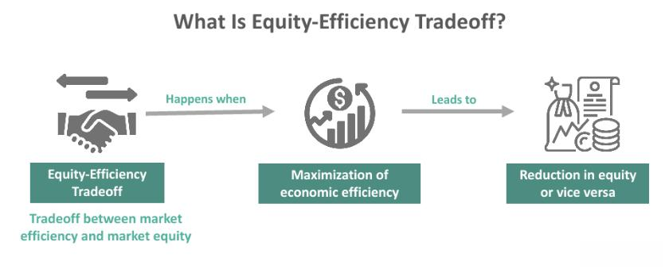

## Table of Contents

## What is the equity-efficiency tradeoff?

The equity-efficiency tradeoff is about balancing fairness and productivity in an economy. Imagine you have a pie to share among friends. Equity means making sure everyone gets a fair slice, while efficiency means making the pie as big as possible. Sometimes, trying to make the pie bigger (efficiency) can lead to some people getting bigger slices than others, which might not seem fair (equity).

For example, if a government decides to tax the rich more to give to the poor, it might make things more equal, but it could also make the rich less motivated to work hard and create wealth. On the other hand, if the government focuses only on making the economy grow without worrying about fairness, the rich might get richer, but the poor might not see much benefit. So, policymakers need to find a balance between making the economy grow and making sure everyone gets a fair share.

## Why is the equity-efficiency tradeoff important in economics?

The equity-efficiency tradeoff is important in economics because it helps us understand how to balance fairness and growth in society. Imagine you're trying to make everyone happy with how resources are shared. If you focus too much on making sure everyone gets an equal share (equity), you might end up slowing down the economy because people who could create more wealth might not be motivated to do so. On the other hand, if you only care about growing the economy as fast as possible (efficiency), some people might end up with much more than others, which can lead to inequality and unhappiness.

This tradeoff is crucial for policymakers because they need to make decisions that affect everyone. For example, if a government decides to raise taxes on the rich to help the poor, it might make things more fair, but it could also make the rich less likely to invest or work hard, which could slow down economic growth. Finding the right balance is tricky but important because it affects how well the economy works and how fair people feel their society is.

## Can you explain the basic concepts of equity and efficiency?

Equity is about fairness. It means making sure that everyone gets a fair share of resources and opportunities. Imagine you and your friends are sharing a pizza. If you cut the pizza into equal slices and make sure everyone gets the same amount, that's equity. In society, this can mean things like equal pay for equal work, access to good education for all, and making sure everyone has what they need to live a good life. It's about reducing differences between people so that everyone has a similar chance to succeed.

Efficiency, on the other hand, is about making the most out of what you have. It's about growing the economy and making it work as well as possible. Think of it like trying to make the biggest pizza you can with the ingredients you have. In an economy, this means using resources in a way that creates the most value. For example, a business might be efficient if it can produce more goods with less waste. Efficiency is important because it helps the economy grow and can lead to more wealth for everyone, but it doesn't always mean that wealth is shared equally.

## What are some common causes of the equity-efficiency tradeoff?

One common cause of the equity-efficiency tradeoff is how taxes are set up. If a government decides to tax the rich more to help the poor, it might make things more fair. But, it could also make the rich less motivated to work hard or invest. They might feel like they're not getting enough reward for their efforts, so they might not try as hard to create new businesses or jobs. This could slow down the economy, making it less efficient.

Another cause is how public services like education and healthcare are funded. If the government spends a lot to make sure everyone can go to school or get medical care, it can help make things more equal. But, this spending has to come from somewhere, usually taxes. If taxes go up to pay for these services, it might make people and businesses less willing to work or invest. This can lead to slower economic growth, which means the economy might not be as efficient as it could be.

Sometimes, regulations can also cause a tradeoff between equity and efficiency. For example, laws that protect workers' rights or the environment can help make things fairer and safer. But, these rules can also make it more expensive or harder for businesses to operate. This might mean fewer jobs or less investment, which can slow down the economy and make it less efficient. Finding the right balance is tough but important for making sure everyone benefits from economic growth.

## How does government policy influence the equity-efficiency tradeoff?

Government policy can have a big impact on the equity-efficiency tradeoff. When the government makes rules about taxes, spending, and regulations, it's trying to find a balance between making things fair for everyone and keeping the economy growing. For example, if the government decides to tax rich people more to help the poor, it might make things more equal. But, if rich people feel like they're being taxed too much, they might not want to work as hard or start new businesses. This could slow down the economy, making it less efficient.

Another way government policy affects the tradeoff is through spending on public services like schools and hospitals. If the government spends a lot to make sure everyone can get a good education or healthcare, it can help make things more fair. But, this spending has to come from somewhere, usually taxes. If taxes go up to pay for these services, people and businesses might not want to work or invest as much. This can slow down economic growth, making the economy less efficient. So, when making policies, governments need to think carefully about how to balance fairness and growth.

## What are some historical examples where the equity-efficiency tradeoff was evident?

One historical example of the equity-efficiency tradeoff was during the New Deal in the United States in the 1930s. President Franklin D. Roosevelt introduced many programs to help people who were struggling during the Great Depression. These programs, like Social Security and public works projects, aimed to make things more fair by giving people jobs and support. But, some people worried that these programs might slow down the economy because businesses had to pay more taxes to fund them. They thought that high taxes might make businesses less likely to invest and grow, which could hurt economic efficiency.

Another example can be seen in the policies of Margaret Thatcher in the United Kingdom during the 1980s. Thatcher believed in reducing government spending and cutting taxes to make the economy more efficient. She thought that by giving businesses more freedom and money to invest, the economy would grow faster. However, these policies also led to more inequality, as the rich got richer while many people struggled. This showed a clear tradeoff between making the economy more efficient and keeping things fair for everyone.

## How do different economic systems approach the equity-efficiency tradeoff?

In a capitalist system, the focus is often on efficiency. Capitalism believes that if people and businesses are free to make money and invest, the economy will grow faster. This can lead to a lot of wealth being created, but it can also mean that some people get very rich while others don't do as well. Governments in capitalist countries might try to balance this by taxing the rich more and using that money to help the poor, like through welfare programs. But, if taxes are too high, it might make the rich less motivated to work hard, which could slow down the economy. So, capitalist countries are always trying to find the right balance between letting the economy grow and making sure everyone gets a fair share.

In a socialist system, the focus is more on equity. Socialism believes that the government should play a big role in making sure everyone has what they need. This might mean the government owns businesses and decides how to share the wealth more equally. By doing this, socialist countries try to make things fairer for everyone. But, if the government controls too much, it might not be as good at making the economy grow as fast as it could. Businesses might not be as motivated to innovate or work hard if they don't get to keep the profits. So, socialist countries also face the challenge of balancing fairness with keeping the economy running efficiently.

Some countries try to mix elements of both systems, creating what's called a mixed economy. In a mixed economy, the government might own some businesses and provide services like healthcare and education, while still allowing private businesses to operate and grow. This approach tries to get the best of both worlds - the efficiency of capitalism and the equity of socialism. However, finding the right mix is tricky. If the government does too much, it might slow down the economy, but if it does too little, people might feel that things are unfair. So, even in mixed economies, the equity-efficiency tradeoff is always a big challenge.

## What are the ethical considerations involved in the equity-efficiency tradeoff?

When we talk about the equity-efficiency tradeoff, we're also talking about what's right and wrong. It's about deciding if it's more important to make sure everyone gets a fair share, or if we should focus on making the economy grow as fast as possible. Some people think that fairness is the most important thing. They believe that everyone should have the same chances and that it's wrong for some people to have a lot more than others. They might argue that it's not fair for the rich to get richer while the poor stay poor, even if the economy is growing.

Others think that growing the economy is more important. They believe that if we focus on efficiency, everyone will be better off in the long run. They might say that it's okay if some people get richer because that wealth can create more jobs and help the economy grow. But, they also know that too much inequality can cause problems, like making people unhappy or causing social unrest. So, they think we should find a way to balance growing the economy with making sure everyone gets a fair share.

Finding the right balance between equity and efficiency is hard because it involves making tough choices. Governments have to decide how much to tax the rich and how much to spend on helping the poor. They have to think about what's fair, but also what will help the economy grow. It's a big challenge, but it's important because these decisions affect everyone's lives.

## How can the equity-efficiency tradeoff be measured and analyzed?

Measuring and analyzing the equity-efficiency tradeoff involves looking at different parts of the economy and society. Economists use tools like the Gini coefficient to measure how equal or unequal the distribution of income is. A lower Gini coefficient means more equity, while a higher one means more inequality. To measure efficiency, economists look at things like GDP growth, productivity, and how well resources are used. By comparing these measures, they can see how changes in policy affect both equity and efficiency. For example, if a new tax policy makes the economy grow faster but also increases inequality, it shows a clear tradeoff.

Analyzing the tradeoff also involves looking at data over time and across different countries. Economists might study how different policies have worked in the past to see what balance between equity and efficiency works best. They can use statistical models to predict how new policies might affect both equity and efficiency. This helps policymakers make better decisions. For example, if a country wants to reduce inequality, they might look at how other countries have done it and what effects it had on their economy. By understanding these patterns, they can make choices that help balance fairness and growth.

## What are the long-term implications of prioritizing either equity or efficiency?

If a country focuses too much on equity, it might make things fairer for everyone in the short term. People might feel happier because they have what they need to live a good life. But, if the government spends a lot of money to make things equal, it might have to raise taxes a lot. High taxes could make businesses and rich people less motivated to work hard or invest in new things. This could slow down the economy over time, making it harder for everyone to get richer in the long run. So, while focusing on equity might help now, it could hurt the economy later.

On the other hand, if a country focuses too much on efficiency, the economy might grow really fast. This could mean more jobs and more wealth for everyone. But, if the focus is only on growing the economy, some people might get left behind. The rich might get richer, while the poor don't see much benefit. This could lead to a lot of inequality, which can make people unhappy and cause social problems. Over time, too much inequality might even slow down the economy because people feel like things are unfair. So, while focusing on efficiency might help the economy grow now, it could cause problems later if it's not balanced with fairness.

## How do advancements in technology affect the equity-efficiency tradeoff?

Advancements in technology can make the economy more efficient by helping businesses do more with less. For example, new machines and computers can make factories produce more goods faster and with fewer workers. This can help the economy grow because businesses can make more money and create more jobs. But, technology can also make things less fair. If only big companies can afford new technology, they might get richer while smaller businesses struggle to keep up. Also, if machines take over jobs that people used to do, some workers might lose their jobs and have a harder time finding new ones. So, while technology can help the economy grow, it can also make things less equal.

To balance this, governments might need to make policies that help everyone benefit from new technology. For example, they could spend money on education to help people learn new skills for jobs that technology creates. They could also make rules to make sure that new technology is shared more fairly among businesses. By doing this, governments can try to make sure that technology helps the economy grow without making things too unfair. It's a tricky balance, but it's important for making sure everyone can benefit from new advancements.

## What are some cutting-edge theories or models used to study the equity-efficiency tradeoff?

One cutting-edge theory used to study the equity-efficiency tradeoff is called the "Capabilities Approach," developed by economists like Amartya Sen and Martha Nussbaum. This theory looks at what people are actually able to do and be, rather than just how much money they have. It says that a society should focus on giving everyone the chance to live a good life, by providing things like education, healthcare, and a safe place to live. By focusing on these "capabilities," the theory tries to balance making the economy grow with making sure everyone has a fair chance to benefit from that growth. It's a way of thinking about equity and efficiency that goes beyond just money and looks at people's real lives.

Another model that's getting a lot of attention is the "Doughnut Economics" model, created by Kate Raworth. This model imagines the economy as a doughnut, with a hole in the middle and a thick ring around it. The hole represents the minimum people need to live a good life, like food, water, and shelter. The ring is the space where the economy can grow without hurting the planet. The idea is to keep the economy within this ring - growing enough to give everyone what they need, but not so much that it harms the environment or creates too much inequality. This model tries to balance equity and efficiency by making sure everyone's basic needs are met while also keeping the economy sustainable.

## What are examples of efficiency tradeoffs in equity trading?

High-frequency trading ([HFT](/wiki/high-frequency-trading-strategies)) firms provide a clear illustration of the equity-efficiency tradeoff, as these entities prioritize speed of execution, often at the cost of equitable market access. High-frequency trading leverages advanced algorithms and high-speed data networks to execute orders at lightning-fast speeds, providing a significant advantage over traditional trading methods. This speed advantage, however, frequently leads to disparities between institutional traders and individual retail investors.

One obvious example is how market makers in high-frequency trading can benefit from the rapid execution of trades, which allows them to capture price discrepancies almost instantaneously. Market makers provide [liquidity](/wiki/liquidity-risk-premium) to the market by buying and selling securities, but their advantage in speed can lead to situations where slower retail participants cannot compete effectively. This disparity is exacerbated during events of market [volatility](/wiki/volatility-trading-strategies), where the ability to execute trades swiftly can significantly impact financial outcomes.

The prioritization of execution speed over equitable access can be quantitatively expressed by comparing execution times. For instance, if a high-frequency trader can execute a trade in microseconds while a retail trader requires milliseconds, the disparity can be depicted as:

$$
\text{Speed Advantage (SA)} = \frac{\text{Execution Time (Retail)}}{\text{Execution Time (HFT)}}
$$

Such a significant speed advantage allows high-frequency traders to capture market opportunities before slower participants, skewing the distribution of profits toward faster, technologically advanced firms.

Redistribution of trading technology access is a potential solution to balance this tradeoff. By democratizing access to advanced trading technologies and data, retail traders could compete more fairly with institutional investors. Initiatives could include reducing costs for trading technology or mandating brokerages to offer advanced trading tools to a broader range of clients.

One practical example of the equity-efficiency tradeoff is the "Flash Crash" incident of May 6, 2010. During this event, [algorithmic trading](/wiki/algorithmic-trading) systems and HFT exacerbated market volatility, leading to a rapid loss and subsequent recovery of nearly $1 trillion in market value. The incident highlighted how the efficiency of speed can lead to extreme and sometimes destabilizing outcomes in financial markets, particularly when equitable access to market-moving information and execution capabilities is unequal.

In summary, the equity-efficiency tradeoff in algorithmic trading presents tangible impacts on market participants, with high-frequency trading firms often gaining an unequal advantage. Addressing these disparities involves rethinking access to trading technologies to ensure a level playing field, thereby promoting fairness and market integrity.

## References & Further Reading

[1]: Hendershott, T., Jones, C. M., & Menkveld, A. J. (2011). ["Does Algorithmic Trading Improve Liquidity?"](https://onlinelibrary.wiley.com/doi/full/10.1111/j.1540-6261.2010.01624.x) The Review of Financial Studies, 24(3), 834-859.

[2]: Baron, M., Brogaard, J., Hagströmer, B., & Kirilenko, A. (2019). ["Risk and Return in High-Frequency Trading."](https://www.cb.cityu.edu.hk/ef/doc/GRU/HFT%202017/Brogaard_HFT_risk_return_20170825.pdf) The Journal of Finance, 74(5), 2871-2907.

[3]: ["Advances in Financial Machine Learning"](https://www.amazon.com/Advances-Financial-Machine-Learning-Marcos/dp/1119482089) by Marcos Lopez de Prado

[4]: Aldridge, I. (2013). ["High-Frequency Trading: A Practical Guide to Algorithmic Strategies and Trading Systems."](https://www.amazon.com/High-Frequency-Trading-Practical-Algorithmic-Strategies/dp/1118343506) Wiley Finance.

[5]: Preda, A. (2017). ["Noise: Living and Trading in Electronic Finance."](https://academic.oup.com/chicago-scholarship-online/book/21673) University of Chicago Press.