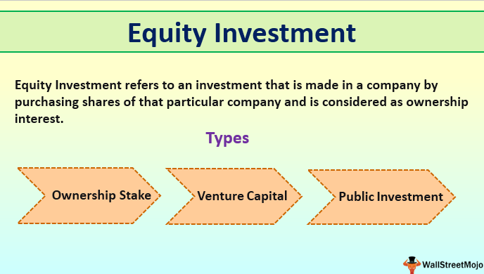

Investing in equity funds is a popular avenue for beginners seeking to diversify their financial portfolios. These funds allow individuals to pool resources with other investors to buy stocks, thereby offering an accessible entry point into the stock market. By investing in a variety of stocks within a fund, investors enjoy the benefits of diversification and professional management without needing in-depth knowledge of individual stock picking.

This article serves as a comprehensive guide for those new to equity funds and algorithmic trading, equipping them with the necessary insights to navigate these investment landscapes. Understanding the basic structure and mechanisms of equity funds, as well as the different types available, is crucial. Furthermore, we introduce algorithmic trading—a modern approach leveraging technology to execute trades efficiently based on pre-set criteria or algorithms.

By the conclusion of this article, readers will possess the foundational knowledge required to embark on their investment journey using these tools. Whether interested in long-term wealth accumulation or leveraging technology in trading, this guide aims to empower novices with the strategies and information needed to make informed decisions.

## Table of Contents

## What Are Equity Funds?

Equity funds, often referred to as stock funds, are a type of investment fund that allocates a major portion of its assets to stocks. By pooling money from multiple investors, these funds allow individuals to access a diversified portfolio of equities, managed professionally by financial experts. This collective investment scheme facilitates easier entry into the stock market, particularly for those who may lack the time, expertise, or substantial capital necessary to manage a portfolio independently.

Equity funds can be categorized as either actively or passively managed. Actively managed funds rely on professional fund managers to select stocks with the goal of outperforming a specific benchmark or index. This involves continuous analysis and decision-making based on the market, economic indicators, and company performance. The expertise of fund managers is leveraged to potentially achieve higher returns, although there is no guarantee of outperforming the market due to inherent market risks.

Passively managed funds, on the other hand, aim to replicate the performance of a specific index, such as the S&P 500. These funds generally involve lower management fees since they require less frequent trading and analysis, and are often referred to as index funds. They offer investors a cost-effective way to gain broad market exposure.

The key advantage of equity funds lies in their ability to offer diversification. By investing in a wide range of stocks across various sectors and geographies, equity funds reduce the unsystematic risk associated with individual companies. This diversification can mitigate potential losses from poor-performing stocks.

Equity funds also provide the opportunity for long-term capital growth, as stocks have historically outperformed other asset classes like bonds or cash over extended periods. However, this potential for higher returns comes with increased [volatility](/wiki/volatility-trading-strategies), as stock prices can fluctuate due to market conditions, economic changes, or company-specific events.

Investors in equity funds can align their investment strategies with their financial goals and risk tolerance. For instance, those with a higher risk tolerance might opt for funds that invest in small-cap stocks with high growth potential, while conservative investors might prefer funds that focus on large-cap, stable companies. Additionally, equity funds can be tailored to specific investment themes or sectors, creating further customization opportunities for investors.

Overall, equity funds serve as a versatile investment tool catering to various investor needs, offering both professional management and the potential for significant returns, while also inherent with the risks typical of stock market investments.

## Types of Equity Funds

Equity funds are versatile financial instruments catering to various investor needs. They can be classified based on management style, market capitalization, investment style, sector focus, and geographical concentration, allowing investors to tailor their portfolios to specific objectives.

**Actively Managed vs. Passively Managed Funds**

Actively managed equity funds involve fund managers making buy and sell decisions to outperform specific benchmarks. These can appeal to investors seeking potentially higher returns, albeit at the cost of higher fees due to the extensive research and analysis involved. In contrast, passively managed funds, often structured as index funds, aim to replicate the performance of a market index such as the S&P 500. These funds typically offer lower expense ratios, making them attractive to cost-conscious investors.

**Market Capitalization: Large-Cap, Mid-Cap, and Small-Cap Funds**

Equity funds can also be classified by the market capitalization of the companies they invest in:

- **Large-cap funds** target established companies with a high market capitalization, usually providing stability and consistent returns.
- **Mid-cap funds** invest in companies with medium market capitalization, offering a blend of growth potential and stability.
- **Small-cap funds** focus on companies with lower market capitalization, presenting higher growth potential but also increased risk and volatility.

**Investment Styles: Growth, Value, and Blend Funds**

- **Growth funds** emphasize companies expected to grow at an above-average rate. They may offer substantial returns but often come with higher risk.
- **Value funds** invest in companies perceived to be undervalued relative to their intrinsic worth. These funds can suit investors looking for stability and income, potentially with a lower risk profile.
- **Blend funds** combine growth and value investment styles, catering to investors seeking a balanced approach.

**Sector and Geographically Focused Funds**

- **Sector funds** concentrate investments in specific industries such as technology, healthcare, or finance. These funds allow investors to capitalize on the potential growth of particular market segments but can carry higher risk due to lack of diversification.
- **Geographically focused funds** invest in specific regions or countries, like emerging markets or developed nations, enabling investors to exploit economic trends in different parts of the world.

**Alignment with Personal Goals**

These varied classifications of equity funds allow investors to align their investment strategies with personal financial goals, risk tolerance, and market perspectives. Whether focusing on growth potential or stability, equity funds offer a range of options to cater to diverse investment preferences.

## Benefits and Risks of Investing in Equity Funds

Investing in equity funds offers a range of benefits that appeal to many investors, particularly those seeking diversification and professional management. By pooling resources from numerous investors, equity funds facilitate access to a diversified portfolio of stocks that individual investors might find challenging to assemble on their own. This diversification helps in mitigating risk, as the performance of the fund is not reliant on a single stock or sector. Professional fund managers oversee these equity funds, employing their expertise to make informed investment decisions while adapting to market changes. This professional management can be particularly beneficial for beginners or investors without the time to manage investments full-time.

Equity funds also provide potential growth opportunities. Historically, equities have offered higher long-term returns compared to other asset classes such as bonds or cash equivalents. This potential for higher returns is a significant draw for investors who are willing to accept some level of volatility in order to achieve growth objectives over time.

Investors must also consider the risks associated with equity funds. Market volatility is a common risk, as equity values can fluctuate due to factors like economic conditions, interest rates, and company performance. While diversification helps mitigate some of this risk, it does not eliminate it. Additionally, management fees can impact the returns of equity funds. Investors should scrutinize the expense ratios of funds, as higher fees can erode net returns over time.

Balancing risk and reward is crucial. Diversification across different types of equity funds—such as large-cap, mid-cap, and international funds—can help manage risk while pursuing growth. This diversification strategy aims to create a blended portfolio that reflects the investor's risk tolerance and financial objectives.

Tax implications are another vital aspect of investing in equity funds. Investors may face taxes on capital gains distributions and dividends. Implementing tax-efficient strategies, such as holding funds in tax-advantaged accounts or utilizing tax-loss harvesting, can help minimize tax impacts on returns.

Informed decision-making is key for successful investing in equity funds. Investors should conduct comprehensive research, analyzing fund performance, management styles, and expense ratios. Utilizing tools like investment screeners and consulting with financial advisors can further assist in making well-informed choices that align with individual financial goals. By understanding both the benefits and risks, investors can harness equity funds to build a robust investment portfolio.

## How to Invest in Equity Funds

Investing in equity funds requires a strategic approach to align with your financial goals. The first step is to clearly define your investment objectives, which might include capital appreciation, income generation, or risk mitigation. Once your objectives are established, select the right type of equity fund that aligns with these goals. Various categories, such as large-cap, mid-cap, or small-cap funds, offer different risk and return profiles, allowing you to choose based on your risk appetite and market outlook.

Conducting thorough research is crucial before committing your capital. Analyze potential funds by reviewing fund prospectuses, which detail the fund’s objectives, strategies, risks, and fees. Financial reports, including performance histories and market analyses, provide insights into a fund's past performance and potential future prospects. These documents help assess a fund manager’s competence and the fund’s alignment with your objectives.

To begin investing, you will need to open an investment account with a financial institution. This process typically involves filling out an application form, submitting identity verification documents, and possibly undergoing an investor suitability assessment. Online brokerage platforms simplify this process, providing an array of investment options and tools to facilitate your decisions.

Regular portfolio monitoring and rebalancing are essential practices to maintain alignment with your objectives. Market fluctuations and relative performance of asset classes might cause deviations from your intended asset allocation. Periodic rebalancing, which involves buying and selling portions of your holdings, ensures your portfolio remains diversified according to your risk tolerance and investment goals.

Fund screeners, available on many financial websites and brokerage platforms, assist in narrowing down fund choices by filtering based on criteria such as performance, fees, and asset size. Online brokerages also enable easy access to a wide range of funds and offer features like automated investment services and robo-advisors, which can provide personalized investment advice based on algorithms.

By following these steps, you equip yourself with the knowledge and tools necessary to effectively invest in equity funds, optimizing your chances for achieving your financial goals.

 to Algorithmic Trading for Beginners

Algorithmic trading, often referred to as algo trading, involves using computer programs to execute trades at speeds and frequencies impossible for human traders. This form of trading has become increasingly popular among equity fund investors due to its ability to process large volumes of data and make trading decisions within milliseconds. These automated systems utilize pre-programmed instructions based on various factors such as timing, price, and [volume](/wiki/volume-trading-strategy), to capitalize on rapid market movements.

The technologies behind [algorithmic trading](/wiki/algorithmic-trading) are grounded in computer science and financial market expertise. At its core, it uses algorithms designed to identify trading opportunities, manage risk, and maximize returns. Technologies like [artificial intelligence](/wiki/ai-artificial-intelligence) and [machine learning](/wiki/machine-learning) are increasingly being integrated into these systems, allowing them to learn from past trades and improve strategies. These systems can process a multitude of market indicators ensuring that trades are executed at the most opportune moments, thereby potentially increasing the efficiency and profitability of investment decisions.

Swift execution of trades is one of the principal advantages of algorithmic trading. The ability to place thousands of orders simultaneously across different markets enables investors to take advantage of fleeting opportunities that could be easily missed by human traders. Additionally, algorithms can be programmed for optimal execution, ensuring trades are executed at the best possible prices with minimal market impact.

Setting up an algorithmic trading system involves defining a strategy based on historical data analysis and simulations. The process typically includes identifying patterns or market inefficiencies, developing an algorithm, [backtesting](/wiki/backtesting) it against historical market data, and adjusting it to improve performance. Once refined, the algorithm is implemented on a trading platform where it can execute trades automatically based on predefined criteria.

Despite its advantages, algorithmic trading also carries potential risks. Technical failures such as system outages or programming errors can lead to significant financial losses. Algorithms that are not properly designed or monitored can make erroneous trades, exacerbating market instability. Moreover, the highly competitive nature of algo trading requires constant updates and vigilance to maintain an edge.

In conclusion, while algorithmic trading offers significant benefits in terms of speed and efficiency, it also necessitates a solid understanding of both the technology and the financial markets. Caution, ongoing monitoring, and employing protective measures are necessary to mitigate risks and leverage the full potential of algorithmic trading for equity fund investments.

## FAQs

### FAQs

**What is the difference between equity funds and income funds?**

Equity funds and income funds are both types of mutual funds, but they differ primarily in their investment goals and the types of securities they hold. Equity funds aim to generate growth by investing predominantly in stocks, providing capital appreciation over the long term. In contrast, income funds focus on generating regular income for investors, primarily through interest or dividends, and often invest in bonds and other fixed-income securities. Thus, equity funds might be more suited to investors seeking growth, while income funds cater to those seeking steady income with potentially lower risk.

**How can equity funds be used for retirement planning?**

Equity funds can play a crucial role in retirement planning by offering the potential for substantial growth over the long term, which can help build a sizeable retirement corpus. Individuals can invest a portion of their retirement savings in equity funds to benefit from the historically higher returns associated with equities compared to fixed-income investments. It's important to note, however, that as one approaches retirement, rebalancing the portfolio to include more conservative options, such as bonds, can help protect against market volatility, ensuring that sufficient funds are available during retirement.

**What should beginners look for in an equity fund?**

Beginners should consider several factors when selecting an equity fund, including the fund's historical performance, expense ratio, fund manager's expertise, and investment objective. It's vital to align the fund's strategy with personal financial goals and risk tolerance. Beginners might also prioritize funds with low fees and a consistent track record. Tools like prospectuses and financial reports can provide valuable insights into a fund's potential.

**What are the tax implications of investing in equity funds?**

Investing in equity funds can have tax implications, which vary depending on the jurisdiction but generally include capital gains tax and dividend tax. When an investor sells shares in an equity fund for a profit, the capital gain may be subject to taxes. Additionally, dividends received from the fund can also be taxed. To minimize tax impact, investors can consider tax-efficient funds or strategies such as utilizing tax-advantaged accounts like IRAs or 401(k)s.

**Is algorithmic trading suitable for beginners?**

Algorithmic trading can offer advantages such as swift trade execution and the capability to capitalize on market movements. However, it requires a solid understanding of trading strategies and some technical programming skills. Beginners interested in algorithmic trading should start by learning the basics, perhaps through simulated trading environments, and gradually build their knowledge and skills before committing significant capital. Engaging with qualified financial advisors or leveraging platforms with user-friendly automated trading features can also be beneficial for those just starting.

## Conclusion

Equity funds present an accessible and diversified method for beginners to engage in stock market investing, offering both the expertise of professional management and the benefit of pooled resources. Understanding the spectrum of equity funds, from actively managed funds to those focused on specific market capitalizations or sectors, equips investors to align their strategies with individual financial goals. This tailored approach promotes more personalized investment outcomes and can cater to varied risk tolerances and growth expectations.

The integration of algorithmic trading introduces a modern, technology-driven dimension to investing, allowing for rapid execution of trades and the ability to capitalize on fleeting market opportunities. By leveraging algorithms, investors can execute predetermined trading strategies efficiently, reducing the emotional biases that often affect manual trading.

However, while equity funds and algorithmic trading provide substantial advantages, they also necessitate a thoughtful consideration of associated risks and tax implications. Balancing potential returns with these factors is crucial. Seeking professional guidance to navigate these complexities can significantly enhance investment decisions and performance.

With this comprehensive guide, beginners are empowered to commence their investment journey in equity funds and algorithmic trading with greater confidence and insight. The knowledge gained enables them to navigate the intricate financial landscape effectively, optimizing their investment choices to achieve desired outcomes.

## References & Further Reading

[1]: Jain, P. K. (2020). ["Equity Funds: Concepts and Application."](https://books.google.com/books/about/Financial_Management.html?id=-FakDwAAQBAJ) Pearson Education.

[2]: ["Investing in Equity Funds"](https://www.investopedia.com/terms/e/equityfund.asp) by Thomas Kenny via Investopedia.

[3]: Pring, M. J. (1991). ["Technical Analysis Explained: The Successful Investor's Guide to Spotting Investment Trends and Turning Points."](https://archive.org/details/technicalanalysi00prin) McGraw-Hill Education.

[4]: ["Algorithmic Trading: Winning Strategies and Their Rationale"](https://www.wiley.com/en-us/Algorithmic+Trading%3A+Winning+Strategies+and+Their+Rationale-p-9781118460146) by Ernie Chan

[5]: Seddon, J., & Lowe, J. (2014). ["The Guide to Equity Fund Management."](https://pubmed.ncbi.nlm.nih.gov/25061203/) Harriman House.

[6]: ["The Little Book of Common Sense Investing: The Only Way to Guarantee Your Fair Share of Stock Market Returns"](https://www.amazon.com/Little-Book-Common-Sense-Investing/dp/1119404509) by John C. Bogle

[7]: Narang, R. K. (2013). ["Inside the Black Box: A Simple Guide to Quantitative and High-Frequency Trading."](https://onlinelibrary.wiley.com/doi/book/10.1002/9781118662717) Wiley Trading.

[8]: ["Equity Funds: An Introduction"](https://www.investopedia.com/terms/e/equityfund.asp) via Investing.com.