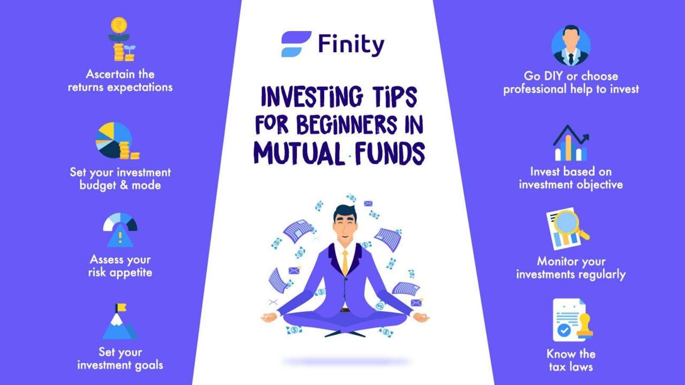

## Table of Contents

## What is an equity fund?

An equity fund is a type of investment fund that mainly invests in stocks or shares of companies. When you put your money into an equity fund, you are essentially buying a small piece of many different companies. This can be a good way to grow your money over time because stocks can increase in value and also pay dividends, which are like small bonuses from the companies.

Equity funds can be a bit risky because the value of stocks can go up and down a lot. However, they also have the potential to give you higher returns compared to safer investments like bonds. By spreading your money across many different stocks, an equity fund can help reduce the risk that comes with investing in just one or a few companies.

## Why should beginners consider investing in equity funds?

Beginners should consider investing in equity funds because they offer a simple way to start investing in the stock market without needing to pick individual stocks. When you invest in an equity fund, you're putting your money into a basket of stocks managed by professionals. This means you don't need to spend a lot of time researching which companies to invest in, which can be overwhelming for someone new to investing.

Another reason beginners might like equity funds is that they help spread out risk. Instead of putting all your money into one or two stocks, an equity fund invests in many different companies. This diversification can protect your money if one company doesn't do well. Over time, equity funds have the potential to grow your money more than keeping it in a savings account, making them a good choice for beginners looking to build wealth over the long term.

## How do equity funds differ from other types of investment funds?

Equity funds are different from other types of investment funds mainly because they focus on investing in stocks. When you put your money into an equity fund, you're buying pieces of many companies. This is different from bond funds, which invest in loans to governments or companies, and money market funds, which invest in safe, short-term investments like government securities. Equity funds can grow your money faster over time, but they also come with more risk because stock prices can go up and down a lot.

Another way equity funds differ from other funds is in how they are managed. Some equity funds are actively managed, which means a person or team picks the stocks they think will do well. This is different from index funds, which are a type of equity fund that automatically invest in all the stocks in a certain market index, like the S&P 500. Index funds usually have lower fees because they don't need a lot of people to manage them, while actively managed funds might have higher fees but aim to beat the market.

So, equity funds are all about stocks, and they can be managed in different ways, which sets them apart from other investment funds like bond funds or money market funds.

## What are the risks associated with equity fund investments?

Investing in equity funds can be risky because the stock market goes up and down a lot. If the market goes down, the value of your investment in an equity fund can drop too. This means you might lose money, especially if you need to take your money out when the market is low. Also, not all companies do well all the time. If a lot of the companies in the fund don't do well, the whole fund can lose value.

Another risk is that even though equity funds are managed by professionals, they can still make bad choices. If the fund manager picks stocks that don't perform well, your investment can suffer. Also, some equity funds charge high fees, and these fees can eat into your returns, making it harder for your investment to grow. So, it's important to think about these risks and maybe talk to a financial advisor before you start investing in equity funds.

## How can beginners start investing in equity funds?

Beginners can start investing in equity funds by first opening a brokerage account. You can do this online with many different companies. Once your account is open, you need to put some money into it. Decide how much you want to invest and transfer that amount from your bank to your brokerage account. After that, you can look for equity funds that match what you want. There are lots of funds to choose from, so you might want to pick one that focuses on a certain part of the market or one that is managed by a company you trust.

When choosing an equity fund, think about your goals and how much risk you're okay with. Some funds are riskier than others because they invest in smaller companies or focus on certain industries. You can start by investing a small amount to see how it goes. Many funds let you start with as little as $100 or even less. Remember, investing in equity funds is for the long term, so be ready to leave your money in the fund for several years to let it grow. If you're not sure, talking to a financial advisor can help you make the best choice for your situation.

## What are the different types of equity funds available to investors?

There are different types of equity funds that investors can choose from, and they are made to fit different needs and goals. One type is growth funds, which invest in companies that are expected to grow a lot in the future. These funds are good if you want your money to grow over time, but they can be risky. Another type is value funds, which invest in companies that are thought to be underpriced. These funds look for good deals and can be less risky than growth funds.

Then there are sector funds, which focus on a specific part of the economy, like technology or healthcare. These can be good if you think a certain industry will do well, but they can also be riskier because they're not spread out across different sectors. There are also index funds, which try to match the performance of a market index like the S&P 500. These funds are usually cheaper to invest in because they don't need a lot of managing. Lastly, there are international or global funds, which invest in companies outside of your home country. These can help you spread your risk but also come with extra risks like changes in currency values.

So, when you're [picking](/wiki/asset-class-picking) an equity fund, think about what you want to achieve and how much risk you're okay with. Each type of fund has its own way of investing and its own level of risk and reward.

## How do you evaluate the performance of an equity fund?

To evaluate the performance of an equity fund, you should look at how well it has done over time. One way to do this is by checking the fund's returns. You can see how much money the fund has made or lost over different periods, like one year, three years, or five years. It's also helpful to compare these returns to a benchmark, like the S&P 500. If the fund does better than the benchmark, it's doing well. But if it does worse, you might want to think about investing in a different fund.

Another thing to consider is the risk the fund takes to get those returns. You can look at something called the standard deviation, which tells you how much the fund's returns go up and down. A higher standard deviation means the fund is riskier. You should also check the fund's expense ratio, which is how much it costs to invest in the fund. Lower fees are better because they don't eat into your returns as much. By looking at these things, you can get a good idea of how well an equity fund is doing and whether it's a good fit for your investment goals.

## What are the costs involved in investing in equity funds?

When you invest in equity funds, you need to know about the costs involved. One main cost is the expense ratio, which is like a yearly fee that the fund charges for managing your money. This fee is a percentage of your investment, and it can range from very low for some index funds to higher for actively managed funds. The expense ratio is taken out of your investment every year, so a lower fee means more of your money stays invested and can grow over time.

Another cost to think about is the sales load, which is a fee you might have to pay when you buy or sell shares of the fund. Not all funds have this fee, but if they do, it can make your investment more expensive. There can also be other smaller costs, like transaction fees if the fund buys and sells a lot of stocks, or account fees if your brokerage charges for managing your account. All these costs can add up, so it's good to look at them closely before you decide to invest in an equity fund.

## How should beginners diversify their equity fund investments?

Beginners should diversify their equity fund investments by spreading their money across different types of funds. This means they should not put all their money into just one kind of equity fund, like a growth fund or a sector fund. Instead, they should think about investing in a mix of funds. For example, they could put some money into a growth fund, some into a value fund, and some into an index fund. This way, if one type of fund doesn't do well, the others might still do okay, and it can help keep their overall investment safer.

Another way to diversify is to look at different sectors and regions. Instead of focusing only on technology companies or just U.S. stocks, beginners can invest in funds that cover a range of industries like healthcare, energy, and finance. They can also choose funds that invest in international markets, like Europe or Asia. By doing this, they're not putting all their eggs in one basket, and it can help protect their money from big ups and downs in any one area. Diversifying like this can take a bit of time to set up, but it's a smart way to manage risk and grow their investments over time.

## What are some common strategies for investing in equity funds?

One common strategy for investing in equity funds is called dollar-cost averaging. This means you put a set amount of money into the fund at regular times, like every month. By doing this, you buy more shares when the price is low and fewer shares when the price is high. Over time, this can help you pay less on average for your shares and can be a good way to grow your money without trying to guess when the market will go up or down.

Another strategy is to focus on your goals and how long you plan to invest. If you're saving for something far away, like retirement, you might choose funds that are riskier but have the potential to grow a lot, like growth funds. But if you'll need the money sooner, you might pick funds that are safer, like value funds or index funds. It's important to match your investments to your goals and how much risk you're okay with.

A third strategy is to keep an eye on your investments and make changes when you need to. This doesn't mean checking every day, but maybe once a year or so, you can look at how your funds are doing. If one fund isn't doing well or if your goals change, you can move your money around to different funds. This way, you can make sure your investments are still working for you and helping you reach your goals.

## How can tax implications affect equity fund investments?

When you invest in equity funds, you need to think about how taxes might affect your money. If you make money from your equity fund, you might have to pay taxes on it. There are two main ways you can make money: by selling your shares for more than you paid for them, which is called a capital gain, or by getting dividends from the companies in the fund. If you hold your shares for more than a year before selling them, you usually pay a lower tax rate on your capital gains. But if you sell them in less than a year, you'll pay a higher rate. Dividends can also be taxed, but sometimes at a lower rate if they are "qualified dividends."

Taxes can take a big bite out of your returns, so it's smart to think about how to keep them as low as possible. One way to do this is by using tax-advantaged accounts like an IRA or a 401(k). In these accounts, you don't pay taxes on your gains or dividends until you take the money out, and sometimes not even then if it's a Roth account. Another way to manage taxes is by being smart about when you sell your shares. If you can, try to hold onto them for more than a year to get the lower capital gains tax rate. Also, think about tax-loss harvesting, which means selling shares that have lost value to offset the taxes on your gains. By planning carefully, you can keep more of your money working for you.

## What advanced techniques can experts use to optimize their equity fund portfolios?

Experts can use a technique called asset allocation to optimize their equity fund portfolios. This means they carefully decide how much money to put into different types of investments, like stocks, bonds, and cash. By spreading their money across different assets, experts can balance risk and reward. They might use a tool called the efficient frontier to find the best mix of investments that gives them the highest return for the least amount of risk. This helps them make sure their portfolio is working as hard as it can to meet their goals.

Another advanced technique is tactical asset allocation, where experts make short-term changes to their portfolio based on what's happening in the market. They might increase their investment in certain sectors or regions if they think those areas will do well soon. This is different from the long-term plan of strategic asset allocation. Experts also use a method called rebalancing, where they regularly check their portfolio and adjust it to keep their original plan on track. If one part of their portfolio grows a lot, they might sell some of it and buy more of another part to keep their investments balanced. This way, they can keep their portfolio optimized and working towards their financial goals.

## References & Further Reading

[1]: Jain, P. K. (2020). ["Equity Funds: Concepts and Application."](https://books.google.com/books/about/Financial_Management.html?id=-FakDwAAQBAJ) Pearson Education.

[2]: ["Investing in Equity Funds"](https://www.investopedia.com/terms/e/equityfund.asp) by Thomas Kenny via Investopedia.

[3]: Pring, M. J. (1991). ["Technical Analysis Explained: The Successful Investor's Guide to Spotting Investment Trends and Turning Points."](https://archive.org/details/technicalanalysi00prin) McGraw-Hill Education.

[4]: ["Algorithmic Trading: Winning Strategies and Their Rationale"](https://www.wiley.com/en-us/Algorithmic+Trading%3A+Winning+Strategies+and+Their+Rationale-p-9781118460146) by Ernie Chan

[5]: Seddon, J., & Lowe, J. (2014). ["The Guide to Equity Fund Management."](https://pubmed.ncbi.nlm.nih.gov/25061203/) Harriman House.

[6]: ["The Little Book of Common Sense Investing: The Only Way to Guarantee Your Fair Share of Stock Market Returns"](https://www.amazon.com/Little-Book-Common-Sense-Investing/dp/1119404509) by John C. Bogle

[7]: Narang, R. K. (2013). ["Inside the Black Box: A Simple Guide to Quantitative and High-Frequency Trading."](https://onlinelibrary.wiley.com/doi/book/10.1002/9781118662717) Wiley Trading.

[8]: ["Equity Funds: An Introduction"](https://www.investopedia.com/terms/e/equityfund.asp) via Investing.com.