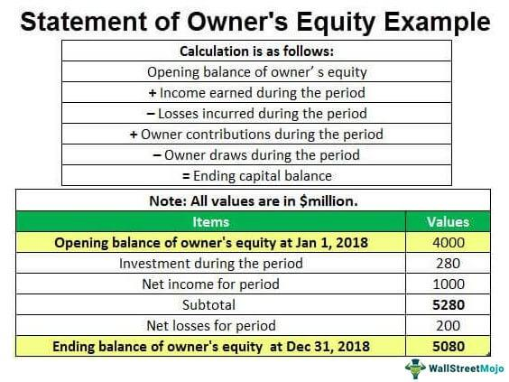

## Table of Contents

## What is equity income?

Equity income refers to the earnings that come from owning shares in a company. When you own stocks, you might receive payments called dividends. These dividends are a part of the company's profits that they share with their shareholders. So, equity income is the money you get from these dividends.

People often invest in stocks that pay good dividends to get a steady income. This can be especially useful for people who are retired or need regular money coming in. By choosing the right stocks, investors can enjoy both the potential for their stocks to grow in value and the regular income from dividends.

## How does equity income differ from other types of income?

Equity income is different from other types of income because it comes from owning stocks in a company. When a company makes money, it might decide to share some of that money with its shareholders as dividends. This is the equity income. It's not like a salary you get from a job, where you work and get paid regularly. With equity income, you don't have to do any work; you just own the stock and might get paid if the company decides to give out dividends.

Other types of income can include things like wages from a job, interest from savings accounts or bonds, and rental income from properties. Wages are what you earn from working, and they are usually steady and predictable. Interest income is what you get from lending money, like when you keep money in a savings account or buy a bond. Rental income comes from renting out property. Each of these types of income has its own risks and benefits, but equity income is unique because it depends on the company's performance and their decision to pay dividends.

## What are the common sources of equity income?

Common sources of equity income come from owning stocks that pay dividends. These stocks are usually from well-established companies that make steady profits. When these companies do well, they share some of their profits with people who own their stocks. This sharing of profits is called a dividend. So, if you own stocks in these companies, you can get regular payments from them, which is your equity income.

Another source of equity income can be from mutual funds or exchange-traded funds (ETFs) that focus on dividend-paying stocks. These funds collect money from many investors and use it to buy a variety of stocks. If the stocks in the fund pay dividends, the fund then shares those dividends with the people who own shares in the fund. This way, even if you don't pick individual stocks, you can still earn equity income through these funds.

Real estate investment trusts (REITs) are also a source of equity income. REITs are companies that own or finance income-generating real estate. They are required by law to pay out most of their taxable income as dividends to shareholders. So, if you own shares in a REIT, you can receive regular dividend payments, which adds to your equity income.

## How can one start generating equity income?

To start generating equity income, you need to buy stocks that pay dividends. These are usually from big, stable companies that make regular profits. You can open a brokerage account online, which is like a bank account but for buying and selling stocks. Once you have the account, you can use the money in it to buy shares in these companies. When the companies make money and decide to share it, they will send you a dividend, which is your equity income. It's a good idea to research and pick stocks that have a history of paying good dividends.

Another way to generate equity income is by investing in mutual funds or ETFs that focus on dividend-paying stocks. These funds collect money from many people and use it to buy a bunch of stocks. If the stocks in the fund pay dividends, the fund will share those dividends with you. This can be easier than [picking](/wiki/asset-class-picking) individual stocks because the fund managers do the work of choosing the stocks for you. You can also invest in real estate investment trusts (REITs), which are companies that own or finance real estate and are required to pay out most of their income as dividends. By buying shares in a REIT, you can receive regular dividend payments, adding to your equity income.

## What are the risks associated with equity income?

When you try to make money from equity income, there are some risks you need to know about. One big risk is that the stock price can go down. If you bought the stock hoping to get dividends, but the stock price falls a lot, you might lose more money than you make from the dividends. Another risk is that the company might not pay a dividend at all. Companies can decide to stop or cut their dividends if they are not making enough money or if they need to use the money for something else. This means you could be expecting to get some income, but then it doesn't come.

There's also the risk that comes with the economy in general. If the whole economy does badly, many companies might struggle, and their stock prices might drop. This can affect your equity income because fewer companies might be able to pay dividends. Also, if you put all your money into one stock or one type of stock, you're taking a big risk. If that company or type of stock does badly, you could lose a lot of money. It's usually safer to spread your money around, which is called diversification. By owning different kinds of stocks or funds, you can lower the risk that one bad investment will hurt your whole income plan.

## How is equity income taxed?

Equity income, which is the money you get from dividends, is usually taxed as regular income. This means it's added to your other income, like your salary, and then you pay taxes on the total amount. The tax rate depends on how much money you make in a year. If you make more money, you might have to pay a higher tax rate on your dividends.

Sometimes, there's a special tax rate for "qualified dividends." These are dividends from certain companies that meet specific rules. If your dividends are qualified, you might pay a lower tax rate on them. It's good to check with a tax advisor to see if your dividends qualify for this lower rate, because it can save you money.

## What strategies can be used to maximize equity income?

To maximize equity income, you should focus on picking stocks that pay high dividends. Look for companies that have a good history of paying dividends and are likely to keep doing so. These are often big, stable companies that make steady profits. You can also look at their "dividend yield," which tells you how much dividend you get for each dollar you invest. A higher yield means more income. Another way is to reinvest the dividends you get. Instead of spending them, use the dividends to buy more shares of the same stock. Over time, this can help you own more shares and get even more dividends.

Diversifying your investments is also a smart move. Instead of putting all your money into one stock, spread it across different stocks or funds. This can help you get income from many sources and reduce the risk that one bad stock will hurt your overall income. You might also consider investing in mutual funds or ETFs that focus on dividend-paying stocks. These funds manage a bunch of stocks for you, so you don't have to pick them yourself. Lastly, think about investing in real estate investment trusts (REITs). These companies have to pay out most of their income as dividends, so they can be a good source of steady equity income.

## Can equity income be a reliable source of passive income?

Equity income can be a reliable source of passive income if you choose the right stocks or funds. Stocks that pay good dividends are often from big, stable companies that make steady profits. These companies usually keep paying dividends even when the economy is not doing great. By investing in these kinds of stocks or in funds that focus on dividend-paying stocks, you can get regular payments without having to work for them. This can be a good way to earn money while you do other things or even when you're retired.

However, there are risks to think about. The stock price can go down, and the company might decide to cut or stop paying dividends if they're not making enough money. If you spread your investments across different stocks or funds, you can lower these risks. This is called diversification. By doing this, you're not relying on just one company for your income. So, while equity income can be a reliable source of passive income, it's important to pick your investments carefully and be ready for some ups and downs.

## How does equity income impact portfolio diversification?

Adding equity income to your investment portfolio can help with diversification. Diversification means spreading your money across different types of investments. When you include stocks that pay dividends, you're not just hoping for the stock price to go up. You're also getting regular payments, which can help balance out other parts of your portfolio that might not give you steady income. This can make your overall investments more stable because you're getting money from different places.

But you need to be careful about how you add equity income to your portfolio. If you put all your money into just a few dividend-paying stocks, you might not be as diversified as you think. It's better to spread your money across different companies and industries. You can also mix in other types of investments, like bonds or real estate investment trusts (REITs), which also pay dividends. By doing this, you can make sure your portfolio is well-rounded and less likely to be hurt by problems in one specific area.

## What are some advanced techniques for managing equity income?

To manage equity income well, you can use a strategy called "dividend capture." This means you buy a stock just before it pays a dividend, get the dividend, and then sell the stock right after. It sounds simple, but it needs careful timing because stock prices can drop by the amount of the dividend after it's paid. So, you need to watch the market closely and be ready to act quickly. Another advanced technique is "dividend reinvestment plans" or DRIPs. With DRIPs, instead of taking the dividend money out, you use it to buy more shares of the same stock. Over time, this can help your investment grow because you're getting more shares without spending extra money.

Another technique is to use "options strategies" to boost your equity income. For example, you can sell "covered calls" on your dividend-paying stocks. This means you agree to sell your stock at a certain price before a certain date. If the stock price stays below that price, you keep the money from selling the option, which adds to your income. But if the stock price goes above that price, you have to sell your stock, which might mean you miss out on future dividends. It's a bit tricky and involves some risk, so it's important to understand options well before trying this. By using these advanced techniques, you can try to get more income from your investments, but always remember to think about the risks too.

## How do market conditions affect equity income?

Market conditions can really change how much equity income you get. When the economy is doing well, companies usually make more money. This means they can pay bigger dividends to people who own their stocks. But if the economy is not doing well, companies might make less money or even lose money. Then, they might cut back on dividends or stop paying them altogether. So, the amount of equity income you get can go up and down depending on how the economy is doing.

Also, interest rates can affect equity income. When interest rates go up, it can be harder for companies to borrow money. This might make them less able to pay big dividends. On the other hand, if interest rates are low, companies can borrow money more easily and might be able to pay bigger dividends. So, keeping an eye on interest rates and the overall economy can help you understand what might happen to your equity income.

## What are some real-world examples of successful equity income strategies?

One successful equity income strategy is used by many retirees who invest in companies like Procter & Gamble and Coca-Cola. These companies are big and stable, and they have a long history of paying good dividends. Retirees buy shares in these companies and get regular payments from the dividends. This helps them have a steady income without having to work. They often reinvest the dividends to buy more shares, which can help their income grow over time.

Another example is using dividend-focused mutual funds or ETFs, like the Vanguard Dividend Appreciation [ETF](/wiki/etf-trading-strategies). People invest in these funds because they hold a bunch of stocks that pay good dividends. The fund managers pick the stocks, so investors don't have to do the work themselves. This can be a good way to get a steady income and also spread the risk across many different companies. By investing in these funds, people can enjoy a reliable stream of equity income without having to manage individual stocks.

## What is the understanding of dividend stocks?

Dividend stocks represent ownership in companies that distribute a portion of their earnings to shareholders as dividends. These payments provide investors with a steady income stream, often appealing to those seeking stability and regular income from their investments. 

Dividend stocks are often characterized by their dividend yield, which is a financial ratio that indicates how much a company pays out in dividends each year relative to its stock price. It is calculated using the formula:

$$
\text{Dividend Yield} = \left(\frac{\text{Annual Dividends per Share}}{\text{Price per Share}}\right) \times 100
$$

Investors typically favor dividend stocks for their potential to deliver consistent returns. However, dividend yields can vary widely among different stocks. Some companies might offer high yields to attract investors, while others maintain lower yields but prioritize steady, incremental increases over time.

The reliability of these dividend payments hinges on multiple factors, primarily the financial health of the company. A company with robust revenue streams and managed expenses is generally more capable of sustaining its dividend payouts. Investors assess this sustainability by scrutinizing a company's payout ratio—a measure of the proportion of earnings paid out as dividends, calculated as:

$$
\text{Payout Ratio} = \left(\frac{\text{Dividends per Share}}{\text{Earnings per Share}}\right) \times 100
$$

A high payout ratio may indicate that a company is distributing most of its earnings as dividends, which might be unsustainable if profits decline. Conversely, a lower ratio could suggest that a company retains more earnings for growth and stability, allowing for potential increases in future dividends.

Market conditions also play a significant role in the reliability of dividends. Economic downturns might pressure companies to cut or suspend dividend payments to maintain financial health. Accordingly, investors should regularly evaluate a company’s financial performance, paying close attention to its earnings reports and broader economic indicators.

In summary, dividend stocks can be a dependable component of an investment portfolio, offering income and stability. However, an informed assessment of a company’s financial condition and market circumstances is essential for evaluating the security and sustainability of its dividends.

## References & Further Reading

[1]: Bergstra, J., Bardenet, R., Bengio, Y., & Kégl, B. (2011). ["Algorithms for Hyper-Parameter Optimization."](https://papers.nips.cc/paper/4443-algorithms-for-hyper-parameter-optimization) Advances in Neural Information Processing Systems 24.

[2]: ["Advances in Financial Machine Learning"](https://www.amazon.com/Advances-Financial-Machine-Learning-Marcos/dp/1119482089) by Marcos Lopez de Prado

[3]: ["Evidence-Based Technical Analysis: Applying the Scientific Method and Statistical Inference to Trading Signals"](https://www.amazon.com/Evidence-Based-Technical-Analysis-Scientific-Statistical/dp/0470008741) by David Aronson

[4]: ["Machine Learning for Algorithmic Trading"](https://github.com/stefan-jansen/machine-learning-for-trading) by Stefan Jansen

[5]: ["Quantitative Trading: How to Build Your Own Algorithmic Trading Business"](https://www.amazon.com/Quantitative-Trading-Build-Algorithmic-Business/dp/1119800064) by Ernest P. Chan