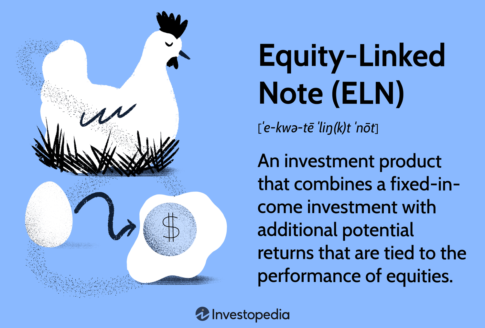

## Table of Contents

## What is an Equity-Linked Note (ELN)?

An Equity-Linked Note (ELN) is a type of investment product that combines the features of a bond with the potential returns of stocks. When you buy an ELN, you are essentially lending money to the issuer, like a bank or a company, for a set period. In return, you get a promise of repayment of your initial investment at the end of the term, plus some additional returns that are linked to the performance of a specific stock or a basket of stocks.

The returns on an ELN depend on how well the linked stocks perform. If the stocks do well, you might get more money back than you initially invested. However, if the stocks do poorly, you might get less, though you are usually protected from losing your entire investment. ELNs can be a good option for investors who want to participate in the potential growth of stocks but also want some level of safety and predictability in their returns.

## How does an Equity-Linked Note work?

An Equity-Linked Note (ELN) works by combining the safety of a bond with the growth potential of stocks. When you buy an ELN, you give money to the issuer, like a bank or a company, and they promise to pay you back at the end of a set time. The amount you get back depends on how well certain stocks or a group of stocks perform during that time. If the stocks do well, you might get more money back than you put in. If they don't do well, you still get your initial investment back, but you might not get any extra money.

The returns on an ELN are linked to the performance of the stocks it's tied to. For example, if the ELN is linked to a stock that goes up by 10%, you might get a return based on that 10% increase. However, if the stock goes down, you might just get your original investment back, without any extra returns. This makes ELNs a good choice for people who want to try to make money from stocks but don't want to risk losing their entire investment.

## What are the basic components of an Equity-Linked Note?

An Equity-Linked Note has a few main parts that make it work. First, there's the principal, which is the money you invest at the start. The issuer promises to give this money back to you when the note matures, which means when the set time period ends. Second, there's the maturity date, which is the specific date when you get your money back. This can be anywhere from a few months to several years in the future.

The other important part is the return, which is based on how well the stocks or stock index linked to the note perform. If the stocks do well, you might get more money back than you put in. This extra money is called the upside potential. If the stocks don't do well, you usually still get your principal back, but you might not get any extra money. This part is called the downside protection, and it's what makes ELNs safer than just buying stocks directly.

## What are the benefits of investing in Equity-Linked Notes?

Investing in Equity-Linked Notes can offer you a chance to grow your money without too much risk. When you buy an ELN, you are promised to get your initial investment back at the end of the term. This is called the principal, and it gives you a safety net that you don't get with regular stocks. If the stocks linked to the ELN go up, you can make more money than you put in. This extra money is called the upside potential, and it lets you enjoy the benefits of the stock market without risking everything.

Another good thing about ELNs is that they can be easier to understand and manage than other investments. They come with a fixed term, so you know exactly when you will get your money back. This can help you plan your finances better. Also, because ELNs are tied to stocks, they can help you diversify your investments. This means you're not putting all your money into one type of investment, which can make your overall portfolio safer and more likely to grow over time.

## What are the risks associated with Equity-Linked Notes?

Investing in Equity-Linked Notes (ELNs) does come with some risks. One big risk is that if the stocks linked to the ELN don't do well, you might not get any extra money back. You'll usually get your initial investment back, but if the stocks go down a lot, you might get less than you put in. This can happen if the ELN has a feature called a "downside risk," where you could lose part of your money if the stocks perform really badly.

Another risk is that ELNs can be hard to sell before they mature. If you need your money back before the set time is up, you might have to sell the ELN for less than you paid for it. This is called a lack of [liquidity](/wiki/liquidity-risk-premium), and it can be a problem if you need cash quickly. Also, ELNs can be complex products, and it's important to understand how they work and what you're getting into. If you don't fully understand the terms and conditions, you might end up with an investment that doesn't meet your needs or expectations.

## How are returns calculated in an Equity-Linked Note?

Returns on an Equity-Linked Note (ELN) depend on how well the stocks or stock index it's tied to perform. When you buy an ELN, you invest a certain amount of money, which is called the principal. At the end of the ELN's term, you get your principal back. But you might also get extra money, which is the return. This extra money comes from how much the linked stocks have gone up. For example, if the stocks go up by 10%, you might get a return based on that 10% increase.

However, if the stocks don't do well and go down, you usually still get your principal back, but you might not get any extra money. Some ELNs have a feature called a "cap," which means there's a limit to how much extra money you can get. For example, even if the stocks go up by 20%, your return might be capped at 15%. Also, some ELNs have a "downside risk," where if the stocks go down a lot, you might get less than your principal back. Understanding these details is important because they affect how much money you might make or lose.

## What is the role of the underlying asset in an Equity-Linked Note?

The underlying asset in an Equity-Linked Note is what the note's returns are based on. This asset can be a single stock or a group of stocks, like an index. When you buy an ELN, you're hoping that the value of this underlying asset will go up. If it does, you might get more money back than you put in at the end of the note's term. The performance of the underlying asset directly affects how much extra money, or return, you get.

However, if the value of the underlying asset goes down, you might not get any extra money. In most cases, you'll still get your initial investment back, which is called the principal. But in some ELNs, if the asset goes down a lot, you might even get less than your principal back. This is why it's important to understand how the underlying asset works and what might affect its value, because it's the key to knowing what kind of returns you might expect from your ELN.

## How do market conditions affect Equity-Linked Notes?

Market conditions play a big role in how well Equity-Linked Notes (ELNs) do. When the stock market is doing well, the stocks or stock index that the ELN is tied to are likely to go up in value. This means you could get more money back than you put in at the end of the ELN's term. But if the market is not doing well, the value of the stocks might go down. In this case, you might not get any extra money, though you usually get your initial investment back. Sometimes, if the market drops a lot, you might even get less than you put in if your ELN has a downside risk.

Another way market conditions affect ELNs is through interest rates. If interest rates go up, the cost for the issuer to borrow money goes up too. This can make ELNs less attractive because the issuer might offer lower returns to make up for the higher costs. Also, if the market is very unpredictable, it might be harder to sell your ELN before it matures. This is called a lack of liquidity, and it can be a problem if you need your money back quickly. So, keeping an eye on the market can help you understand how your ELN might perform.

## What are the different types of Equity-Linked Notes available?

There are a few different types of Equity-Linked Notes, each with its own features. One common type is the Principal Protected ELN. This kind promises to give you back all your initial investment at the end of the term, no matter how the linked stocks do. It's a good choice if you want to try to make money from the stock market but don't want to risk losing your entire investment. Another type is the Partially Protected ELN, which gives you back only part of your initial investment if the stocks do really badly. This type offers a bit less safety but might give you a chance for higher returns.

Another type of ELN is the Reverse Convertible ELN. This one works differently. If the linked stocks go down a lot, instead of getting cash back, you might get shares of the stock. This can be riskier because the value of the stock might keep going down after you get it. Lastly, there are Capped ELNs, which have a limit on how much extra money you can make. Even if the stocks go up a lot, your return might be capped at a certain amount. Each type of ELN has its own risks and rewards, so it's important to pick the one that fits your investment goals and how much risk you're willing to take.

## How can an investor assess the suitability of an Equity-Linked Note for their portfolio?

To figure out if an Equity-Linked Note (ELN) is right for your investment portfolio, you need to think about a few things. First, look at how much risk you're okay with. ELNs can be safer than regular stocks because they often promise to give you your initial investment back, but some types might still let you lose some money if the stocks do really badly. Think about how much of your money you're willing to put into something that might go up or down based on the stock market. Also, consider how long you want to keep your money in the investment. ELNs have a set time before you get your money back, so make sure that time works with your plans.

Next, think about what you want to get out of your investment. Are you looking for extra money on top of what you put in, or are you okay with just getting your initial investment back? Some ELNs have a limit on how much extra money you can make, so check if that's okay with you. Also, look at the other investments you already have. Adding an ELN can help spread out your risk if you have a lot of money in other types of investments. By thinking about these things, you can decide if an ELN is a good fit for what you're trying to do with your money.

## What are the tax implications of investing in Equity-Linked Notes?

When you invest in Equity-Linked Notes (ELNs), you need to think about taxes. The money you get back from an ELN can be taxed in different ways depending on where you live and the specific rules of your country. Usually, any extra money you make from the ELN, which is called the return, is seen as income and you have to pay taxes on it. If the ELN gives you stocks instead of cash, you might have to pay taxes on the value of those stocks. It's important to check the tax laws in your area because they can change how much you end up keeping from your investment.

Another thing to consider is how the tax treatment of ELNs can be different from other investments like regular stocks or bonds. For example, if you get your initial investment back at the end of the term, that part might not be taxed because it's just your money coming back to you. But if you get more money than you put in, that extra money could be taxed as income or as a capital gain, depending on the rules. Talking to a tax advisor can help you understand all this better and make sure you're ready for any taxes you might have to pay.

## How do regulatory frameworks impact the issuance and trading of Equity-Linked Notes?

Regulatory frameworks play a big role in how Equity-Linked Notes are made and traded. Different countries have their own rules that issuers have to follow when they create and sell ELNs. These rules are there to protect investors by making sure that ELNs are sold in a fair and clear way. For example, issuers might have to give detailed information about the risks and how the ELN works. This helps investors make smart choices. If the rules are strict, it might be harder for issuers to offer ELNs, but it can make the market safer for everyone.

Also, regulations can affect how easy it is to trade ELNs. Some rules might limit who can buy or sell ELNs, or they might require special licenses or permissions. This can make the market less liquid, which means it might be harder to sell your ELN before it matures if you need your money back quickly. On the other hand, good regulations can help build trust in the market, making more people want to invest in ELNs. So, understanding the regulatory environment is important for both issuers and investors when dealing with Equity-Linked Notes.

## References & Further Reading

[1]: Jegadeesh, N., & Titman, S. (1993). ["Returns to Buying Winners and Selling Losers: Implications for Stock Market Efficiency."](https://www.jstor.org/stable/2328882) The Journal of Finance, 48(1), 65-91.

[2]: Ciampi, F., & Giacomelli, D. (2019). ["Algorithmic Trading: Understanding and Applying Automated & Algorithmic Trading Systems."](https://www.mdpi.com/2218-273X/14/12/1646)

[3]: Fabozzi, F. J., & Choudhry, M. (2004). ["The Handbook of Equity Derivatives."](https://www.semanticscholar.org/paper/The-handbook-of-European-structured-financial-Fabozzi-Choudhry/8d5755b3e61df8deecf68de1f438cdcea9733ddb) Wiley Finance.

[4]: Engle, R. (1982). ["Autoregressive Conditional Heteroscedasticity with Estimates of the Variance of United Kingdom Inflation."](https://www.semanticscholar.org/paper/Autoregressive-conditional-heteroscedasticity-with-Engle/2ee6cb87fc81ecd78d161c4a92c9dfce00c8961c) Econometrica, 50(4), 987-1007.

[5]: Tsay, R. S. (2005). ["Analysis of Financial Time Series."](https://cpb-us-w2.wpmucdn.com/blog.nus.edu.sg/dist/0/6796/files/2017/03/analysis-of-financial-time-series-copy-2ffgm3v.pdf) Wiley Series in Probability and Statistics.