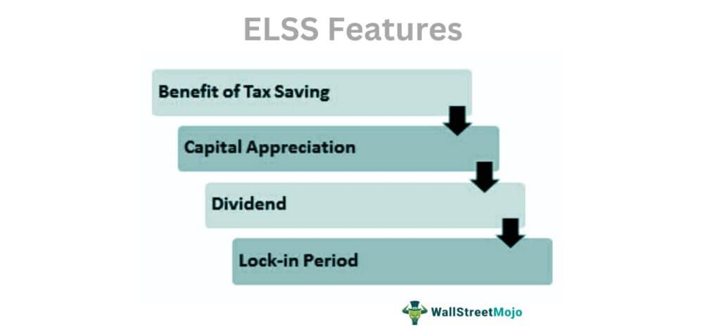

In an evolving financial landscape, investors are presented with diverse opportunities to maximize returns. One such opportunity is through equity-linked securities (ELKS), innovative financial instruments that combine the characteristics of both equity and fixed-income assets. By providing exposure to equity markets while simultaneously offering a fixed-income component, ELKS present a unique investment strategy that aligns with a wide range of risk appetites and return expectations.

This article explores the multifaceted nature of ELKS, delving into their various types and the distinctive benefits they present to investors. Furthermore, it examines the inherent risks associated with these securities, providing a balanced view essential for informed decision-making. In addition, the intersection of algorithmic trading with ELKS is explored, highlighting how technology can enhance portfolio strategies by automating complex trading processes and optimizing asset management.



Understanding ELKS requires a clear grasp of their structure and function within the broader investment ecosystem. By integrating the precision and speed of algorithmic trading, investors can potentially enhance their engagement with these securities, optimizing returns while managing risk effectively. This article serves as a comprehensive guide for investors eager to explore ELKS and leverage cutting-edge trading methods, equipping them with the knowledge needed to navigate modern financial markets.

## Table of Contents

## What are Equity-Linked Securities (ELKS)?

Equity-linked securities (ELKS) are complex financial instruments that entail both debt and equity characteristics, making them a popular choice for investors aiming to harness equity market benefits while mitigating some risk. Essentially, these hybrid instruments are debt securities whose returns are derived from the performance of an underlying equity asset. This performance linkage means that the payoff for ELKS is tied directly to the fluctuations and overall outcomes of specified equity assets, such as individual stocks or market indices.

A typical structure for ELKS includes a set maturity date and periodic interest payment offerings. The fixed maturity date provides a clear timeline for the investment, similar to traditional bonds. Meanwhile, the interest payments offer a consistent income stream throughout the holding period, adding a fixed-income component that can stabilize returns despite equity market volatility.

The appeal of equity-linked securities lies in their ability to offer exposure to equity markets while embedding mechanisms that can limit potential losses. This structural protection is particularly beneficial in volatile market conditions where traditional equity investments might suffer significant declines. By tailoring the financial product with a linked underlying equity asset, issuers can provide varying levels of risk and return profiles, aligning with investor objectives.

Overall, ELKS represent a targeted investment strategy for those seeking to bolster their portfolios with equity exposure while minimizing the direct risks typically associated with equity investments. Through the combination of periodic interest income and equity-linked performance returns, these securities offer sophisticated avenues for achieving controlled equity investment returns.

## Types of Equity-Linked Securities

Equity-linked securities (ELKS) are versatile financial instruments that fuse characteristics of debt and equity. There are several types of ELKS, each offering unique features and investment opportunities. These securities are structured to provide returns based on the performance of an underlying asset class, such as equities, while retaining certain fixed-income attributes.

Corporate ELKS are a notable type, developed in collaboration with investment banks. These ELKS are structured with offerings tied primarily to equity benchmarks. By aligning the returns to specific equity indices or stock performances, corporate ELKS can cater to investors seeking equity exposure without directly purchasing the stock itself. This structure allows investors to potentially benefit from equity market gains, while also securing regular interest payments typical of debt instruments.

Another prominent category is market-linked securities. These are designed to offer payments that depend on the performance of diverse market benchmarks, which can include not only equities but also commodities or currencies. This type of ELKS broadens the scope of possible returns, enabling investors to tap into various market sectors and asset classes with a single investment vehicle. Market-linked securities often come with structured features to cap gains or limit losses, balancing the risk-reward equation for investors.

Different ELKS offer varied degrees of principal protection and income generation opportunities. For example, some ELKS might guarantee the return of the principal amount at maturity, providing a safety net against market downturns. This principal protection is especially appealing in volatile market conditions, assuring investors that their original investment remains secure, irrespective of market performance. However, this level of protection may come with a trade-off in terms of reduced potential returns or income.

In summary, the diverse types of equity-linked securities available cater to a wide array of investor preferences and risk tolerances. From corporate offerings that tie directly to equity benchmarks to more diversified market-linked securities, ELKS provide innovative pathways for achieving financial objectives while managing exposure to various market forces. These instruments are increasingly popular among investors who seek a balance between equity-linked growth potential and the stable income attributes of fixed-income products.

## Benefits of Investing in ELKS

Equity-linked securities (ELKS) present several advantages that make them an appealing choice for investors looking to diversify portfolios by intertwining fixed-income and equity components. This blend allows investors to enjoy the relative stability of fixed-income instruments alongside the growth potential of equities, offering a balanced approach to investment.

One primary benefit of ELKS is their potential to generate higher returns than traditional fixed-income securities. While conventional bonds and similar instruments offer a predictable income stream, their returns are often modest, usually aligning with prevailing interest rates. In contrast, ELKS provide returns directly linked to the performance of an underlying equity asset. This linkage allows investors to capture a portion of the equity market's upside potential while still receiving periodic interest payments that are characteristic of fixed-income investments.

Another significant advantage of ELKS is the principal protection features that many of these instruments offer. Principal protection is an attractive feature for risk-averse investors as it can mitigate losses during periods of market [volatility](/wiki/volatility-trading-strategies). Typically, ELKS are structured in a way that ensures investors receive at least a portion, if not all, of their initial investment back at maturity, regardless of the performance of the underlying equity.

Additionally, ELKS are highly customizable, which allows them to be tailored to fit an investor's specific goals and risk profiles. This customizability enables investors to select products that match their target return expectations while adhering to their desired risk threshold. By choosing ELKS that align closely with personal investment objectives, investors can create portfolios that optimize their risk-return balance.

Overall, ELKS offer a versatile investment opportunity by combining the income-generating features of bonds with the growth potential of equities. This structural hybridization not only aids in portfolio diversification but also empowers investors to access broader market opportunities while safeguarding against extreme losses.

## Risks Associated with ELKS

Investing in Equity-Linked Securities (ELKS) exposes investors to a variety of risks that necessitate careful consideration. One significant risk is credit risk, which refers to the possibility that the issuer of the security may default on its obligations. The creditworthiness of the issuing entity directly affects the risk level; therefore, investors need to evaluate the issuer's financial health before investing.

Market risk is another critical [factor](/wiki/factor-investing), as the return on ELKS is linked to the performance of an underlying equity asset. Market fluctuations, geopolitical events, and economic data releases can all influence equity prices, thus impacting the performance of ELKS. Given their tie to underlying assets, the intrinsic market volatility of these securities can lead to significant variations in returns, potentially affecting the investor’s anticipated profit.

Liquidity risk arises because ELKS may be thinly traded in secondary markets, making it challenging to buy or sell these securities without causing significant price changes. This limited [liquidity](/wiki/liquidity-risk-premium) can lead to difficulties in liquidating positions quickly, potentially resulting in unanticipated losses or diminished returns.

Furthermore, ELKS possess a complex pricing structure. The valuation of these securities often includes various derivatives components that can be difficult for investors to understand fully. This complexity increases the possibility of mispricing, making it challenging to discern the true value of the investment. As such, investors may face challenges in accurately assessing the potential return and risk of ELKS.

In summary, while ELKS offer attractive investment opportunities by providing equity exposure with certain fixed-income attributes, they [carry](/wiki/carry-trading) specific risks that investors must evaluate. These include credit risk, market risk, and liquidity risk, alongside the intricacies of their pricing structures. Due diligence, a comprehensive understanding of these risks, and possibly consulting financial experts are crucial steps for investors considering ELKS to avoid unforeseen financial setbacks.

## Algorithmic Trading with ELKS

Algorithmic trading is a sophisticated methodology for executing trading strategies by utilizing computational power to conduct transactions at speeds and frequencies unattainable by human traders. This technological advancement is particularly beneficial for investors dealing with equity-linked securities (ELKS), as it provides significant opportunities for optimizing their investment strategies. 

One of the primary advantages of [algorithmic trading](/wiki/algorithmic-trading) for ELKS is the ability to capitalize on market volatility. The fluctuating nature of the underlying equity assets can be efficiently managed through algorithms that execute trades based on predefined criteria or real-time market data. This allows for capturing favorable price points while mitigating the negative impacts of volatile market shifts. 

The execution of these strategies is largely reliant on the use of complex mathematical models and computational algorithms. These algorithms can be designed to automatically adjust positions in response to changing market conditions, which enhances the potential for achieving optimal outcomes. For instance, mean reversion strategies or [momentum](/wiki/momentum)-based algorithms can be implemented to align trading activities with the expected behavior of the ELKS, thereby maximizing returns.

Moreover, algorithmic trading offers advanced risk management capabilities. Algorithms can be programmed to follow strict risk parameters, ensuring that exposure to detrimental market movements is minimized. Techniques such as [value at risk](/wiki/var-value-at-risk) (VaR) calculations or Monte Carlo simulations might be employed within these algorithms to gauge and hedge potential risks effectively.

The following Python example demonstrates a simple algorithmic trading model that might adjust positions in an ELKS investment based on market volatility:

```python
import numpy as np

# Generate synthetic market data
np.random.seed(42)
market_returns = np.random.normal(0, 0.01, 1000)  # mean=0, std=0.01, n=1000

def algorithmic_strategy(returns, threshold=0.01):
    """
    A simple algorithmic strategy based on market volatility.

    Args:
        returns: Array of market returns.
        threshold: Volatility threshold to trigger trading actions.

    Returns:
        positions: Array indicating trading positions (-1, 0, 1).
    """
    positions = np.zeros_like(returns)
    volatility = np.std(returns)

    for i in range(1, len(returns)):
        # Long position when market is less volatile
        if abs(returns[i]) < threshold * volatility:
            positions[i] = 1
        # Short position when market is volatile
        elif abs(returns[i]) > threshold * volatility:
            positions[i] = -1
        # No position otherwise
        else:
            positions[i] = 0

    return positions

positions = algorithmic_strategy(market_returns)
print(f"Trading positions: {positions}")
```

This example outlines a basic approach where trading decisions in ELKS can be dynamically altered based on observed market volatility, leveraging the speed and precision of computational algorithms. Such strategies can significantly enhance the performance and resilience of ELKS investments, empowering investors to efficiently manage both risks and returns.

## Considerations for Investing in ELKS and Algorithmic Trading

Investing in equity-linked securities (ELKS) and implementing algorithmic trading necessitates a comprehensive understanding of the instruments and strategies involved. One primary consideration for investors is defining their risk tolerance. Given the hybrid nature of ELKS, which blend features of both equity and debt, investors must assess how much risk they are willing to shoulder relative to their investment goals. This assessment helps in selecting the right ELKS and developing effective algorithmic trading strategies.

Conducting thorough research on the underlying equities tied to ELKS is paramount. The performance of ELKS depends significantly on the equities they are linked to, meaning investors must analyze market trends, company fundamentals, and other economic factors that may impact these equities. Moreover, developing or selecting appropriate algorithmic trading strategies involves understanding technical aspects and the ability to model market conditions accurately. Algorithmic trading can utilize strategies such as mean reversion, [trend following](/wiki/trend-following), or statistical [arbitrage](/wiki/arbitrage). For instance, a simple Python script to simulate a moving average crossover strategy might involve libraries like pandas and numpy:

```python
import pandas as pd
import numpy as np

# Sample equity price data
prices = pd.Series([100, 102, 101, 103, 105, 104, 107, 109, 108, 110])

short_window = 3
long_window = 7

# Calculate moving averages
short_mavg = prices.rolling(window=short_window, min_periods=1, center=False).mean()
long_mavg = prices.rolling(window=long_window, min_periods=1, center=False).mean()

# Generate buy/sell signals
signals = pd.DataFrame(index=prices.index)
signals['signal'] = 0.0
signals['short_mavg'] = short_mavg
signals['long_mavg'] = long_mavg
signals['signal'][short_window:] = np.where(signals['short_mavg'][short_window:] > signals['long_mavg'][short_window:], 1.0, 0.0)   
signals['positions'] = signals['signal'].diff()

print(signals)
```

Engaging financial advisors or experienced industry experts is another crucial consideration. These professionals can provide insights into the technical and operational aspects of ELKS and algorithmic trading. Their expertise can guide investors through complex areas such as algorithm design, market microstructure, and risk management.

Monitoring market conditions is essential for investors engaged in ELKS and algorithmic trading. Market dynamics can significantly influence the performance of ELKS and the effectiveness of algorithmic strategies. Investors need to be vigilant regarding economic announcements, industry changes, and global events that may lead to fluctuations in the underlying equities or ELKS themselves.

By thoughtfully considering these factors, investors can better align their ELKS and algorithmic trading activities with their financial objectives, potentially improving portfolio performance and minimizing risks.

## Conclusion

Equity-linked securities (ELKS) occupy a significant niche in the financial landscape by offering a dual advantage: exposure to equity markets alongside the characteristics of fixed-income instruments. This unique combination enables investors to potentially enhance their portfolios with diversified risk and return opportunities. By linking returns to the performance of an underlying equity asset, ELKS provide a structured avenue for engaging with volatile markets while maintaining a level of security traditionally associated with fixed-income products.

The incorporation of algorithmic trading into ELKS investment strategies further augments their potential. Algorithms allow for real-time market analysis and swift execution of trades, optimizing strategies based on current market conditions. This can improve risk management and maximize returns by dynamically adjusting investment positions. The efficiency and precision offered by algorithmic trading may lead to better handling of the market volatility inherent in ELKS, thus refining portfolio performance.

For investors, understanding the intricate balance of benefits and risks associated with ELKS is critical. These instruments offer considerable potential but come with complexities that require thorough comprehension and systematic evaluation against individual financial goals and prevailing market conditions. The decision to integrate algorithmic trading into ELKS strategies should be underpinned by careful consideration of one's risk tolerance and investment acumen. Engaging with financial advisors or relying on expert opinion can add a layer of insight that supports informed decision-making. 

In conclusion, by leveraging the dual nature of ELKS and the capabilities of algorithmic trading, investors can position themselves to effectively navigate the complexities of modern markets. Staying informed and adaptable in strategy formulation ensures that investments in ELKS align with broader financial objectives while effectively responding to evolving market dynamics.

## References & Further Reading

[1]: ["Equity-Linked Securities and Derivatives"](https://www.investopedia.com/terms/e/equity-linked-security.asp) by Ronnie Belcher

[2]: ["Risk Management and Financial Institutions"](https://www.amazon.com/Management-Financial-Institutions-Wiley-Finance/dp/1119932483) by John C. Hull

[3]: ["Advances in Financial Machine Learning"](https://www.amazon.com/Advances-Financial-Machine-Learning-Marcos/dp/1119482089) by Marcos Lopez de Prado

[4]: ["Algorithmic Trading: Winning Strategies and Their Rationale"](https://www.amazon.com/Algorithmic-Trading-Winning-Strategies-Rationale-ebook/dp/B00CY5HC0U) by Ernest P. Chan

[5]: ["Evidence-Based Technical Analysis: Applying the Scientific Method and Statistical Inference to Trading Signals"](https://www.amazon.com/Evidence-Based-Technical-Analysis-Scientific-Statistical/dp/0470008741) by David Aronson