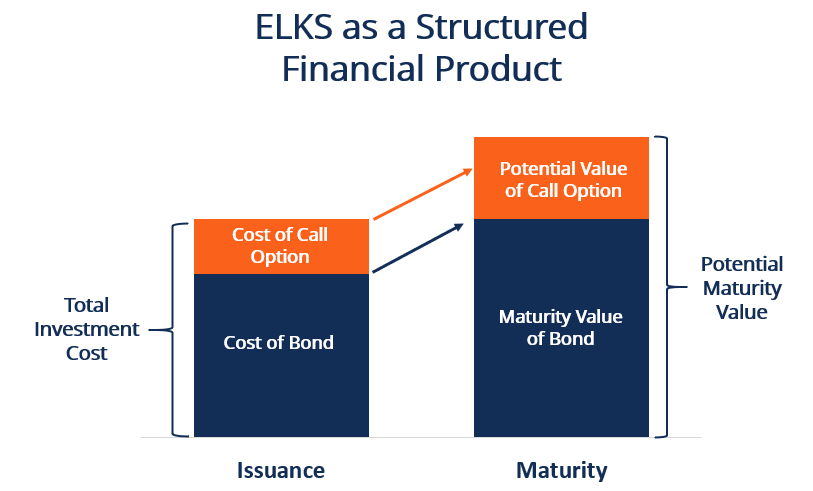

## Table of Contents

## What are Equity-Linked Securities (ELS)?

Equity-Linked Securities (ELS) are investment products that combine the features of bonds and stocks. They are typically issued by banks and offer investors a way to participate in the potential growth of stock markets while also providing some level of protection against losses. ELS are often linked to the performance of a specific stock, a basket of stocks, or a stock market index. This means that the returns an investor receives depend on how well the linked stocks or index performs over the term of the security.

These securities usually have a fixed term, which can range from a few months to several years. At the end of the term, the investor gets back their initial investment plus any additional returns based on the performance of the linked equity. However, if the linked equity performs poorly, the investor might not receive any additional returns, though some ELS products offer a minimum return to cushion against total loss. Because of this structure, ELS can be an attractive option for investors looking for a balance between risk and reward.

## How do Equity-Linked Securities work?

Equity-Linked Securities (ELS) are financial products that mix features of bonds and stocks. When you invest in ELS, you're basically giving money to a bank, and in return, they promise to give you back your money plus some extra based on how well certain stocks or a stock market index does. The bank decides which stocks or index the ELS will be linked to. If those stocks or the index go up in value, you could earn more money. But if they go down, you might not get any extra money, though some ELS have a safety net that ensures you get at least a little bit back.

ELS have a set time period, like a few months or years. When that time is up, you get your original investment back, along with any extra returns based on the performance of the linked stocks or index. This makes ELS a bit safer than just buying stocks because you know when you'll get your money back, and some ELS even promise a minimum return to protect against big losses. This mix of safety and potential for growth makes ELS appealing to people who want to invest in the stock market but are worried about losing too much money.

## What are the main types of Equity-Linked Securities?

There are a few main types of Equity-Linked Securities (ELS). The first type is called Equity-Linked Notes (ELNs). These are debt instruments where the return you get depends on how well a certain stock or group of stocks does. If the stocks do well, you might get more money back than you put in. If they don't do well, you might just get your original money back, or sometimes a bit less, depending on the terms of the note.

Another type of ELS is the Equity-Linked Bond (ELB). These are similar to regular bonds but with a twist. You get regular interest payments like a normal bond, but the final amount you get back at the end of the bond's term depends on the performance of the linked stocks or stock index. This means you could earn more if the stocks do well, but you might not get much extra if they don't.

A third type is the Principal Protected Note (PPN). These are designed to be safer. With PPNs, you're guaranteed to get your original investment back at the end of the term, no matter how the linked stocks perform. Any extra money you might get depends on how well those stocks do, but at least you know your initial investment is safe.

## What are the benefits of investing in Equity-Linked Securities?

Investing in Equity-Linked Securities (ELS) can offer you a chance to earn more money than you would from regular savings accounts or bonds. ELS let you join in on the potential growth of the stock market without having to buy stocks directly. This means you could see bigger returns if the stocks or stock index linked to your ELS do well. Plus, some ELS come with a safety net, like Principal Protected Notes, which promise to give you back your original investment no matter what happens to the stocks. This can make investing in the stock market feel less risky.

Another benefit of ELS is that they have a set time period, so you know when you'll get your money back. This can be helpful if you're planning for something in the future and want to know when your investment will mature. Also, ELS can be customized to fit different levels of risk and reward. For example, if you want to take on more risk for the chance of higher returns, you can choose ELS that are more closely tied to the performance of the stocks. If you're more cautious, you can pick ones that offer more protection against losses.

## What are the risks associated with Equity-Linked Securities?

Investing in Equity-Linked Securities (ELS) can be risky because they depend on how well certain stocks or a stock market index does. If those stocks or the index go down a lot, you might not get any extra money back, and in some cases, you might even lose part of your initial investment. This means ELS can be less safe than regular savings accounts or bonds, where you know exactly how much you'll get back.

Another risk is that ELS are often complex and hard to understand. They come with a lot of rules and conditions about how your returns are calculated, and if you don't fully understand these, you might be surprised by what you get back at the end of the term. Plus, ELS usually can't be sold easily before the term ends, so if you need your money back sooner, you might have a hard time getting it.

Lastly, ELS are issued by banks, and if the bank runs into financial trouble, it could affect your investment. Even though some ELS promise to protect your principal, this protection might not be guaranteed if the bank fails. So, it's important to think about the bank's financial health when you're deciding whether to invest in ELS.

## How can someone start investing in Equity-Linked Securities?

To start investing in Equity-Linked Securities (ELS), you first need to find a bank or financial institution that offers them. Many big banks have ELS products, so you can visit their websites or go to their branches to learn more. Once you've found a bank, you'll need to open an investment account with them if you don't already have one. This usually involves filling out some forms and providing identification. After your account is set up, you can look at the different ELS options the bank offers. They might be linked to specific stocks, a group of stocks, or a stock market index, and they can have different terms and levels of risk.

When you've chosen an ELS that fits your goals and risk tolerance, you can decide how much money you want to invest. The bank will explain how the ELS works, including how your returns will be calculated and any risks involved. Make sure you understand all the details before you invest. Once you're ready, you can place your order through the bank's online platform or by talking to a bank representative. After that, you just need to wait until the ELS matures at the end of its term to see what your returns will be.

## What are some common strategies for using Equity-Linked Securities in a portfolio?

One common strategy for using Equity-Linked Securities (ELS) in a portfolio is to balance risk and reward. Since ELS can offer a bit of safety with the chance for higher returns, they can be a good middle ground for investors who want to join the stock market but are worried about losing money. For example, if you're someone who likes to play it safe but still wants to grow your money, you might put some of your money into ELS that promise to give your initial investment back, no matter what happens to the stocks. This way, you can still earn extra money if the stocks do well, but you won't lose your original investment if they don't.

Another strategy is to use ELS to diversify your investments. Instead of putting all your money into one type of investment, like stocks or bonds, you can spread it out by adding ELS to the mix. This can help reduce the overall risk of your portfolio because ELS often work differently than other investments. For instance, if you already have a lot of regular stocks, adding ELS linked to different stocks or an index can give you a chance to earn more in different ways. Plus, since ELS have a set time period, you can plan your investments around when you'll need the money back, making it easier to manage your overall financial plan.

## How do Equity-Linked Securities compare to other investment products like stocks and bonds?

Equity-Linked Securities (ELS) are different from stocks and bonds in how they work and the risks they [carry](/wiki/carry-trading). When you buy a stock, you're buying a piece of a company, and your money goes up or down based on how well that company does. Stocks can be risky because their value can change a lot in a short time, but they also have the potential for big rewards if the company does well. On the other hand, ELS are linked to stocks or a stock index, but they usually come with some protection. This means you might not lose all your money if the stocks go down, unlike with regular stocks. ELS also have a set time period, so you know when you'll get your money back, which is different from stocks, where you can sell whenever you want.

Bonds are another type of investment that's different from ELS. When you buy a bond, you're lending money to a company or government, and they promise to pay you back with interest over time. Bonds are generally safer than stocks and ELS because they have a fixed [interest rate](/wiki/interest-rate-trading-strategies) and you know exactly how much you'll get back at the end. ELS, however, offer a chance to earn more money if the linked stocks do well, but they also come with more risk than bonds. While bonds give you steady, predictable returns, ELS can give you higher returns if the stock market performs well, but they might not offer any extra money if it doesn't. So, ELS can be a middle ground between the safety of bonds and the potential rewards of stocks.

## What are some historical examples of successful Equity-Linked Securities?

One well-known example of successful Equity-Linked Securities was the Equity-Linked Note (ELN) issued by Lehman Brothers in the early 2000s. These notes were linked to the performance of the S&P 500 index and offered investors a chance to earn returns based on the index's growth. Many investors found these ELNs attractive because they provided a way to invest in the stock market with some protection against losses. The notes had a set term, and if the S&P 500 performed well during that time, investors could see significant returns. This example shows how ELS can be a good choice for people looking to balance risk and reward.

Another example comes from the Asian market, where banks like HSBC have issued successful Equity-Linked Securities. In the mid-2010s, HSBC offered ELS linked to various stock indices in Asia, such as the Hang Seng Index. These securities appealed to investors because they offered the potential for high returns if the Asian markets did well, while also providing some level of principal protection. Many investors in Asia used these ELS to diversify their portfolios and gain exposure to the stock market without taking on as much risk as they would with direct stock investments. This demonstrates how ELS can be tailored to different markets and investor needs.

## How are Equity-Linked Securities structured and priced?

Equity-Linked Securities (ELS) are structured by banks to combine features of bonds and stocks. When you buy an ELS, you're giving money to the bank, and they promise to give it back to you at the end of a set time, like a few months or years. The amount you get back depends on how well the stocks or stock index linked to the ELS perform. If the stocks do well, you might get more money back than you put in. Some ELS even promise to give you back at least your original investment, no matter what happens to the stocks, making them a bit safer than regular stocks. The structure of ELS can be customized to fit different levels of risk and reward, so you can choose ones that match what you're comfortable with.

Pricing ELS is a bit tricky because it depends on a lot of things, like how well the linked stocks or index are expected to do, how long the ELS lasts, and what kind of protection it offers. Banks use special math models to figure out the price, taking into account things like interest rates, how much the stock market might go up or down, and even how likely it is that the bank might run into financial trouble. The price you pay for an ELS is usually less than what you'd pay for the stocks directly, but this is because the bank is taking on some of the risk and offering you some protection. This makes ELS a unique investment because you're getting a mix of safety and the chance for bigger returns.

## What role do Equity-Linked Securities play in financial markets and corporate finance?

Equity-Linked Securities (ELS) play an important role in financial markets by giving investors a way to get into the stock market without taking on as much risk as they would with regular stocks. Banks create ELS to help investors balance the chance of [earning](/wiki/earning-announcement) more money with some protection against losing it all. This makes ELS popular with people who want to grow their money but are worried about the ups and downs of the stock market. ELS also help banks attract more customers by offering them a unique investment product that combines features of both bonds and stocks.

In corporate finance, ELS can be useful for companies looking to raise money without issuing new stocks or taking on more debt. By issuing ELS, companies can tap into investors who are interested in the potential growth of the company's stock but want some safety. This can be a smart way for companies to get the money they need for growth or other projects while also giving investors a chance to earn more if the company does well. ELS can be tailored to fit different needs, making them a flexible tool in the world of corporate finance.

## What are the regulatory considerations and compliance issues related to Equity-Linked Securities?

When it comes to Equity-Linked Securities (ELS), there are a lot of rules that banks and investors need to follow. These rules are made by groups like the Securities and Exchange Commission (SEC) in the U.S. or other financial watchdogs around the world. The main goal of these rules is to make sure that ELS are sold fairly and that investors know exactly what they're getting into. Banks have to give clear information about how ELS work, what the risks are, and how much money you might make or lose. They also have to make sure that the people selling ELS are properly trained and that they're not pushing these products on people who don't understand them.

Another big part of the rules is making sure that banks are financially strong enough to offer ELS. This means that banks have to keep enough money on hand to pay back investors if something goes wrong. If a bank runs into trouble, it could affect the safety of the ELS they've issued. So, regulators keep a close eye on banks to make sure they're not taking on too much risk. This helps protect investors and keep the financial markets stable. If banks don't follow these rules, they can get into big trouble, like fines or even losing their right to sell ELS.

## References & Further Reading

[1]: ["Equity-Linked Securities and Derivatives"](https://www.investopedia.com/terms/e/equity-linked-security.asp) by Ronnie Belcher

[2]: ["Risk Management and Financial Institutions"](https://www.amazon.com/Management-Financial-Institutions-Wiley-Finance/dp/1119932483) by John C. Hull

[3]: ["Advances in Financial Machine Learning"](https://www.amazon.com/Advances-Financial-Machine-Learning-Marcos/dp/1119482089) by Marcos Lopez de Prado

[4]: ["Algorithmic Trading: Winning Strategies and Their Rationale"](https://www.amazon.com/Algorithmic-Trading-Winning-Strategies-Rationale-ebook/dp/B00CY5HC0U) by Ernest P. Chan

[5]: ["Evidence-Based Technical Analysis: Applying the Scientific Method and Statistical Inference to Trading Signals"](https://www.amazon.com/Evidence-Based-Technical-Analysis-Scientific-Statistical/dp/0470008741) by David Aronson