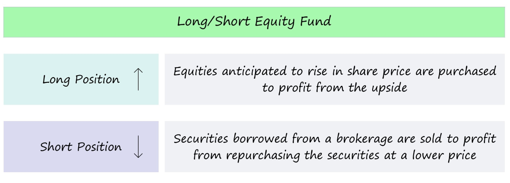

Equity long short strategies have become a cornerstone in the dynamic world of algorithmic trading, enabling traders to profit from both rising and falling markets. By strategically leveraging both long and short positions, this approach offers a more comprehensive method for capitalizing on market movements. Long positions aim to benefit from price increases, while short positions allow traders to profit from potential declines. The dual nature of this strategy is particularly beneficial in volatile markets, where prices can fluctuate rapidly and unpredictably.



The primary advantage of equity long short strategies lies in their ability to mitigate risk. By balancing investments between long and short holdings, traders can hedge against adverse market conditions. This risk mitigation aspect is crucial, especially in periods of high volatility, providing a buffer against market downturns. Moreover, these strategies can enhance portfolio returns by exploiting mispricings in the market, offering the potential for generating alpha—the excess returns on an investment relative to a benchmark index.

Algorithmic trading platforms further enhance the efficacy of long short strategies by automating the process of stock selection and execution. These platforms leverage sophisticated algorithms that analyze vast datasets, identify trading opportunities, and execute trades with precision and speed. Such technological advancements significantly reduce human error and enable traders to act on market signals with greater accuracy and efficiency.

In conclusion, the equity long short strategy is an invaluable tool for modern traders and investors. By employing both long and short positions, traders can not only navigate volatile markets with a greater sense of security but also potentially achieve superior returns. With the continuous evolution of algorithmic trading technologies, the relevance and application of these strategies are only expected to grow.


## Table of Contents


## What is a Long Short Equity Strategy?

A [long short](/wiki/equity-long-short) equity strategy is an investment approach that seeks to maximize returns by taking both long and short positions in stocks. The foundational principle behind this strategy is to capitalize on expected fluctuations in stock prices — buying (or going long on) undervalued stocks and selling (or going short on) overvalued stocks. This technique allows investors to potentially profit from both rising and falling markets.

At its core, the strategy aims to optimize returns through a balanced portfolio. Long positions involve purchasing stocks with the expectation that their value will rise over time. Conversely, short positions entail selling borrowed stocks in anticipation that their prices will decline, allowing them to be repurchased at a lower price. By balancing these positions carefully, investors can reduce market exposure and hedge against potential downturns, since gains from one position could offset losses from the other.

The adaptability of the long short equity strategy in diverse market conditions makes it an attractive choice for investors. In volatile markets, the ability to take advantage of shorting allows portfolio managers to mitigate risk better than a traditional long-only approach. This flexibility enables the strategy to adapt to bullish, bearish, or sideways markets by adjusting the proportion between long and short positions, thereby navigating different economic cycles effectively.

Moreover, the strategy's flexibility makes it particularly suitable for [algorithmic trading](/wiki/algorithmic-trading), where advanced data analysis and computational power can enhance stock selection and position sizing. This leads to more informed decision-making and a dynamic response to market changes, further optimizing the performance of the long short equity strategy.

While the potential for high returns exists, it is crucial to note the importance of skillful execution and comprehensive research in identifying the right stocks for long and short positions. This ensures that the strategy remains aligned with investment objectives and risk tolerance, maintaining its efficacy across varied market environments.


## Types of Long Short Equity Funds

Long short equity funds employ a blend of long and short positions to capitalize on market inefficiencies, with various fund types offering diverse strategies and risk profiles. Here, we examine [hedge fund](/wiki/hedge-fund-trading-strategies)s, mutual funds, and exchange-traded funds ([ETF](/wiki/etf-trading-strategies)s) that make use of long short strategies, highlighting their unique characteristics and investment horizons.

### Hedge Funds

Hedge funds are the most traditional vehicles for long short equity strategies. Typically structured for high-net-worth individuals and institutional investors, hedge funds offer considerable flexibility in their investment approach, including the use of leverage and derivatives to enhance returns. They often adopt a high-risk, high-reward profile, aiming for absolute returns irrespective of market conditions. Hedge funds' long short strategies are designed to exploit specific stock mispricings, allowing them to profit from both appreciating and depreciating assets.

A typical hedge fund might allocate a significant portion of its portfolio to a set of long positions in undervalued stocks while simultaneously taking short positions in overvalued stocks. This dynamic allocation sets hedge funds apart, offering them the agility to reposition quickly in response to market shifts. Consequently, hedge funds usually operate with shorter investment horizons and require active management to adjust positions and maintain alpha generation.

### Mutual Funds

Contrasting with hedge funds, mutual funds are aimed at a wider base of investors, including retail participants. Long short mutual funds tend to have more regulatory constraints, which limit the extent of short selling and leverage usage. Despite these limitations, they offer an accessible avenue for investors to benefit from long short strategies.

Mutual funds generally feature more conservative risk profiles than hedge funds, often driven by a balance between long and short positions that limits [volatility](/wiki/volatility-trading-strategies). They may have longer investment horizons, focusing on achieving steady growth with reduced exposure to drastic market movements. Moreover, mutual funds typically offer greater [liquidity](/wiki/liquidity-risk-premium), enabling investors to buy and sell shares with ease.

### Exchange-Traded Funds (ETFs)

Long short ETFs represent a hybrid investment vehicle that combines the long short strategy with the liquidity and transparency of exchange-traded instruments. These funds track indexes designed to reflect the performance of long short strategies, allowing investors to gain exposure without the need for active management.

ETFs typically operate with lower fees compared to mutual funds and hedge funds, appealing to cost-conscious investors. The risk profile of an ETF depends heavily on the index it follows, with some offering more aggressive approaches that resemble hedge funds, while others are structured to mimic the risk characteristics of mutual funds. Investment horizons for ETFs can vary widely, influenced by the target index and underlying strategy.

### Comparison of Risk Profiles and Investment Horizons

The risk profile and investment horizon of long short equity funds vary significantly across hedge funds, mutual funds, and ETFs. Hedge funds generally pursue aggressive strategies with shorter timeframes, making them suitable for investors with a higher risk tolerance. Mutual funds, on the other hand, appeal to those seeking moderate risk, often aligning with those who prefer longer-term investments. ETFs offer versatility, allowing for both aggressive and conservative strategies that cater to diverse investor needs.

In summary, each fund type provides distinct advantages and limitations, enabling investors to select an approach that aligns with their risk preferences and investment goals. Understanding these nuances is essential for making informed decisions in employing long short equity strategies within a diversified investment portfolio.


## Comparing Long Short Equity Strategy to Other Strategies

When comparing the long short equity strategy to other investment approaches, it is essential to understand how each method operates and the unique benefits or drawbacks they present. Here's a closer look at the differences and opportunities provided by long short equity strategies contrasted with long only investing, market neutral strategies, and value investing.

### Long Short vs Long Only Investing

Long only investing involves purchasing securities with the expectation that their price will rise, thereby offering returns when the market performs well. In contrast, long short equity strategies allow investors to take positions both long and short, enabling profits from both rising and falling markets. This dual approach provides an edge in mitigating risk, particularly in volatile or bearish conditions. For instance, while a long only portfolio is fully exposed to market downturns, a long short portfolio can hedge potential losses by shorting overvalued or declining stocks. 

A significant opportunity presented by long short strategies is the potential for generating alpha through skillful stock selection on both ends. However, this approach requires robust analytical capabilities to identify both outperformers and underperformers accurately. Investors can benefit from increased diversification and reduced systematic risk by strategically balancing their long and short positions according to market conditions.

### Long Short vs Market Neutral Strategy

Market neutral strategies aim to eliminate market risk by balancing long and short positions to the point that the net market exposure is zero. This often means maintaining equal dollar amounts in long and short positions, effectively capturing alpha through stock selection independent of market movements. On the other hand, long short equity strategies do not necessarily maintain this balance and may have a net long or short exposure based on the manager's market view.

The risk and return trade-offs between these two strategies are pronounced. Market neutral strategies typically prioritize lower risk and stable returns, aligning with investors seeking less volatility and more predictable performance. Conversely, long short strategies may offer higher potential returns by strategically altering net market exposure based on prevailing trends, albeit with higher variance in outcomes, depending on market direction and timing.

### Long Short vs Value Investing

Value investing focuses on identifying undervalued stocks with strong fundamentals expected to appreciate over time. This strategy relies heavily on thorough analysis to discover discrepancies between intrinsic value and market price. Meanwhile, long short equity strategies encompass not only seeking undervalued stocks for long positions but also overvalued stocks or those with deteriorating fundamentals for short positions.

One common myth regarding long short equity compared to value investing is that the former solely aims for quick profits through shorting, which disregards value fundamentals. However, many long short portfolios integrate value investing principles by shorting stocks deemed overvalued or technically weak, effectively capturing inefficiencies on both sides of the market.

Long short strategies offer greater flexibility, potentially enhancing returns during market corrections by identifying and taking advantage of both misvalued opportunities and overvalued risks, something value investors might miss due to a predominant focus on long positions. However, the complexity and execution challenges of managing both long and short book trades need adept management skills and sophisticated market analysis.

In summary, while each strategy has its merits and is suited for different investor goals and market conditions, the long short equity approach offers a dynamic framework adaptable to varying market cycles, enabling risk management and alpha generation curtailed to the investor’s strategic insight and risk appetite.


## Working of the Long Short Equity Strategy

The long short equity strategy operates by leveraging both long and short positions to achieve returns beyond the market average, essentially generating what is termed as "alpha." The core mechanism of this strategy lies in its distinctive approach to stock selection and portfolio construction.

The process begins with idea generation, where potential investment opportunities are identified through various research techniques, including [fundamental analysis](/wiki/fundamental-analysis), technical indicators, and quantitative models. In this stage, analysts and traders assess company fundamentals, industry trends, and market conditions to pinpoint stocks that are undervalued (for long positions) and overvalued (for short positions).

Once potential stocks are identified, the next step is stock selection. This involves a more detailed evaluation of the chosen equities, considering [factor](/wiki/factor-investing)s such as [earning](/wiki/earning-announcement)s growth, valuation multiples, and competitive positioning. Advanced algorithms and [machine learning](/wiki/machine-learning) models may be used to analyze historical data and predict future performance. A key metric used in this phase is the expected return, often calculated using a risk-adjusted model, such as the Capital Asset Pricing Model (CAPM):

$$
E(R_i) = R_f + \beta_i (E(R_m) - R_f) 
$$

where:
- $E(R_i)$ is the expected return of the investment,
- $R_f$ is the risk-free rate,
- $\beta_i$ is the beta of the investment,
- $E(R_m)$ is the expected return of the market.

The selected stocks are then compiled into a portfolio, balancing long and short positions to manage risk and maximize returns. The portfolio construction focuses on diversification across sectors and regions to minimize unsystematic risk. Techniques such as mean-variance optimization might be employed to determine the optimal asset weights that minimize portfolio variance for a given expected return.

The effectiveness of the long short equity strategy is significantly influenced by prevailing market conditions. In bullish markets, long positions tend to outperform, while in bearish markets, short positions are favored. Thus, the strategy's success largely depends on the trader's ability to accurately predict market trends and adjust the portfolio accordingly. Moreover, volatility and liquidity also play crucial roles; during periods of high volatility and low liquidity, execution risk increases, potentially affecting overall strategy performance. This calls for dynamic risk management practices and continuous re-evaluation of the strategy's components to ensure sustained alpha generation amidst changing market landscapes.


## Steps to Build a Long Short Equity Strategy

Building a robust long short equity strategy requires a systematic approach that blends market insight with analytical rigor. This involves several key steps, each vital for the strategy's efficacy and success in volatile markets.

**Guideline on Creating a Robust Long Short Equity Strategy**

1. **Define the Investment Universe:**
   Start by selecting a comprehensive list of stocks from which you'll identify potential opportunities. This universe could be based on market capitalization, sector, or geographic region, keeping in mind the ease of liquidity and transaction costs associated with these stocks.

2. **Develop a Stock Selection Model:**
   Create a model to evaluate and rank stocks for long and short positions. This model could leverage factors such as fundamental analysis, technical indicators, or sentiment analysis. For example, a straightforward valuation model might buy undervalued stocks and short overvalued ones.

3. **Importance of Backtesting and Data Analysis:**
   Backtesting is crucial. It involves running your model on historical data to gauge its performance. Use metrics like the Sharpe ratio, maximum drawdown, and alpha generation to assess the strategy's risk-adjusted returns. Data analysis helps refine these models by highlighting significant patterns and anomalies in past price movements.

   Here's a simple Python snippet demonstrating [backtesting](/wiki/backtesting) with a basic moving average crossover strategy:

   ```python
   import pandas as pd
   import numpy as np

   # Example: Load historical price data
   data = pd.read_csv('historical_prices.csv', index_col='Date', parse_dates=True)
   short_window = 40
   long_window = 100
   
   # Calculate moving averages
   data['Short_MA'] = data['Close'].rolling(window=short_window, min_periods=1).mean()
   data['Long_MA'] = data['Close'].rolling(window=long_window, min_periods=1).mean()

   # Generate signals
   data['Signal'] = 0
   data['Signal'][short_window:] = np.where(data['Short_MA'][short_window:] > data['Long_MA'][short_window:], 1, 0)

   # Calculate returns
   data['Returns'] = data['Close'].pct_change()
   data['Strategy_Returns'] = data['Signal'].shift(1) * data['Returns']
   ```

4. **Role of Algorithmic Trading Platforms in Strategy Implementation:**
   Choose the right algorithmic trading platform for implementing your strategy. Platforms like QuantConnect or Alpaca offer robust APIs and integrations, enabling automated trading and real-time data access. They provide the necessary infrastructure and tools to deploy your strategy seamlessly in live markets, ensuring timely and accurate execution.

5. **Risk Management and Portfolio Optimization:**
   Use techniques such as Value at Risk (VaR) and stress testing to assess potential risks. Portfolio optimization methodologies, like the mean-variance optimization, can help balance the allocation between long and short positions, thereby enhancing risk-adjusted returns.

6. **Continuous Monitoring and Refinement:**
   Markets are dynamic, and so should be your strategy. Regularly review and adjust your model and strategy based on ongoing performance analysis and emerging market trends. This iterative process ensures the strategy remains relevant and effective over time.

Each step in building a long short equity strategy involves careful execution and continuous refinement to adapt to changing market conditions and achieve optimal performance.


## Building a Long Short Equity Strategy in Python

Creating a long-short equity strategy in Python involves several steps, from understanding market dynamics to implementing the actual algorithm. Here's a step-by-step guide to effectively coding a basic long-short strategy using Python.

### Step-by-Step Guide

**1. Essential Python Libraries and Tools**

To start, you'll need a set of Python libraries that will facilitate data manipulation, analysis, and financial calculations. Here are the essential ones:

- **Pandas**: For data manipulation and analysis.
  ```python
  import pandas as pd
  ```
- **NumPy**: For numerical computations.
  ```python
  import numpy as np
  ```
- **Matplotlib and Seaborn**: For data visualization.
  ```python
  import matplotlib.pyplot as plt
  import seaborn as sns
  ```
- **SciPy**: Useful for optimization and statistical functions.
  ```python
  from scipy.optimize import minimize
  ```
- **TA-Lib or ffn**: For technical analysis indicators.
  - TA-Lib: `import talib`
  - ffn: `import ffn`
- **Backtrader or Zipline**: For backtesting the strategy.
  - Backtrader: `import backtrader as bt`
  - Zipline: `from zipline import *`

**2. Data Collection and Preparation**

Data collection is crucial. You can obtain price data for equities using APIs like Yahoo Finance through libraries such as `yfinance` or paid services providing premium datasets.

```python
import yfinance as yf

data = yf.download(['AAPL', 'MSFT', 'GOOGL'], start='2020-01-01', end='2023-01-01')
prices = data['Adj Close']
```

**3. Strategy Logic**

Define your strategy's logic. For a simple long-short strategy, identify overvalued and undervalued stocks using indicators or factors such as Moving Averages, Relative Strength Index (RSI), etc.

```python
def compute_indicators(df):
    df['SMA50'] = df['Adj Close'].rolling(window=50).mean()
    df['SMA200'] = df['Adj Close'].rolling(window=200).mean()
    df['RSI'] = talib.RSI(df['Adj Close'], timeperiod=14)
    return df
```

**4. Signal Generation**

Generate buy and sell signals based on your indicators:

```python
def generate_signals(df):
    df['Signal'] = 0
    df.loc[df['SMA50'] > df['SMA200'], 'Signal'] = 1       # Long
    df.loc[df['RSI'] > 70, 'Signal'] = -1                  # Short
    return df
```

**5. Backtesting and Optimization**

Use Backtrader or Zipline to backtest your strategy:

```python
class LongShortStrategy(bt.SignalStrategy):
    def __init__(self):
        self.signal_add(bt.SIGNAL_LONG, self.data.signal)

cerebro = bt.Cerebro()
cerebro.addstrategy(LongShortStrategy)
cerebro.adddata(bt.feeds.PandasData(dataname=prices))
cerebro.run()
cerebro.plot()
```

For optimization, adjust parameters like the window size of indicators and analyze which configuration maximizes returns.

**6. Evaluation**

Evaluate your strategy's performance by analyzing key metrics such as the Sharpe ratio, maximum drawdown, and net profit.

```python
returns = cerebro.run()[0].analyzers.getbyname("basicstats").get_analysis()['return']
sharpe_ratio = risk_free_rate = 0.03
sharpe = (returns.mean() - risk_free_rate) / returns.std()

print(f'Sharpe Ratio: {sharpe}')
```

Combining these elements will help you implement a simple long-short equity strategy in Python. Through careful testing and analysis, you can refine this basic model to develop more sophisticated strategies tailored to your investment goals.


## Ranking Scheme, Capital Allocation, and Rebalancing Frequency

To effectively implement a long short equity strategy, ranking potential stocks for long and short positions forms the foundation for generating alpha. Various methods such as fundamental analysis, technical indicators, and machine learning models can be employed for this purpose. One common approach is to use a multi-factor model that incorporates metrics like earnings yield, [momentum](/wiki/momentum), and volatility. Each stock receives a score based on these factors, helping to identify the most attractive long and short candidates.

**Capital Allocation Strategies**

Once potential stocks are ranked, the next step involves determining how capital will be allocated across these positions. Effective capital allocation is crucial for managing risk and optimizing returns. One popular strategy is risk parity, which seeks to allocate capital in such a way that each position contributes equally to the portfolio's overall risk. This can be mathematically represented as:

$$
w_i = \frac{\frac{1}{\sigma_i}}{\sum_{j=1}^{N} \frac{1}{\sigma_j}}
$$

where $w_i$ is the weight of stock $i$ in the portfolio, and $\sigma_i$ is the volatility of stock $i$.

Another approach is mean-variance optimization, where the goal is to maximize the portfolio’s expected return for a given level of risk. This involves solving a quadratic programming problem to determine the optimal weights for each position.

**Rebalancing Frequency**

Determining the appropriate rebalancing frequency is key to maintaining the effectiveness of a long short strategy. Frequent rebalancing ensures the portfolio stays aligned with quantitative models and changing market conditions, but it also incurs transaction costs. Conversely, less frequent rebalancing may lead to misalignments between the portfolio composition and the model predictions.

A balanced rebalancing strategy often involves a combination of temporal and threshold-based approaches. For example, a portfolio might be rebalanced monthly or when individual positions deviate beyond a specified threshold from their target weights. Algorithms can automate this process, continuously monitoring the portfolio and executing trades when pre-defined conditions are met. The choice of rebalancing frequency should consider factors like transaction costs, liquidity, and the strategy’s volatility.

By meticulously ranking stocks, allocating capital judiciously, and optimizing rebalancing procedures, traders can enhance the stability and performance of long short equity strategies.


## Risk Management and Industry Trends

Risk management is a critical component of successful long short equity strategies. These strategies typically involve leveraging both long and short positions to capitalize on market inefficiencies. Effective risk management involves monitoring exposure, maintaining diversification, and implementing stop-loss orders to protect against adverse market movements. Portfolio managers often use Value at Risk (VaR) and stress testing to estimate potential losses and ensure that the strategy can withstand extreme market conditions.

Industry trends currently influencing the adoption and evolution of long short equity strategies include advancements in technology and shifts in market dynamics. The proliferation of [artificial intelligence](/wiki/ai-artificial-intelligence) and machine learning algorithms has enabled traders to analyze vast amounts of data more efficiently, identifying profitable trading signals and enhancing decision-making processes. Furthermore, the rise of [alternative data](/wiki/best-alternative-data) sources such as social media sentiment, satellite imagery, and web traffic data offers fresh insights that can be integrated into long short strategies, providing a competitive edge.

The future outlook for equity long short strategies in algorithmic trading is promising. As technology continues to evolve, the sophistication and efficiency of these strategies are expected to improve. Data-driven approaches will likely become more prevalent, minimizing human bias and enhancing strategy performance. Additionally, the increasing acceptance of environmental, social, and governance ([ESG](/wiki/esg-investing)) factors in investment decision-making is set to influence long short equity strategies. Incorporating ESG considerations can help identify potential risks and opportunities, aligning investment strategies with sustainable practices.

In summary, robust risk management practices are essential to mitigate potential downsides and capitalize on market opportunities within long short equity strategies. As industry trends evolve, the integration of advanced analytics, alternative data, and ESG factors will continue to shape the future of these strategies, making them a vital tool in the algorithmic trading arsenal.


## Transaction Costs and Slippages

Transaction costs and slippages are critical factors influencing the profitability of long-short equity strategies in algorithmic trading. They can significantly erode returns, especially when executing frequent trades. Understanding and managing these costs is essential for maximizing the efficiency and success of a strategy.

**Impact of Transaction Costs on Profitability**

Transaction costs include commissions, fees, and other expenses incurred during trading. These costs directly reduce the net returns of a strategy. For instance, consider a scenario where you execute several trades based on anticipated small price movements. Even if your predictions are correct, the transaction costs can outweigh the profits from these trades, making it crucial to account for them in the strategy's profitability assessment.

Mathematically, the net return $( R_{\text{net}} )$ of a trade can be defined as:

$$
R_{\text{net}} = R_{\text{gross}} - C_{\text{transaction}}
$$

where $R_{\text{gross}}$ is the gross return and $C_{\text{transaction}}$ represents the transaction costs.

**Methods to Reduce Transaction Costs and Mitigate Slippage Risk**

1. **Use Efficient Execution Algorithms**: Employing sophisticated execution algorithms that optimize trade execution by splitting large orders into smaller ones can help reduce the market impact and minimize slippage.

2. **Optimize Order Timing**: Timing orders to coincide with periods of higher liquidity can also help minimize transaction costs and slippages. For instance, trading during high-volume periods can reduce the spread between buying and selling prices.

3. **Leverage Low-Cost Brokers**: Selecting brokers that offer competitive commission rates and fees can directly help in cutting down transaction costs without compromising on service quality.

4. **Automate and Monitor Execution**: Utilizing algorithmic trading platforms that provide real-time monitoring and execution capabilities can ensure that trades are executed at the best possible prices, thus reducing slippage risk.

**Role of Liquidity Considerations**

Liquidity plays a vital role in the execution of long-short strategies. High liquidity ensures that trades can be executed quickly without causing significant price impact, which in turn reduces transaction costs and slippage. Traders should prioritize assets with sufficient liquidity to ensure seamless execution. This can be evaluated using metrics such as the bid-ask spread and average daily trading [volume](/wiki/volume-trading-strategy).

In conclusion, effectively managing transaction costs and slippages is fundamental to the profitability of long-short equity strategies. By leveraging efficient execution methods and considering liquidity, traders can significantly enhance their strategy's performance.


## Pros and Cons of the Long Short Equity Strategy

Incorporating long short equity strategies in portfolios offers several advantages, primarily focusing on return optimization and risk mitigation. One of the main benefits is the ability to profit from both rising and falling markets, increasing the potential for returns across different market conditions. This strategy can enhance portfolio diversification by reducing reliance on market direction, thus providing a hedge against systemic risks. By balancing long and short positions, the strategy can achieve a more stable performance profile compared to traditional long-only approaches.

Additionally, long short equity strategies can exploit inefficiencies within specific sectors or stocks, allowing investors to target both undervalued and overvalued assets. This capacity to generate alpha, irrespective of broader market trends, distinguishes long short strategies as particularly appealing in volatile or sideways markets. Moreover, they offer a flexible framework adaptable to various investment objectives and time horizons, making them suitable for both active traders and institutional investors.

However, these strategies are not without their potential drawbacks and risks. Implementing a long short strategy often involves higher complexity and requires a sophisticated understanding of market dynamics and stock behavior. The reliance on short selling introduces unique risks, such as unlimited loss potential should a shorted stock's price rise unexpectedly. This necessitates effective risk management practices, including stop-loss settings and careful leverage management.

The strategy is also susceptible to high transaction costs and slippage, as frequent trading of positions can erode returns if not managed efficiently. Additionally, the performance of long short strategies is heavily dependent on the manager's skill in selecting appropriate stocks and market timing—this adds a layer of manager-specific risk.

Balancing these benefits and challenges involves a strategic consideration of investment objectives, risk tolerance, and market conditions. Investors must weigh the potential for enhanced returns against the complexities and costs involved. A well-implemented long short equity strategy can serve to enhance portfolio robustness while achieving desired investment outcomes, provided that the challenges are effectively managed. This balance is key to harnessing the full potential of long short equities within a portfolio framework.


## Conclusion

Equity long short strategies stand as a cornerstone in modern algorithmic trading, offering a dynamic approach to navigating the complexities of today's financial markets. Throughout this article, we've highlighted the versatility of these strategies, which allow traders to capitalize on both bullish and bearish market conditions by simultaneously holding long and short positions. This dual approach not only mitigates risk but also aims to enhance returns, making it an attractive option for risk-adjusted performance.

One of the critical insights into equity long short strategies is their ability to adapt to different market environments. By leveraging advanced algorithmic techniques for idea generation, stock selection, and portfolio construction, traders can generate alpha — the excess return over a benchmark — even in volatile market conditions. The application of rigorous backtesting and data analysis further strengthens strategy development, ensuring robust performance across diverse scenarios.

Moreover, algorithmic trading platforms have revolutionized the implementation of these strategies, enabling automated processes that enhance efficiency and reduce human error. The use of Python and other programming languages facilitates the customization of strategies, allowing traders to tailor their approaches to specific investment goals and risk appetites.

The strategic importance of equity long short strategies extends beyond individual portfolios. They are instrumental in the broader hedge fund industry and among institutional investors, where they serve as key tools for asset management and portfolio diversification.

For traders and investors intrigued by the potential of equity long short strategies, the encouragement is clear: embrace the exploration and implementation of these sophisticated tactics. By continuously refining techniques and staying abreast of industry trends, one can effectively harness the power of these strategies to achieve superior investment outcomes. As financial markets continue to evolve, the ability to dynamically adapt and optimize one's approach will remain an invaluable skill in the pursuit of financial success.


## References & Further Reading

[1]: Lopez de Prado, M. (2018). ["Advances in Financial Machine Learning"](https://www.wiley.com/en-us/Advances+in+Financial+Machine+Learning-p-9781119482086). Wiley.

[2]: Chan, E. P. (2009). ["Quantitative Trading: How to Build Your Own Algorithmic Trading Business"](https://www.amazon.com/Quantitative-Trading-Build-Algorithmic-Business/dp/0470284889). Wiley.

[3]: Aronson, D. R. (2007). ["Evidence-Based Technical Analysis: Applying the Scientific Method and Statistical Inference to Trading Signals"](https://www.wiley.com/en-gb/Evidence+Based+Technical+Analysis:+Applying+the+Scientific+Method+and+Statistical+Inference+to+Trading+Signals-p-9780470008744). Wiley.

[4]: Khandani, A. E., & Lo, A. W. (2007). ["What Happened to the Quants in August 2007?"](https://papers.ssrn.com/sol3/papers.cfm?abstract_id=1015987). The Journal of Investment Management.