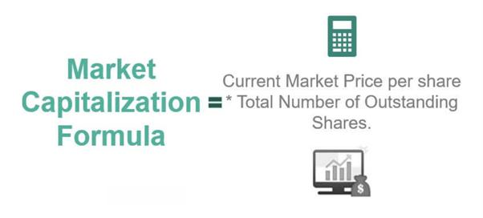

Financial markets serve as a cornerstone of global economies, forming a complex network where financial instruments such as stocks, bonds, and currencies are traded. These markets facilitate the efficient allocation of resources, support the transfer of funds between savers and borrowers, and play a pivotal role in determining the cost of capital for enterprises. The functionality and health of financial markets are thus integral to economic stability and growth.

Market capitalization is a critical metric within equity markets, used to gauge the total value of a publicly traded company's outstanding shares. Calculated as the share price multiplied by the number of shares outstanding, market capitalization provides investors with a quick assessment of a company's size, level of risk, and potential for growth. As such, understanding market capitalization is essential for making informed investment decisions and analyzing market trends.

In recent decades, algorithmic trading has surged in prominence, profoundly reshaping equity markets. Algorithmic trading employs complex algorithms to automatically execute trades at high speed and volume, often reducing transaction costs and improving market liquidity. However, its proliferation also raises concerns regarding market volatility and systemic risk.

This article aims to explore fundamental concepts that underpin financial markets: market capitalization, equity markets, and algorithmic trading. It will examine how these elements interact, their impact on market dynamics, and the ongoing evolution within financial markets. Key areas of focus will include the calculation and significance of market capitalization, the function and influence of equity markets, and the strategies and implications of algorithmic trading. This foundational understanding will provide insights into current trends and future possibilities in global financial markets.

## Table of Contents

## Understanding Market Capitalization

Market capitalization, commonly referred to as "market cap," is a fundamental metric used in finance to assess the total value of a publicly traded company's equity. It is calculated by multiplying the current share price by the total number of outstanding shares. Mathematically, it can be expressed as:

$$
\text{Market Capitalization} = \text{Share Price} \times \text{Total Outstanding Shares}
$$

This metric serves as an essential indicator of a company's size, with significant implications for investors and market analysts. Market capitalization categorizes companies into different segments: large-cap, mid-cap, and small-cap. These classifications help investors assess risk, growth potential, and investment strategy suitability.

### Importance of Market Capitalization

Market capitalization is pivotal in evaluating the size and scope of a company. Large-cap companies, generally valued at $10 billion or more, are typically well-established with a history of stable earnings. Mid-cap companies, valued between $2 billion and $10 billion, often represent growth opportunities with potentially higher risks than large-cap firms. Small-cap companies, valued below $2 billion, offer high growth potential but are usually riskier and more volatile.

Investors rely on market capitalization to gauge the investment potential of a company. Larger companies often provide consistent returns with lower risk, making them appealing for conservative portfolios. Meanwhile, smaller companies might attract investors seeking aggressive growth opportunities, willing to assume more risk for higher returns.

### Influence on Investment Decisions and Market Trends

Market capitalization exerts significant influence on market trends. It determines a company's weight in stock indices such as the S&P 500 or the FTSE 100, impacting fund management strategies, particularly index funds and ETFs. Changes in a company's market cap can lead to its inclusion or exclusion from indexes, causing shifts in institutional investment patterns.

Moreover, market capitalization impacts [liquidity](/wiki/liquidity-risk-premium) and stock price [volatility](/wiki/volatility-trading-strategies). Large-cap stocks usually experience high trading volumes and lower volatility, whereas small-cap stocks may exhibit significant price swings due to lower liquidity.

### Global Market Capitalization Trends

Globally, market capitalization trends reflect the economic health and growth prospects of different regions. As of recent [statistics](/wiki/bayesian-statistics), the United States maintains the largest share of global market capitalization, driven by its robust equity markets and leading companies in technology, healthcare, and consumer goods. Emerging markets, however, have been increasing their share, propelled by rapid economic development and growing investor interest.

In recent years, global market capitalization has experienced significant growth, driven by technological advancements, globalization, and increased investor participation. However, it remains susceptible to macroeconomic factors such as interest rates, geopolitical tensions, and regulatory changes, which can lead to fluctuations in market valuations.

In conclusion, understanding market capitalization is crucial for investors and analysts assessing company value and potential market performance. Its role in investment decision-making, combined with evolving global trends, continues to shape the landscape of financial markets.

## The Role of Equity Markets

Equity markets, commonly known as stock markets, are venues where shares or stocks of publicly held companies are issued, bought, and sold. They play a crucial role in the economy by facilitating the transfer of funds between investors and businesses, thereby contributing to capital formation and economic development.

Equity markets function through the trading of securities, primarily shares of corporations, on stock exchanges or over-the-counter markets. These markets provide a platform for companies to raise capital through initial public offerings (IPOs) and for investors to gain partial ownership in corporations through the purchase of stocks. The two primary types of securities traded in equity markets are common stocks and preferred stocks. Common stocks offer shareholders voting rights and potential dividends, while preferred stocks typically provide fixed dividends and priority over common stocks in the event of liquidation.

The relationship between equity market capitalization and the overall economy is significant. Market capitalization, calculated as the share price multiplied by the number of outstanding shares, indicates the total market value of a company's equity. This metric is often used to gauge the economic strength of a country. Higher market capitalization reflects investor confidence and economic vitality, as it implies that companies are valued highly, potentially leading to increased investments and consumption.

Equity markets impact financial growth by enabling [capital raising](/wiki/hedge-fund-capital-raising) for businesses, which is essential for expansion, research and development, and technological advancements. When companies access funds through equity markets, they can invest in projects that drive innovation and competitiveness, fostering overall industrial growth. Moreover, equity markets facilitate corporate financing by providing liquidity, where investors can easily buy and sell securities, thus creating an efficient mechanism for resource allocation.

Recent trends in global equity markets highlight increased globalization, with cross-border listings and investments becoming more common. The rise of technology, such as electronic trading platforms and high-frequency trading, has enhanced market efficiency. Additionally, emerging markets have witnessed significant growth, contributing to a shift in the balance of global market capitalization. These trends underscore the growing interconnectedness and complexity of modern equity markets, as they continue to evolve and adapt to new economic challenges and opportunities.

## Algorithmic Trading in Equity Markets

Algorithmic trading refers to the use of computer algorithms to automate trading processes in financial markets, including equity markets. These algorithms execute orders based on predefined criteria such as timing, price, and [volume](/wiki/volume-trading-strategy), allowing traders to process large volumes of transactions with high speed and efficiency. 

### Components of Algorithmic Trading

Algorithmic trading platforms consist of several key components: 

1. **Trade Execution Algorithms**: These algorithms determine the timing and parameters for executing trades, often based on historical data and market conditions. 
2. **Trade Monitoring Systems**: These systems track market activity and adjust trading strategies in real time.
3. **Backtesting Frameworks**: Backtesting evaluates the effectiveness of trading strategies by applying them to historical market data before real-world implementation.

### Advantages of Algorithmic Trading

Algorithmic trading offers multiple benefits to market participants:

- **Speed and Efficiency**: Algorithms can process and execute orders much faster than human traders, significantly reducing the time between order placement and execution.
- **Reduced Transaction Costs**: By optimizing trade execution, algorithms can minimize the costs associated with trading, including market impact and opportunity costs.
- **Precision and Accuracy**: Automated systems ensure that trades are executed with high precision, adhering to the defined criteria without human error.

### Strategies in Algorithmic Trading

Several strategies are prevalent in [algorithmic trading](/wiki/algorithmic-trading), each leveraging different market inefficiencies:

- **Arbitrage**: This strategy exploits price discrepancies of the same asset in different markets or forms.
- **Market Making**: Algorithms generate profits by simultaneously offering buy and sell quotes on an asset, capturing the spread between the bid and ask prices.
- **Statistical Arbitrage**: This involves complex quantitative models to identify and capitalize on short-term mispricings between securities.

### Technological Infrastructure

Successful implementation of algorithmic trading requires robust technological infrastructure, including:

- **High-Speed Connectivity**: Ensures rapid access to market data and swift execution of trades.
- **Advanced Computational Systems**: Necessary to handle large datasets and perform complex mathematical calculations without delay.
- **Reliable Data Feeds**: Guarantee that trading decisions are based on accurate and real-time market information.

### Risks and Challenges

Despite its advantages, algorithmic trading also presents risks and challenges:

- **Market Volatility**: High-frequency trading can contribute to increased market volatility, potentially leading to flash crashes.
- **System Failures**: Technical glitches or failures can result in significant financial losses.
- **Regulatory Scrutiny**: Due to its potential impact on market stability, algorithmic trading is subject to strict regulatory oversight to prevent market manipulation.

In conclusion, algorithmic trading plays a critical role in modern equity markets, driving the efficiency and speed of trading processes while posing distinct risks that require careful management and regulation.

## Impact of Algorithmic Trading on Market Capitalization

Algorithmic trading, a process leveraging computer algorithms to execute trades at very high speeds and frequencies, has significantly reshaped equity markets and their capitalization. This form of trading primarily impacts market capitalization through its influence on market liquidity, volatility, and trading volumes. 

High-frequency trading ([HFT](/wiki/high-frequency-trading-strategies)), a subset of algorithmic trading, is one of the most influential forms on today's markets. HFT enhances market liquidity by providing a constant flow of buy and sell orders, thereby narrowing bid-ask spreads. This improvement in liquidity bolsters market efficiency and can lead to more accurate price discovery, which may subsequently influence market capitalization as stock prices adjust to reflect this information. However, increased HFT participation often correlates with heightened market volatility, which can lead to fluctuations in market capitalization. The rapid execution of trades may result in dramatic price changes within short periods, potentially destabilizing markets during episodes of high volatility.

Algorithmic trading volumes have been shown to have a complex correlation with market capitalization trends. On one hand, the increasing prevalence of algorithmic trading has been associated with a rise in overall trade volumes, which can lead to more efficient markets and robust capitalizations. Conversely, the same trading strategies can destabilize equities, affecting long-term capitalization stability. For instance, sudden influxes or withdrawals of algorithm-driven trades can lead to transient distortions in asset pricing, impacting immediate market capitalization assessments.

Regulatory concerns surrounding algorithmic trading focus on its potential to create systemic risks. These concerns have led several market regulators to implement measures aimed at minimizing the adverse effects of algorithm-driven market activity. Regulatory efforts, such as the imposition of circuit breakers and the introduction of minimum resting times for orders, seek to control excessive volatility and ensure fair trading environments.

Case studies underscore the impact of algorithmic trading on market capitalization. The "Flash Crash" of May 6, 2010, serves as a prominent example. In this event, rapid and large-scale algorithmic trades contributed to a sudden market plunge, temporarily wiping out approximately $1 trillion in equity market value. The event highlighted vulnerabilities and led to increased scrutiny and subsequent regulation of algorithmic trading practices. More recently, various studies have indicated algorithmic trading’s role in driving up trade volumes and market efficiency in emerging markets, aiding in market capitalization growth.

The dynamic influence of algorithmic trading on market capitalization presents both opportunities and challenges for market participants and regulators. Continued technological advancements and refined regulatory measures are essential to harness the benefits and mitigate the risks associated with this modern trading paradigm.

## Future Trends in the Financial Markets

The future of financial markets is poised for significant transformation driven by emerging trends in equity markets and market capitalization growth. One of the most notable trends is the continued innovation in algorithmic trading. This type of trading relies heavily on sophisticated algorithms and models to execute trades at high speeds and volumes, thereby enhancing market efficiency and liquidity. Technological advancements in this domain are accelerating, with the integration of big data analytics and cloud computing platforms providing traders with more robust and scalable solutions.

Furthermore, [artificial intelligence](/wiki/ai-artificial-intelligence) (AI) and [machine learning](/wiki/machine-learning) are becoming integral to future trading strategies. AI's ability to analyze vast amounts of data rapidly and identify patterns that are inconspicuous to the human eye promises to optimize decision-making processes in trading. Machine learning models can improve the accuracy of predictions related to market movements by continuously learning from new data, thus adapting strategies in real time to maximize returns. For instance, [reinforcement learning](/wiki/reinforcement-learning), a subset of machine learning, is being utilized to develop models that adapt and optimize trading strategies based on historical successes and failures.

As the global financial landscape evolves, market capitalization is expected to follow suit, influenced by diverse factors such as technological progress, regulatory changes, and macroeconomic environments. The rise of emerging markets and the integration of sustainable investment practices are also contributing to shifts in global market capitalization. Data suggests a growing emphasis on environmental, social, and governance ([ESG](/wiki/esg-investing)) criteria affecting how companies are valued and how capital is allocated.

Lastly, the financial markets are progressively adopting blockchain technology, promising greater transparency, security, and efficiency. Blockchain could redefine traditional trading systems by facilitating faster settlement times and reducing counterparty risk through decentralized ledgers.

In conclusion, the financial markets are on a trajectory of transformation characterized by the interplay of market capitalization strategies and algorithmic trading advancements. The future will likely witness an intertwining of AI, machine learning, and blockchain technologies, creating a dynamic and interconnected market ecosystem that could redefine investment paradigms. These changes underscore the need for continuous adaptation and innovation to thrive in a rapidly evolving financial environment.

## References & Further Reading

[1]: Bergstra, J., Bardenet, R., Bengio, Y., & Kégl, B. (2011). ["Algorithms for Hyper-Parameter Optimization."](https://dl.acm.org/doi/10.5555/2986459.2986743) Advances in Neural Information Processing Systems 24.

[2]: ["Advances in Financial Machine Learning"](https://www.amazon.com/Advances-Financial-Machine-Learning-Marcos/dp/1119482089) by Marcos Lopez de Prado

[3]: ["Evidence-Based Technical Analysis: Applying the Scientific Method and Statistical Inference to Trading Signals"](https://www.amazon.com/Evidence-Based-Technical-Analysis-Scientific-Statistical/dp/0470008741) by David Aronson

[4]: ["Machine Learning for Algorithmic Trading"](https://github.com/stefan-jansen/machine-learning-for-trading) by Stefan Jansen

[5]: ["Quantitative Trading: How to Build Your Own Algorithmic Trading Business"](https://www.amazon.com/Quantitative-Trading-Build-Algorithmic-Business/dp/1119800064) by Ernest P. Chan

[6]: Aldridge, I. (2013). ["High-Frequency Trading: A Practical Guide to Algorithmic Strategies and Trading Systems."](https://books.google.com/books/about/High_Frequency_Trading.html?id=6l0DDQAAQBAJ) Wiley.

[7]: Lewis, M. (2014). ["Flash Boys: A Wall Street Revolt."](https://en.wikipedia.org/wiki/Flash_Boys) W. W. Norton & Company.

[8]: Pardo, R. (2011). ["The Evaluation and Optimization of Trading Strategies."](https://onlinelibrary.wiley.com/doi/book/10.1002/9781119196969) John Wiley & Sons.

[9]: Hasbrouck, J. (2009). ["Trading Costs and Returns for U.S. Equities: Estimating Effective Costs from Daily Data."](https://pages.stern.nyu.edu/~jhasbrou/Research/GibbsCurrent/HasbrouckJF.pdf) Review of Financial Studies, Volume 22, Issue 3.

[10]: Patel, S. (2014). ["Market Capitalization and Stock Returns: International Evidence."](https://www.researchgate.net/profile/Mitesh-Patel-15/publication/372476328_STOCK_PRICE_AND_LIQUIDITY_EFFECT_OF_STOCK_SPLIT_EVIDENCE_FROM_INDIAN_STOCK_MARKET/links/64b8edd7b9ed6874a52f9244/STOCK-PRICE-AND-LIQUIDITY-EFFECT-OF-STOCK-SPLIT-EVIDENCE-FROM-INDIAN-STOCK-MARKET.pdf) Journal of Economics and Business, Volume 72.