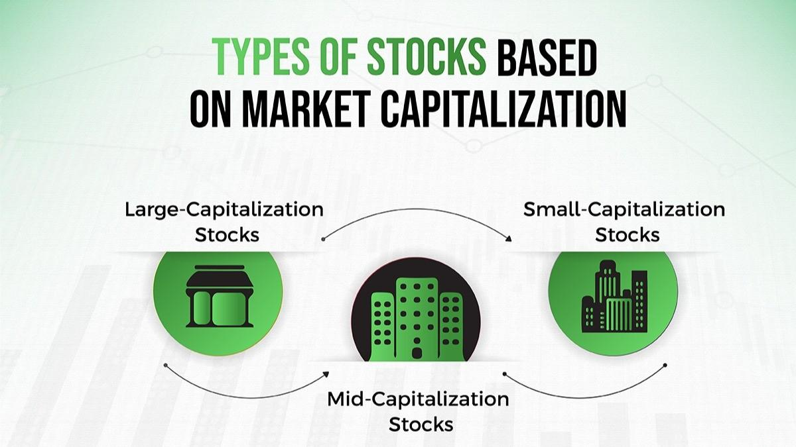

## Table of Contents

## What is equity market capitalization?

Equity market capitalization, often called market cap, is the total value of all the shares of a company's stock. It is calculated by multiplying the current stock price by the total number of shares outstanding. This number gives investors an idea of the company's size and its value in the stock market. For example, if a company has 1 million shares and each share is worth $10, the market cap would be $10 million.

Market cap is important because it helps investors compare companies and understand their relative sizes. It is often used to categorize companies into different groups like small-cap, mid-cap, and large-cap. Small-cap companies usually have a market cap of less than $2 billion, mid-cap companies are between $2 billion and $10 billion, and large-cap companies are above $10 billion. This classification helps investors decide which stocks might fit their investment strategy.

## How is market capitalization calculated?

Market capitalization is calculated by multiplying the current price of a company's stock by the total number of its shares that are available to the public. For example, if a company's stock price is $50 and there are 2 million shares available, the market capitalization would be $100 million.

This calculation gives investors a quick way to understand how big a company is in terms of its value on the stock market. It's like looking at the total price tag of the company if someone wanted to buy it all at once. Market cap is useful because it helps people compare different companies and see which ones are bigger or smaller in value.

## Why is market capitalization important for investors?

Market capitalization is important for investors because it helps them see how big a company is in the stock market. When investors know the market cap, they can compare different companies easily. For example, a company with a market cap of $100 billion is much bigger than one with a market cap of $1 billion. This size difference can tell investors which companies might be safer to invest in or which ones might grow faster.

Another reason market capitalization is important is that it helps investors decide what kind of stocks to buy. Stocks are often grouped into categories like small-cap, mid-cap, and large-cap based on their market cap. Small-cap stocks might be riskier but could grow a lot, while large-cap stocks might be safer but grow more slowly. By understanding market cap, investors can pick stocks that fit their goals and how much risk they want to take.

## What are the different categories of market capitalization?

Market capitalization is used to group companies into different sizes. The main categories are small-cap, mid-cap, and large-cap. Small-cap companies have a market cap of less than $2 billion. These companies are usually newer or smaller and can grow a lot, but they can also be riskier. Mid-cap companies have a market cap between $2 billion and $10 billion. They are bigger than small-cap companies but still have room to grow. They are often seen as a good balance between risk and growth.

Large-cap companies have a market cap of more than $10 billion. These are the biggest companies and are usually well-known. They might not grow as fast as smaller companies, but they are often seen as safer investments. Some people also talk about mega-cap companies, which are the very biggest with market caps over $200 billion or even $1 trillion. Knowing these categories helps investors choose stocks that fit their goals and how much risk they want to take.

## How does market capitalization affect a company's stock price?

Market capitalization is the total value of a company's stock, calculated by multiplying the stock price by the number of shares. It doesn't directly affect the stock price, but it can influence how people see the company. If a company's market cap is very high, it might make people think the company is big and successful. This could make more people want to buy the stock, which might push the stock price up.

On the other hand, if the market cap is low, people might think the company is small or not doing well. This could make fewer people want to buy the stock, which might make the stock price go down. But remember, market cap is just one piece of information. Other things like how the company is doing, what's happening in the economy, and news about the company can also affect the stock price.

## What role does market capitalization play in the overall economy?

Market capitalization helps show how big and valuable companies are in the economy. When you add up the market caps of all the companies in a country, you get a big number that tells you how much the whole stock market is worth. This big number can tell people if the economy is doing well or not. If the total market cap is growing, it might mean the economy is getting stronger because companies are worth more. But if it's going down, it could mean the economy is having problems.

Market cap also helps investors and businesses make choices. Investors look at market cap to decide which companies to buy stocks from. They might choose big companies with high market caps if they want safer investments, or smaller companies if they want to take more risks for possibly bigger rewards. Businesses use market cap to see how they compare to other companies and to make plans for growing or changing. So, market capitalization is a big part of understanding and working with the economy.

## How can changes in market capitalization impact investment strategies?

Changes in market capitalization can impact investment strategies because they tell investors if a company is getting bigger or smaller. If a company's market cap goes up, it might mean the company is doing well and growing. Investors might then want to buy more of that company's stock because they think it will keep growing and they can make more money. On the other hand, if a company's market cap goes down, it might mean the company is not doing so well. Investors might then decide to sell their stocks in that company to avoid losing money.

These changes also help investors decide what kind of stocks to buy. If an investor sees that many small-cap companies are growing quickly, they might decide to focus on small-cap stocks because they think they can make more money that way. But if they see that large-cap companies are more stable and safer, they might choose to invest in those instead. So, by watching how market caps change, investors can change their strategies to fit what's happening in the market and what they want to achieve with their investments.

## What are the limitations of using market capitalization as a metric?

Market capitalization is a good way to see how big a company is, but it has some problems. One big problem is that it only tells you the total value of a company's stock, not how much money the company is making or how healthy its finances are. A company might have a high market cap because a lot of people want to buy its stock, but it could still be losing money. This means market cap doesn't tell the whole story about a company's health.

Another problem is that market cap can change a lot day by day. The stock price can go up or down based on news, rumors, or what's happening in the economy. This means that a company's market cap can look very different from one day to the next, even if nothing has really changed about the company itself. So, investors need to look at other things along with market cap to get a full picture of a company's value and how it's doing.

## How do global economic factors influence market capitalization?

Global economic factors can have a big impact on market capitalization. Things like how strong the world economy is, what interest rates are, and what's happening with trade between countries can all change how much people are willing to pay for stocks. For example, if the world economy is doing well, people might feel more confident and buy more stocks, which can make market caps go up. But if there's a big problem like a financial crisis, people might sell their stocks and market caps can go down.

Another way global economic factors affect market capitalization is through currency values. If a country's currency gets stronger, the value of its companies' stocks might look better to foreign investors, which can push up market caps. On the other hand, if a currency gets weaker, it might make investors from other countries less interested, and market caps could go down. So, what's happening around the world can really change how much companies are worth in the stock market.

## What are the challenges companies face in maintaining or increasing their market capitalization?

Companies face many challenges when trying to keep or grow their market capitalization. One big challenge is staying profitable. If a company starts losing money, its stock price might go down, which makes its market cap smaller. This can happen if the company's products or services aren't selling well, or if costs go up a lot. Another challenge is competition. If other companies start doing better or come out with new products that are more popular, people might buy their stocks instead, making the market cap of the first company go down.

Another challenge is dealing with changes in the economy. If the economy goes into a recession, people might not want to buy as many stocks, and market caps can drop. Companies also have to deal with changes in interest rates, which can affect how much money they can borrow and how much it costs them. On top of that, companies have to keep investors happy. If investors think the company isn't doing a good job or if there's bad news about the company, they might sell their stocks, which can lower the market cap. So, companies have to work hard to keep their market cap up by staying profitable, staying ahead of the competition, and dealing with economic changes.

## How does market capitalization relate to other financial metrics like P/E ratio?

Market capitalization and the price-to-earnings (P/E) ratio are two different ways to look at a company's value. Market cap tells you how much the whole company is worth based on its stock price and the number of shares. The P/E ratio, on the other hand, tells you how much people are willing to pay for each dollar of the company's earnings. It's calculated by dividing the stock price by the earnings per share. So, market cap gives you a big picture of the company's size, while the P/E ratio gives you an idea of what investors think about the company's future earnings.

These two metrics can help investors understand a company better when used together. A high market cap might mean a company is big and well-known, but if its P/E ratio is also high, it could mean that investors think the company will keep growing and making more money in the future. On the other hand, if a company has a high market cap but a low P/E ratio, it might mean that the company is big but not growing as fast as investors want. By looking at both market cap and P/E ratio, investors can get a fuller picture of a company's value and its potential for growth.

## What advanced strategies can investors use to analyze market capitalization trends?

Investors can use advanced strategies to analyze market capitalization trends by looking at historical data and using technical analysis. They can study how a company's market cap has changed over time to see if there are patterns or cycles. For example, they might notice that a company's market cap goes up every time it releases a new product. By using charts and graphs, investors can spot these trends and make better guesses about where the market cap might go next. They can also use moving averages, which are lines on a chart that show the average market cap over a certain time, to see if the market cap is going up or down in the long run.

Another strategy is to use [fundamental analysis](/wiki/fundamental-analysis), which means looking at the company's financial health and how it's doing in its industry. Investors can compare a company's market cap to its earnings, sales, and other financial numbers to see if the market cap makes sense. They might also look at what's happening in the economy and the world to see how these things could affect the company's market cap. For example, if there's a big change in interest rates or a new law that affects the company's industry, it could change how investors see the company's future and its market cap. By combining these different ways of looking at market cap, investors can make smarter choices about which stocks to buy or sell.

## What is Understanding Market Capitalization?

Market capitalization, commonly referred to as "market cap," is a fundamental metric used in finance to assess the total value of a publicly traded company's equity. It is calculated by multiplying the current share price by the total number of outstanding shares. Mathematically, it can be expressed as:

$$
\text{Market Capitalization} = \text{Share Price} \times \text{Total Outstanding Shares}
$$

This metric serves as an essential indicator of a company's size, with significant implications for investors and market analysts. Market capitalization categorizes companies into different segments: large-cap, mid-cap, and small-cap. These classifications help investors assess risk, growth potential, and investment strategy suitability.

### Importance of Market Capitalization

Market capitalization is pivotal in evaluating the size and scope of a company. Large-cap companies, generally valued at $10 billion or more, are typically well-established with a history of stable earnings. Mid-cap companies, valued between $2 billion and $10 billion, often represent growth opportunities with potentially higher risks than large-cap firms. Small-cap companies, valued below $2 billion, offer high growth potential but are usually riskier and more volatile.

Investors rely on market capitalization to gauge the investment potential of a company. Larger companies often provide consistent returns with lower risk, making them appealing for conservative portfolios. Meanwhile, smaller companies might attract investors seeking aggressive growth opportunities, willing to assume more risk for higher returns.

### Influence on Investment Decisions and Market Trends

Market capitalization exerts significant influence on market trends. It determines a company's weight in stock indices such as the S&P 500 or the FTSE 100, impacting fund management strategies, particularly index funds and ETFs. Changes in a company's market cap can lead to its inclusion or exclusion from indexes, causing shifts in institutional investment patterns.

Moreover, market capitalization impacts [liquidity](/wiki/liquidity-risk-premium) and stock price [volatility](/wiki/volatility-trading-strategies). Large-cap stocks usually experience high trading volumes and lower volatility, whereas small-cap stocks may exhibit significant price swings due to lower liquidity.

### Global Market Capitalization Trends

Globally, market capitalization trends reflect the economic health and growth prospects of different regions. As of recent [statistics](/wiki/bayesian-statistics), the United States maintains the largest share of global market capitalization, driven by its robust equity markets and leading companies in technology, healthcare, and consumer goods. Emerging markets, however, have been increasing their share, propelled by rapid economic development and growing investor interest.

In recent years, global market capitalization has experienced significant growth, driven by technological advancements, globalization, and increased investor participation. However, it remains susceptible to macroeconomic factors such as interest rates, geopolitical tensions, and regulatory changes, which can lead to fluctuations in market valuations.

In conclusion, understanding market capitalization is crucial for investors and analysts assessing company value and potential market performance. Its role in investment decision-making, combined with evolving global trends, continues to shape the landscape of financial markets.

## References & Further Reading

[1]: Bergstra, J., Bardenet, R., Bengio, Y., & Kégl, B. (2011). ["Algorithms for Hyper-Parameter Optimization."](https://dl.acm.org/doi/10.5555/2986459.2986743) Advances in Neural Information Processing Systems 24.

[2]: ["Advances in Financial Machine Learning"](https://www.amazon.com/Advances-Financial-Machine-Learning-Marcos/dp/1119482089) by Marcos Lopez de Prado

[3]: ["Evidence-Based Technical Analysis: Applying the Scientific Method and Statistical Inference to Trading Signals"](https://www.amazon.com/Evidence-Based-Technical-Analysis-Scientific-Statistical/dp/0470008741) by David Aronson

[4]: ["Machine Learning for Algorithmic Trading"](https://github.com/stefan-jansen/machine-learning-for-trading) by Stefan Jansen

[5]: ["Quantitative Trading: How to Build Your Own Algorithmic Trading Business"](https://www.amazon.com/Quantitative-Trading-Build-Algorithmic-Business/dp/1119800064) by Ernest P. Chan

[6]: Aldridge, I. (2013). ["High-Frequency Trading: A Practical Guide to Algorithmic Strategies and Trading Systems."](https://books.google.com/books/about/High_Frequency_Trading.html?id=6l0DDQAAQBAJ) Wiley.

[7]: Lewis, M. (2014). ["Flash Boys: A Wall Street Revolt."](https://en.wikipedia.org/wiki/Flash_Boys) W. W. Norton & Company.

[8]: Pardo, R. (2011). ["The Evaluation and Optimization of Trading Strategies."](https://onlinelibrary.wiley.com/doi/book/10.1002/9781119196969) John Wiley & Sons.

[9]: Hasbrouck, J. (2009). ["Trading Costs and Returns for U.S. Equities: Estimating Effective Costs from Daily Data."](https://pages.stern.nyu.edu/~jhasbrou/Research/GibbsCurrent/HasbrouckJF.pdf) Review of Financial Studies, Volume 22, Issue 3.

[10]: Patel, S. (2014). ["Market Capitalization and Stock Returns: International Evidence."](https://www.researchgate.net/profile/Mitesh-Patel-15/publication/372476328_STOCK_PRICE_AND_LIQUIDITY_EFFECT_OF_STOCK_SPLIT_EVIDENCE_FROM_INDIAN_STOCK_MARKET/links/64b8edd7b9ed6874a52f9244/STOCK-PRICE-AND-LIQUIDITY-EFFECT-OF-STOCK-SPLIT-EVIDENCE-FROM-INDIAN-STOCK-MARKET.pdf) Journal of Economics and Business, Volume 72.