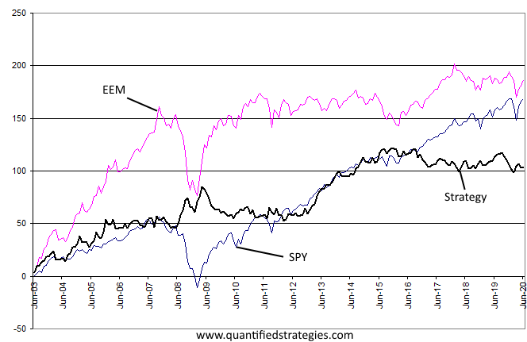

The world of stock trading is vast and complex, with various strategies designed to cater to different market conditions and investor goals. One prominent strategy within this domain is the equity market neutral strategy, which seeks to deliver consistent returns regardless of whether the overall market is trending upwards, downwards, or remaining stagnant. This approach involves crafting a portfolio with equal values in long and short positions, thereby minimizing exposure to market volatility and emphasizing stock selection over broader market trends.

Equity market neutral strategies have garnered significant interest, particularly among institutional investors, due to their potential to provide steady returns while mitigating risks associated with market fluctuations. The implementation of these strategies involves sophisticated methodologies, often rooted in algorithmic trading and quantitative analysis. By leveraging advanced algorithms, investors can rapidly identify price inefficiencies and execute trades with high precision and minimal transaction costs.



Incorporating technology and mathematical models enhances the ability of investors to maintain market neutrality, adapting swiftly to shifting trading conditions. As a result, equity market neutral strategies stand as a compelling option for investors seeking diversification and stability in their investment portfolios. This article explores the intricate details of these strategies, discussing their advantages and the role of algorithmic trading in their execution.

## Table of Contents

## Understanding Equity Market Neutral Strategies

Equity market neutral strategies are designed to mitigate market exposure by maintaining an equilibrium between long and short positions in related stocks. This balanced approach aims to neutralize the impact of broader market movements on the portfolio's performance, allowing investors to focus on individual stock selection rather than market trends. The strategy's success is measured by the spread between long and short positions, which reflects the investor's ability to pick stocks that outperform the market, irrespective of its overall direction.

A key objective of equity market neutral strategies is to hedge against directional market exposure. By constructing a portfolio where the aggregate value of long positions is approximately equal to that of short positions, investors aim to achieve returns that are independent of market volatility. This is accomplished by identifying pairs or groups of stocks that are expected to behave in a relatively similar manner in response to market movements, and then taking a long position in one set while shorting the other. The hedged structure enables investors to profit from the relative performance of specific equities without being significantly affected by market-wide trends.

Leveraging both long and short positions allows investors to reduce portfolio volatility and customize their returns based on their stock-[picking](/wiki/asset-class-picking) expertise. This dual-position approach facilitates the strategic selection of undervalued stocks for long positions and overvalued stocks for short positions, enhancing the potential for returns derived from stock-specific movements. Consequently, the strategy emphasizes the importance of rigorous stock analysis and independent judgment rather than reliance on the general market trajectory. 

Mathematically, an equity market neutral portfolio seeks to achieve a beta (β) of zero, where beta is a measure of a portfolio's sensitivity to market movements. A beta of zero indicates that the portfolio is theoretically immune to market fluctuations, making its performance independent of the directionality of the market as a whole. This neutral stance is critical for investors aiming to achieve steady returns while minimizing exposure to market risk.

## The Role of Algorithmic Trading

Algorithmic trading is integral to the effective implementation of equity market neutral strategies, primarily due to its ability to enhance speed, accuracy, and efficiency in trade execution. This approach employs quantitative models and advanced algorithms to detect pricing inefficiencies in the market, allowing for timely and precise trading actions. The automation provided by algorithms significantly reduces transaction costs by optimizing the entry and [exit](/wiki/exit-strategy) points, ensuring trades are executed at the most favorable prices.

Machine learning and [artificial intelligence](/wiki/ai-artificial-intelligence) further enhance these algorithms by enabling them to adapt to changing market conditions. Through the use of sophisticated data analysis techniques, [machine learning](/wiki/machine-learning) models can process vast amounts of historical and real-time data to predict future market movements and identify opportunities for profitable trades. Adaptive strategies, powered by AI, can quickly recalibrate their positions in response to market fluctuations, enhancing their effectiveness in maintaining market neutrality.

Algorithmic trading also ensures the continual balancing of long and short positions, which is essential for market neutral strategies. This balance is crucial for mitigating market exposure and achieving stable returns. The algorithms can swiftly adjust these positions, recalibrating portfolios to maintain neutrality as market dynamics shift. For example, a basic Python snippet that illustrates how an algorithm might adjust positions based on market signals could look like this:

```python
def adjust_positions(long_positions, short_positions, market_signals):
    for stock, signal in market_signals.items():
        if signal > 0:  # Positive signal indicates potential for long position
            long_positions[stock] += signal
            short_positions[stock] = max(0, short_positions[stock] - signal)
        elif signal < 0:  # Negative signal indicates potential for short position
            short_positions[stock] -= signal
            long_positions[stock] = max(0, long_positions[stock] + signal)
    return long_positions, short_positions

# Example usage
current_long_positions = {'AAPL': 50, 'MSFT': 40}
current_short_positions = {'GOOG': 30, 'AMZN': 20}
market_signals = {'AAPL': 5, 'GOOG': -3, 'MSFT': -2, 'AMZN': 4}

new_long_positions, new_short_positions = adjust_positions(current_long_positions, current_short_positions, market_signals)
```

In this example, the `adjust_positions` function modifies long and short positions based on dynamic market signals, ensuring that the portfolio remains balanced and market neutral.

Overall, [algorithmic trading](/wiki/algorithmic-trading) facilitates the efficient execution of equity market neutral strategies by leveraging quantitative methods and technological advancements, providing the necessary tools to navigate complex market environments with precision and reduce exposure to market [volatility](/wiki/volatility-trading-strategies).

## Advantages of Equity Market Neutral Strategies

Equity market neutral strategies offer several advantages for investors seeking stable and consistent returns in varying market conditions. These strategies are characterized by their balanced approach of taking both long and short positions, reducing exposure to market risks and enhancing portfolio resilience.

**Reduced Market Risk**: By maintaining a neutral stance through equal long and short positions, equity market neutral strategies inherently mitigate exposure to systemic market risks. This approach aims to isolate and capitalize on the performance of individual stocks or sectors rather than the broader market trends. As a result, investors are less vulnerable to market downturns or volatility, providing a layer of protection against unfavorable market movements.

**Consistent Returns**: One of the primary objectives of equity market neutral strategies is to achieve positive returns irrespective of the direction of the overall market. This is accomplished by focusing on stock selection and identifying mispriced securities, allowing investors to gain from both upward and downward price movements. The emphasis on consistency provides a reliable performance metric that is less influenced by market cycles, making it attractive for risk-averse investors seeking steady income.

**Portfolio Diversification**: Another significant advantage of equity market neutral strategies is their low correlation with traditional investment portfolios. By diversifying investments between long and short positions, these strategies offer an additional layer of diversification, enhancing the overall resilience of a portfolio. This diversification is particularly valuable during periods of market stress when traditional asset classes may experience simultaneous declines.

**Adaptability**: The integration of algorithmic trading into market neutral strategies allows for efficient and dynamic adjustments to rapidly changing market conditions. Algorithms can quickly analyze vast amounts of market data to identify price inefficiencies and execute trades with speed and precision. This adaptability ensures that portfolios remain balanced and aligned with their market neutral objectives, even in the face of volatility. By employing sophisticated quantitative models and leveraging machine learning techniques, investors can continuously refine their strategies to maintain optimal performance.

In summary, equity market neutral strategies provide reduced market risk, consistent returns, enhanced diversification, and adaptability through algorithmic trading. These advantages make them a compelling option for investors seeking stability and resilience in their investment portfolios.

## Implementing Market Neutral Strategies

Implementing market neutral strategies requires a multifaceted approach that begins with a meticulous selection of stocks. This process relies heavily on quantitative models to identify optimal long and short positions, factoring in valuation metrics, historical performance data, and market forecasts. Quantitative analysts often use statistical techniques such as mean reversion and [pair trading](/wiki/pair-trading) strategies to predict potential price movements. Tools like the Capital Asset Pricing Model (CAPM) or Fama-French Three-Factor Model can aid in evaluating expected returns and stock anomalies, enhancing the decision-making process for stock selection. 

Risk management is an essential component in [market neutral strategy](/wiki/market-neutral-strategy) implementation. By diversifying their portfolios and carefully determining position sizes, investors can mitigate potential losses. Diversification minimizes unsystematic risk—the risk specific to individual stocks—while position sizing ensures that no single trade disproportionately affects the overall portfolio. Constant rebalancing is also vital, as it maintains the desired market neutrality amid price fluctuations. Risk management can employ methods such as the Kelly Criterion or Value at Risk (VaR) to optimize position sizes and allocate capital effectively:

```python
def calculate_var(portfolio_returns, confidence_level=0.95):
    import numpy as np
    return np.percentile(portfolio_returns, (1-confidence_level)*100)

# Example usage:
# portfolio_returns = numpy array of returns
# var_value = calculate_var(portfolio_returns)
```

Execution of trades must be efficient and precise to minimize slippage and transaction costs. Leveraging advanced technology, traders can automate trade execution, using algorithms to trigger buy and sell orders at optimal times. High-frequency trading platforms and smart order routing systems help achieve this precision, by breaking down large orders into smaller ones and executing them incrementally across various markets to avoid price distortion. 

Monitoring and adjustment are continuous requirements to maintain market neutrality and optimize returns. This includes regular assessment of market conditions, portfolio performance reviews, and adjusting positions as necessary. Analytical tools and dashboards offer real-time insights into portfolio metrics, such as beta exposure, net market exposure, and tracking error. Additionally, machine learning models can predict future performance trends, allowing traders to proactively adjust their strategies. Consistent performance audits ensure that strategies align with investment goals, through detailed reporting and back-testing procedures. 

In summary, the implementation of market neutral strategies necessitates a robust framework that encompasses quantitative stock selection, effective risk management, technological execution, and dynamic monitoring, all essential to achieving and maintaining desired financial outcomes.

## Challenges and Risks

Execution risk is a significant challenge in equity market neutral strategies, particularly in volatile markets. When market conditions shift rapidly, delays or difficulties in executing trades can adversely affect the strategy's performance. This risk is exacerbated by the need for precise timing in capitalizing on pricing inefficiencies between long and short positions. For instance, algorithmic systems must execute trades at optimal moments to maintain market neutrality, but any lag in execution can lead to unintended market exposure or missed opportunities.

Model risk is another concern, arising from the heavy reliance on quantitative models in equity market neutral strategies. These models are designed to predict stock movements and identify [arbitrage](/wiki/arbitrage) opportunities. However, if models fail to adapt to new market conditions or changes in stock behavior, they could generate suboptimal trades or incur losses. This risk emphasizes the importance of continuously updating and validating models to ensure their effectiveness in diverse market scenarios. Effective model risk management involves stress testing models and incorporating machine learning techniques that allow for adaptability.

Liquidity risk poses a challenge, as the execution of trades hinges on the ability to readily enter or exit positions in the market. Illiquid markets, particularly those involving less traded securities, may obstruct efficient trade execution, resulting in unfavorable pricing or increased slippage. This limitation can prevent traders from achieving desired market neutrality or realizing anticipated returns. Traders must select stocks with sufficient trading [volume](/wiki/volume-trading-strategy) and actively monitor [liquidity](/wiki/liquidity-risk-premium) levels to mitigate this risk.

Cost implications, including high transaction costs and management fees, can erode potential profits if not managed carefully. The intricate nature of equity market neutral strategies involves frequent trading, which incurs significant commission and execution costs. Additionally, the sophisticated infrastructure and expertise required to implement these strategies often result in higher management fees. To minimize these cost implications, traders can use algorithmic systems that optimize trade execution, reduce slippage, and capitalize on favorable cost structures across different trading platforms.

Addressing these challenges necessitates robust execution systems, adaptive modeling strategies, diligent liquidity management, and cost-efficient trading practices. As technology and financial markets continue to evolve, the ability to navigate these risks effectively will determine the success of equity market neutral strategies.

## Conclusion

Equity market neutral strategies emphasize maintaining a balance between long and short positions to deliver consistent returns across varying market conditions. By minimizing market exposure, these strategies seek to provide stability and predictability in investment outcomes. The integration of algorithmic trading plays a significant role in enhancing the efficiency and accuracy of these strategies. Algorithms enable the rapid analysis and execution of trades, which is particularly appealing to institutional investors who benefit from technological precision and the ability to swiftly respond to market fluctuations.

Despite certain challenges, such as execution risks and the complexities of quantitative models, equity market neutral strategies offer significant advantages. They mitigate market risk and generate stable returns, making them an attractive choice for a diversified investment portfolio. As technology continues to evolve, the tools available for implementing these strategies will only become more sophisticated, lowering barriers to entry and enhancing effectiveness. Consequently, these advancements are poised to pave the way for innovative trading solutions, further expanding the potential of equity market neutral strategies in modern finance.

## References & Further Reading

[1]: ["Quantitative Equity Portfolio Management: Modern Techniques and Applications"](https://www.taylorfrancis.com/books/mono/10.1201/9781420010794/quantitative-equity-portfolio-management-edward-qian-eric-sorensen-ronald-hua) by Ludwig B. Chincarini and Daehwan Kim

[2]: ["Algorithmic Trading: Winning Strategies and Their Rationale"](https://www.amazon.com/Algorithmic-Trading-Winning-Strategies-Rationale-ebook/dp/B00CY5HC0U) by Ernest P. Chan

[3]: Grossman, S. J., & Stiglitz, J. E. (1980). ["On the Impossibility of Informationally Efficient Markets."](https://www.jstor.org/stable/1805228) The American Economic Review, 70(3), 393-408.

[4]: Gatev, E. G., Goetzmann, W. N., & Rouwenhorst, K. G. (2006). ["Pairs Trading: Performance of a Relative-Value Arbitrage Rule."](https://www.nber.org/papers/w7032) The Journal of Finance, 61(5), 2143-2173.

[5]: ["Market Neutral Strategies"](https://www.financestrategists.com/wealth-management/investment-management/market-neutral-strategies/) by Bruce I. Jacobs and Kenneth N. Levy

[6]: Narang, R. K. (2009). ["Inside the Black Box: The Simple Truth About Quantitative Trading."](https://onlinelibrary.wiley.com/doi/book/10.1002/9781118267738) Wiley Trading Series.