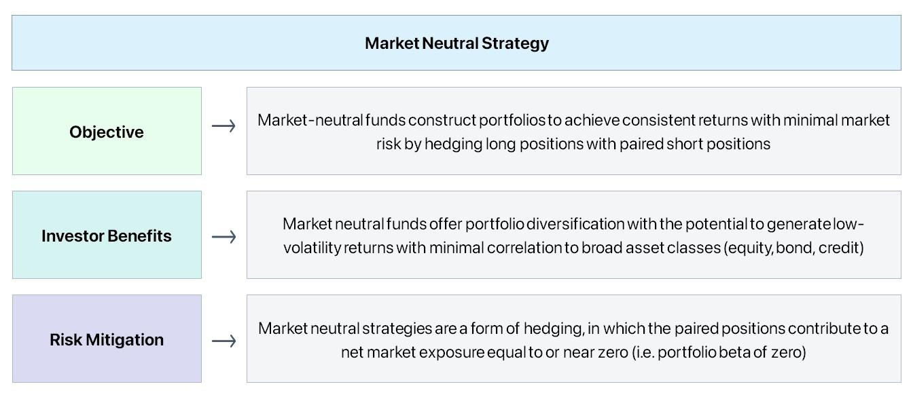

## Table of Contents

## What is an equity market neutral strategy in stock trading?

An equity market neutral strategy in stock trading is a way to invest that tries to make money no matter if the stock market goes up or down. The main idea is to balance out the risks by taking opposite positions in different stocks. For example, if you think one stock will go up, you buy it, and at the same time, if you think another stock will go down, you sell it or short it. By doing this, the gains from one stock can cancel out the losses from the other, making the overall investment less affected by general market movements.

This strategy often involves using a lot of math and analysis to pick the right pairs of stocks. Traders look at things like how much a stock's price moves compared to the market or other stocks, and they try to find stocks that will move in opposite ways. The goal is to have a portfolio where the total value stays stable, even if the market goes through ups and downs. While it sounds simple, it can be tricky to do well because it requires a lot of research and careful management to keep the balance right.

## How does an equity market neutral strategy aim to generate returns?

An equity market neutral strategy aims to generate returns by balancing long and short positions in stocks. When traders use this strategy, they buy stocks they think will go up in price (long positions) and sell stocks they think will go down (short positions). The idea is that the profits from the stocks that go up will be more than the losses from the stocks that go down. By doing this, the strategy tries to make money no matter what the overall market does. If the market goes up, the long positions might do well, and if the market goes down, the short positions might do well.

To make this work, traders use a lot of data and math to pick the right pairs of stocks. They look at things like how much a stock's price moves compared to the market or other stocks. The goal is to find stocks that move in opposite ways, so when one goes up, the other goes down. This helps keep the overall value of the portfolio stable. While it can be hard to do well because it needs a lot of research and careful management, a well-executed equity [market neutral strategy](/wiki/market-neutral-strategy) can provide steady returns without being too affected by big swings in the market.

## What are the key components of an equity market neutral strategy?

The main parts of an equity market neutral strategy are choosing the right stocks and balancing them out. Traders pick some stocks they think will go up and buy them. These are called long positions. At the same time, they pick other stocks they think will go down and sell them or short them. These are called short positions. The idea is to make money from the stocks that go up more than they lose from the stocks that go down. To do this, they need to use a lot of data and math to find stocks that will move in opposite ways.

Another important part is keeping everything in balance. Traders need to watch their portfolio all the time to make sure the long and short positions are working together to keep the overall value stable. This means they might need to change their positions if the market changes or if their predictions about the stocks change. The goal is to make steady returns without being too affected by big ups and downs in the market. It takes a lot of work and careful management, but if done right, it can help investors make money no matter what the market does.

## Can you explain the difference between long and short positions in this strategy?

In an equity market neutral strategy, a long position means you buy a stock because you think its price will go up. If the stock's price does go up, you can sell it later for more money than you paid, making a profit. For example, if you buy a stock at $10 and it goes up to $15, you make $5 per share. In this strategy, the long positions are the stocks you think will do well, and you hope they will help balance out any losses from other parts of your portfolio.

A short position is the opposite. You sell a stock you don't own because you think its price will go down. You borrow the stock from someone else, sell it at the current price, and then buy it back later at a lower price to return it to the lender. If the stock's price drops, you make money on the difference. For instance, if you sell a stock at $20 and it falls to $15, you can buy it back for $15, return it, and keep the $5 difference as profit. In an equity market neutral strategy, short positions are used to balance out the long positions, so if the market goes down, the short positions can help cover losses from the long positions.

## What are the typical risk management techniques used in equity market neutral strategies?

In an equity market neutral strategy, one important way to manage risk is by keeping a balance between long and short positions. Traders try to make sure that the value of the stocks they think will go up (long positions) is about the same as the value of the stocks they think will go down (short positions). This balance helps to reduce the impact of big market swings. If the market goes up, the long positions might do well, and if it goes down, the short positions can help cover any losses. By keeping things even, traders aim to have a portfolio that stays stable no matter what the market does.

Another technique is using stop-loss orders. These are orders that automatically sell a stock if its price drops to a certain level. This helps limit losses if a stock doesn't behave the way the trader expected. For example, if a trader goes long on a stock at $50 and sets a stop-loss at $45, the stock will be sold if it falls to $45, preventing further loss. Traders also use careful research and analysis to pick the right stocks and keep an eye on their portfolio all the time. They might change their positions if the market or their predictions change, which helps them manage risk and keep their strategy working well.

## How do equity market neutral funds differ from traditional mutual funds?

Equity market neutral funds and traditional mutual funds are different in how they try to make money and manage risk. Traditional mutual funds usually invest in a mix of stocks or bonds, trying to do well when the market goes up. They might focus on growth or income, but their success depends a lot on the overall market doing well. On the other hand, equity market neutral funds aim to make money no matter if the market goes up or down. They do this by balancing long and short positions in stocks, trying to make the gains from the stocks that go up cancel out the losses from the stocks that go down. This means they are less affected by big market swings.

Another big difference is how they manage risk. Traditional mutual funds might use diversification to spread out their investments, but they are still tied to the market's ups and downs. They don't usually use short selling, which is a key part of equity market neutral strategies. Equity market neutral funds, on the other hand, use a lot of math and analysis to pick the right pairs of stocks to balance out risks. They keep a close eye on their portfolio, making changes to keep the long and short positions balanced. This careful management helps them aim for steady returns without being too affected by the market's overall performance.

## What are the common metrics used to evaluate the performance of an equity market neutral strategy?

When people want to see how well an equity market neutral strategy is doing, they look at a few important numbers. One key metric is alpha, which shows how much better or worse the strategy is doing compared to just following the market. A positive alpha means the strategy is beating the market, which is what investors hope for. Another important number is the Sharpe ratio, which measures how much return the strategy is getting for each unit of risk it takes. A higher Sharpe ratio means the strategy is doing a good job of making money without taking too much risk.

Another metric that's often used is the information ratio, which looks at how well the strategy is doing compared to a benchmark, while also taking into account how much it moves around. A high information ratio means the strategy is not only beating the benchmark but doing so consistently. Lastly, people also look at the beta of the strategy, which tells them how much the strategy moves with the market. In an equity market neutral strategy, the goal is to have a beta close to zero, meaning the strategy isn't affected much by market ups and downs. These metrics help investors understand if the strategy is working well and managing risk properly.

## How does leverage impact an equity market neutral strategy?

Leverage can make an equity market neutral strategy more powerful but also riskier. When traders use leverage, they borrow money to buy more stocks than they could with just their own money. This means they can take bigger positions, both long and short. If their picks are right, the gains can be much bigger because they're using more money. But if their picks are wrong, the losses can also be much bigger. So, while leverage can help make more money, it can also lead to bigger losses if the market doesn't go the way they expected.

To manage the risks that come with using leverage, traders need to be very careful. They have to keep a close eye on their portfolio and be ready to make quick changes if the market moves against them. They might use stop-loss orders to limit losses or adjust their long and short positions to keep things balanced. Even though leverage can make an equity market neutral strategy more exciting, it needs a lot of careful management to make sure it doesn't get too risky.

## What are the challenges and limitations of implementing an equity market neutral strategy?

One big challenge of using an equity market neutral strategy is that it needs a lot of work and research to pick the right stocks. Traders have to use a lot of math and data to find stocks that will move in opposite ways. If they don't pick the right pairs, the strategy won't work well. Also, keeping the long and short positions balanced takes a lot of time and attention. If the market changes or their predictions are wrong, they need to make quick changes to keep everything in balance. This can be hard to do well, especially if the market is moving a lot.

Another limitation is that using leverage can make the strategy more risky. Leverage means borrowing money to buy more stocks, which can lead to bigger gains but also bigger losses. If the stocks don't go the way the trader expected, the losses can be a lot more than they would be without leverage. This makes it really important to manage risk carefully, using things like stop-loss orders and always watching the portfolio. Even though an equity market neutral strategy aims to make money no matter what the market does, it can still be hard to do well because of these challenges and the need for careful management.

## How can an investor incorporate an equity market neutral strategy into their overall investment portfolio?

An investor can add an equity market neutral strategy to their overall investment portfolio by setting aside a part of their money for this special kind of investing. They might decide to put some of their money into an equity market neutral fund, which is run by experts who balance long and short positions to try to make money no matter what the market does. This can help make the whole portfolio more stable because the equity market neutral part won't be affected much by big ups and downs in the market. The investor should think about how much risk they want to take and how much of their money they want to use for this strategy, keeping it balanced with other kinds of investments like stocks, bonds, or mutual funds.

Another way to include an equity market neutral strategy is by doing it themselves, but this takes a lot of work and knowledge. The investor would need to learn how to pick the right stocks to buy and sell, use leverage carefully, and keep everything balanced. They might use tools and data to help them make good choices. This can be tricky and risky, so it's important for them to understand the strategy well and be ready to watch their investments closely. By adding an equity market neutral strategy, the investor can try to make their portfolio less affected by market swings and maybe even out their returns over time.

## What advanced statistical methods are used in optimizing an equity market neutral strategy?

Advanced statistical methods help make an equity market neutral strategy better by using math to pick the right stocks and keep everything balanced. One method is called regression analysis, which looks at how different stocks move together. By understanding these relationships, traders can find pairs of stocks that move in opposite ways, which is key to making the strategy work. Another method is called [factor](/wiki/factor-investing) analysis, which helps break down what makes stocks move, like how much they depend on the overall market or other things like company size or industry. By using factor analysis, traders can pick stocks that will help balance out risks in their portfolio.

Another important method is called optimization, which uses math to figure out the best way to balance long and short positions. This can involve something called linear programming, which helps find the best mix of stocks to use. Traders also use something called risk parity, which makes sure that the risk is spread out evenly across all the stocks in the portfolio. These methods need a lot of data and computer power, but they can help make the strategy more successful by making better choices and managing risks more carefully. By using these advanced tools, traders can try to get steady returns no matter what the market does.

## Can you discuss case studies or real-world examples of successful equity market neutral strategies?

One famous example of a successful equity market neutral strategy is the work of the Renaissance Technologies' Medallion Fund. This fund, run by Jim Simons, a mathematician, uses a lot of math and computer power to pick stocks. They look at a huge amount of data to find patterns that help them decide which stocks to buy and which to sell short. The Medallion Fund has been very good at making money, often getting returns of over 30% a year. They keep their strategy secret, but it's clear that their use of advanced math and technology helps them balance their long and short positions well.

Another example is the AQR Equity Market Neutral Fund, managed by AQR Capital Management. This fund uses a mix of math and research to pick stocks that will move in opposite ways. They look at things like how much a stock's price moves compared to the market, and they use this information to balance their investments. The AQR fund aims to make steady returns without being too affected by big market swings. By using careful analysis and keeping a close eye on their portfolio, they have been able to do well with their equity market neutral strategy.

## References & Further Reading

[1]: ["Quantitative Equity Portfolio Management: Modern Techniques and Applications"](https://www.taylorfrancis.com/books/mono/10.1201/9781420010794/quantitative-equity-portfolio-management-edward-qian-eric-sorensen-ronald-hua) by Ludwig B. Chincarini and Daehwan Kim

[2]: ["Algorithmic Trading: Winning Strategies and Their Rationale"](https://www.amazon.com/Algorithmic-Trading-Winning-Strategies-Rationale-ebook/dp/B00CY5HC0U) by Ernest P. Chan

[3]: Grossman, S. J., & Stiglitz, J. E. (1980). ["On the Impossibility of Informationally Efficient Markets."](https://www.jstor.org/stable/1805228) The American Economic Review, 70(3), 393-408.

[4]: Gatev, E. G., Goetzmann, W. N., & Rouwenhorst, K. G. (2006). ["Pairs Trading: Performance of a Relative-Value Arbitrage Rule."](https://www.nber.org/papers/w7032) The Journal of Finance, 61(5), 2143-2173.

[5]: ["Market Neutral Strategies"](https://www.financestrategists.com/wealth-management/investment-management/market-neutral-strategies/) by Bruce I. Jacobs and Kenneth N. Levy

[6]: Narang, R. K. (2009). ["Inside the Black Box: The Simple Truth About Quantitative Trading."](https://onlinelibrary.wiley.com/doi/book/10.1002/9781118267738) Wiley Trading Series.