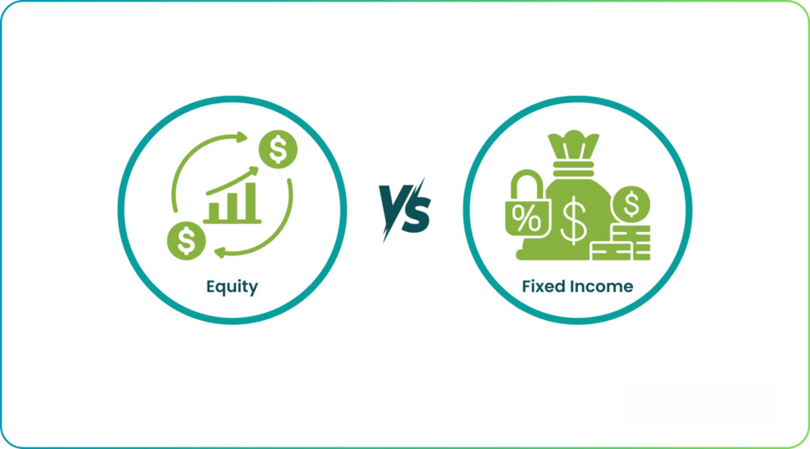

## Table of Contents

## What are equity markets?

Equity markets, also known as stock markets, are places where people buy and sell shares of companies. When you buy a share, you own a small piece of that company. This gives you a chance to make money if the company does well. The price of shares goes up and down based on how people think the company will do in the future. Big stock markets like the New York Stock Exchange and the NASDAQ are where most of this trading happens.

People and big groups like banks and investment firms trade in equity markets. They might buy shares to keep for a long time, hoping the company grows and the share price goes up. Or they might buy and sell quickly to make money from small changes in price. Equity markets are important because they help companies raise money to grow and they give people a way to invest and possibly earn more money.

## What are fixed-income markets?

Fixed-income markets are where people buy and sell bonds and other types of loans. Bonds are like IOUs where the borrower promises to pay back the money they borrowed, plus interest, over time. Governments, cities, and companies issue bonds to raise money for big projects or to run their operations. When you buy a bond, you're lending money to the issuer and they pay you interest regularly until the bond matures, at which point they pay you back the full amount.

These markets are important because they help governments and companies get the money they need without having to rely only on banks. For investors, fixed-income markets offer a way to earn steady income through the interest payments. The value of bonds can go up and down based on changes in interest rates and how safe people think the bond is. If interest rates go up, the price of existing bonds usually goes down, and if rates go down, bond prices usually go up.

## How do equity markets differ from fixed-income markets?

Equity markets and fixed-income markets are different in what they offer and how they work. Equity markets are where people buy and sell shares of companies. When you buy a share, you own a part of that company. The value of your shares can go up or down a lot based on how the company is doing and what people think about its future. People invest in equity markets hoping to make money if the company grows and the share price goes up. This can be riskier but also has the potential for bigger rewards.

Fixed-income markets, on the other hand, are where people buy and sell bonds. Bonds are like loans where the borrower, like a government or a company, promises to pay back the money with interest over time. When you buy a bond, you're lending money and you get regular interest payments until the bond matures. The value of bonds can change, but usually not as much as stocks. They are seen as safer investments because you know how much interest you'll get and when you'll get your money back. Fixed-income markets are good for people who want a steady income and less risk.

## What types of securities are traded in equity markets?

In equity markets, the main type of security traded is stocks or shares. When you buy a stock, you're buying a piece of a company. This means you own a small part of that business. Stocks can be from big companies like Apple or smaller ones. The price of a stock can go up and down a lot, depending on how the company is doing and what people think about its future. People buy stocks hoping the price will go up so they can sell them for a profit later.

There are also other types of securities in equity markets, like preferred stocks and equity derivatives. Preferred stocks are a bit different from regular stocks. They usually pay a fixed dividend and have priority over common stocks if the company goes bankrupt. Equity derivatives, like options and futures, are more complex. They are contracts that get their value from the price of a stock. These can be used to bet on where a stock's price is going or to protect against price changes.

## What types of securities are traded in fixed-income markets?

In fixed-income markets, the main type of security traded is bonds. Bonds are like loans that you give to a government, a city, or a company. They promise to pay you back the money you lent them, plus some interest over time. There are different kinds of bonds, like government bonds, which are issued by countries, and corporate bonds, which are issued by companies. Some bonds are safer and pay less interest, while others are riskier and pay more.

Another type of security in fixed-income markets is notes. Notes are similar to bonds but usually have shorter terms, often from one to ten years. They work the same way, with the issuer paying back the money with interest. There are also securities like Treasury bills, which are very short-term government securities that mature in less than a year. All these securities help governments and companies borrow money and give investors a way to earn a steady income.

## What are the risk profiles associated with equity markets?

Equity markets can be risky because the value of stocks can go up and down a lot. When you buy a stock, you're hoping the company will do well and the price of the stock will go up. But if the company has problems or if people start to think it won't do well in the future, the stock price can drop. This means you could lose money if you need to sell your stock when the price is low. Also, stocks don't pay you regular money like bonds do. You only make money if the stock price goes up or if the company pays dividends, which not all companies do.

There are different levels of risk in equity markets. Big, well-known companies, called blue-chip stocks, are usually seen as less risky because they are more stable. But even these can lose value if the whole market goes down. Smaller companies or new companies, called growth stocks, can be much riskier. They might grow a lot and make you a lot of money, but they can also fail and lose all their value. So, when you invest in equity markets, you need to think about how much risk you're okay with and choose your stocks carefully.

## What are the risk profiles associated with fixed-income markets?

Fixed-income markets are generally seen as less risky than equity markets, but they still have risks. One big risk is interest rate risk. When interest rates go up, the price of existing bonds usually goes down. This is because new bonds will pay more interest, so people won't want to buy old bonds unless their price goes down. If you need to sell your bond before it matures, you might get less money than you paid for it. Another risk is credit risk, which is the chance that the borrower might not be able to pay you back. If a company or government runs into money trouble, they might not be able to pay the interest or return your money when the bond matures.

There's also inflation risk. If inflation goes up a lot, the money you get from your bond might not buy as much as it used to. This means the real value of your investment goes down. Some bonds, like those from the government, are seen as safer because the government is less likely to go bankrupt. But even these can lose value if interest rates go up a lot. So, while fixed-income markets can give you steady income and are less risky than stocks, they still have risks you need to think about.

## How do interest rates affect equity and fixed-income markets?

Interest rates can have a big effect on both equity and fixed-income markets. In equity markets, when interest rates go up, it often makes borrowing more expensive for companies. This can slow down their growth and make their profits smaller. When people think companies won't grow as fast, they might not want to buy their stocks, so stock prices can go down. On the other hand, if interest rates go down, borrowing becomes cheaper, which can help companies grow and make more money. This can make people more excited about buying stocks, pushing prices up.

In fixed-income markets, interest rates have a direct impact on the value of bonds. When interest rates go up, new bonds will pay more interest than old ones. So, if you want to sell an old bond, you might have to lower its price to make it attractive to buyers. This means the value of your bond goes down. When interest rates go down, the opposite happens. Old bonds start to look better because they pay more interest than new ones, so their prices can go up. This is why people who invest in fixed-income markets need to keep an eye on interest rates.

## What role do equity markets play in the economy?

Equity markets help the economy grow by letting companies raise money. When a company wants to get bigger, it can sell shares to people and use the money to build new things, hire more workers, or start new projects. This helps the company grow and also creates jobs and new products for people. When people buy and sell these shares, it makes the market active and helps set prices that show how well the company is doing.

Equity markets also help people save and invest their money. When people buy shares, they are hoping the company will do well and the price of the shares will go up. This gives them a chance to make more money over time. If lots of people feel good about the economy and start buying shares, it can make the whole market go up. This can make people feel more confident about spending money and help the economy grow even more.

## What role do fixed-income markets play in the economy?

Fixed-income markets help the economy by letting governments and companies borrow money. When a government or a company needs money to build roads, schools, or factories, they can sell bonds. People buy these bonds and lend money to the government or company. In return, they get regular interest payments. This helps the government or company do big projects without having to use all their own money. It also helps the economy grow because these projects create jobs and help people.

Fixed-income markets also give people a safe way to save and invest their money. When people buy bonds, they know they will get their money back plus interest over time. This can be good for people who want a steady income or who don't want to take big risks with their money. When lots of people feel safe and start buying bonds, it can help keep the economy stable. It also helps keep interest rates in check, which is important for the whole economy.

## How can investors diversify their portfolios using both equity and fixed-income markets?

Investors can diversify their portfolios by mixing stocks from equity markets with bonds from fixed-income markets. Stocks can go up and down a lot, but they also have the chance to make a lot of money if the companies do well. Bonds are usually safer and give you regular interest payments, but they might not grow as much as stocks. By having both, you can balance the risk and reward. If the stock market goes down, the bonds can help keep your money safe. And if the stock market goes up, you can still make money from your stocks.

To do this, you might put some of your money into different kinds of stocks, like big companies and smaller ones, or companies from different countries. This way, if one type of stock does badly, the others might do well. Then, you can also put some money into different kinds of bonds, like government bonds and corporate bonds. Government bonds are usually safer, while corporate bonds might pay more interest but are riskier. By spreading your money across stocks and bonds, you can make your portfolio stronger and less likely to lose a lot of money all at once.

## What advanced strategies can be employed in trading equities versus fixed-income securities?

In trading equities, one advanced strategy is called "short selling." This is when you borrow shares of a company and sell them, hoping the price will go down. If it does, you buy the shares back at the lower price, return them to the person you borrowed them from, and keep the difference as profit. Another strategy is using options, which are contracts that give you the right to buy or sell a stock at a certain price. Options can be used to bet on where a stock's price is going or to protect your other investments from big drops. These strategies can be risky but can also make a lot of money if you guess right.

In trading fixed-income securities, one advanced strategy is called "bond laddering." This means you buy bonds that mature at different times, like one year, two years, and so on. This way, you get money back at different times and can use it to buy new bonds or spend it. Another strategy is "interest rate swaps," where you and another person agree to exchange interest payments. For example, you might swap your fixed interest payments for someone else's variable interest payments. This can help you if you think interest rates are going to change. These strategies can help you manage risk and make the most of your money in fixed-income markets.

## What is the understanding of Fixed-Income Markets?

Fixed-income markets are financial environments where participants trade securities that promise fixed periodic payments and the return of principal at maturity. These securities are instrumental for investors seeking relatively stable returns and safety of capital. The primary fixed-income securities include bonds, treasury notes, and certificates of deposit. 

**Types of Fixed-Income Securities**

1. **Bonds**: Bonds are long-term debt instruments where the issuer promises to pay the bondholder a fixed interest rate typically twice a year, and repay the principal upon maturity. They are popular among investors for providing predictable income streams and include government bonds, corporate bonds, and municipal bonds.

2. **Treasury Notes**: Treasury notes are U.S. government debt securities with maturities ranging from one to ten years. They pay a fixed interest rate every six months and are regarded as low-risk investments.

3. **Certificates of Deposit (CDs)**: CDs are time deposits offered by banks, providing fixed interest returns over specified periods, often ranging from a few months to several years. They are insured by the Federal Deposit Insurance Corporation (FDIC), providing an additional layer of security to investors.

**Risk-Return Profile of Fixed-Income Investments**

Fixed-income securities generally have a lower risk-return profile compared to equities. The predictable interest payments make fixed-income investments appealing to risk-averse investors. However, they are not without risks, which include credit risk (the possibility of default by the issuer), [interest rate](/wiki/interest-rate-trading-strategies) risk (the potential for investment value to decrease due to rising interest rates), and inflation risk (the chance that inflation will erode the purchasing power of future payments).

**The Role of Interest Rates in Fixed-Income Markets**

Interest rates are crucial in determining the attractiveness and price of fixed-income securities. Generally, as interest rates rise, existing bonds' prices fall, and vice versa. This inverse relationship can be mathematically represented through the bond's duration, which measures its sensitivity to changes in interest rates:

$$
\text{Price Change} \approx - \text{Duration} \times \Delta \text{Interest Rate}
$$

Where Price Change is the percentage change in the bond's price, Duration is the bond's duration in years, and $\Delta \text{Interest Rate}$ is the change in interest rates.

**Typical Investors in Fixed-Income Securities**

Fixed-income securities attract a wide range of investors, including individual retirees seeking stable income, institutional investors like pension funds and insurance companies, and governments looking to manage funds conservatively. Each of these investors prioritizes capital preservation and predictable returns, aligning with their risk management strategies and investment objectives. 

In summary, fixed-income markets offer a variety of investment opportunities, characterized by predictable income streams and a stable risk-return profile, influenced significantly by prevailing interest rates. These features make them a cornerstone for conservative investment portfolios.

## What are the differences between Fixed-Income and Equity Markets?

Fixed-income and equity markets are pivotal components of the financial landscape, each offering distinct opportunities and challenges for investors. Understanding the similarities and differences in investment returns, risk management strategies, liquidity, and the impact of economic factors on these markets is crucial for informed decision-making.

### Similarities and Differences in Investment Returns

Fixed-income markets primarily consist of debt securities like bonds and treasury notes, providing investors with regular interest payments and principal repayment at maturity. In contrast, equity markets involve the trading of stocks, where returns are derived from dividends and capital appreciation. While fixed-income investments typically offer lower returns with stability, equity investments have higher potential returns, coupled with higher volatility.

The expected return on a fixed-income security (such as a bond) can be estimated using the yield to maturity (YTM), which considers the present value of all future cash flows. For equities, the expected return often relies on models like the Capital Asset Pricing Model (CAPM), expressed as:

$$
\text{Expected Return} = R_f + \beta (R_m - R_f)
$$

where $R_f$ is the risk-free rate, $\beta$ is the measure of risk relative to the market, and $R_m$ is the market return.

### Risk Management Strategies

Risk management is essential across both markets, though the strategies differ due to the nature of the assets. Fixed-income investors mitigate risk through credit analysis, interest rate risk management, and diversification across different issuers and maturities. Equity investors, on the other hand, manage risk using portfolio diversification, options and futures for hedging, and stop-loss orders.

### Liquidity Comparison

Liquidity, or the ease with which assets can be bought or sold without affecting their price, varies significantly between the two markets. Fixed-income securities generally have lower liquidity compared to equities. Government bonds are more liquid than corporate bonds, given their higher trading volumes and lower default risk. Equities, especially those of large-cap companies, typically exhibit higher liquidity, allowing rapid execution of trades.

### Impact of Economic Factors

Both fixed-income and equity markets are influenced by macroeconomic factors. Interest rates directly impact fixed-income markets; as rates rise, existing bond prices tend to fall, and vice versa. Inflation expectations also play a critical role. Conversely, equity markets are affected by a broader range of economic indicators, including GDP growth, unemployment rates, and corporate earnings. Economic downturns often lead to market-wide sell-offs in equities, whereas safe-haven assets like treasury bonds might see increased demand.

### Performance Analysis Through Market Cycles

Market cycles significantly influence the performance of both asset types. During economic expansions, equities typically outperform due to increased corporate earnings and investor risk appetite. Conversely, during recessions or market downturns, fixed-income markets, especially government securities, often provide a refuge due to their stability and lower risk profile.

The interplay between these factors determines the viability and attractiveness of each market to different investor profiles. By analyzing these aspects, investors can make more informed decisions, balancing their portfolios to align with their risk tolerance and investment goals.

## References & Further Reading

[1]: Bergstra, J., Bardenet, R., Bengio, Y., & Kégl, B. (2011). ["Algorithms for Hyper-Parameter Optimization."](https://papers.nips.cc/paper/4443-algorithms-for-hyper-parameter-optimization) Advances in Neural Information Processing Systems 24.

[2]: ["Advances in Financial Machine Learning"](https://www.amazon.com/Advances-Financial-Machine-Learning-Marcos/dp/1119482089) by Marcos Lopez de Prado

[3]: ["Evidence-Based Technical Analysis: Applying the Scientific Method and Statistical Inference to Trading Signals"](https://www.amazon.com/Evidence-Based-Technical-Analysis-Scientific-Statistical/dp/0470008741) by David Aronson

[4]: ["Machine Learning for Algorithmic Trading"](https://github.com/stefan-jansen/machine-learning-for-trading) by Stefan Jansen

[5]: ["Quantitative Trading: How to Build Your Own Algorithmic Trading Business"](https://www.amazon.com/Quantitative-Trading-Build-Algorithmic-Business/dp/1119800064) by Ernest P. Chan