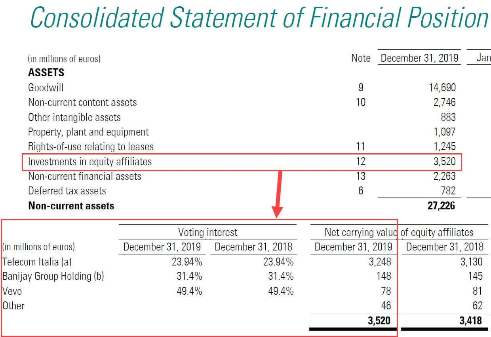

## Table of Contents

## What is the equity method in accounting?

The equity method is a way to account for investments in other companies where the investor has significant influence but not full control. This usually happens when the investor owns between 20% and 50% of the voting stock of the other company. Instead of just recording the investment at its original cost, the investor adjusts the value of the investment based on their share of the other company's profits or losses. This means if the other company makes a profit, the investor increases the value of their investment, and if the other company has a loss, the investor decreases the value of their investment.

When using the equity method, the investor also needs to record their share of the other company's dividends. If the other company pays out dividends, the investor reduces the value of their investment by the amount of dividends they receive. This method helps give a more accurate picture of the investor's financial position because it reflects changes in the value of the investment over time, rather than just showing the initial cost. It's like keeping a running tally of how the investment is doing, based on the performance of the company they've invested in.

## When should a company use the equity method?

A company should use the equity method when it has significant influence over another company but does not fully control it. This usually happens when the company owns between 20% and 50% of the voting stock of the other company. Significant influence means the company can affect the decisions of the other company, like how it runs its business or makes important choices. By using the equity method, the company can show how well the investment is doing by adjusting the value of the investment based on their share of the other company's profits or losses.

The equity method is different from just keeping track of the original cost of the investment. Instead, it helps give a clearer picture of how the investment's value changes over time. For example, if the other company makes a profit, the company using the equity method will increase the value of their investment. If the other company has a loss, they will decrease the value. Also, if the other company pays dividends, the company will reduce the value of their investment by the amount of dividends they receive. This way, the company can see a more accurate reflection of their financial position based on the performance of the company they've invested in.

## How does the equity method differ from the cost method?

The equity method and the cost method are two different ways to account for investments in other companies. The equity method is used when a company has significant influence over another company, usually when it owns between 20% and 50% of the voting stock. With the equity method, the value of the investment changes based on the investor's share of the other company's profits or losses. If the other company makes a profit, the investor increases the value of their investment. If the other company has a loss, the investor decreases the value. Also, if the other company pays dividends, the investor reduces the value of their investment by the amount of dividends received.

The cost method, on the other hand, is used when a company does not have significant influence over the other company, usually when it owns less than 20% of the voting stock. With the cost method, the investment is recorded at its original cost and stays the same unless there's a permanent drop in value. The investor only records income from the investment when they receive dividends. So, the value of the investment doesn't change based on the other company's profits or losses, just on the dividends paid out. This makes the cost method simpler but less reflective of the investment's current value compared to the equity method.

## What are the steps to apply the equity method?

To apply the equity method, first, you need to figure out if you have significant influence over the company you've invested in. This usually means you own between 20% and 50% of their voting stock. Once you know you have significant influence, you record your investment at its initial cost. This is the starting point for using the equity method.

After that, you need to keep track of the other company's profits and losses. If they make a profit, you increase the value of your investment by your share of that profit. If they have a loss, you decrease the value of your investment by your share of that loss. Also, if the other company pays dividends, you need to reduce the value of your investment by the amount of dividends you receive. This way, you keep your investment value up to date based on how well the other company is doing.

By following these steps, you can use the equity method to show a more accurate picture of your investment's value over time. It's like keeping a running tally that reflects the other company's performance, which is more informative than just keeping track of the original cost of your investment.

## How is the initial investment recorded under the equity method?

When you first invest in another company using the equity method, you record the investment at its initial cost. This means you write down the amount you paid for the shares in your accounting records. This initial cost is the starting point for tracking your investment's value over time.

After you record the initial cost, you don't just leave it at that. You need to keep an eye on the other company's profits and losses. If they make a profit, you add your share of that profit to the value of your investment. If they have a loss, you subtract your share of that loss. This way, the value of your investment changes to reflect how the other company is doing.

## How are subsequent earnings and losses accounted for under the equity method?

After you record the initial cost of your investment, you need to keep track of the other company's earnings and losses. If the other company makes a profit, you add your share of that profit to the value of your investment. For example, if you own 30% of the other company and they make a $100,000 profit, you would increase the value of your investment by $30,000. This way, your investment's value goes up when the other company does well.

On the other hand, if the other company has a loss, you subtract your share of that loss from the value of your investment. So, if the same company has a $50,000 loss, you would decrease the value of your investment by $15,000 (30% of $50,000). This means your investment's value goes down when the other company doesn't do well. By doing this, you keep your investment's value up to date based on how the other company is performing.

## What adjustments are made for dividends received under the equity method?

When you use the equity method, you need to make adjustments if the company you've invested in pays out dividends. If you get dividends, you reduce the value of your investment by the amount of dividends you receive. This is because dividends are a part of the company's profits, and you've already added your share of those profits to your investment's value.

For example, if you own 30% of a company and they pay out $10,000 in dividends, you would decrease the value of your investment by $3,000 (30% of $10,000). This way, you keep your investment's value accurate by accounting for the money you get back from the company. It's like keeping a running tally that reflects not just the company's performance, but also the cash you receive from them.

## How does the equity method impact the investor's financial statements?

When a company uses the equity method, it changes how the investment shows up on their financial statements. The investment starts at the cost the company paid for the shares. But then, the value goes up or down based on the other company's profits or losses. If the other company makes money, the investor adds their share of that profit to the investment's value. If the other company loses money, the investor subtracts their share of that loss. This way, the investment's value on the balance sheet changes to show how well the other company is doing.

Dividends also play a part in how the equity method affects financial statements. When the investor gets dividends from the other company, they reduce the investment's value by the amount of the dividends. This makes sense because dividends are part of the profits the investor has already added to their investment's value. So, the balance sheet reflects the true value of the investment by accounting for both the company's performance and the dividends paid out. This method gives a clearer picture of the investor's financial position over time.

## What are the disclosure requirements for investments accounted for using the equity method?

When a company uses the equity method to account for its investments, it needs to share some important details in its financial statements. This is called disclosure. The company has to tell people about the investments it has in other companies, how much of those companies it owns, and how those investments are doing. This includes saying how much profit or loss it got from those investments and any dividends it received. The company also needs to explain any big changes or special events that affected the value of its investments.

The goal of these disclosures is to help people understand the company's financial health better. By sharing this information, the company makes it easier for investors, analysts, and others to see how the investments are impacting its overall financial picture. This way, everyone can get a clearer view of how the company is doing, not just from its own operations but also from its investments in other companies.

## How does the equity method handle impairment of investment?

When a company uses the equity method to account for its investment in another company, it needs to check if the investment has lost a lot of value, which is called impairment. If the other company isn't doing well and the value of the investment drops a lot, the investor has to recognize that loss. This means they need to reduce the value of the investment on their [books](/wiki/algo-trading-books) to show it's worth less now. They do this by recording an impairment loss, which shows up on their income statement and reduces the value of the investment on their balance sheet.

To figure out if an impairment has happened, the investor compares the current fair value of the investment to what it's recorded on their books. If the fair value is a lot lower, they need to write down the investment to that lower value. This helps make sure the financial statements show a true picture of how much the investment is really worth. After recording the impairment loss, the investor keeps using the equity method, adjusting the new, lower value based on the other company's profits or losses and any dividends received.

## What are the challenges and limitations of using the equity method?

Using the equity method can be tricky because it needs a lot of information about the other company's profits and losses. This means the investor has to keep a close eye on how the other company is doing all the time. If the other company doesn't share its financial details often or if the investor doesn't have enough resources to track this information, it can be hard to use the equity method correctly. Also, figuring out if an investment has lost a lot of value, or is impaired, can be complicated. The investor has to guess what the investment is really worth now, which isn't always easy and can lead to mistakes.

Another challenge is that the equity method might not show the full picture of the investor's financial situation. Even though the method updates the investment's value based on the other company's profits or losses, it doesn't include all the details about what's going on inside the other company. This can make it hard for people looking at the financial statements to understand how the investment might affect the investor's future. Plus, if the investor owns a big part of the other company but not quite enough to use the equity method, they might miss out on showing how much influence they really have.

## How does the equity method apply to joint ventures and how is it different from other methods in such scenarios?

When a company invests in a joint venture, it often uses the equity method to account for it. This happens when the company has significant influence over the joint venture, which is usually when it owns between 20% and 50% of the joint venture. With the equity method, the company records its investment at the initial cost and then adjusts it based on its share of the joint venture's profits or losses. If the joint venture makes money, the company adds its share of that profit to the investment's value. If the joint venture loses money, the company subtracts its share of that loss. If the joint venture pays dividends, the company reduces the investment's value by the amount of the dividends received. This way, the company's financial statements show how the joint venture is doing and how it affects the company's overall financial health.

The equity method is different from other methods like the cost method and the consolidation method when it comes to joint ventures. The cost method is simpler and used when the company doesn't have significant influence, usually owning less than 20% of the joint venture. With the cost method, the company records the investment at its original cost and only recognizes income when dividends are received, without adjusting for profits or losses. On the other hand, the consolidation method is used when the company has control over the joint venture, typically owning more than 50%. In this case, the company combines the joint venture's financial statements with its own, showing all the details as if they were one big company. The equity method sits in the middle, reflecting significant influence without full control, and it gives a more accurate picture of the investment's value over time compared to the cost method, but it's less detailed than consolidation.

## What is the Equity Method in Accounting and How is it Understood?

The equity method of accounting is applied when a company possesses significant influence over a separate entity, typically defined as holding between 20% and 50% of the investee's voting stock. This method requires the investor to record the investee company's profits or losses directly on its own income statement, reflecting an accurate share of its financial outcomes. 

The equity method modifies the book value of the investment based on the investor’s proportional share of the investee's earnings or losses. For example, if Company A has a 30% stake in Company B and Company B reports a net income of $1 million for a fiscal period, Company A would increase its investment account by $300,000, calculated as:

$$
\text{Investment Income} = \text{Investee's Net Income} \times \text{Ownership Percentage}
$$

$$
\text{Investment Income} = \$1,000,000 \times 0.30 = \$300,000
$$

Similarly, if the investee reports a loss, the investor decreases the book value of its investment proportionally.

Significant influence implies that the investor participates in the investee's policy decisions and can affect managerial alterations but does not confer control over the entity. This influence might be evidenced by representation on the board of directors, significant intercompany transactions, or essential technology dependencies. It is crucial to note that significant influence is determined by the level of involvement in decision-making processes rather than simple ownership percentages alone.

This accounting method ensures that the investments are not merely categorized as assets on the balance sheet but are dynamically adjusted to mirror ongoing economic relationships between the investor and investee. Properly applying the equity method enables companies to present a more transparent and accurate reflection of their financial activities and investment performance.

## How do you record revenue and asset changes with the equity method?

Using the equity method, an investor recognizes changes in the investee's net income as adjustments to the asset's carrying amount on the balance sheet. This approach fundamentally aligns the investment's value with the investor's share of the investee's financial performance. Specifically, the investor increases their investment value by their proportionate share of the investee's earnings and decreases it when the investee reports losses.

Dividend distributions by the investee add another layer of complexity. When dividends are paid, they are not recorded as income; instead, they are treated as a return on investment. Consequently, the investment's book value on the investor's balance sheet is reduced by the amount of the dividends received. This reduction mirrors the outflow of economic benefit back to the investor, realigning the carrying value of the investment with the remaining economic interest.

To accurately reflect these financial transactions, an investor employing the equity method needs to meticulously update their financial records to represent a true and fair view of their financial position. The importance of accurate reporting cannot be overstated, as it ensures stakeholders have a reliable overview of the economic interest and financial health of the investment.

The formula representing changes in investment value through the equity method can be expressed as follows:

$$
\text{Investment\ value\ (end\ of\ period)} = \text{Investment\ value\ (beginning\ of\ period)} + (\text{Investor's\ share\ of\ investee's\ net\ income}) - (\text{Dividends\ received})
$$

This formula highlights the central components that an investor must track: the initial investment value, the proportional share of net income or loss, and the dividends received. By adhering to this accounting method, investors maintain transparency and precision in financial reporting, which are crucial for informed decision-making and strategic planning.

## What are examples and practical applications of the equity method?

To illustrate the practical applications of the equity method, consider a scenario where Company A acquires a 25% stake in Company B. This significant influence allows Company A to record its share of Company B's net income as part of its financial results. Assume Company B generates a net income of $1 million during the financial year. Under the equity method, Company A will record 25% of that net income, equating to $250,000, as a profit on its income statement. This amount is not received in cash but rather recorded as an increase in the investment account on the balance sheet, representing the increased value of Company A's investment due to Company B's earnings.

In addition, if Company B declares dividends during this period, Company A must adjust its investment account to reflect the payout received. Suppose Company B pays out $400,000 in dividends, and Company A's share of those dividends is 25%, amounting to $100,000. This dividend reduces the book value of the investment on Company A's balance sheet because dividends represent a return on investment rather than a component of profitability. 

Mathematically, if we let $I_n$ be the initial investment, $\Delta NI$ be the share of net income recorded, and $D$ be the dividends received, the updated investment value $I_{t+1}$ can be calculated as:

$$
I_{t+1} = I_n + \Delta NI - D
$$

This formula ensures the investment account accurately reflects economic reality by incorporating both profit share and dividend payout. 

This process provides stakeholders essential insights into the financial health and influence of Company A's investment in Company B, facilitating informed decision-making. Such accurate representation is crucial for investors, financial analysts, and corporate managers who rely on these figures for strategic planning and performance evaluation.

## References & Further Reading

[1]: Bergstra, J., Bardenet, R., Bengio, Y., & Kégl, B. (2011). ["Algorithms for Hyper-Parameter Optimization."](https://papers.nips.cc/paper/4443-algorithms-for-hyper-parameter-optimization) Advances in Neural Information Processing Systems 24.

[2]: ["Advances in Financial Machine Learning"](https://www.amazon.com/Advances-Financial-Machine-Learning-Marcos/dp/1119482089) by Marcos Lopez de Prado

[3]: ["Evidence-Based Technical Analysis: Applying the Scientific Method and Statistical Inference to Trading Signals"](https://www.amazon.com/Evidence-Based-Technical-Analysis-Scientific-Statistical/dp/0470008741) by David Aronson

[4]: ["Machine Learning for Algorithmic Trading"](https://github.com/PacktPublishing/Machine-Learning-for-Algorithmic-Trading-Second-Edition) by Stefan Jansen

[5]: ["Quantitative Trading: How to Build Your Own Algorithmic Trading Business"](https://books.google.com/books/about/Quantitative_Trading.html?id=j70yEAAAQBAJ) by Ernest P. Chan