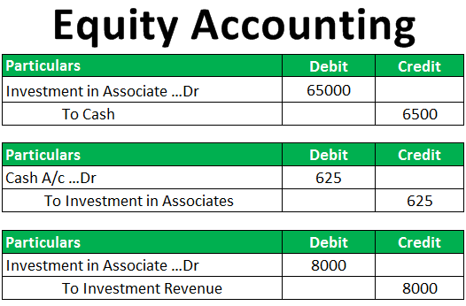

The intricate relationship between accounting financial reporting, the equity method, and algorithmic trading is increasingly vital in today's financial landscape. Financial reporting stands as a cornerstone of accounting, ensuring that a company's financial affairs are documented with transparency and accuracy. This process involves the preparation of financial statements that reflect a true and fair view of an organization's financial performance and position, serving as critical tools for stakeholders to make informed decisions.

The equity method is a significant accounting technique employed when a company has a substantial influence over another entity, typically through ownership of 20% to 50% of the company's shares. This method allows the investor to recognize their share of the investee's profits in their income statement, adjusting the investment's book value according to the investee's earnings or losses. Such significant influence means the investor can participate in policy-making decisions and influence managerial actions, although without outright control.



Algorithmic trading, on the other hand, has revolutionized the way trades are executed in financial markets. It employs sophisticated computational and mathematical models to automate trading decisions, optimizing the conditions under which trades are made. This technology leverages large datasets and analyses them at a pace unmatched by human traders, thereby executing trades with high speed and frequency. Such capabilities reduce human errors and enhance market efficiency, offering traders a significant competitive advantage.

An understanding of the interplay between these components can significantly enhance the strategic capabilities in both accounting and trading environments. Combining robust financial reporting with astute use of the equity method provides transparency and precision needed for sound financial decision-making. Meanwhile, harnessing algorithmic trading ensures that these decisions are acted upon efficiently in the markets, maximizing potential returns and minimizing risks.

## Table of Contents

## Understanding the Equity Method in Accounting

The equity method of accounting is applied when a company possesses significant influence over a separate entity, typically defined as holding between 20% and 50% of the investee's voting stock. This method requires the investor to record the investee company's profits or losses directly on its own income statement, reflecting an accurate share of its financial outcomes. 

The equity method modifies the book value of the investment based on the investor’s proportional share of the investee's earnings or losses. For example, if Company A has a 30% stake in Company B and Company B reports a net income of $1 million for a fiscal period, Company A would increase its investment account by $300,000, calculated as:

$$
\text{Investment Income} = \text{Investee's Net Income} \times \text{Ownership Percentage}
$$

$$
\text{Investment Income} = \$1,000,000 \times 0.30 = \$300,000
$$

Similarly, if the investee reports a loss, the investor decreases the book value of its investment proportionally.

Significant influence implies that the investor participates in the investee's policy decisions and can affect managerial alterations but does not confer control over the entity. This influence might be evidenced by representation on the board of directors, significant intercompany transactions, or essential technology dependencies. It is crucial to note that significant influence is determined by the level of involvement in decision-making processes rather than simple ownership percentages alone.

This accounting method ensures that the investments are not merely categorized as assets on the balance sheet but are dynamically adjusted to mirror ongoing economic relationships between the investor and investee. Properly applying the equity method enables companies to present a more transparent and accurate reflection of their financial activities and investment performance.

## Recording Revenue and Asset Changes with the Equity Method

Using the equity method, an investor recognizes changes in the investee's net income as adjustments to the asset's carrying amount on the balance sheet. This approach fundamentally aligns the investment's value with the investor's share of the investee's financial performance. Specifically, the investor increases their investment value by their proportionate share of the investee's earnings and decreases it when the investee reports losses.

Dividend distributions by the investee add another layer of complexity. When dividends are paid, they are not recorded as income; instead, they are treated as a return on investment. Consequently, the investment's book value on the investor's balance sheet is reduced by the amount of the dividends received. This reduction mirrors the outflow of economic benefit back to the investor, realigning the carrying value of the investment with the remaining economic interest.

To accurately reflect these financial transactions, an investor employing the equity method needs to meticulously update their financial records to represent a true and fair view of their financial position. The importance of accurate reporting cannot be overstated, as it ensures stakeholders have a reliable overview of the economic interest and financial health of the investment.

The formula representing changes in investment value through the equity method can be expressed as follows:

$$
\text{Investment\ value\ (end\ of\ period)} = \text{Investment\ value\ (beginning\ of\ period)} + (\text{Investor's\ share\ of\ investee's\ net\ income}) - (\text{Dividends\ received})
$$

This formula highlights the central components that an investor must track: the initial investment value, the proportional share of net income or loss, and the dividends received. By adhering to this accounting method, investors maintain transparency and precision in financial reporting, which are crucial for informed decision-making and strategic planning.

## Examples and Practical Applications of the Equity Method

To illustrate the practical applications of the equity method, consider a scenario where Company A acquires a 25% stake in Company B. This significant influence allows Company A to record its share of Company B's net income as part of its financial results. Assume Company B generates a net income of $1 million during the financial year. Under the equity method, Company A will record 25% of that net income, equating to $250,000, as a profit on its income statement. This amount is not received in cash but rather recorded as an increase in the investment account on the balance sheet, representing the increased value of Company A's investment due to Company B's earnings.

In addition, if Company B declares dividends during this period, Company A must adjust its investment account to reflect the payout received. Suppose Company B pays out $400,000 in dividends, and Company A's share of those dividends is 25%, amounting to $100,000. This dividend reduces the book value of the investment on Company A's balance sheet because dividends represent a return on investment rather than a component of profitability. 

Mathematically, if we let $I_n$ be the initial investment, $\Delta NI$ be the share of net income recorded, and $D$ be the dividends received, the updated investment value $I_{t+1}$ can be calculated as:

$$
I_{t+1} = I_n + \Delta NI - D
$$

This formula ensures the investment account accurately reflects economic reality by incorporating both profit share and dividend payout. 

This process provides stakeholders essential insights into the financial health and influence of Company A's investment in Company B, facilitating informed decision-making. Such accurate representation is crucial for investors, financial analysts, and corporate managers who rely on these figures for strategic planning and performance evaluation.

## Algo Trading: Revolutionizing Trading Strategies

Algorithmic trading, often referred to as algo trading, utilizes advanced algorithms to automate and enhance trading decisions in financial markets. This modern trading approach depends significantly on analyzing vast amounts of data and implementing sophisticated mathematical models to execute transactions at high speed and frequency. By leveraging technology, algo trading models can sift through extensive datasets to identify real-time trading opportunities, thus minimizing human error and increasing market efficiency.

In the context of financial markets, speed and precision are crucial. Algorithms can execute trades in fractions of a second, far quicker than any human trader. This rapid execution allows traders to capitalize on market inefficiencies that might exist only for a brief moment. Furthermore, these algorithms can operate continuously, ensuring that trading opportunities are not missed outside of traditional trading hours.

An algorithm used in trading typically follows a systematic process that includes data collection, data processing, signal generation, and order execution. For example, a trading algorithm could be designed using Python to analyze historical price data, identify trends or patterns, and create buy or sell signals based on predefined criteria. Below is a simple Python example illustrating the concept:

```python
import pandas as pd

# Load historical market data
data = pd.read_csv('market_data.csv')

# Simple moving average strategy
data['Short_MA'] = data['Close'].rolling(window=40).mean()  # Short-term moving average
data['Long_MA'] = data['Close'].rolling(window=100).mean()  # Long-term moving average

# Generate trading signals
data['Signal'] = 0
data['Signal'][40:] = np.where(data['Short_MA'][40:] > data['Long_MA'][40:], 1, 0)

# Generate orders
data['Position'] = data['Signal'].diff()

# Output strategy performance
print(data['Position'].value_counts())
```

In this simple moving average strategy, a buy signal is generated when the short-term moving average crosses above the long-term moving average, and a sell signal occurs when the reverse happens. This example highlights how computational models can process historical data to derive actionable trading insights based on systematic rules.

Apart from speed and efficiency, [algorithmic trading](/wiki/algorithmic-trading) contributes to market [liquidity](/wiki/liquidity-risk-premium), as trades are executed automatically without delay. This increased liquidity can lead to narrower bid-ask spreads, benefiting all market participants. Moreover, by reducing human involvement, algorithmic trading helps mitigate the emotional biases and errors that often affect manual trading.

Overall, the cutting-edge nature of algorithmic trading continues to transform financial markets, offering traders and investors a powerful tool to execute strategies with unrivaled precision and efficiency. As technologies and data analytics techniques advance, the capabilities and applications of algorithmic trading are expected to expand further, reinforcing its critical role in modern trading infrastructures.

## Integrating Financial Reporting and Algo Trading

Financial reporting serves as a crucial data source for algorithmic trading, offering the detailed documentation needed to analyze market trends and identify profitable trading opportunities. The data contained in financial statements, such as balance sheets, income statements, and cash flow statements, provides a comprehensive picture of a company's financial health. This information can be used as input for sophisticated algorithms designed to detect patterns and predict future price movements.

Algorithmic trading relies on the processing and analysis of large volumes of financial data to execute trades at optimal conditions. By leveraging financial reports, algorithms can assess various financial indicators such as earnings per share, price-to-earnings ratios, and debt-to-equity ratios. These indicators help in constructing models that anticipate market behavior.

For example, consider a Python-based approach to integrating financial reporting with algorithmic trading. By using libraries such as Pandas and NumPy, traders can process and analyze financial data efficiently:

```python
import pandas as pd
import numpy as np

# Load financial data
financial_data = pd.read_csv('financial_statements.csv')

# Calculate key financial ratios
financial_data['P/E Ratio'] = financial_data['Market Price'] / financial_data['Earnings Per Share']
financial_data['Debt/Equity Ratio'] = financial_data['Total Liabilities'] / financial_data['Shareholder Equity']

# Define a simple trading algorithm
def trading_decision(data):
    # Example condition: Buy if P/E ratio < 15 and Debt/Equity ratio < 1
    return (data['P/E Ratio'] < 15) & (data['Debt/Equity Ratio'] < 1)

# Apply trading decision
buy_signals = financial_data[trading_decision(financial_data)]

# Display buy signals
print(buy_signals[['Company', 'P/E Ratio', 'Debt/Equity Ratio']])
```

In the above code, financial statements are processed to compute key ratios, which are then used to make trading decisions. The algorithm identifies buy opportunities where specific financial criteria are met, improving the likelihood of profitable trades.

Consistency and transparency in financial reports are fundamental to creating reliable trading algorithms. Without accurate and standardized financial data, the models may produce erroneous results, leading to suboptimal trading decisions. Thus, maintaining rigorous financial reporting practices is essential for leveraging the full potential of algorithmic trading.

In conclusion, the integration of detailed financial reporting into algorithmic trading frameworks enhances the ability to develop data-driven trading strategies. This synergy not only boosts trading efficiency but also helps in making informed investment decisions, thereby optimizing financial outcomes.

## Conclusion

Mastering the integration of accounting methods, particularly the equity method, with algorithmic trading offers a significant strategic advantage. This convergence requires a deep understanding of both fields as they each contribute to maximizing financial outcomes. In accounting, accuracy and transparency are paramount to ensure stakeholders have a clear view of a company’s financial health. The equity method, for instance, demands precise recording of investments in associated companies, documenting changes in income and dividends with fidelity.

Algorithmic trading, on the other hand, relies on precision in computational models to execute trades swiftly and effectively. By harnessing detailed financial data obtained through meticulous reporting, algorithms can identify patterns and opportunities that might be overlooked by human analysis. The synergy between these disciplines allows for strategic insights that can significantly elevate trading and investment decisions. 

As technology continues to advance, the relationship between accurate financial reporting and algorithmic trading will remain pivotal. Leveraging cutting-edge tools to improve both transparency in financial statements and the efficacy of trading algorithms promises to enhance market efficiency and provide a competitive edge in the increasingly fast-paced financial landscape. The continual evolution of technology and methodologies will spur further integration, driving both fields toward greater precision and strategic depth.

## References & Further Reading

[1]: Bergstra, J., Bardenet, R., Bengio, Y., & Kégl, B. (2011). ["Algorithms for Hyper-Parameter Optimization."](https://papers.nips.cc/paper/4443-algorithms-for-hyper-parameter-optimization) Advances in Neural Information Processing Systems 24.

[2]: ["Advances in Financial Machine Learning"](https://www.amazon.com/Advances-Financial-Machine-Learning-Marcos/dp/1119482089) by Marcos Lopez de Prado

[3]: ["Evidence-Based Technical Analysis: Applying the Scientific Method and Statistical Inference to Trading Signals"](https://www.amazon.com/Evidence-Based-Technical-Analysis-Scientific-Statistical/dp/0470008741) by David Aronson

[4]: ["Machine Learning for Algorithmic Trading"](https://github.com/PacktPublishing/Machine-Learning-for-Algorithmic-Trading-Second-Edition) by Stefan Jansen

[5]: ["Quantitative Trading: How to Build Your Own Algorithmic Trading Business"](https://books.google.com/books/about/Quantitative_Trading.html?id=j70yEAAAQBAJ) by Ernest P. Chan