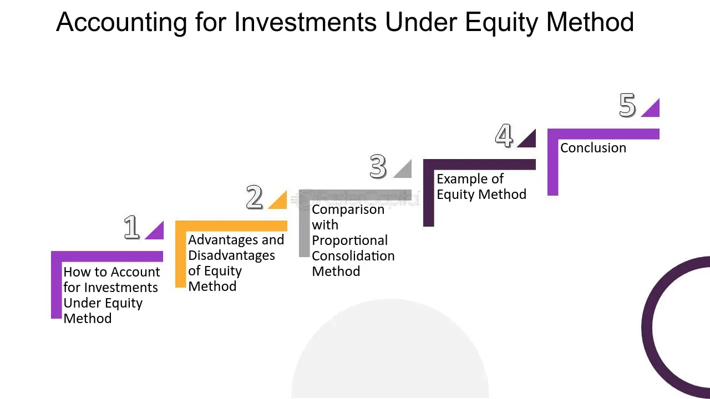

## Table of Contents

## What is the equity method of accounting?

The equity method of accounting is a way to record investments in other companies. It's used when a company owns a significant portion of another company, usually between 20% and 50% of the voting stock. Instead of just noting the investment at its original cost, the investor company adjusts the value of the investment based on its share of the profits or losses of the company it invested in. This method helps show a more accurate picture of the investor's financial health because it reflects the performance of the investment over time.

When using the equity method, the investor records its share of the investee's net income or loss on its own income statement. This means if the investee makes a profit, the investor increases the value of the investment and records income. If the investee has a loss, the investor decreases the value of the investment and records a loss. Additionally, the investor must also adjust the investment's value for any dividends received from the investee, as these reduce the investee's equity. This method provides a clearer view of how the investment impacts the investor's financial statements over time.

## What is proportional consolidation?

Proportional consolidation is a way to show a company's investment in a joint venture on its financial statements. When a company owns part of a joint venture, it can use proportional consolidation to include its share of the joint venture's assets, liabilities, revenues, and expenses directly on its own financial statements. This method is useful because it gives a clearer picture of how the joint venture affects the company's financial health.

For example, if a company owns 40% of a joint venture, it would include 40% of the joint venture's assets and 40% of its liabilities on its balance sheet. On the income statement, it would show 40% of the joint venture's revenues and expenses. This way, the company's financial statements reflect the true impact of the joint venture, making it easier for people to understand the company's overall financial situation.

## How does the equity method differ from proportional consolidation?

The equity method and proportional consolidation are two ways to show investments in other companies on financial statements, but they work differently. With the equity method, a company records its investment at cost and then adjusts this value based on its share of the profits or losses of the company it invested in. This means if the invested company makes a profit, the investor company increases the value of its investment and records income. If the invested company has a loss, the investor decreases the value of the investment and records a loss. The focus is on the investor's share of the net income or loss, which is shown on the investor's income statement.

Proportional consolidation, on the other hand, is used for joint ventures where a company includes its share of the joint venture's assets, liabilities, revenues, and expenses directly on its own financial statements. For example, if a company owns 40% of a joint venture, it would show 40% of the joint venture's assets and liabilities on its balance sheet, and 40% of the revenues and expenses on its income statement. This method gives a detailed view of how the joint venture impacts the company's financial position and performance by breaking down the investment into its individual components.

In simple terms, the equity method focuses on the overall net effect of the investment on the investor's income, adjusting the investment's value accordingly. Proportional consolidation, however, breaks down the investment into its parts, showing the investor's share of each asset, liability, revenue, and expense. Both methods aim to give a clearer picture of the investment's impact, but they do so in different ways.

## In what situations is the equity method typically used?

The equity method is typically used when a company owns a big part of another company, usually between 20% and 50% of the voting stock. This level of ownership means the company has a lot of influence over the other company but doesn't control it completely. The equity method helps show how the investment affects the company's financial health by adjusting the value of the investment based on its share of the other company's profits or losses.

For example, if a company owns 30% of another company, it will record its share of the other company's net income or loss on its own income statement. If the other company makes a profit, the company will increase the value of its investment and show income. If the other company has a loss, the company will decrease the value of its investment and show a loss. This method is useful for giving a clear picture of how the investment is doing over time.

## When is proportional consolidation more appropriate?

Proportional consolidation is more appropriate when a company is part of a joint venture. A joint venture is when two or more companies work together on a project or business. If a company owns part of a joint venture, it can use proportional consolidation to show its share of the joint venture's assets, liabilities, revenues, and expenses right on its own financial statements. This method helps give a clear picture of how the joint venture is doing and how it affects the company's financial health.

For example, if a company owns 40% of a joint venture, it would show 40% of the joint venture's assets and 40% of its liabilities on its balance sheet. On the income statement, it would show 40% of the joint venture's revenues and expenses. This way, people can see exactly how the joint venture impacts the company's overall financial situation. Proportional consolidation is useful because it breaks down the investment into its parts, making it easier to understand the company's financial position and performance.

## How do these methods affect the financial statements of the parent company?

When a parent company uses the equity method, it affects its financial statements by showing the investment at cost and then adjusting it based on the parent company's share of the profits or losses of the company it invested in. For example, if the parent company owns 30% of another company and that company makes a profit, the parent company will increase the value of its investment and show that 30% of the profit as income on its income statement. If the other company has a loss, the parent company will decrease the value of its investment and show that 30% of the loss on its income statement. This method helps show how well the investment is doing over time, but it doesn't break down the investment into assets, liabilities, revenues, and expenses.

On the other hand, when a parent company uses proportional consolidation, it directly includes its share of a joint venture's assets, liabilities, revenues, and expenses on its own financial statements. For instance, if the parent company owns 40% of a joint venture, it will show 40% of the joint venture's assets and 40% of its liabilities on its balance sheet. On the income statement, it will show 40% of the joint venture's revenues and expenses. This method gives a detailed view of how the joint venture affects the parent company's financial position and performance, making it easier to see the impact of the joint venture on the parent company's overall financial health.

## What are the key advantages of using the equity method?

The equity method has several key advantages. One big advantage is that it helps show how well the investment is doing over time. When a company uses the equity method, it changes the value of its investment based on its share of the profits or losses of the company it invested in. This means if the other company makes money, the investing company shows more income. If the other company loses money, the investing company shows a loss. This gives a clear picture of how the investment is doing and how it affects the company's overall financial health.

Another advantage of the equity method is that it's simple to use. Instead of having to break down the investment into lots of different parts like assets, liabilities, revenues, and expenses, the equity method just focuses on the overall net effect of the investment. This makes it easier for the company to keep track of its investments and for people looking at the financial statements to understand how the investment is doing. This method is especially useful when a company owns a big part of another company but doesn't control it completely.

## What are the potential drawbacks of proportional consolidation?

Proportional consolidation can make financial statements more complicated. When a company uses this method, it has to show its share of a joint venture's assets, liabilities, revenues, and expenses on its own financial statements. This means the company's financial statements will have more details and numbers, which can be hard to understand. People looking at the financial statements might get confused because it's not as simple as just showing the investment as a single number.

Another potential drawback of proportional consolidation is that it might not show the true financial health of the company as clearly. Because the company includes its share of the joint venture's numbers directly on its financial statements, it can make the company's financial situation look better or worse than it really is. If the joint venture is doing well, it might make the company look more profitable than it is on its own. If the joint venture is doing poorly, it might make the company look less profitable. This can make it harder for people to understand the company's real financial performance.

## How do international accounting standards (IFRS) treat the equity method and proportional consolidation?

Under International Financial Reporting Standards (IFRS), the equity method is used when a company has significant influence over another company but doesn't control it completely. This usually happens when a company owns between 20% and 50% of the voting stock of another company. With the equity method, the investing company records its investment at cost and then adjusts the value based on its share of the other company's profits or losses. This means if the other company makes a profit, the investing company shows more income on its financial statements. If the other company has a loss, the investing company shows a loss. IFRS prefers the equity method because it gives a clear picture of how the investment affects the company's financial health over time.

Proportional consolidation, on the other hand, was once allowed under IFRS for joint ventures, but it is no longer permitted. Instead, IFRS now requires the use of the equity method or a method called "joint operations" for joint ventures. With joint operations, a company includes its share of the joint venture's assets, liabilities, revenues, and expenses directly on its financial statements, similar to proportional consolidation. However, the choice between the equity method and joint operations depends on how the joint venture is set up and how the company participates in it. This change in IFRS was made to make financial reporting more consistent and easier to understand across different companies and countries.

## Can you explain the impact of these methods on the income statement and balance sheet?

When a company uses the equity method, its income statement shows its share of the profits or losses from the company it invested in. For example, if a company owns 30% of another company and that company makes a profit, the investing company will show 30% of that profit as income on its income statement. If the other company has a loss, the investing company will show 30% of that loss on its income statement. This method helps show how well the investment is doing over time. On the balance sheet, the investment is recorded at its original cost and then adjusted for the share of profits or losses. If the other company pays dividends, the investing company will decrease the value of its investment by the amount of dividends received.

With proportional consolidation, the impact on the income statement and balance sheet is different. On the income statement, a company using proportional consolidation will show its share of the joint venture's revenues and expenses. For example, if a company owns 40% of a joint venture, it will show 40% of the joint venture's revenues and 40% of its expenses on its income statement. This gives a detailed view of how the joint venture affects the company's financial performance. On the balance sheet, the company will show its share of the joint venture's assets and liabilities. So, if the company owns 40% of the joint venture, it will show 40% of the joint venture's assets and 40% of its liabilities. This method breaks down the investment into its parts, making it easier to see how the joint venture impacts the company's overall financial position.

## How do these accounting methods influence the calculation of key financial ratios?

When a company uses the equity method, it affects key financial ratios by changing the numbers on the income statement and balance sheet. For example, if the company's share of the other company's profits increases, it will show more income on its income statement. This can make the company's profit margins and return on assets look better. On the balance sheet, the value of the investment goes up when the other company makes a profit, which can change ratios like the debt-to-equity ratio. If the other company pays dividends, the value of the investment goes down, which can also affect these ratios.

Proportional consolidation impacts financial ratios differently because it shows the company's share of the joint venture's assets, liabilities, revenues, and expenses directly on its financial statements. For instance, if the joint venture is doing well, the company will show more revenues and assets, which can improve ratios like the current ratio and return on sales. But if the joint venture has a lot of liabilities, it can make the company's debt ratios look worse. This method gives a detailed view of how the joint venture affects the company's financial health, which can make the financial ratios more complex but also more accurate in showing the impact of the joint venture.

## What are the latest trends or changes in the application of the equity method and proportional consolidation in global accounting practices?

In global accounting practices, the use of the equity method has become more common, especially since the International Financial Reporting Standards (IFRS) stopped allowing proportional consolidation for joint ventures. Many companies now use the equity method when they have a big stake in another company but don't control it completely. This means they show their share of the other company's profits or losses on their income statement. The equity method helps keep financial statements clear and consistent across different countries, making it easier for investors to understand how well a company's investments are doing.

On the other hand, proportional consolidation is no longer allowed under IFRS for joint ventures. Instead, companies must use the equity method or a method called "joint operations" for joint ventures. With joint operations, a company shows its share of the joint venture's assets, liabilities, revenues, and expenses directly on its financial statements. This change was made to make financial reporting more uniform and easier to understand. Even though proportional consolidation is not used for joint ventures anymore, the idea behind it still helps companies show how joint ventures affect their financial health in a detailed way when using joint operations.

## What are the differences between Proportional Consolidation and the Equity Method?

Proportional consolidation and the equity method are two primary accounting approaches for representing investments in joint ventures, each characterized by distinct methodologies for reflecting the financial influence on the investor's financial statements.

Proportional consolidation involves recording the investor's share of each of the joint venture's assets and liabilities directly onto its financial statements, proportionate to its ownership interest. For instance, if a company holds a 40% interest in a joint venture, it would report 40% of the joint venture's assets, liabilities, revenues, and expenses on its balance sheet and income statement. This approach provides a detailed representation of the joint venture's contribution to the investor's financial position, facilitating a transparent view of the underlying economic interests and obligations.

Conversely, the equity method recognizes an investor's stake in a joint venture with significant influence but not outright control, typically presumed with a shareholding of 20% to 50%. Instead of line-by-line integration, this method aggregates the investor’s share of the joint venture’s net income or loss into a single line item on the income statement. In this context, the investment is initially recorded at cost and subsequently adjusted to reflect changes proportional to the investor's equity share, using the following formula for the investment account:

$$
\text{Investment Account} = \text{Initial Investment} + \text{Investor's Share of Net Income} - \text{Dividends Received}
$$

The move toward the equity method was significantly influenced by changes in International Financial Reporting Standards (IFRS) that emerged in 2013. The IFRS requires the equity method for joint ventures in consolidated financial statements, effectively making the proportional consolidation approach the exception rather than the rule. This shift was driven by the need for consistency and comparability in financial reporting, as the equity method aligns more closely with these objectives.

An understanding of the key differences and appropriate application scenarios of these two methods is critical for accurate and meaningful financial reporting. The choice of method affects how joint ventures appear in financial statements, impacting disclosures, financial ratios, and insights into the operational dynamics of a company's investments. Hence, adeptness in these accounting approaches is crucial for professionals aiming to deliver precise financial reporting and insights to stakeholders and analysts.

## References & Further Reading

[1]: ["International Financial Reporting Standards (IFRS)."](https://www.ifrs.org/content/dam/ifrs/publications/pdf-standards/english/2021/issued/part-a/ifrs-1-first-time-adoption-of-international-financial-reporting-standards.pdf)

[2]: ["Advances in Financial Machine Learning"](https://www.amazon.com/Advances-Financial-Machine-Learning-Marcos/dp/1119482089) by Marcos Lopez de Prado

[3]: ["Algorithmic Trading: Winning Strategies and Their Rationale"](https://www.wiley.com/en-us/Algorithmic+Trading%3A+Winning+Strategies+and+Their+Rationale-p-9781118460146) by Ernie Chan

[4]: ["Quantitative Investment Analysis"](https://www.investopedia.com/articles/investing/041114/simple-overview-quantitative-analysis.asp) by Richard A. DeFusco, Dennis W. McLeavey, Jerald E. Pinto, and David E. Runkle

[5]: ["Intermediate Accounting"](https://open.umn.edu/opentextbooks/textbooks/474) by Donald E. Kieso, Jerry J. Weygandt, and Terry D. Warfield