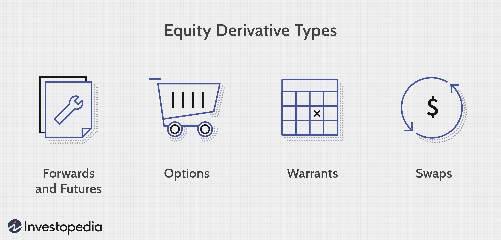

## Table of Contents

## What are equity options?

Equity options are contracts that give you the right, but not the obligation, to buy or sell a specific stock at a set price before a certain date. They are a type of financial tool that people use to make money from changes in stock prices without having to buy the actual stock. There are two main types of equity options: calls and puts. A call option lets you buy the stock, while a put option lets you sell it.

When you buy an equity option, you pay a small fee called a premium. This premium gives you the chance to make a big profit if the stock price moves in the direction you expect. However, if the stock price doesn't move as you hoped, you might lose the money you paid for the option. Many investors use equity options to protect their investments or to try to earn extra money. They can be a bit risky, but they also offer a lot of flexibility in how you can invest in the stock market.

## How do equity options work?

Equity options are like tickets that let you buy or sell a stock at a certain price before a specific date. There are two kinds: call options and put options. A call option gives you the right to buy the stock, while a put option lets you sell it. You don't have to buy or sell the stock if you don't want to; you just have the choice. To get this option, you pay a small fee called a premium. This premium is like the price of the ticket, and it's what you risk losing if the stock doesn't move the way you expect.

When you buy a call option, you're hoping the stock price will go up. If it does, you can buy the stock at the lower price you agreed on and then sell it at the higher market price, making a profit. If the stock price doesn't go up, you can just let the option expire and only lose the premium you paid. With a put option, you're betting the stock price will go down. If it does, you can sell the stock at the higher price you agreed on, even if the market price is lower, and make a profit. Again, if the stock price doesn't move as you hoped, you can let the option expire and only lose the premium.

## What are the basic types of equity options?

Equity options come in two basic types: call options and put options. A call option gives you the right to buy a specific stock at a set price before a certain date. If you think the stock's price will go up, you might buy a call option. It's like getting a ticket that lets you buy the stock at a good price later if you want to. If the stock price does go up, you can use your option to buy the stock at the lower price and then sell it at the higher market price, making a profit.

A put option, on the other hand, gives you the right to sell a specific stock at a set price before a certain date. If you think the stock's price will go down, you might buy a put option. It's like getting a ticket that lets you sell the stock at a good price later if you want to. If the stock price does go down, you can use your option to sell the stock at the higher price you agreed on, even though the market price is lower, and make a profit. Both call and put options give you choices without forcing you to buy or sell the stock, but you do have to pay a small fee called a premium for these options.

## What are the key terms used in equity options trading?

When you're dealing with equity options, there are some key words you'll hear a lot. One is the "strike price," which is the price at which you can buy or sell the stock if you use your option. Another important term is the "expiration date," which is the last day you can use your option. The "premium" is the price you pay to buy the option. "In-the-money" means the option would be worth something if you used it right now, while "out-of-the-money" means it wouldn't. "At-the-money" is when the stock price is the same as the strike price.

Another term you'll come across is "call option," which gives you the right to buy the stock at the strike price. A "put option" gives you the right to sell the stock at the strike price. "Open interest" tells you how many options contracts are currently out there for a particular stock. "Volume" shows how many options were traded on a given day. "Bid" and "ask" are the prices people are willing to pay to buy or sell the option, with the "bid" being the highest price someone will pay to buy, and the "ask" being the lowest price someone will accept to sell. Understanding these terms can help you make better decisions when trading equity options.

## How can someone start trading equity options?

To start trading equity options, you first need to open a brokerage account with a firm that lets you trade options. Many big brokers offer this service. When you sign up, you'll need to fill out an options trading application. This application will ask about your experience with investing and how much risk you're okay with. The broker will look at your answers to decide what level of options trading you can do. Once your application is approved, you can start trading.

After your account is set up, you can begin by choosing the stock you want to trade options on. You'll need to decide if you want to buy a call option, which lets you buy the stock at a set price, or a put option, which lets you sell it at a set price. Look at the strike price and expiration date for each option to see which one fits your plan. You'll pay a premium for the option, which is the cost of your ticket to possibly make a profit later. Remember, trading options can be risky, so it's a good idea to learn as much as you can and maybe even practice with a pretend account before you start using real money.

## What are the risks associated with trading equity options?

Trading equity options can be risky because you might lose the money you paid for the option. This is called the premium, and if the stock doesn't move the way you hoped, you could lose all of it. Options are like bets on whether a stock will go up or down, and if your guess is wrong, you don't get your money back. Also, options have an expiration date, so if the stock doesn't move in time, your option becomes worthless.

Another risk is that options can be very complicated. If you don't understand them well, you might make bad choices and lose money. Sometimes, people use options to try to make a lot of money quickly, but this can lead to big losses if things don't go as planned. It's important to know what you're doing and maybe start small or practice with a pretend account before you start using real money.

## What strategies can be used with equity options?

One common strategy with equity options is called a covered call. This is when you own a stock and sell someone else the right to buy it from you at a set price. You get money from selling the option, which can help you earn extra income. But if the stock price goes up a lot, you might have to sell your stock at the lower price you agreed on, so you could miss out on bigger gains. This strategy can be good if you think the stock will stay the same or go up a little but not a lot.

Another strategy is buying a protective put. This is like buying insurance for your stock. If you own a stock and you're worried its price might go down, you can buy a put option. This gives you the right to sell your stock at a set price, even if the market price drops lower. It costs you money to buy the put, but it can save you from losing a lot if the stock price falls. This strategy can help you feel safer about holding onto your stock.

A third strategy is a straddle, which you might use if you think a stock's price will move a lot but you're not sure which way. You buy both a call option and a put option with the same strike price and expiration date. If the stock price goes up a lot, the call option becomes valuable. If it goes down a lot, the put option does. Either way, you could make money, but you'll lose the money you spent on both options if the stock price doesn't move much. This strategy is riskier but can pay off big if the stock makes a big move.

## How do equity options differ from other types of options?

Equity options are different from other types of options because they are based on stocks. When you trade an equity option, you're betting on the price of a specific company's stock going up or down. Other types of options, like index options, are based on a group of stocks or a market index, like the S&P 500. Commodity options are based on things like gold or oil, and they let you bet on the price of those items. So, equity options focus on individual companies, while other options can cover broader markets or different kinds of goods.

Another difference is how they are used and their potential risks and rewards. Equity options can be used to make money from small changes in a stock's price or to protect other stock investments. They can be riskier because a single company's stock can be more unpredictable than a whole market or a commodity. Index options might be less risky because they're based on a larger group of stocks, but they also might not offer the same big potential profits as equity options. Commodity options can be affected by things like weather or global events, which makes them different from equity options, which are more directly tied to a company's performance.

## What are the tax implications of trading equity options?

When you trade equity options, you need to know about taxes because they can affect how much money you keep. If you make money from your options, it's usually counted as capital gains. There are two kinds of capital gains: short-term and long-term. Short-term capital gains are when you hold your option for less than a year before selling it. These are taxed at your regular income tax rate, which can be pretty high. Long-term capital gains are when you hold your option for more than a year. These are taxed at a lower rate, which can save you money. But remember, if you lose money on your options, you might be able to use those losses to lower your taxes.

Another thing to think about is how the IRS treats different kinds of options. If you buy an option and then sell it, that's pretty straightforward. But if you exercise an option (that means you use it to buy or sell the stock) and then sell the stock, things can get more complicated. The IRS might see that as two separate events: one for exercising the option and another for selling the stock. Each of these events could have its own tax rules. It's a good idea to keep good records of all your options trades and maybe talk to a tax professional to make sure you're doing everything right and not paying more taxes than you need to.

## How do market conditions affect equity options pricing?

Market conditions can really change how much equity options cost. One big thing that affects the price is how much the stock is moving around, which is called [volatility](/wiki/volatility-trading-strategies). If the stock is jumping up and down a lot, the option might cost more because there's a bigger chance it could end up being worth something. Another thing is the overall mood of the market. If everyone is feeling good about the stock market and thinks prices will go up, options might be more expensive. But if people are worried and think prices will go down, options might be cheaper.

Also, interest rates and how long until the option expires can make a difference. If interest rates go up, the price of options might go up too, especially for call options. And the longer you have until the option expires, the more time there is for the stock to move in your favor, so the option might cost more. All these things together help decide how much you'll have to pay for an equity option, and they can change from day to day depending on what's happening in the market.

## What advanced techniques can be used to analyze equity options?

One advanced technique to analyze equity options is using the Black-Scholes model. This model helps you figure out what an option should be worth based on things like the stock's price, how much it moves around, how long until the option expires, and interest rates. It's like a math formula that gives you a number for the option's price. Traders use this model to see if an option is a good deal or if it's too expensive. But remember, the Black-Scholes model makes some guesses about how the stock will act, so it's not perfect, but it's a good tool to have.

Another technique is called the Greeks. These are special numbers that show how sensitive an option's price is to different things. For example, "Delta" tells you how much the option's price will change if the stock's price changes. "Theta" tells you how the option's price changes as time goes by. "Vega" shows how the option's price changes with the stock's volatility. By looking at these Greeks, traders can understand better how their options might behave and make smarter choices about which options to buy or sell. It's like having a set of tools to help you see the future of your options a bit clearer.

## How can institutional investors utilize equity options for portfolio management?

Institutional investors can use equity options to manage their portfolios in a few smart ways. One way is by using options to protect their investments. For example, if they own a lot of a certain stock and they're worried it might go down in price, they can buy put options. These options give them the right to sell the stock at a set price, even if the market price drops lower. This can help them avoid big losses. Another way is by selling call options on stocks they already own. This can bring in extra money, kind of like renting out their stocks. But they have to be careful because if the stock price goes up a lot, they might have to sell the stock at a lower price than it's worth.

Another strategy institutional investors might use is to make their portfolios more balanced. They can buy options on different stocks or indexes to spread out their risk. For example, if they think the market might go down but they want to stay invested, they can buy put options on a market index. This way, if the market does fall, the options can help make up for losses in their other investments. They can also use options to bet on certain stocks or sectors without having to buy the actual stocks. This can be a way to try to make more money with less cash upfront. Overall, options give institutional investors a lot of flexibility to manage their portfolios and try to do better in different market conditions.

## Question: How can algo trading be applied to equity options according to the case study?

In this case study, we investigate the implementation of [algorithmic trading](/wiki/algorithmic-trading) strategies in managing equity options portfolios. Equity options, which provide the right to purchase or sell a stock at a fixed price before a specific date, can greatly benefit from the precision and speed offered by algorithmic trading. This approach not only aims to maximize returns but also to manage risks effectively.

### Strategies Utilized

Algorithmic trading strategies for equity options typically involve a combination of quantitative methods and statistical modeling. Key strategies applied include:

1. **Delta Hedging**: This involves maintaining a delta-neutral portfolio, whereby the delta of options positions is counterbalanced by trading in the underlying stocks. The objective is to mitigate the impact of small price changes in the underlying asset:
$$
   \Delta_{\text{total}} = \sum (\Delta_i \times \text{Number of options}_i) + \text{Shares of underlying}

$$
   Ensuring $\Delta_{\text{total}} = 0$ helps in maintaining a balanced exposure to price movements.

2. **Volatility Arbitrage**: By exploiting discrepancies between the implied volatility of options and the expected future volatility of the underlying stocks, traders can take positions to benefit from these differences. This requires continuously updating volatility models and adjusting options positions accordingly.

3. **Statistical Arbitrage**: This strategy involves identifying patterns and relationships between various securities’ price movements, leveraging statistical models for predicting option price behaviors relative to the stock's historical performance.

### Tools and Systems

The application of these strategies relies heavily on advanced tools and systems. Key components include:

- **Automated Trading Systems (ATS)**: These are software platforms capable of executing multiple trades per second based on pre-defined algorithms. They connect directly to stock exchanges and utilize APIs for real-time market data analysis and order execution.

- **Risk Management Software**: Essential for managing options portfolios, this software monitors potential risks, including market, credit, and operational risks, through real-time analytics and ensures adherence to risk limits.

- **Backtesting Platforms**: Before deploying strategies in live markets, rigorous backtesting is conducted using historical data. This helps in assessing the effectiveness and efficiency of the proposed algorithms under various market conditions.

### Maximizing Returns and Managing Risks

Effective management of equity options portfolios via algorithmic trading is achieved through:

1. **Dynamic Rebalancing**: Constantly adjusting the portfolio to adapt to market conditions, thereby maximizing returns while maintaining risk exposure within specified limits.

2. **Real-time Market Data Processing**: Utilizing high-frequency data feeds allows for the immediate recognition of opportunities and risks, facilitating timely and accurate trading decisions.

3. **Machine Learning Models**: Employing sophisticated models to predict market movements and option pricing dynamics enables more informed decision-making and strategy refinement.

4. **Robust Risk Measures**: Calculating Greeks (delta, gamma, theta, vega) and Value-at-Risk (VaR) insights continuously provide insights into the risk profile of the portfolio, ensuring comprehensive risk management.

### Practical Implementation

A practical application might include using Python libraries such as Pandas for data handling, NumPy for numerical computations, and packages like PyAlgoTrade or Zipline for [backtesting](/wiki/backtesting) trading strategies. Further, [machine learning](/wiki/machine-learning) models are employed to optimize trading signals and improve forecasting accuracy.

```python
import pandas as pd
import numpy as np
from pyalgotrade import strategy
from pyalgotrade.stratanalyzer import sharpe

class MyStrategy(strategy.BacktestingStrategy):
    def __init__(self, feed, instrument, initial_cash):
        super(MyStrategy, self).__init__(feed, initial_cash)
        self.__position = None
        self.__instrument = instrument

    def onBars(self, bars):
        # implement the logic for your chosen strategy
        pass

# Load historical data and set up the strategy
feed = ... # Load appropriate data here
myStrategy = MyStrategy(feed, "AAPL", 10000)
myStrategy.run()
sharpe_ratio = sharpe.SharpeRatio().getSharpeRatio(0.05)
print(f"Sharpe Ratio: {sharpe_ratio}")
```

In summary, algorithmic trading significantly enhances the efficiency and effectiveness of managing equity options portfolios through precise risk management and strategic execution, driven by advanced technologies and quantitative methodologies.

## References & Further Reading

[1]: Hull, J. (2017). ["Options, Futures, and Other Derivatives."](https://www.semanticscholar.org/paper/Options%2C-Futures%2C-and-Other-Derivatives-Hull/89bdee500c8623864fc9eb7a471546aa713acc44) Pearson Education.

[2]: Black, F., & Scholes, M. (1973). ["The Pricing of Options and Corporate Liabilities."](https://www.cs.princeton.edu/courses/archive/fall09/cos323/papers/black_scholes73.pdf) Journal of Political Economy, 81(3), 637-654.

[3]: Narang, R. K. (2013). ["Inside the Black Box: A Simple Guide to Quantitative and High Frequency Trading."](https://www.amazon.com/Inside-Black-Box-Quantitative-Frequency/dp/1118362411) Wiley.

[4]: Chan, E. (2009). ["Quantitative Trading: How to Build Your Own Algorithmic Trading Business."](https://github.com/ftvision/quant_trading_echan_book) Wiley.

[5]: Lopez de Prado, M. (2018). ["Advances in Financial Machine Learning."](https://www.amazon.com/Advances-Financial-Machine-Learning-Marcos/dp/1119482089) Wiley.

[6]: Johnson, B. (2010). ["Algorithmic Trading & DMA: An Introduction to Direct Access Trading Strategies."](https://www.amazon.com/Algorithmic-Trading-DMA-introduction-strategies/dp/0956399207) 4Myeloma Press.

[7]: Abernethy, J., & Kale, S. (2007). ["A Comparison of Market Risk Measures and Portfolio Optimization Techniques."](https://www.sciencedirect.com/science/article/pii/S154461231730212X) Advances in Neural Information Processing Systems.

[8]: Hendershott, T., Jones, C. M., & Menkveld, A. J. (2011). ["Does Algorithmic Trading Improve Liquidity?"](https://onlinelibrary.wiley.com/doi/full/10.1111/j.1540-6261.2010.01624.x) Journal of Finance, 66(1), 1-33.

[9]: McMillan, L. G. (2004). ["Options as a Strategic Investment."](https://www.amazon.com/Options-Strategic-Investment-Lawrence-McMillan/dp/0735201978) New York Institute of Finance.