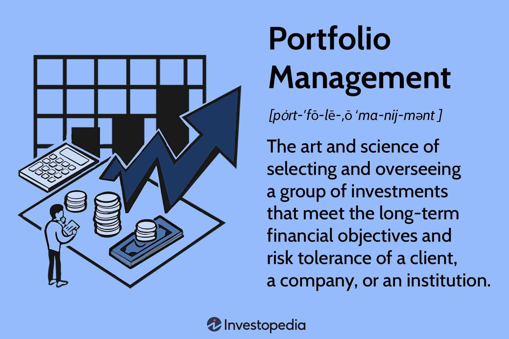

## Table of Contents

## What is equity portfolio management?

Equity portfolio management is the process of managing a collection of stocks and other equity investments to meet specific financial goals. It involves making decisions about which stocks to buy, when to buy them, and when to sell them. The goal is to build a portfolio that grows in value over time, providing the investor with good returns while managing risk.

A key part of equity portfolio management is diversification, which means spreading investments across different types of stocks and industries. This helps to reduce the risk of losing money if one stock or sector performs poorly. Portfolio managers also keep an eye on market trends and economic conditions to adjust the portfolio as needed. By doing this, they aim to maximize returns for their clients while keeping risks in check.

## Why is equity portfolio management important for investors?

Equity portfolio management is important for investors because it helps them make the most of their money. When you invest in stocks, you want your money to grow over time. A good portfolio manager will choose the right stocks and keep an eye on them, making changes when needed. This can lead to better returns than if you just picked stocks on your own without a plan.

It also helps manage risk. Investing in stocks can be risky because the value of stocks can go up and down a lot. By spreading your money across different stocks and industries, a portfolio manager can reduce the chance that you'll lose a lot of money if one stock does badly. This way, you can feel more secure about your investments and sleep better at night knowing that someone is looking out for your money.

## What are the basic principles of equity portfolio management?

The first principle of equity portfolio management is diversification. This means spreading your money across different stocks and industries. It's like not putting all your eggs in one basket. If one stock or industry does badly, you won't lose all your money because your other investments might do well. Diversification helps you manage risk and can lead to more stable returns over time.

Another important principle is regular monitoring and rebalancing. This means keeping an eye on your stocks and making changes when needed. If one stock is doing much better than the others, it might become a bigger part of your portfolio. To keep things balanced, you might sell some of that stock and buy more of the others. This helps you stick to your investment plan and can improve your returns.

The third principle is understanding your goals and risk tolerance. Before you start investing, you should know what you want to achieve and how much risk you're willing to take. Some people might want to grow their money quickly and are okay with taking big risks. Others might want steady growth and prefer to be safer. Knowing this helps you pick the right stocks and manage your portfolio in a way that matches your needs.

## How do you start building an equity portfolio?

To start building an equity portfolio, you first need to think about what you want to achieve with your investments and how much risk you're okay with. Do you want to save for a big purchase like a house, or are you looking to grow your money for retirement? Understanding your goals will help you decide which stocks to buy. You also need to know how much risk you can handle. Some stocks can go up and down a lot, while others are more stable. Knowing this will help you pick stocks that fit your comfort level.

Once you know your goals and risk tolerance, you can start [picking](/wiki/asset-class-picking) stocks. It's a good idea to spread your money across different types of stocks and industries. This is called diversification, and it helps reduce the risk of losing money if one stock does badly. You can start by looking at different sectors like technology, healthcare, or energy, and pick stocks from each one. After you've bought your stocks, you need to keep an eye on them. If one stock starts doing much better or worse than the others, you might need to sell some of it and buy more of the others to keep your portfolio balanced. This is called rebalancing, and it helps keep your investments on track with your goals.

## What are the different types of equity investments?

There are different types of equity investments, and each one can fit different goals and risk levels. The most common type is common stock. When you buy common stock, you own a piece of the company. If the company does well, the value of your stock can go up, and you might get dividends, which are like little payments from the company. But if the company does badly, the value of your stock can go down, and you might lose money. Common stock is popular because it can grow a lot, but it can also be risky.

Another type of equity investment is preferred stock. Preferred stock is different because it usually doesn't go up and down as much as common stock. It also pays regular dividends, which can be good if you want steady income. But preferred stock usually doesn't grow as much as common stock, so you might miss out on big gains. There are also other types of equity investments like stock mutual funds and exchange-traded funds (ETFs). These let you invest in a bunch of different stocks at once, which can help you spread out your risk. They can be a good choice if you want to invest in the stock market but don't want to pick individual stocks.

## What role does diversification play in equity portfolio management?

Diversification is a big deal in equity portfolio management. It's all about not putting all your money in one place. Imagine if you had all your money in just one stock and that stock did badly. You could lose a lot of money. But if you spread your money across different stocks and industries, you're safer. If one stock does badly, the others might do well, and that can help balance things out. This way, you can lower the risk of losing a lot of money and have a better chance of making steady returns over time.

When you're building your equity portfolio, diversification means picking stocks from different sectors like technology, healthcare, or energy. It's also a good idea to mix in stocks of different sizes, from big companies to smaller ones. This helps you cover more ground and not be too dependent on one type of stock. By doing this, you can make your portfolio stronger and more able to handle ups and downs in the market. Diversification doesn't mean you'll never lose money, but it can make your investments more stable and help you sleep better at night knowing you're not betting everything on one stock.

## How do you assess and manage risk in an equity portfolio?

Assessing and managing risk in an equity portfolio starts with understanding your own comfort level with risk. Some people are okay with their money going up and down a lot because they think it might lead to bigger gains. Others want their money to grow more slowly but steadily. Once you know how much risk you can handle, you can pick stocks that match that level. It's also important to look at the risk of each stock. Some stocks are more likely to go up and down a lot, while others are more stable. You can look at things like how much the stock price changes over time, how the company is doing, and what's going on in the market to figure out how risky a stock might be.

Once you've picked your stocks, you need to keep an eye on them and make changes when needed. This is called monitoring and rebalancing your portfolio. If one stock starts doing much better than the others, it might become a bigger part of your portfolio. To keep things balanced, you might sell some of that stock and buy more of the others. This helps you stick to your plan and manage risk. Another way to manage risk is by diversifying your portfolio. By spreading your money across different types of stocks and industries, you can reduce the chance that you'll lose a lot of money if one stock or sector does badly. Diversification doesn't mean you'll never lose money, but it can make your investments more stable and help you feel more secure.

## What are some common strategies used in equity portfolio management?

One common strategy in equity portfolio management is called the buy-and-hold strategy. This means you pick good stocks and keep them for a long time. You believe that over time, these stocks will grow in value. This strategy works well if you're patient and don't want to keep buying and selling stocks all the time. It can also save you money on fees and taxes because you're not trading a lot. But you still need to keep an eye on your stocks and make sure they're doing well.

Another strategy is called active management. This means you're always looking for new opportunities to buy and sell stocks. You might try to time the market, which means buying stocks when they're cheap and selling them when they're expensive. This can be risky because it's hard to predict the market, but it can also lead to big gains if you get it right. Active management requires a lot of work and knowledge about the market, but it can be exciting for people who like to be involved in their investments.

A third strategy is called value investing. This means you look for stocks that you think are underpriced. You believe that the market has made a mistake and that the stock is worth more than its current price. You buy these stocks and wait for the market to realize their true value, which can lead to big gains. Value investing requires a lot of research and patience, but it can be a good way to find hidden gems in the stock market.

## How do market conditions affect equity portfolio management decisions?

Market conditions can really change how you manage your equity portfolio. When the market is doing well and stocks are going up, you might feel more confident about buying more stocks or holding onto the ones you have. But if the market starts to go down, you might want to sell some stocks to protect your money. You might also look for stocks that are less likely to go down a lot, like ones from stable companies. Keeping an eye on things like interest rates, inflation, and big news events can help you make better choices about when to buy and sell stocks.

Sometimes, market conditions can make you change your whole strategy. If the market is really shaky, you might decide to be more active and trade more often to try to make money from the ups and downs. Or you might choose to be more careful and focus on stocks that pay dividends to get some steady income. It's all about adjusting your plan to fit what's happening in the market. By staying flexible and paying attention to market trends, you can make smarter decisions and keep your portfolio strong no matter what's going on.

## What advanced tools and techniques can be used to optimize an equity portfolio?

To optimize an equity portfolio, you can use advanced tools like quantitative analysis. This means using math and computer programs to look at a lot of data about stocks. These programs can help you find patterns and make predictions about which stocks might do well. For example, you can use algorithms to see how stocks have moved in the past and guess how they might move in the future. This can help you pick the best stocks for your portfolio and make better decisions about when to buy and sell.

Another useful tool is portfolio optimization software. This software can help you figure out the best way to spread your money across different stocks. It looks at things like how much risk you want to take and how much return you want to get. By using this software, you can make sure your portfolio is as balanced as possible. This means you can have a mix of stocks that can help you grow your money while also keeping your risk under control. It's like having a smart helper that can do a lot of the hard work for you.

## How do you measure the performance of an equity portfolio?

Measuring the performance of an equity portfolio is important to see if your investments are doing well. You can start by looking at the total return, which is how much your portfolio has grown over time. This includes any money you've made from the stocks going up in value and any dividends you've received. You can compare this to a benchmark, like a stock market index, to see if your portfolio is doing better or worse than the market as a whole. If your portfolio is beating the benchmark, you're doing a good job. If it's not, you might need to make some changes.

Another way to measure performance is by looking at risk-adjusted returns. This means you're not just looking at how much money you've made, but also how much risk you've taken to make that money. A common way to do this is by using the Sharpe Ratio. This ratio tells you how much return you're getting for each unit of risk you're taking. A higher Sharpe Ratio means you're getting good returns without taking too much risk. By keeping an eye on both your total return and your risk-adjusted return, you can get a full picture of how your equity portfolio is doing and make better decisions about how to manage it.

## What are the latest trends and innovations in equity portfolio management?

One of the latest trends in equity portfolio management is the use of [artificial intelligence](/wiki/ai-artificial-intelligence) (AI) and [machine learning](/wiki/machine-learning). These technologies can look at a lot of data really fast and find patterns that humans might miss. For example, AI can help pick stocks by looking at things like news articles, social media posts, and financial reports. It can also help predict how stocks might move in the future. This can make it easier to manage a portfolio and make smarter decisions about when to buy and sell stocks.

Another big trend is the rise of sustainable and [ESG](/wiki/esg-investing) (environmental, social, and governance) investing. More and more investors want to put their money in companies that are good for the planet and society. They look at things like how a company treats its workers, its impact on the environment, and how it's run. Portfolio managers are using special tools and data to find these kinds of companies and include them in their portfolios. This trend is not just about doing good, but also about making money, as many studies show that ESG-focused companies can do just as well or even better than others.

A third innovation is the increased use of robo-advisors. These are computer programs that can manage your equity portfolio for you. They ask you about your goals and how much risk you want to take, and then they pick the right stocks and keep your portfolio balanced. Robo-advisors are getting better all the time and can be a good choice for people who don't have the time or knowledge to manage their own investments. They can also be cheaper than hiring a human advisor, which makes them a popular option for many investors.

## References & Further Reading

[1]: Bergstra, J., Bardenet, R., Bengio, Y., & Kégl, B. (2011). ["Algorithms for Hyper-Parameter Optimization."](https://dl.acm.org/doi/10.5555/2986459.2986743) Advances in Neural Information Processing Systems 24.

[2]: ["Advances in Financial Machine Learning"](https://www.amazon.com/Advances-Financial-Machine-Learning-Marcos/dp/1119482089) by Marcos Lopez de Prado

[3]: ["Evidence-Based Technical Analysis: Applying the Scientific Method and Statistical Inference to Trading Signals"](https://www.amazon.com/Evidence-Based-Technical-Analysis-Scientific-Statistical/dp/0470008741) by David Aronson

[4]: ["Machine Learning for Algorithmic Trading"](https://github.com/stefan-jansen/machine-learning-for-trading) by Stefan Jansen

[5]: ["Quantitative Trading: How to Build Your Own Algorithmic Trading Business"](https://github.com/LucindaYa/quant-resources/blob/master/Quantitative%20Trading%20How%20to%20Build%20Your%20Own%20Algorithmic%20Trading%20Business.pdf) by Ernest P. Chan