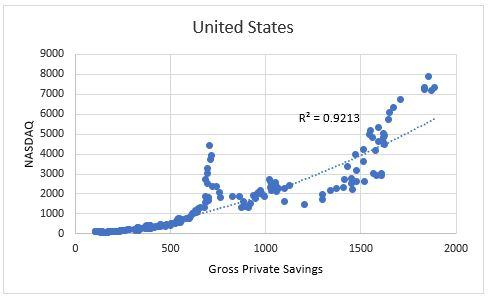

This article explores the intricate topics of investment risk, finance theories, the equity premium puzzle (EPP), and algorithmic trading. The equity premium puzzle refers to the historically high returns of stocks compared to risk-free assets such as Treasury bills. This phenomenon has persistently challenged conventional finance models, which struggle to offer satisfactory explanations.

Algorithmic trading represents a significant advancement in financial markets by utilizing computer algorithms to execute trades with speed and precision, potentially altering market dynamics and influencing risk assessments. The intersection of technology and finance underscores the importance of understanding these evolving concepts.

Understanding investment risk and finance theories is crucial today, not only for investors but also for policymakers and scholars. The landscape of financial markets is rapidly evolving, driven by technological advances and shifting economic paradigms. The ability to navigate these changes depends on a comprehensive understanding of the underlying theories and empirical evidence.

This article aims to unravel these complex issues by exploring theoretical underpinnings, empirical evidence, and current research directions in finance. Through an interdisciplinary lens, we examine how these concepts interplay in contemporary markets and discuss potential avenues for future research and innovations in understanding risk and return.

## Table of Contents

## Understanding the Equity Premium Puzzle

The equity premium puzzle (EPP) is a noteworthy anomaly in financial economics, wherein stocks consistently offer significantly higher average returns compared to risk-free assets such as Treasury bills. This phenomenon is puzzling because traditional risk-return models do not adequately explain the magnitude of the observed equity premium.

In 1985, economists Rajnish Mehra and Edward C. Prescott formally identified the equity premium puzzle, providing a rigorous examination of historical data that revealed a remarkable disparity between equity and risk-free returns—averaging about 6% annually in the U.S. since the 19th century. The implication of this gap is profound, as it seems to contradict basic tenets of asset pricing theory, particularly the expected trade-off between risk and return.

Several hypotheses have been proposed to unravel the EPP. Behavioral finance models suggest that psychological factors and cognitive biases may lead investors to demand higher risk premiums than would be predicted by standard models. These biases include overreaction to short-term market fluctuations and the inability to properly gauge long-term risks, resulting in altered consumption and savings behavior that can distort asset pricing.

Macroeconomic explanations have also been explored, where changes in economic cycles, growth trends, and inflation expectations potentially influence risk perceptions and investor behavior, thus affecting the equity premium. Moreover, rare economic disasters or catastrophic risks—though infrequent—could lead investors to demand substantially higher returns as compensation for the possibility of extreme losses.

The puzzle persists largely due to the inconsistencies between standard economic assumptions about investor behavior and the actual high premiums demanded by market participants. Consumption-based asset pricing models, which link asset returns to consumption patterns, often fail to account for the high equity premium observed in practice. This discrepancy challenges the assumption that individuals optimize consumption over their lifetime in a manner consistent with classical economic theories.

Understanding and potentially resolving the EPP is vital, as it could lead to more accurate models of risk in capital markets. Such advancements could influence a wide range of applications, from formulating monetary and fiscal policies to guiding individual and institutional investment strategies. Furthermore, a solution to the equity premium puzzle could enhance insights into how markets develop risk premiums, thereby shifting the paradigms of existing economic and financial theories. Ultimately, this could lead to more effective investment decision-making and improved resource allocation in the global economy.

## Finance Theories and Investment Risk

Traditional finance models, specifically the Capital Asset Pricing Model (CAPM), aim to quantify the relationship between expected return and investment risk. CAPM postulates that the expected return on an investment is equal to the risk-free rate plus a risk premium, which is proportional to the systematic risk, measured by the investment's beta. However, empirical evidence suggests that CAPM inadequately explains the magnitude of the equity premium and the associated risks observed in real markets. This shortcoming has led to alternative explanations and models that seek to address these discrepancies.

Behavioral finance offers an alternative perspective by incorporating psychological insights into financial analysis. It posits that cognitive biases, such as overconfidence, loss aversion, and herd behavior, significantly influence investor decisions and market outcomes. These biases can lead to mispricing of risk, contributing to the observed higher risk premiums. By acknowledging the emotional and cognitive factors driving investor behavior, behavioral finance provides a broader understanding of market anomalies, like the equity premium puzzle.

Another approach is the consumption-based asset pricing model (CCAPM), which connects asset prices to consumption growth. This model suggests that risk premiums are linked to the covariance between an asset's returns and changes in consumption. According to CCAPM, assets that perform poorly during economic downturns, when consumption is low, require higher returns as compensation for risk-averse investors. This approach ties market risk to macroeconomic factors and consumption patterns, offering a different lens to understand asset pricing dynamics.

Algorithmic trading is increasingly influential in assessing and managing investment risk. By using sophisticated algorithms to analyze and trade large volumes of data at high speeds, [algorithmic trading](/wiki/algorithmic-trading) enhances market efficiency and [liquidity](/wiki/liquidity-risk-premium). It allows for rapid adjustments in portfolios, which can mitigate risk exposure. However, algorithmic trading also introduces unique risks, such as those demonstrated by flash crashes. These events underscore the need for robust risk management frameworks in algorithmic strategies.

In contemporary financial markets, the execution speed and [volume](/wiki/volume-trading-strategy) of algorithmic trades require a nuanced understanding of investment theories. Traditional models like CAPM, when augmented with behavioral and consumption-based insights, offer a more comprehensive framework for navigating the complexities introduced by algorithmic trading. Such integration is essential for investors and policymakers aiming to make informed decisions in an increasingly fast-paced and interconnected financial environment.

## Algorithmic Trading and Market Dynamics

Algorithmic trading involves the use of computer programs to conduct trading activities at speeds and volumes beyond the capability of human traders. Through the execution of trades based on predefined criteria, algorithmic trading fundamentally alters market dynamics, particularly in terms of efficiency and precision. Traditional markets, characterized by human decision-making, now witness trading strategies executed in milliseconds, enhancing liquidity and narrowing bid-ask spreads.

Nonetheless, the high-speed nature of algorithmic trading introduces new risk factors that necessitate advanced risk management strategies. Flash crashes, brief but severe market tremors, exemplify potential downsides. These events occur when algorithms react in an unforeseen feedback loop, leading to rapid price declines. Additionally, algorithmic trading can be exploited for market manipulation, as evidenced by techniques like spoofing and layering. Spoofing involves placing large orders with no intention to execute, aiming to manipulate prices. Such tactics have prompted regulatory bodies to implement stringent monitoring mechanisms.

Algorithmic trading can influence the equity premium by modifying market liquidity and [volatility](/wiki/volatility-trading-strategies). Greater liquidity potentially lowers transaction costs, which could decrease the required premium for holding equities. Conversely, increased volatility attributed to rapid trading can elevate perceived risks, thereby sustaining or even enhancing the equity premium. This dual effect of algorithmic trading on market properties complicates the assessment of risk and return.

Representing the integration of technology and finance, advanced algorithms enable firms to dynamically adjust to changing market conditions. Techniques such as [machine learning](/wiki/machine-learning) and [artificial intelligence](/wiki/ai-artificial-intelligence) empower traders to refine their strategies, predicting market movements with progressively higher accuracy. Firms can perform complex computations involving large datasets to generate innovative trading strategies, leveraging patterns undetectable by human analysis.

The expansion of algorithmic trading presents a spectrum of challenges and possibilities. For investors focusing on technological leverage, it offers potential avenues for achieving superior risk-adjusted returns. The capacity to analyze vast amounts of data in real time and adapt to complex market environments allows for optimization of trading performance. However, this technological edge necessitates constant vigilance and adaptation, considering the swift evolution of trading algorithms and regulatory landscapes. Understanding these dynamics is crucial for market participants aiming for enduring success in an environment where technology continues to redefine financial markets.

## Empirical Evidence on the Equity Premium

Empirical studies robustly confirm the historical existence of a considerable equity premium, which catalyzes ongoing investigations into its fundamental causes. Analysis of extensive historical data consistently shows that equity markets yield significantly higher returns compared to risk-free assets, such as government treasury bills. This observation supports the notion that investors demand these higher returns as compensation for taking on the perceived additional risks associated with equities.

Historical analyses have highlighted several key factors potentially contributing to the equity premium. The role of dividends has been scrutinized, with studies suggesting that dividends have historically formed a considerable portion of equity returns, augmenting the observed premium. Additionally, market inefficiencies, such as information asymmetries and transaction costs, are believed to influence the sustained premium by affecting how information is disseminated and priced within financial markets.

Government policy fluctuations also significantly affect the equity premium. Regulatory changes, monetary policy adjustments, and fiscal interventions can alter investor risk perceptions and market conditions, impacting the premium. Such policies may either mitigate or exacerbate perceived economic risks, thereby influencing investor demand for higher equity returns as compensation.

Temporal variations in the equity premium have been observed, aligning with changing economic conditions and shifting investor sentiment. During periods of economic expansion or stability, confidence in equity markets may rise, temporarily compressing the equity premium. Conversely, economic contractions or heightened uncertainty tend to expand the premium as risk-aversion intensifies among investors. Investor sentiment, often volatile and influenced by media, market narratives, and behavioral biases, also plays a critical role in these time-varying patterns.

Understanding empirical evidence on the equity premium is essential for refining theoretical models in financial economics. It allows for a nuanced appreciation of the complex interplay between risk and return in equity markets. This understanding encourages the development of models that more accurately align with observed market behaviors, facilitating more effective investment strategies and policy-making. As empirical insights continue to evolve, they promise to enhance our grasp of the dynamics underpinning equity returns, ultimately contributing to more balanced and informed financial decision-making.

## Risk Aversion and Investment Decision-Making

Risk aversion is a fundamental concept in investment decision-making, encapsulating how individual investors perceive and respond to uncertainty and risk. According to traditional utility theory, investors are typically risk-averse, meaning they prefer to minimize exposure to uncertainty and prioritize steady returns over potentially higher, but more volatile, outcomes. In the context of the equity premium puzzle, this aversion to risk requires compensation in the form of higher returns when investors decide to hold riskier assets like equities over risk-free assets such as government bonds. 

Mathematically, risk aversion can be represented within the framework of expected utility theory. The utility function $U(W)$, where $W$ is wealth, helps quantify the satisfaction or utility an investor derives from different levels of wealth. A risk-averse investor exhibits a concave utility function, as depicted by diminishing marginal utility of wealth:

$$
U'(W) > 0 \quad \text{and} \quad U''(W) < 0
$$

This implies that the investor gains less additional utility with each incremental increase in wealth, favoring a secure outcome over a gamble with the same expected value. Such behavior directly impacts their valuations and demand for the equity premium.

Beyond traditional models, behavioral finance has introduced new perspectives on risk aversion. Psychological factors, such as overconfidence or loss aversion, can lead investors to make decisions that deviate from rational models. For example, loss aversion, a concept popularized by Kahneman and Tversky, suggests that people experience losses more intensely than gains of comparable size, often resulting in overly conservative investment strategies or poor timing decisions, such as panic selling during market downturns.

Understanding risk aversion is crucial for constructing investment strategies that align with an investor's specific financial goals and tolerance levels. Modern portfolio theory employs risk aversion insightfully to balance portfolios by optimizing the expected return against a measure of risk, such as variance or standard deviation, tailored according to individual risk tolerance profiles.

The ongoing fascination with the equity premium further underscores the significance of understanding risk aversion. Disparities between traditional economic models and actual investor behavior, influenced by psychological and emotional factors, continue to drive research into investor psychology and market dynamics. Identifying how these elements influence economic decisions not only aids in resolving the equity premium puzzle but also enhances strategies for wealth management, advising investors appropriately aligned with their risk preferences and psychological inclinations.

## Recent Advances and Theories

Recent theories have expanded the understanding of the equity premium puzzle (EPP) by integrating insights from finance, psychology, and economics. These interdisciplinary approaches have paved the way for innovative explanations and methodologies that better capture the complexities of financial markets. One significant area of advancement is the role of derivatives and increased market participation, which challenge the traditional interpretations of risk and return dynamics. The use of derivatives allows investors to hedge risks and enhance returns, potentially affecting the perceived risk premiums associated with equities. Furthermore, as more individuals and institutions become active in the markets, the diversification of participants influences market volatility and returns, contributing to a dynamic understanding of the EPP.

Macroeconomic factors and demographic trends are also central to contemporary research on the equity premium puzzle. Economic cycles, fiscal policies, and global events are recognized as influential in shaping the conditions under which equities generate returns. For instance, periods of economic expansion may correlate with higher stock returns, while recessions could widen the gap between equity returns and risk-free rates. Additionally, demographic shifts, such as aging populations and changes in workforce participation, can impact savings rates and investment behaviors, further informing theories on equity premiums.

Technological advancements, especially in the fields of big data analytics and machine learning, provide deeper insights into market behaviors and returns. The ability to process vast amounts of financial data quickly allows for more refined modeling of market participants' behaviors and risk assessments. Machine learning algorithms can identify patterns and correlations that traditional statistical methods might overlook, potentially uncovering new factors that contribute to the EPP. For example, sentiment analysis derived from news articles and social media can be used to predict market movements and capture the effects of investor psychology on stock prices.

These advancements offer refined perspectives on investing, providing potential pathways to address the equity premium puzzle. By incorporating a wider array of variables and sophisticated analytical techniques, researchers and practitioners can better understand the different components that drive the premium demanded by equity investors. Such developments not only enhance theoretical models but also support practical investment strategies that take into account the evolving nature of market risk and return dynamics. The ongoing integration of innovative tools and multidisciplinary knowledge continues to shape the future research directions in addressing the complexities of the equity premium puzzle.

## Conclusion and Future Directions

The equity premium puzzle remains a focal point for both theoretical exploration and practical application in financial economics. Its persistent presence in academic discourse highlights fundamental gaps in our understanding of risk and return. The puzzle underscores anomalies that traditional financial theories struggle to address, thereby inviting collaborative research efforts across disciplines such as economics, psychology, and computer science.

Recent technological advancements offer promising avenues to explore these financial conundrums further. The rise of data analytics and machine learning provides new methodologies to parse the complexities embedded within market data, offering the potential to unravel the equity premium puzzle's intricacies. The integration of these technologies facilitates a more granular examination of investor behavior, market efficiency, and economic indicators that contribute to the equity premium.

Continued research may innovate new theoretical frameworks or adapt existing ones, potentially reshaping our understanding of market behavior and risk management. Such insights could have vast implications, influencing investment strategies and policy formulations. For instance, a refined understanding of the equity premium might inform asset allocation decisions, risk assessment models, and regulatory policies.

Moreover, as financial markets grow increasingly complex, due to factors such as globalization and technological integration, the necessity to incorporate interdisciplinary approaches to financial puzzles becomes evident. Collaborative research conducted by economists, data scientists, and behavioral psychologists could yield more comprehensive models that encapsulate the multifaceted nature of modern financial markets.

Engagement with the equity premium puzzle is crucial for investors, academics, and policymakers aiming to navigate today's intricate investment landscape. Solving or better understanding this puzzle could lead to more effective investment strategies and robust risk management frameworks, ensuring improved financial outcomes and stability in global markets.

## References & Further Reading

[1]: Mehra, R., & Prescott, E. C. (1985). ["The Equity Premium: A Puzzle."](https://www.academicwebpages.com/preview/mehra/pdf/The%20Equity%20Premium%20A%20Puzzle.pdf) Journal of Monetary Economics, 15(2), 145-161.

[2]: Barberis, N., & Thaler, R. (2003). ["A Survey of Behavioral Finance."](https://www.nber.org/papers/w9222) In: Handbook of the Economics of Finance, 1, 1053-1128.

[3]: Shiller, R. J. (1982). ["Consumption, Asset Markets and Macroeconomic Fluctuations."](https://www.nber.org/papers/w0838) Carnegie-Rochester Conference Series on Public Policy, 17, 203-238.

[4]: Campbell, J. Y., & Cochrane, J. H. (1999). ["By Force of Habit: A Consumption-Based Explanation of Aggregate Stock Market Behavior."](https://www.jstor.org/stable/10.1086/250059) The Quarterly Journal of Economics, 114(4), 831-880.

[5]: Kahneman, D., & Tversky, A. (1979). ["Prospect Theory: An Analysis of Decision under Risk."](https://www.jstor.org/stable/1914185) Econometrica, 47(2), 263-291.

[6]: Biais, B., & Woolley, P. (2011). ["High Frequency Trading."](https://papers.ssrn.com/sol3/papers.cfm?abstract_id=1834344) Annals of Finance, 11, 333-370.

[7]: Fama, E. F., & French, K. R. (2004). ["The Capital Asset Pricing Model: Theory and Evidence."](https://www.aeaweb.org/articles?id=10.1257/0895330042162430) Journal of Economic Perspectives, 18(3), 25-46.

[8]: Lo, A. W. (2004). ["The Adaptive Markets Hypothesis: Market Efficiency from an Evolutionary Perspective."](https://papers.ssrn.com/sol3/papers.cfm?abstract_id=602222) Journal of Portfolio Management, 30(5), 15-29.