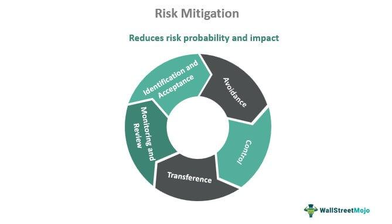

Financial markets are inherently complex, characterized by a multitude of variables that influence asset prices and investor decisions. This complexity underscores the necessity for effective equity risk investment strategies. Investors face a myriad of risks, including price volatility, macroeconomic shifts, and geopolitical events, necessitating sophisticated methods to safeguard investments and capitalize on potential gains.

Automated trading, a technological innovation in the investment landscape, has fundamentally altered how trades are executed and strategies are developed. By utilizing algorithms to automate trading processes, investors can enhance the speed and accuracy of their transactions. This technology offers considerable advantages, such as improved efficiency and the ability to process vast amounts of data beyond human capacity. However, it also presents challenges, including the need for robust risk management protocols to handle software errors, data inaccuracies, and execution lags.



This article examines the role of algorithmic trading in risk mitigation, an essential aspect in enhancing investment decision-making. It highlights how integrating algorithmic methodologies can improve the precision and objectivity of trades while also outlining the strategies employed to manage the associated risks. Through a detailed exploration, the article aims to provide insights into optimizing algorithmic trading for risk-adjusted returns in today's dynamic market environment.

## Table of Contents

## Understanding Equity Risk in Investment Strategies

Equity risk is a fundamental concept in investment strategies, representing the uncertainty associated with potential financial loss in market activities. To effectively manage and navigate this risk, investors must distinguish between systematic and unsystematic risks, both key components influencing investment outcomes.

Systematic risk, also known as market risk, is an inherent feature of the entire market. This type of risk is influenced by macroeconomic factors such as changes in interest rates, inflation, political instability, and global economic events. These factors collectively affect the overall market, and as a result, systematic risk cannot be eliminated through diversification. Mathematically, systematic risk can be represented as the covariance between the security returns and the market returns, and it is often measured using metrics like beta (β), which compares the volatility of an asset or portfolio to the market. A beta greater than one indicates higher sensitivity to market movements, while a beta less than one indicates less sensitivity.

Unsystematic risk, on the other hand, is specific to individual companies or industries. This risk arises from factors such as company management decisions, competitive position, regulatory changes, and specific industry dynamics. Unlike systematic risk, unsystematic risk can be mitigated through diversification. By holding a broad portfolio of different securities, the impact of a poorly performing company or industry on the overall portfolio can be minimized. The principle of diversification relies on the notion that the individual risks of different investments will offset each other, thus reducing the overall risk.

Effectively managing equity risk requires a comprehensive understanding of both systematic and unsystematic risks. Investors must evaluate the interplay of these risks when constructing a portfolio to align with their specific investment objectives. While portfolio diversification is the primary tool for mitigating unsystematic risk, maintaining cognizance of broader economic factors and their potential impacts is vital for acknowledging systematic risk. This balanced approach facilitates the achievement of investment goals while navigating the complexities of financial markets.

## Key Risk Management Techniques

Effective investment strategies incorporate risk management to align with financial goals and mitigate downsides in an ever-evolving market landscape. These strategies are essential for maintaining a balance between risk and reward, ensuring that investors can navigate market [volatility](/wiki/volatility-trading-strategies) while seeking desirable returns.

### Sharpe Ratio

The Sharpe Ratio is a widely used metric that evaluates the return of an investment compared to its risk. Developed by Nobel laureate William F. Sharpe, the ratio helps investors understand the excess return generated per unit of risk. The formula for the Sharpe Ratio is:

$$
\text{Sharpe Ratio} = \frac{R_p - R_f}{\sigma_p}
$$

where $R_p$ is the expected portfolio return, $R_f$ is the risk-free rate of return, and $\sigma_p$ is the standard deviation of the portfolio's excess return. A higher Sharpe Ratio indicates a more attractive risk-adjusted return.

### Value at Risk (VaR)

Value at Risk (VaR) quantifies the potential loss in value of an asset or portfolio with a given probability over a specific time period. This measure helps investors assess the extent and likelihood of possible losses. VaR can be calculated using historical data, variance-covariance, or Monte Carlo simulation methods. A typical VaR statement might say, "There is a 5% chance that the portfolio will lose at least $X over a specified period."

### Conditional Value at Risk (CVaR)

Conditional Value at Risk (CVaR), also known as Expected Shortfall, provides an estimate of the expected loss in the worst-case scenarios beyond the VaR threshold. CVaR is valuable for understanding the tail risk or the risk of extreme losses, thereby offering a more comprehensive picture of potential downsides than VaR alone. CVaR can be expressed as:

$$
\text{CVaR}_\alpha = E[X \mid X < \text{VaR}_\alpha]
$$

where $X$ is the loss and $\alpha$ signifies the confidence level.

### Optimization of Portfolios

These statistical tools—Sharpe Ratio, VaR, and CVaR—are instrumental in optimizing portfolios by balancing expected returns against risk. For instance, combining these metrics can help in constructing efficient portfolios that were initially described in Harry Markowitz's Modern Portfolio Theory. By analyzing the risk-return trade-off, investors can achieve efficient diversification that minimizes unsystematic risk while maximizing potential returns.

Investors and analysts often employ these techniques in software platforms using programming languages like Python. A simple Python snippet to calculate Sharpe Ratio using historical returns data could be:

```python
import numpy as np

# Assuming 'returns' is an array of historical portfolio returns
risk_free_rate = 0.02  # Example risk-free rate
excess_returns = np.array(returns) - risk_free_rate
sharpe_ratio = np.mean(excess_returns) / np.std(excess_returns)

print(f"Sharpe Ratio: {sharpe_ratio}")
```

In conclusion, risk management techniques such as the Sharpe Ratio, VaR, and CVaR are invaluable for designing investment strategies that align with investor goals. They enable the objective evaluation and management of risk, thereby facilitating more informed and balanced investment decisions.

## The Role of Algorithmic Trading in Risk Mitigation

Algorithmic trading utilizes predefined instructions that allow trades to be executed swiftly and with precision, reducing the potential for human error and emotional decision-making. This method enhances the objectivity of trading strategies, providing an edge in complex financial markets. By leveraging [algorithmic trading](/wiki/algorithmic-trading), investors can execute intricate strategies that are beyond the capabilities of manual trading, particularly due to the limitations in speed and the extensive data analysis required.

One of the greatest benefits of algorithmic trading is its ability to analyze large datasets quickly, identifying patterns and trends that might not be apparent to human traders. This capability enables the execution of strategies based on real-time market data analysis, facilitating quick decision-making processes and the capturing of fleeting [arbitrage](/wiki/arbitrage) opportunities.

However, this rapid trading approach is not without risks. Algorithmic trading systems can encounter software bugs, which may lead to erroneous trades or financial losses. Data inaccuracies are another concern, as flawed data inputs can lead to incorrect trading signals. Furthermore, delays in market data feeds can also impact the effectiveness of algorithmic strategies, as these systems rely on timely information to make accurate assessments and execute trades.

To address these risks, robust risk management practices are necessary. Implementing systematic checks and balances, including rigorous testing of the trading algorithms under simulated market conditions, helps in identifying potential issues before they manifest in live trading environments. Moreover, real-time monitoring of trading activities can help in detecting and rectifying anomalies swiftly.

Code examples are often used to illustrate how risk management can be embedded within algorithmic trading systems. For instance, a simple Python code snippet to catch exceptions during trading execution might look like this:

```python
try:
    execute_trade(order)
except (NetworkError, DataFeedError) as error:
    log_error(error)
    implement_fallback_strategy()
```

In this example, any network or data feed errors during trade execution will trigger an error logging process and implement a predefined fallback strategy, minimizing potential losses.

In conclusion, while algorithmic trading offers unparalleled speed and precision in executing complex trading strategies, it is imperative to employ stringent risk management protocols to safeguard against technical issues and data mishaps. These protective measures ensure that the algorithms perform optimally, maintaining the integrity of investment strategies in fluctuating market conditions.

## Implementing Risk Mitigation in Algo Trading

Risk mitigation in algorithmic trading involves employing a variety of tools and strategies to manage the inherent risks associated with automated systems. Key among these tools are circuit breakers, real-time monitoring, and stress-testing strategies. 

Circuit breakers are mechanisms used to temporarily halt trading on an exchange to curb panic-selling and allow time for traders to make informed decisions. By setting predetermined thresholds, algorithmic traders can stop trading activity when abnormal conditions such as excessive volatility occur, preventing substantial losses.

Real-time monitoring plays a critical role in algo-trading risk management. By continuously supervising trading activities and market conditions, any anomaly can be swiftly detected, allowing for immediate intervention. This real-time analysis facilitates prompt risk mitigation, thus maintaining the integrity of trading strategies.

Stress tests and simulations form another cornerstone of risk mitigation. These are designed to evaluate how trading algorithms perform under extreme conditions, such as sudden market crashes or spikes in volatility. By simulating these scenarios, traders can identify weaknesses within their algorithms and refine them accordingly. This not only enhances the resilience of the trading strategy but also ensures preparedness against unpredictable market events.

Continuous evaluation and adaptation are essential in maintaining effective algorithmic trading strategies. Since financial markets are dynamic, trading algorithms must be regularly reviewed and updated to align with current market trends and data. This involves adjusting parameters, refining models, and incorporating new data to keep the strategy robust against the ever-changing market landscape.

In summary, implementing risk mitigation in algorithmic trading involves utilizing a comprehensive toolkit that includes circuit breakers, real-time monitoring, and rigorous stress tests. These tools work in unison to ensure that trading algorithms are resilient, adaptable, and effective in navigating the complexities of modern financial markets.

## Building Robust Investment Strategies

Effective investment strategies combine both technical and [fundamental analysis](/wiki/fundamental-analysis), providing a comprehensive framework for decision-making. Technical analysis involves examining past market data, primarily price and [volume](/wiki/volume-trading-strategy), to forecast future price movements. Chart patterns, moving averages, and [momentum](/wiki/momentum) indicators are commonly used to identify potential entry and [exit](/wiki/exit-strategy) points in trading. In contrast, fundamental analysis evaluates a company's intrinsic value by examining financial statements, industry conditions, and economic factors. Metrics such as earnings per share (EPS), price-to-earnings (P/E) ratio, and return on equity (ROE) are fundamental to understanding a company’s performance.

Diversification is a crucial risk management strategy that reduces unsystematic risk—risk specific to a single company or industry—by spreading investments across various asset classes, sectors, or geographic regions. By not placing all financial resources into one investment, the adverse performance of a single asset is less likely to affect the entire portfolio. For example, a portfolio comprising stocks, bonds, commodities, and real estate may experience more stable returns than one concentrated solely in equities.

Backtesting is another essential component in developing robust investment strategies. It involves applying a trading strategy to historical data to assess its performance. This retrospective analysis helps investors understand how a strategy might perform under various market conditions and allows for optimization before actual market application. The process requires careful attention to avoid biases such as overfitting—when a model is too complex and fits the historical data too closely, thus performing poorly in real-time environments.

A simple Python implementation for [backtesting](/wiki/backtesting) might involve using libraries such as pandas to handle data and calculate returns, and matplotlib for visual analysis. Here's a basic example:

```python
import pandas as pd
import matplotlib.pyplot as plt

# Load historical data
data = pd.read_csv('historical_data.csv', parse_dates=['Date'], index_col='Date')
data['Returns'] = data['Close'].pct_change()

# Define a moving average strategy
short_window = 40
long_window = 100
data['Short_MA'] = data['Close'].rolling(window=short_window, min_periods=1).mean()
data['Long_MA'] = data['Close'].rolling(window=long_window, min_periods=1).mean()

# Generate trading signals
data['Signal'] = 0
data.loc[data['Short_MA'] > data['Long_MA'], 'Signal'] = 1
data.loc[data['Short_MA'] < data['Long_MA'], 'Signal'] = -1

# Calculate strategy returns
data['Strategy_Returns'] = data['Returns'] * data['Signal'].shift(1)

# Plot results
plt.figure(figsize=(14, 7))
plt.plot(data['Strategy_Returns'].cumsum(), label='Strategy Returns')
plt.plot(data['Returns'].cumsum(), label='Market Returns', color='r', alpha=0.5)
plt.legend()
plt.show()
```

In conclusion, building robust investment strategies requires a blend of technical and fundamental analysis, diversification to mitigate unsystematic risks, and thorough backtesting to verify strategy effectiveness before real-world deployment. Through these methodologies, investors can better navigate financial markets and enhance their decision-making.

## Conclusions

Effective investment strategies in the contemporary financial landscape necessitate a judicious blend of risk management and algorithmic efficiency. Successful navigation of market complexities involves not only understanding the inherent risks but also leveraging the precision and speed offered by algorithmic trading systems. The integration of traditional methodologies with advanced algorithmic strategies enhances an investor's adaptability to shifting market conditions.

Traditional investment techniques, grounded in fundamental and technical analysis, remain essential for comprehending market dynamics and evaluating individual asset performance. Their incorporation in algorithmic models ensures that these sophisticated systems are anchored in sound financial principles, providing a stable foundation upon which automated strategies can operate.

Combining algorithmic trading with traditional methods enables investors to exploit the advantages of rapid execution and data analysis while maintaining a comprehensive view of market forces. Algorithmic systems can process vast datasets and execute trades at speeds unattainable by human traders, allowing for the implementation of complex strategies that mitigate risks associated with human error and slow decision-making processes.

Nevertheless, the deployment of algorithmic trading systems is not without risks. It demands robust risk management frameworks that can handle potential pitfalls such as software glitches, erroneous data inputs, and unexpected market events. By continuously evaluating and updating algorithms, investors can ensure these tools remain effective amidst market changes.

Ultimately, a balanced approach that combines the insights of traditional analysis with the mechanical precision of algorithmic trading systems equips investors to capitalize on opportunities while effectively managing associated risks. This holistic strategy not only facilitates more informed investment decisions but also prepares investors to address the unpredictability inherent in financial markets.

## References & Further Reading

1. **Books**
   - *"Quantitative Risk Management: Concepts, Techniques, and Tools"* by Alexander J. McNeil, Rüdiger Frey, and Paul Embrechts. This book provides comprehensive insights into risk management techniques, statistical modeling, and financial theory.
   - *"Algorithmic Trading: Winning Strategies and Their Rationale"* by Ernie Chan. This book explores quantitative trading strategies and their foundational principles, focusing on practical implementations.
   - *"Investment Valuation: Tools and Techniques for Determining the Value of Any Asset"* by Aswath Damodaran. This text covers fundamental and technical analysis tools essential for crafting robust investment strategies.

2. **Academic Papers**
   - *"The Risk Management of Everything: Rethinking the Politics of Uncertainty"* by Michael Power. This paper critiques traditional risk management approaches and suggests methodologies for integrating uncertainty in investments.
   - *"Algorithmic Trading Patterns in the S&P 500 Futures Market"* by Björn Hagströmer and Lars Nordén. This study analyzes the impact of algorithmic trading on market dynamics and risk mitigation.
   - *"Managing Volatility Risk"* by Emanuel Derman and Michael B. Miller. This academic paper discusses volatility modeling and risk management techniques.

3. **Online Courses**
   - *Coursera: Financial Engineering and Risk Management* by Columbia University. A course that offers insights into financial markets, risk management techniques, and quantitative modeling.
   - *edX: Algorithmic Trading and Finance Models with Python, R, and Stata Essential Training* by the University of Edinburgh. This course introduces the basics of algorithmic trading and financial modeling using popular programming languages.
   - *Udemy: Python for Financial Analysis and Algorithmic Trading*. This practical course covers utilizing Python for quantitative finance, including algorithm implementation and risk management strategies.

4. **Web Resources**
   - *Investopedia (www.investopedia.com)*: Offers a plethora of articles on investment risk management, trading strategies, and market analysis.
   - *CFA Institute (www.cfainstitute.org)*: Provides insights and white papers pertaining to the latest trends and strategies in financial analysis and risk management. 

These resources collectively offer a blend of fundamental theories, practical applications, and interactive learning platforms to enhance your understanding of investment risk management and algorithmic trading strategies.

