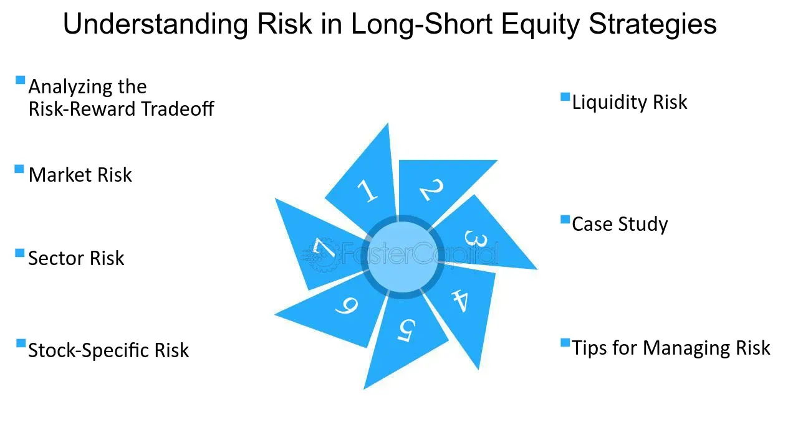

## Table of Contents

## What is equity risk and why is it important to mitigate it?

Equity risk refers to the potential for an investor to lose money due to the ups and downs in the stock market. When you buy stocks, you hope their value will go up, but sometimes they can go down instead. This risk is higher with stocks than with safer investments like bonds or savings accounts. Equity risk can come from many things, like bad news about a company, changes in the economy, or even global events that shake up the markets.

It's important to mitigate equity risk because it helps protect your money. If you don't manage this risk, you could lose a lot, especially if the market takes a big dive. By spreading your investments across different types of assets, like stocks, bonds, and real estate, you can reduce the impact of any one investment doing poorly. This way, even if one part of your portfolio loses value, the others might still do well, helping to balance things out and keep your overall investment safer.

## What are the basic strategies for mitigating equity risk?

One basic strategy for mitigating equity risk is diversification. This means spreading your money across different types of investments, like stocks, bonds, and real estate. By not putting all your eggs in one basket, you reduce the chance that a drop in one investment will hurt your whole portfolio. For example, if the stock market goes down, your bonds might still be doing okay, which can help balance out your losses.

Another strategy is asset allocation. This involves deciding how much of your money to put into different kinds of investments based on your goals and how much risk you're willing to take. Younger investors might put more money into stocks because they have time to recover from market dips. Older investors might choose more bonds because they need their money to be safer. Adjusting your asset allocation over time can help manage risk as your needs change.

A third strategy is regular rebalancing. This means checking your portfolio from time to time and making adjustments to keep it aligned with your goals. If one type of investment has grown a lot, it might now be a bigger part of your portfolio than you want. By selling some of it and buying more of other investments, you can bring your portfolio back to your desired balance. This helps manage risk by making sure your investments stay diversified.

## How does diversification help in reducing equity risk?

Diversification helps reduce equity risk by spreading your investments across different types of assets. When you invest in just one stock or one type of investment, you're putting all your money on one bet. If that investment does badly, you could lose a lot. But if you spread your money across many different investments, like stocks, bonds, and real estate, you're not relying on just one thing to do well. If one investment goes down, others might go up or stay the same, which can help balance out your losses.

Think of it like this: if you only invest in tech stocks and the tech industry has a bad year, your whole portfolio could suffer. But if you also have some money in healthcare stocks, government bonds, and maybe even some real estate, a bad year for tech won't hurt as much. The other investments might do well enough to make up for the losses in tech. By diversifying, you're giving yourself a safety net, making it less likely that a single bad event will wipe out your savings.

## What role does asset allocation play in equity risk management?

Asset allocation is like deciding how to divide your money among different types of investments, such as stocks, bonds, and cash. It's a key part of managing equity risk because it helps you balance the risk and reward in your portfolio. If you put all your money into stocks, you might make a lot if the market does well, but you could also lose a lot if it goes down. By spreading your money across different kinds of investments, you can lower the risk of big losses. For example, if the stock market falls, your bonds might still be doing okay, which can help cushion the blow.

The right asset allocation depends on your goals and how much risk you're comfortable with. Younger investors might choose to have more of their money in stocks because they have time to recover from any market dips. Older investors, who might need their money sooner, might put more into bonds and cash, which are usually safer. By adjusting your asset allocation over time, you can manage equity risk better. It's like changing the recipe of your investment pie to match your current needs and future plans, making sure it's not too risky but still has the chance to grow.

## Can you explain the use of stop-loss orders in equity risk mitigation?

A stop-loss order is like a safety net for your stock investments. It's a tool you can set up with your broker that automatically sells your stock if it falls to a certain price. This helps you limit how much money you could lose if the stock price drops a lot. For example, if you buy a stock at $50 and set a stop-loss order at $45, the stock will be sold automatically if it hits $45, so you don't lose more than $5 per share.

Using stop-loss orders is a smart way to manage equity risk because it takes emotion out of the equation. Sometimes, when the market is falling, people panic and make bad decisions. With a stop-loss order, you decide ahead of time what your limit is, so you don't have to worry about making a quick choice when things get stressful. This can help protect your money and keep your investment strategy on track.

## How do hedging strategies work to mitigate equity risk?

Hedging is like buying insurance for your stock investments. It's a way to protect your money if the stock market goes down. One common way to hedge is by using options, which are contracts that give you the right to buy or sell a stock at a certain price. For example, if you own a stock and you're worried it might go down, you can buy a "put option." This gives you the right to sell the stock at a set price, even if the market price drops lower. So, if the stock falls, you can use the put option to sell it at the higher price and lose less money.

Another way to hedge is by investing in assets that move in the opposite direction to your stocks. For instance, if you think the stock market might go down, you could invest in things like gold or government bonds, which often do well when stocks do badly. By balancing your portfolio with these kinds of investments, you can reduce the impact of a falling stock market on your overall savings. Hedging doesn't make the risk go away completely, but it can help soften the blow if things go wrong.

## What are the advanced financial instruments used for equity risk mitigation?

Advanced financial instruments for equity risk mitigation include options and futures. Options give you the right, but not the obligation, to buy or sell a stock at a set price within a certain time. For example, if you own a stock and want to protect against a price drop, you can buy a put option. This lets you sell the stock at a higher price than the market if it falls, limiting your losses. Futures, on the other hand, are contracts to buy or sell an asset at a future date at a set price. They can be used to lock in prices and hedge against market movements. For instance, if you think the market will go down, you can sell stock index futures to offset potential losses in your stock portfolio.

Another advanced instrument is the use of derivatives like swaps. Interest rate swaps, for example, can be used to manage risk by exchanging one type of cash flow for another. If you're worried about rising interest rates affecting your stock investments, you might enter into a swap agreement to exchange variable interest payments for fixed ones, providing more predictability and stability. Additionally, structured products combine traditional investments with derivatives to create tailored risk profiles. These can be designed to offer protection against downside risk while still allowing for potential upside gains, making them a flexible tool for managing equity risk.

## How can one use options and futures to manage equity risk?

Options are like a safety net for your stock investments. They give you the right, but not the obligation, to buy or sell a stock at a set price before a certain time. If you own a stock and you're worried it might lose value, you can buy a "put option." This means you can sell your stock at a higher price than the market if it falls, so you don't lose as much money. On the other hand, if you think a stock might go up, you can buy a "call option," which lets you buy the stock at a lower price than the market if it rises. Using options helps you manage risk because it gives you control over how much you might lose, without having to sell your stocks right away.

Futures are another way to manage equity risk. They are contracts that let you buy or sell an asset at a set price on a future date. If you think the stock market might go down, you can sell stock index futures. This means you agree to sell a stock index at today's price at a later date. If the market does fall, the value of your futures contract goes up, helping to offset the losses in your stock portfolio. Futures are useful because they let you lock in prices and protect your investments from big swings in the market. Both options and futures can be tricky to use, but they're powerful tools for managing the ups and downs of the stock market.

## What is the impact of market volatility on equity risk mitigation strategies?

Market volatility, or how much prices go up and down, can make managing equity risk trickier. When the market is very volatile, the value of stocks can change a lot in a short time. This makes it harder to use strategies like diversification and asset allocation to keep your investments safe. For example, if you spread your money across different stocks to reduce risk, a big drop in the market could still hurt your whole portfolio. Also, if you have a plan to balance your investments between stocks and safer things like bonds, a sudden market swing might throw off that balance before you can adjust.

To handle this, you might need to use more advanced tools like options and futures. Options can act like insurance for your stocks, letting you set a price to sell them if they fall too much. Futures can help you lock in prices and protect your money from big market swings. But these tools can be complicated and might not work well if the market keeps moving a lot. So, while they can help manage risk during volatile times, they need to be used carefully and with a good understanding of how they work.

## How do macroeconomic factors influence the choice of equity risk mitigation strategies?

Macroeconomic factors like interest rates, inflation, and economic growth can really change how you manage your stock investments. For example, if interest rates are going up, it might be a good idea to have more money in bonds because they become more attractive than stocks. On the other hand, if the economy is growing fast, you might want to put more money into stocks because they can do well in a strong economy. These big economic changes can make you rethink your plan to spread your money across different investments or how you balance your portfolio between stocks and safer options.

Also, when inflation is high, it can eat away at your money's value, so you might need to look for investments that can grow faster than inflation. Sometimes, big events like a recession or a global crisis can make the stock market go up and down a lot, and that's when you might want to use more advanced tools like options or futures to protect your investments. Understanding these macroeconomic factors helps you pick the right strategies to keep your money safe and make sure it can grow, even when things are changing around you.

## What are the latest trends in equity risk mitigation for institutional investors?

Institutional investors, like big pension funds and insurance companies, are always looking for new ways to manage equity risk. One of the latest trends they're using is something called [factor](/wiki/factor-investing) investing. This means they look at things like a company's size, how much it's growing, or how much it pays in dividends to decide where to put their money. By focusing on these factors, they can spread their investments in a smarter way and maybe even do better than just [picking](/wiki/asset-class-picking) stocks randomly. Another trend is using more data and technology to make decisions. They use computer programs and lots of data to predict how the market might move and adjust their investments to lower the risk.

Another big trend is [ESG](/wiki/esg-investing) investing, which stands for Environmental, Social, and Governance. More and more, institutional investors are thinking about how a company treats the environment, its workers, and how it's run when deciding to invest. They believe that companies doing well in these areas might be less risky and could do better in the long run. Also, they're using more advanced financial tools like options and futures to hedge their bets. These tools can help protect their money if the stock market goes down. By mixing these new strategies with old ones, institutional investors are trying to keep their money safe while still making it grow.

## How can behavioral finance principles be applied to enhance equity risk mitigation strategies?

Behavioral finance looks at how people's feelings and mistakes can affect their money choices. When it comes to managing equity risk, understanding these behaviors can help investors make better decisions. For example, people often feel too confident and think they know more about the stock market than they really do. This can lead them to take bigger risks than they should. By being aware of this, investors can set up rules for themselves, like using stop-loss orders, to stop them from making risky choices just because they feel too sure of themselves. Also, many people hate losing money more than they like making it, which can make them hold onto losing stocks for too long, hoping they'll go back up. Knowing this, investors can use strategies like regular portfolio check-ups to sell off losing stocks and cut their losses before they get too big.

Another way behavioral finance can help with equity risk is by understanding how people react to market ups and downs. When the market is going crazy, people can get scared and make quick, bad choices. By planning ahead and setting up a clear investment strategy, investors can stick to their plan even when things get tough. This might mean using options to protect their money or diversifying their investments to not put all their eggs in one basket. By knowing how their own feelings might lead them astray, investors can build a more solid plan to keep their money safe and grow it over time, even when the market is unpredictable.

## What are the key risk management techniques?

Effective investment strategies incorporate risk management to align with financial goals and mitigate downsides in an ever-evolving market landscape. These strategies are essential for maintaining a balance between risk and reward, ensuring that investors can navigate market [volatility](/wiki/volatility-trading-strategies) while seeking desirable returns.

### Sharpe Ratio

The Sharpe Ratio is a widely used metric that evaluates the return of an investment compared to its risk. Developed by Nobel laureate William F. Sharpe, the ratio helps investors understand the excess return generated per unit of risk. The formula for the Sharpe Ratio is:

$$
\text{Sharpe Ratio} = \frac{R_p - R_f}{\sigma_p}
$$

where $R_p$ is the expected portfolio return, $R_f$ is the risk-free rate of return, and $\sigma_p$ is the standard deviation of the portfolio's excess return. A higher Sharpe Ratio indicates a more attractive risk-adjusted return.

### Value at Risk (VaR)

Value at Risk (VaR) quantifies the potential loss in value of an asset or portfolio with a given probability over a specific time period. This measure helps investors assess the extent and likelihood of possible losses. VaR can be calculated using historical data, variance-covariance, or Monte Carlo simulation methods. A typical VaR statement might say, "There is a 5% chance that the portfolio will lose at least $X over a specified period."

### Conditional Value at Risk (CVaR)

Conditional Value at Risk (CVaR), also known as Expected Shortfall, provides an estimate of the expected loss in the worst-case scenarios beyond the VaR threshold. CVaR is valuable for understanding the tail risk or the risk of extreme losses, thereby offering a more comprehensive picture of potential downsides than VaR alone. CVaR can be expressed as:

$$
\text{CVaR}_\alpha = E[X \mid X < \text{VaR}_\alpha]
$$

where $X$ is the loss and $\alpha$ signifies the confidence level.

### Optimization of Portfolios

These statistical tools—Sharpe Ratio, VaR, and CVaR—are instrumental in optimizing portfolios by balancing expected returns against risk. For instance, combining these metrics can help in constructing efficient portfolios that were initially described in Harry Markowitz's Modern Portfolio Theory. By analyzing the risk-return trade-off, investors can achieve efficient diversification that minimizes unsystematic risk while maximizing potential returns.

Investors and analysts often employ these techniques in software platforms using programming languages like Python. A simple Python snippet to calculate Sharpe Ratio using historical returns data could be:

```python
import numpy as np

# Assuming 'returns' is an array of historical portfolio returns
risk_free_rate = 0.02  # Example risk-free rate
excess_returns = np.array(returns) - risk_free_rate
sharpe_ratio = np.mean(excess_returns) / np.std(excess_returns)

print(f"Sharpe Ratio: {sharpe_ratio}")
```

In conclusion, risk management techniques such as the Sharpe Ratio, VaR, and CVaR are invaluable for designing investment strategies that align with investor goals. They enable the objective evaluation and management of risk, thereby facilitating more informed and balanced investment decisions.

## References & Further Reading

1. **Books**
   - *"Quantitative Risk Management: Concepts, Techniques, and Tools"* by Alexander J. McNeil, Rüdiger Frey, and Paul Embrechts. This book provides comprehensive insights into risk management techniques, statistical modeling, and financial theory.
   - *"Algorithmic Trading: Winning Strategies and Their Rationale"* by Ernie Chan. This book explores quantitative trading strategies and their foundational principles, focusing on practical implementations.
   - *"Investment Valuation: Tools and Techniques for Determining the Value of Any Asset"* by Aswath Damodaran. This text covers fundamental and technical analysis tools essential for crafting robust investment strategies.

2. **Academic Papers**
   - *"The Risk Management of Everything: Rethinking the Politics of Uncertainty"* by Michael Power. This paper critiques traditional risk management approaches and suggests methodologies for integrating uncertainty in investments.
   - *"Algorithmic Trading Patterns in the S&P 500 Futures Market"* by Björn Hagströmer and Lars Nordén. This study analyzes the impact of algorithmic trading on market dynamics and risk mitigation.
   - *"Managing Volatility Risk"* by Emanuel Derman and Michael B. Miller. This academic paper discusses volatility modeling and risk management techniques.

3. **Online Courses**
   - *Coursera: Financial Engineering and Risk Management* by Columbia University. A course that offers insights into financial markets, risk management techniques, and quantitative modeling.
   - *edX: Algorithmic Trading and Finance Models with Python, R, and Stata Essential Training* by the University of Edinburgh. This course introduces the basics of algorithmic trading and financial modeling using popular programming languages.
   - *Udemy: Python for Financial Analysis and Algorithmic Trading*. This practical course covers utilizing Python for quantitative finance, including algorithm implementation and risk management strategies.

4. **Web Resources**
   - *Investopedia (www.investopedia.com)*: Offers a plethora of articles on investment risk management, trading strategies, and market analysis.
   - *CFA Institute (www.cfainstitute.org)*: Provides insights and white papers pertaining to the latest trends and strategies in financial analysis and risk management. 

These resources collectively offer a blend of fundamental theories, practical applications, and interactive learning platforms to enhance your understanding of investment risk management and [algorithmic trading](/wiki/algorithmic-trading) strategies.

