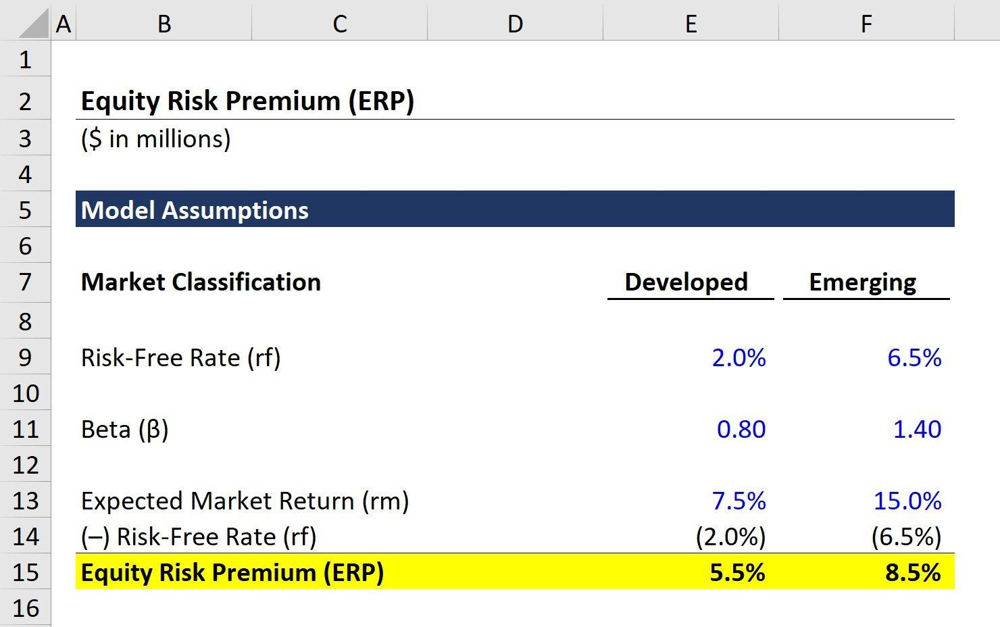

## Table of Contents

## What is the equity risk premium and why is it important?

The equity risk premium is the extra return that investors expect to get from investing in stocks compared to risk-free investments like government bonds. It's like a reward for taking the risk of investing in the stock market, which can go up and down a lot more than safer investments. If you think of stocks as a roller coaster and government bonds as a calm boat ride, the equity risk premium is the extra thrill (and potential reward) you get for choosing the roller coaster.

Understanding the equity risk premium is important because it helps investors decide where to put their money. If the expected reward for taking the risk of investing in stocks is high, more people might choose stocks over safer options. This can affect how the whole stock market behaves. Also, businesses use the equity risk premium to figure out how much it costs them to raise money from investors, which can influence their decisions about expanding or starting new projects. So, the equity risk premium is a big deal for both individual investors and the economy as a whole.

## How can I use Excel to calculate the equity risk premium?

To calculate the equity risk premium using Excel, you need two pieces of information: the expected return on the stock market and the risk-free rate. The expected return on the stock market can be based on historical data or forecasts, and the risk-free rate is usually the yield on a government bond, like a 10-year U.S. Treasury bond. Let's say you have these numbers: the expected return on the stock market is 8% and the risk-free rate is 2%. In Excel, you would enter these numbers into two different cells, for example, A1 for the expected return and B1 for the risk-free rate.

Once you have these values in your spreadsheet, calculating the equity risk premium is simple. In another cell, like C1, you would type in the formula to subtract the risk-free rate from the expected return on the stock market. So, you would type `=A1-B1` into cell C1. After pressing Enter, Excel will show you the result, which in this example would be 6%. This 6% is your equity risk premium, telling you that investors expect an additional 6% return for investing in the stock market instead of in risk-free government bonds.

## What data do I need to gather before starting the calculation in Excel?

Before you start calculating the equity risk premium in Excel, you need to gather two main pieces of data: the expected return on the stock market and the risk-free rate. The expected return on the stock market can be tricky to figure out. You can use historical data to estimate it, looking at how the stock market has performed in the past, or you can use forecasts from financial experts about what they think will happen in the future. This number is important because it tells you what investors might expect to earn from investing in stocks.

The other piece of data you need is the risk-free rate. This is usually the yield on a government bond, like a 10-year U.S. Treasury bond. The risk-free rate is considered 'risk-free' because governments are very unlikely to default on their debt. You can find this rate by looking at current bond yields or financial news websites. Once you have both the expected return on the stock market and the risk-free rate, you can plug these numbers into Excel to find out the equity risk premium.

## How do I import historical stock market data into Excel?

To import historical stock market data into Excel, you can use the internet to find websites that offer this data for free. Websites like Yahoo Finance or Google Finance have lots of historical data on stock market indexes like the S&P 500 or the Dow Jones. Once you find the data you need, you can download it as a CSV file, which is a type of file that Excel can open easily. After downloading the file, you just need to open Excel, go to the 'File' menu, choose 'Open', and then select the CSV file you downloaded. This will bring the data right into your Excel spreadsheet.

Once the data is in Excel, you might need to do a little bit of organizing. The data might come in with dates and numbers all mixed together. You can use Excel's sorting and filtering tools to make sure the data is in the right order, usually with the oldest dates at the top and the newest at the bottom. After you have the data organized, you can use Excel's formulas to calculate things like the average return over time, which you can use as your expected return on the stock market. This will help you when you're ready to calculate the equity risk premium.

## What are the basic formulas used in Excel for calculating the equity risk premium?

To calculate the equity risk premium in Excel, you need two main pieces of data: the expected return on the stock market and the risk-free rate. The expected return on the stock market can be estimated using historical data or forecasts. You can find this by calculating the average return of a stock market index like the S&P 500 over a certain period. For example, if you have the annual returns of the S&P 500 in a column, you can use the AVERAGE function in Excel to find the average return. Let's say your data is in cells A1 through A10, you would type `=AVERAGE(A1:A10)` into a cell to get the average return. This average return is what you'll use as the expected return on the stock market.

The risk-free rate is usually the yield on a government bond, like a 10-year U.S. Treasury bond. You can find this rate on financial websites and enter it into a cell in your Excel spreadsheet. Once you have both the expected return on the stock market and the risk-free rate, calculating the equity risk premium is simple. If your expected return is in cell B1 and your risk-free rate is in cell C1, you would type `=B1-C1` into another cell, like D1, to calculate the equity risk premium. This formula subtracts the risk-free rate from the expected return on the stock market, giving you the extra return investors expect for taking the risk of investing in stocks.

## How do I calculate the average market return using Excel?

To calculate the average market return using Excel, you first need to have the historical data of the stock market's returns. Let's say you have these returns listed in cells A1 through A10 in your Excel sheet. These could be the annual returns of an index like the S&P 500. To find the average of these returns, you'll use the AVERAGE function. In a new cell, like B1, you type `=AVERAGE(A1:A10)`. When you press Enter, Excel will calculate the average of the numbers in cells A1 through A10 and show you the result in B1. This average is what you'll use as the expected return on the stock market.

Once you have the average market return, you can use it to calculate other things, like the equity risk premium. The equity risk premium is the difference between the expected return on the stock market and the risk-free rate. If you have the risk-free rate in another cell, say C1, you can subtract it from the average market return to find the equity risk premium. In a new cell, like D1, you would type `=B1-C1`. This simple formula helps you see how much extra return investors expect for choosing to invest in the stock market instead of in safer options like government bonds.

## How can I estimate the risk-free rate in Excel for the equity risk premium calculation?

To estimate the risk-free rate in Excel for calculating the equity risk premium, you first need to find the current yield on a government bond, like a 10-year U.S. Treasury bond. You can look this up on financial websites like Yahoo Finance or Google Finance. Once you have the yield, enter it into a cell in your Excel spreadsheet. For example, if the yield is 2%, you would type `2%` or `0.02` into a cell, let's say A1.

After you have the risk-free rate in your spreadsheet, you can use it to calculate the equity risk premium. The equity risk premium is the difference between the expected return on the stock market and the risk-free rate. If you have the expected return on the stock market in another cell, say B1, you can subtract the risk-free rate from it to find the equity risk premium. In a new cell, like C1, you would type `=B1-A1`. This simple formula will show you the extra return investors expect for investing in the stock market instead of in safer options like government bonds.

## What advanced Excel functions can enhance the accuracy of the equity risk premium calculation?

To make your equity risk premium calculation more accurate in Excel, you can use the AVERAGE function to find the expected return on the stock market. Instead of just using a simple average, you can use the AVERAGEIF or AVERAGEIFS functions. These let you include only certain data points in your average. For example, if you want to ignore years with very high or very low returns because they might not be typical, you can set conditions to only average the 'normal' years. This can give you a more reliable expected return, which is a big part of the equity risk premium calculation.

Another useful function is XIRR, which calculates the internal rate of return for a series of cash flows that might not be regular. If you have data on stock market returns that include dividends or other irregular cash flows, using XIRR can give you a more accurate expected return. You can then use this in your equity risk premium calculation. Also, the VLOOKUP or INDEX/MATCH functions can help you pull in the risk-free rate from another part of your spreadsheet or from an external data source, making sure you're always using the most up-to-date numbers. These functions can make your calculations more precise and easier to update over time.

## How do I account for different time periods when calculating the equity risk premium in Excel?

When you want to calculate the equity risk premium for different time periods in Excel, you need to think about how the expected return on the stock market and the risk-free rate might change over time. For the expected return, you can use the AVERAGE function to find the average return over a specific period. For example, if you want to calculate the equity risk premium for the last 10 years, you can use the returns from those 10 years to find the average. You can also use the AVERAGEIF function to only include certain years in your average, like ignoring years with very high or very low returns to get a more typical expected return.

For the risk-free rate, you need to find the yield on a government bond for the same time period you're looking at. If you're calculating the equity risk premium for different time periods, you'll need to find the risk-free rate for each period. You can use the VLOOKUP or INDEX/MATCH functions to pull in the right risk-free rate from another part of your spreadsheet or from an external data source. Once you have both the expected return on the stock market and the risk-free rate for the time period you're interested in, you can subtract the risk-free rate from the expected return to find the equity risk premium for that period.

## Can Excel be used to perform sensitivity analysis on the equity risk premium, and if so, how?

Yes, you can use Excel to do a sensitivity analysis on the equity risk premium. Sensitivity analysis helps you see how changes in the expected return on the stock market or the risk-free rate can affect the equity risk premium. In Excel, you can set up a table where you change the values of the expected return and the risk-free rate to see how the equity risk premium changes. You can use the Data Table feature in Excel to do this easily. Just put different values for the expected return in one column and different values for the risk-free rate in another column. Then, Excel will calculate the equity risk premium for each combination of these values, showing you how sensitive the equity risk premium is to these changes.

To set up a Data Table for sensitivity analysis, first, calculate the equity risk premium in a cell using the formula `=Expected Return - Risk-Free Rate`. Let's say this is in cell C1, where B1 has the expected return and A1 has the risk-free rate. Next, create a table where you list different possible values for the expected return in one column and different values for the risk-free rate in the first row of another column. Then, select the entire table including the cell with the original equity risk premium calculation. Go to the Data tab, click on 'What-If Analysis', and choose 'Data Table'. Set the Column input cell to the cell with the expected return (B1) and the Row input cell to the cell with the risk-free rate (A1). Excel will fill in the table with the equity risk premium for each combination, helping you see how sensitive it is to changes in the expected return and the risk-free rate.

## How can I use Excel to compare the equity risk premium across different countries or markets?

To compare the equity risk premium across different countries or markets using Excel, you first need to gather data on the expected return on the stock market and the risk-free rate for each country or market you want to compare. You can find this data from financial websites or databases that provide historical returns and current bond yields. Once you have this information, enter it into your Excel spreadsheet. For example, you might have columns for the country or market name, the expected return on the stock market, and the risk-free rate. Then, you can use a simple formula to calculate the equity risk premium for each country or market by subtracting the risk-free rate from the expected return.

After calculating the equity risk premium for each country or market, you can use Excel's tools to make the comparison easier to understand. You can sort the data by the equity risk premium to see which countries or markets have the highest and lowest premiums. You can also use Excel's charting features to create a bar chart or a line graph to visually compare the equity risk premiums. This way, you can quickly see how the equity risk premium varies across different countries or markets and make more informed investment decisions based on the relative risk and potential reward in each market.

## What are the common pitfalls to avoid when calculating the equity risk premium in Excel?

When you're figuring out the equity risk premium in Excel, it's easy to make mistakes if you're not careful. One big mistake is using the wrong numbers for the expected return on the stock market or the risk-free rate. If you use old numbers or guess instead of looking up the right ones, your calculation will be off. Another common problem is not checking your data. If your historical stock market returns or bond yields have mistakes or are missing some information, your equity risk premium won't be accurate. Also, make sure you're using the right time period for your data. If you mix up different years or periods, your results won't make sense.

Another pitfall to watch out for is not understanding how Excel works. If you don't know how to use functions like AVERAGE or AVERAGEIF correctly, you might end up with the wrong average return for the stock market. It's also important to double-check your formulas. A small typo or using the wrong cell reference can throw off your whole calculation. Finally, remember that the equity risk premium can change over time, so using a single number for a long time might not give you the best picture. Keep updating your data and checking your work to make sure your equity risk premium calculation stays accurate and useful.

## What is the Understanding of Equity Risk Premium?

The equity risk premium (ERP) is a fundamental concept in finance, representing the additional return that investors expect from holding equities over risk-free assets. In essence, it serves as a compensation for taking on the higher risk associated with equities. This premium is a critical component in several financial models, particularly the Capital Asset Pricing Model (CAPM), which is utilized to estimate the expected return on an investment by adjusting for systematic risk.

The calculation of the equity risk premium is straightforward: it is the difference between the expected market returns and the return on risk-free assets. Mathematically, it can be expressed as:

$$
\text{Equity Risk Premium} = E(R_m) - R_f
$$

where $E(R_m)$ is the expected return of the market portfolio and $R_f$ is the risk-free rate, typically represented by government bond yields.

The importance of ERP is underscored during periods of market [volatility](/wiki/volatility-trading-strategies) and economic uncertainty, as these conditions amplify the risks associated with equity investments. Hence, a thorough understanding of the equity risk premium is crucial for financial professionals as it aids in portfolio management and in forming sound investment strategies. By quantifying the additional return expected from equities, investors can better evaluate the attractiveness of these assets.

Moreover, the equity risk premium functions as a gauge of potential future market performance. It aids in assessing whether the current level of risk is appropriately priced given the anticipated returns. This assessment can have significant implications for asset allocation decisions, helping investors determine the optimal balance between equities and less risky investments to maximize returns while managing risk.

Overall, a comprehensive grasp of the equity risk premium enhances an investor's ability to evaluate and manage the risks and rewards inherent in equity markets, ultimately contributing to more informed investment decisions.

## What is the Role of Investment Risk?

Investment risk is an inherent part of financial decision-making, encompassing the uncertainty of returns and the potential for financial losses. This uncertainty arises from various factors, each contributing to different types of investment risks. These risks must be thoroughly understood to effectively align investment choices with an individual or institution's risk tolerance.

Market risk, also referred to as systematic risk, is associated with broader economic shifts and affects the entire market. Fluctuations in interest rates, inflation, and economic recessions are common sources of market risk. Conversely, credit risk pertains to the possibility that a borrower may default on its financial obligations, impacting the lender’s returns.

Liquidity risk arises when an investor cannot quickly execute a trade or convert an asset into cash without significantly affecting its price. This risk can lead to assets being sold at a loss, especially during times of market stress. Operational risk, meanwhile, involves potential losses from internal failures such as processes, systems, or even human errors. Finally, inflation risk refers to the erosion of purchasing power due to a rise in price levels, which can diminish real investment returns over time.

Quantitative measures provide essential tools for assessing investment risk. Standard deviation, for instance, quantifies the degree of variation or [dispersion](/wiki/dispersion-trading) of a set of values, serving as an indicator of an asset’s risk relative to its historical performance. The Sharpe ratio, on the other hand, evaluates risk-adjusted return by dividing the excess return (over the risk-free rate) by the standard deviation of the portfolio's return. It is expressed as:

$$
\text{Sharpe Ratio} = \frac{E(R) - R_f}{\sigma}
$$

where $E(R)$ is the expected return of the portfolio, $R_f$ is the risk-free rate, and $\sigma$ is the standard deviation of the portfolio's excess return.

Effectively managing these various risks is crucial for optimizing portfolio performance and enhancing returns. Risk management strategies often involve diversification, where investments are spread across various asset classes to mitigate exposure to any single risk [factor](/wiki/factor-investing). Additionally, modern portfolio theory advocates for constructing a portfolio that maximizes return for a given level of risk, often relying on quantitative tools to balance these elements effectively.

Investors who understand and employ these risk management techniques can better navigate the complexities of financial markets, striving to achieve their investment objectives while minimizing potential losses.

## How do you calculate the equity risk premium?

The equity risk premium (ERP) is a critical concept in finance, representing the additional return investors expect from investing in equities over a risk-free asset. It is essential for understanding the compensation investors require for taking on the higher risk of equity investments. The ERP can be calculated using several methodologies, each with distinct applications and assumptions.

The Capital Asset Pricing Model (CAPM) provides a framework for calculating the ERP by factoring in the stock's beta, representing the systematic risk compared to the overall market. The formula for the expected return according to CAPM is:

$$

E(R_i) = R_f + \beta_i \times (E(R_m) - R_f) 
$$

Where:
- $E(R_i)$ is the expected return of the investment
- $R_f$ is the risk-free rate
- $\beta_i$ is the beta of the investment
- $E(R_m)$ is the expected market return

The equity risk premium ($ERP$) in this context is:
$$

ERP = E(R_m) - R_f 
$$

This calculation essentially adjusts the expected return for the risk attributable to the market as a whole, as expressed by $\beta$.

There are two primary approaches to estimate ERP: historical methods and implied methods. Historical methods involve analyzing historical returns to estimate the ERP. These methods assume that historical performance is indicative of future expectations and often involve calculating the average historical excess return of stocks over risk-free assets.

Implied methods, on the other hand, estimate the ERP by using current market prices and expected future returns. These methods incorporate forward-looking expectations, such as analyst earnings forecasts and dividend growth rates, to arrive at an ERP value.

The choice between historical and implied methods depends largely on the specific context and objectives of the investment analysis. Historical methods are often used when a long-term perspective is warranted, and there is confidence that historical patterns will continue. Implied methods may be more suitable in volatile markets or when accurate predictions of future performance are crucial.

For practical implementation, these calculations can be performed using Python. The following Python code snippet demonstrates how to compute a historical equity risk premium based on historical return data:

```python
import numpy as np

# Historical returns of the market and the risk-free rate
market_returns = np.array([0.10, 0.12, 0.08, 0.15, 0.09])  # Example market returns
risk_free_rate = np.array([0.03, 0.03, 0.03, 0.03, 0.03])  # Constant risk-free rate over the period

# Calculate the historical ERP
historical_erp = np.mean(market_returns - risk_free_rate)
print(f"Historical Equity Risk Premium: {historical_erp:.2%}")
```

In this example, the average of the excess returns of the market over the risk-free rate provides a historical equity risk premium estimate, showcasing how past data can inform current investment strategies.

## How can financial calculations be applied in real-world scenarios according to the case study?

This case study highlights the importance of incorporating the equity risk premium (ERP) into portfolio optimization and trading strategies. In financial analysis and investment management, the equity risk premium serves as a foundational concept that affects decision-making. By understanding and employing ERP, investors can effectively manage risk and enhance returns.

The Capital Asset Pricing Model (CAPM) is a pivotal tool in modern portfolio theory, facilitating the selection of an optimal mix of assets to maximize returns for a given level of risk. The CAPM formula is expressed as:

$$

E(R_i) = R_f + \beta_i (E(R_m) - R_f) 
$$

Where:
- $E(R_i)$ is the expected return of investment,
- $R_f$ is the risk-free rate,
- $\beta_i$ represents the sensitivity of the asset's returns to market returns,
- $E(R_m)$ is the expected market return.

The equity risk premium, calculated as $E(R_m) - R_f$, plays a crucial role in assessing the attractiveness of equity investments over risk-free alternatives. By calculating ERP, investors and portfolio managers can predict risk-adjusted returns and determine the optimal asset allocation that aligns with their investment objectives and risk tolerance.

Algorithmic trading takes this analysis further by dynamically adjusting trading strategies using real-time ERP data. Algorithms can respond quickly to changing market conditions, allowing for precision in trade execution. By integrating ERP into these algorithms, traders can evaluate the relative attractiveness of different equities, making informed decisions on trade entry and [exit](/wiki/exit-strategy) points.

Here's a simple Python example displaying how real-time ERP calculations might inform algorithmic trading decisions:

```python
import numpy as np

# Constants for calculation
risk_free_rate = 0.03
market_return = 0.08
beta = 1.2

# Calculate equity risk premium
erp = market_return - risk_free_rate

# Calculate expected return using CAPM
expected_return = risk_free_rate + beta * erp

# Example trading decision based on expected return
def trading_decision(current_stock_return):
    if current_stock_return > expected_return:
        return "Buy"
    else:
        return "Sell"

# Simulated current stock return
current_stock_return = 0.10

# Decision
decision = trading_decision(current_stock_return)
print(f"Trading decision: {decision}")
```

In this code, a stock's current return is compared to the expected return calculated using ERP and CAPM. If the stock's return exceeds the expected return, the algorithm triggers a "Buy" decision, otherwise, it advises to "Sell". This approach allows for real-time strategy adjustments based on current market data.

By incorporating ERP into portfolio and trading strategies, financial professionals gain the ability to craft more informed, responsive, and effective investment decisions. This integration ensures that strategies are aligned with the underlying market dynamics and can adapt to varying economic conditions seamlessly. Such a strategic approach enhances the ability to maximize returns while managing risk effectively in an ever-evolving financial market landscape.

## References & Further Reading

[1]: ["Advances in Financial Machine Learning"](https://www.amazon.com/Advances-Financial-Machine-Learning-Marcos/dp/1119482089) by Marcos Lopez de Prado

[2]: ["Quantitative Trading: How to Build Your Own Algorithmic Trading Business"](https://www.amazon.com/Quantitative-Trading-Build-Algorithmic-Business/dp/1119800064) by Ernest P. Chan

[3]: ["Machine Learning for Algorithmic Trading"](https://github.com/stefan-jansen/machine-learning-for-trading) by Stefan Jansen

[4]: ["Evidence-Based Technical Analysis: Applying the Scientific Method and Statistical Inference to Trading Signals"](https://www.amazon.com/Evidence-Based-Technical-Analysis-Scientific-Statistical/dp/0470008741) by David Aronson

[5]: "Equity Risk Premiums (ERP): Determinants, Estimation and Implications." Available online at New York University Stern School of Business, https://pages.stern.nyu.edu/~adamodar/