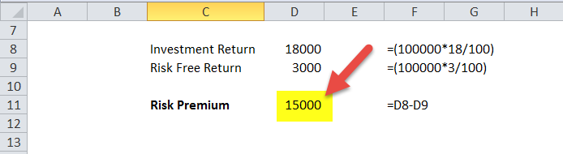

The modern financial landscape is marked by increasing complexity, characterized by an array of intricate terms and concepts that significantly influence investment decisions. Amidst this complex ecosystem, key financial calculations, such as the equity risk premium, play a crucial role. The equity risk premium, which measures the additional return expected from investing in equities over risk-free assets, is vital for evaluating potential equity investments and optimizing portfolio management. This metric is foundational in financial models like the Capital Asset Pricing Model (CAPM), used to predict expected returns by contrasting anticipated market returns with risk-free rates.

This article investigates the intersection of Excel-based financial calculations, equity risk premium, and algorithmic trading, which represents a transformative segment of financial analysis. Excel, with its robust capabilities, serves as an essential tool in performing complex financial calculations, allowing professionals to model scenarios and analyze investment opportunities with precision. Meanwhile, the integration of algorithmic trading systems has revolutionized market interactions, employing advanced algorithms to process data and execute trades with unprecedented speed and accuracy.



Investors and financial professionals are continually seeking ways to enhance investment strategies. By utilizing concepts such as the equity risk premium and integrating them with algorithmic trading and Excel-based computational tools, they can make more informed decisions, optimize performance, and effectively manage risks. These strategies are essential in a fast-paced financial environment where timely, data-driven decisions can significantly impact investment outcomes and organizational success.

## Table of Contents

## Understanding Equity Risk Premium

The equity risk premium (ERP) is a fundamental concept in finance, representing the additional return that investors expect from holding equities over risk-free assets. In essence, it serves as a compensation for taking on the higher risk associated with equities. This premium is a critical component in several financial models, particularly the Capital Asset Pricing Model (CAPM), which is utilized to estimate the expected return on an investment by adjusting for systematic risk.

The calculation of the equity risk premium is straightforward: it is the difference between the expected market returns and the return on risk-free assets. Mathematically, it can be expressed as:

$$
\text{Equity Risk Premium} = E(R_m) - R_f
$$

where $E(R_m)$ is the expected return of the market portfolio and $R_f$ is the risk-free rate, typically represented by government bond yields.

The importance of ERP is underscored during periods of market [volatility](/wiki/volatility-trading-strategies) and economic uncertainty, as these conditions amplify the risks associated with equity investments. Hence, a thorough understanding of the equity risk premium is crucial for financial professionals as it aids in portfolio management and in forming sound investment strategies. By quantifying the additional return expected from equities, investors can better evaluate the attractiveness of these assets.

Moreover, the equity risk premium functions as a gauge of potential future market performance. It aids in assessing whether the current level of risk is appropriately priced given the anticipated returns. This assessment can have significant implications for asset allocation decisions, helping investors determine the optimal balance between equities and less risky investments to maximize returns while managing risk.

Overall, a comprehensive grasp of the equity risk premium enhances an investor's ability to evaluate and manage the risks and rewards inherent in equity markets, ultimately contributing to more informed investment decisions.

## The Role of Investment Risk

Investment risk is an inherent part of financial decision-making, encompassing the uncertainty of returns and the potential for financial losses. This uncertainty arises from various factors, each contributing to different types of investment risks. These risks must be thoroughly understood to effectively align investment choices with an individual or institution's risk tolerance.

Market risk, also referred to as systematic risk, is associated with broader economic shifts and affects the entire market. Fluctuations in interest rates, inflation, and economic recessions are common sources of market risk. Conversely, credit risk pertains to the possibility that a borrower may default on its financial obligations, impacting the lender’s returns.

Liquidity risk arises when an investor cannot quickly execute a trade or convert an asset into cash without significantly affecting its price. This risk can lead to assets being sold at a loss, especially during times of market stress. Operational risk, meanwhile, involves potential losses from internal failures such as processes, systems, or even human errors. Finally, inflation risk refers to the erosion of purchasing power due to a rise in price levels, which can diminish real investment returns over time.

Quantitative measures provide essential tools for assessing investment risk. Standard deviation, for instance, quantifies the degree of variation or [dispersion](/wiki/dispersion-trading) of a set of values, serving as an indicator of an asset’s risk relative to its historical performance. The Sharpe ratio, on the other hand, evaluates risk-adjusted return by dividing the excess return (over the risk-free rate) by the standard deviation of the portfolio's return. It is expressed as:

$$
\text{Sharpe Ratio} = \frac{E(R) - R_f}{\sigma}
$$

where $E(R)$ is the expected return of the portfolio, $R_f$ is the risk-free rate, and $\sigma$ is the standard deviation of the portfolio's excess return.

Effectively managing these various risks is crucial for optimizing portfolio performance and enhancing returns. Risk management strategies often involve diversification, where investments are spread across various asset classes to mitigate exposure to any single risk [factor](/wiki/factor-investing). Additionally, modern portfolio theory advocates for constructing a portfolio that maximizes return for a given level of risk, often relying on quantitative tools to balance these elements effectively.

Investors who understand and employ these risk management techniques can better navigate the complexities of financial markets, striving to achieve their investment objectives while minimizing potential losses.

## Algorithmic Trading in Modern Finance

Algorithmic trading, also known as algo trading, employs computer algorithms to automate financial transactions. This method leverages computational power to execute orders at speeds and frequencies that are beyond human capability. By processing large volumes of data with high speed and precision, [algorithmic trading](/wiki/algorithmic-trading) significantly enhances the efficiency of executing trades.

A critical advantage of algorithmic trading is its ability to incorporate complex financial calculations, such as equity risk premiums, into trading strategies. The equity risk premium, which reflects the expected return from equities over risk-free assets, is essential in determining investment attractiveness. Algorithms that integrate this financial metric can optimize decision-making by aligning trading strategies with expected market returns, facilitating more informed investment choices.

Moreover, algorithmic trading models utilize risk-adjusted strategies and performance metrics to enhance their effectiveness. Performance metrics, such as the Sharpe ratio, which evaluates the return of an investment compared to its risk, are integrated into these algorithms to optimize their decision-making processes. This risk-adjusted approach ensures that the trading models are not only targeting returns but are also mindful of associated risks.

The implementation of algorithmic trading is markedly supported by the use of programming languages, with Python being particularly prominent due to its extensive libraries tailored for financial analysis. Libraries such as NumPy and Pandas enable efficient data manipulation and analysis, while libraries like TA-Lib and PyAlgoTrade offer tools for technical analysis and algorithmic trading strategy development. Below is a simplified example of how Python can be used for a foundational algorithmic trading strategy:

```python
import pandas as pd
import numpy as np
import talib
from datetime import datetime

# Sample data: assume 'data' contains historical price data with 'close' prices column
data = pd.read_csv('historical_price_data.csv')
data['SMA'] = talib.SMA(data['close'], timeperiod=30)

# Trading strategy: Buy when price is above Simple Moving Average (SMA), sell otherwise
data['Signal'] = np.where(data['close'] > data['SMA'], 1, 0)

# Example execution: Print trade signals
print(data[['close', 'SMA', 'Signal']])
```

This basic script demonstrates a simple moving average (SMA) strategy using the TA-Lib library in Python. It calculates the SMA of close prices and generates trading signals where a buy signal is indicated when the price is above the SMA.

Algorithmic trading not only elevates the efficiency of trade execution but also fortifies the strategic approach through precise calculations and risk management. As financial markets continue to advance, the integration of robust financial analyses within algorithmic frameworks remains a cornerstone of modern finance.

## Integrating Equity Risk Premium in Trading Strategies

Incorporating the equity risk premium into trading strategies allows for more precise forecasting of returns, facilitating the alignment of investment approaches with the current market environment. Algorithmic trading systems are particularly well-suited for this task, as they can dynamically adjust strategies based on real-time calculations of the equity risk premium. This adaptability enables trading systems to respond swiftly to changes in market dynamics and investor sentiment.

Algorithmic trading relies heavily on data analysis and swift execution of trades, providing a unique advantage in integrating financial calculations such as the equity risk premium. By embedding these calculations into trading algorithms, systems can alter their strategies in accordance with real-time shifts in the equity risk premium. This adaptability allows traders to manage risks proactively and seize opportunities that align with their investment objectives.

Python, a preferred language for financial analysis due to its extensive library support and ease of use, provides robust tools for implementing equity risk premium calculations into trading algorithms. The following Python example demonstrates a simple way to incorporate equity risk premium calculations into an algorithmic trading strategy:

```python
import numpy as np

# Simulated historical returns and risk-free rate
market_returns = np.array([0.10, 0.15, 0.12, 0.07])
risk_free_rate = 0.03

# Calculate the equity risk premium
equity_risk_premium = np.mean(market_returns) - risk_free_rate
print(f"Equity Risk Premium: {equity_risk_premium}")

# Example trading strategy adjustment based on equity risk premium
def trade_based_on_erp(erp):
    if erp > 0.05:
        return "Aggressive Strategy"
    else:
        return "Conservative Strategy"

strategy = trade_based_on_erp(equity_risk_premium)
print(f"Selected Strategy: {strategy}")
```

In this example, the equity risk premium is calculated by subtracting the risk-free rate from the average market return. This premium is then used as a benchmark to guide the selection of a trading strategy. A higher equity risk premium indicates a more favorable environment for equities, suggesting an aggressive trading approach, whereas a lower premium may warrant a conservative strategy.

By integrating the equity risk premium into their strategies, traders can better position themselves to navigate complex market conditions. This approach ensures that trading decisions are informed by both current financial data and strategic foresight. Such a method not only enhances decision-making but also optimizes the ability to capitalize on financial opportunities while effectively managing risk.

## Factors Affecting Equity Risk Premium

Economic conditions, interest rates, and market volatility significantly affect the equity risk premium by altering investor perceptions and influencing market dynamics. Understanding these factors is crucial for forecasting potential market movements and strategy formulation.

Economic conditions play a vital role in determining the equity risk premium. During periods of economic growth, businesses typically display improved earnings potential and stability, which can lead to a decrease in the perceived risk of equity investments. As a result, investors may expect a lower equity risk premium, reflecting higher confidence in their equity investments. Conversely, during economic downturns or recessions, the uncertainty surrounding corporate earnings increases, prompting investors to demand a higher equity risk premium as compensation for the added risk.

Interest rates are another important factor affecting the equity risk premium. When interest rates rise, fixed-income investments such as bonds become more attractive due to their higher yields. This can lead to a shift in investor preference away from equities, which often results in an increased equity risk premium as investors seek higher returns to justify the additional risk of equity holdings. Conversely, during periods of low interest rates, equities become relatively more attractive, potentially reducing the equity risk premium.

Market volatility also influences the equity risk premium. In highly volatile markets, the perceived risk of equity investments increases, prompting investors to demand a higher risk premium. The volatility of stock returns can be measured using indicators such as the standard deviation, which quantifies the dispersion of returns. An increase in market volatility, often driven by geopolitical events or unexpected economic indicators, can lead to elevated equity risk premiums as investors factor in the greater uncertainty associated with their investments.

Understanding these factors is essential for investors and financial analysts when forecasting market behavior and formulating investment strategies. By analyzing economic indicators, [interest rate](/wiki/interest-rate-trading-strategies) trends, and market volatility metrics, investors can gain insights into potential shifts in the risk-reward balance of equities. This analysis aids in making informed decisions regarding asset allocation and risk management, ultimately contributing to more effective portfolio management and strategy optimization.

## Calculating Equity Risk Premium

The equity risk premium (ERP) is a critical concept in finance, representing the additional return investors expect from investing in equities over a risk-free asset. It is essential for understanding the compensation investors require for taking on the higher risk of equity investments. The ERP can be calculated using several methodologies, each with distinct applications and assumptions.

The Capital Asset Pricing Model (CAPM) provides a framework for calculating the ERP by factoring in the stock's beta, representing the systematic risk compared to the overall market. The formula for the expected return according to CAPM is:

$$

E(R_i) = R_f + \beta_i \times (E(R_m) - R_f) 
$$

Where:
- $E(R_i)$ is the expected return of the investment
- $R_f$ is the risk-free rate
- $\beta_i$ is the beta of the investment
- $E(R_m)$ is the expected market return

The equity risk premium ($ERP$) in this context is:
$$

ERP = E(R_m) - R_f 
$$

This calculation essentially adjusts the expected return for the risk attributable to the market as a whole, as expressed by $\beta$.

There are two primary approaches to estimate ERP: historical methods and implied methods. Historical methods involve analyzing historical returns to estimate the ERP. These methods assume that historical performance is indicative of future expectations and often involve calculating the average historical excess return of stocks over risk-free assets.

Implied methods, on the other hand, estimate the ERP by using current market prices and expected future returns. These methods incorporate forward-looking expectations, such as analyst earnings forecasts and dividend growth rates, to arrive at an ERP value.

The choice between historical and implied methods depends largely on the specific context and objectives of the investment analysis. Historical methods are often used when a long-term perspective is warranted, and there is confidence that historical patterns will continue. Implied methods may be more suitable in volatile markets or when accurate predictions of future performance are crucial.

For practical implementation, these calculations can be performed using Python. The following Python code snippet demonstrates how to compute a historical equity risk premium based on historical return data:

```python
import numpy as np

# Historical returns of the market and the risk-free rate
market_returns = np.array([0.10, 0.12, 0.08, 0.15, 0.09])  # Example market returns
risk_free_rate = np.array([0.03, 0.03, 0.03, 0.03, 0.03])  # Constant risk-free rate over the period

# Calculate the historical ERP
historical_erp = np.mean(market_returns - risk_free_rate)
print(f"Historical Equity Risk Premium: {historical_erp:.2%}")
```

In this example, the average of the excess returns of the market over the risk-free rate provides a historical equity risk premium estimate, showcasing how past data can inform current investment strategies.

## Case Study: Applying Financial Calculations in Real-world Scenarios

This case study highlights the importance of incorporating the equity risk premium (ERP) into portfolio optimization and trading strategies. In financial analysis and investment management, the equity risk premium serves as a foundational concept that affects decision-making. By understanding and employing ERP, investors can effectively manage risk and enhance returns.

The Capital Asset Pricing Model (CAPM) is a pivotal tool in modern portfolio theory, facilitating the selection of an optimal mix of assets to maximize returns for a given level of risk. The CAPM formula is expressed as:

$$

E(R_i) = R_f + \beta_i (E(R_m) - R_f) 
$$

Where:
- $E(R_i)$ is the expected return of investment,
- $R_f$ is the risk-free rate,
- $\beta_i$ represents the sensitivity of the asset's returns to market returns,
- $E(R_m)$ is the expected market return.

The equity risk premium, calculated as $E(R_m) - R_f$, plays a crucial role in assessing the attractiveness of equity investments over risk-free alternatives. By calculating ERP, investors and portfolio managers can predict risk-adjusted returns and determine the optimal asset allocation that aligns with their investment objectives and risk tolerance.

Algorithmic trading takes this analysis further by dynamically adjusting trading strategies using real-time ERP data. Algorithms can respond quickly to changing market conditions, allowing for precision in trade execution. By integrating ERP into these algorithms, traders can evaluate the relative attractiveness of different equities, making informed decisions on trade entry and [exit](/wiki/exit-strategy) points.

Here's a simple Python example displaying how real-time ERP calculations might inform algorithmic trading decisions:

```python
import numpy as np

# Constants for calculation
risk_free_rate = 0.03
market_return = 0.08
beta = 1.2

# Calculate equity risk premium
erp = market_return - risk_free_rate

# Calculate expected return using CAPM
expected_return = risk_free_rate + beta * erp

# Example trading decision based on expected return
def trading_decision(current_stock_return):
    if current_stock_return > expected_return:
        return "Buy"
    else:
        return "Sell"

# Simulated current stock return
current_stock_return = 0.10

# Decision
decision = trading_decision(current_stock_return)
print(f"Trading decision: {decision}")
```

In this code, a stock's current return is compared to the expected return calculated using ERP and CAPM. If the stock's return exceeds the expected return, the algorithm triggers a "Buy" decision, otherwise, it advises to "Sell". This approach allows for real-time strategy adjustments based on current market data.

By incorporating ERP into portfolio and trading strategies, financial professionals gain the ability to craft more informed, responsive, and effective investment decisions. This integration ensures that strategies are aligned with the underlying market dynamics and can adapt to varying economic conditions seamlessly. Such a strategic approach enhances the ability to maximize returns while managing risk effectively in an ever-evolving financial market landscape.

## Conclusion

The integration of equity risk premiums with financial algorithms offers significant strategic depth for traders and investors. By incorporating the equity risk premium into advanced algorithms, financial professionals can achieve a nuanced understanding of market dynamics, allowing for more informed investment decisions. This understanding is critical for optimizing trading strategies and portfolio management, ensuring that investments align closely with risk-return objectives.

In today's fast-paced financial environment, automation and data-driven decisions are paramount. The precision and efficiency afforded by algorithmic trading systems ensure that investors can respond swiftly to market changes, leveraging real-time data to adjust strategies dynamically. Python, among other programming languages, facilitates the development of these sophisticated algorithms, which can analyze vast data sets to identify patterns and insights that may otherwise be overlooked.

As financial markets continue to evolve, the principles of equity risk premium integration and algorithmic trading maintain their status as foundational to successful investment practices. The adaptability of these strategies allows investors to navigate both stable and volatile markets effectively. Furthermore, continued exploration and refinement of financial calculations, such as the equity risk premium, promise to drive future innovations in finance, enabling even more refined and sophisticated trading models.

In conclusion, embracing the synergy of equity risk premiums and financial algorithms positions investors at the forefront of modern finance, equipped for the challenges and opportunities presented by an ever-shifting financial landscape.

## References & Further Reading

[1]: ["Advances in Financial Machine Learning"](https://www.amazon.com/Advances-Financial-Machine-Learning-Marcos/dp/1119482089) by Marcos Lopez de Prado

[2]: ["Quantitative Trading: How to Build Your Own Algorithmic Trading Business"](https://www.amazon.com/Quantitative-Trading-Build-Algorithmic-Business/dp/1119800064) by Ernest P. Chan

[3]: ["Machine Learning for Algorithmic Trading"](https://github.com/stefan-jansen/machine-learning-for-trading) by Stefan Jansen

[4]: ["Evidence-Based Technical Analysis: Applying the Scientific Method and Statistical Inference to Trading Signals"](https://www.amazon.com/Evidence-Based-Technical-Analysis-Scientific-Statistical/dp/0470008741) by David Aronson

[5]: "Equity Risk Premiums (ERP): Determinants, Estimation and Implications." Available online at New York University Stern School of Business, https://pages.stern.nyu.edu/~adamodar/