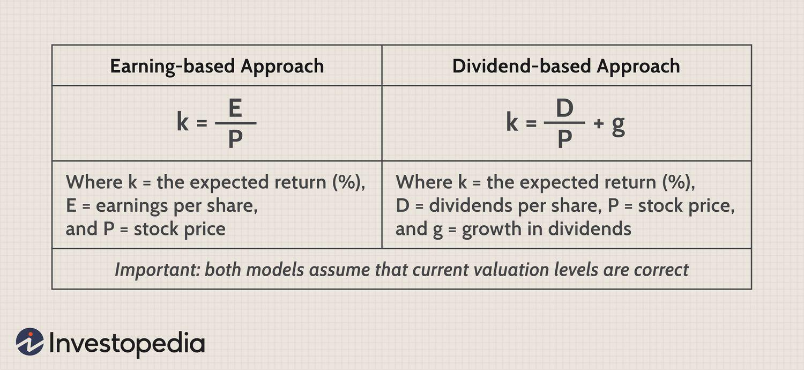

Financial markets serve as platforms for the exchange of financial securities and commodities, effectively facilitating the flow of capital and liquidity in the economy. Within these markets, the concept of the equity risk premium is pivotal. The equity risk premium represents the excess return that investing in stocks provides over a risk-free security, such as government bonds. This metric is integral to understanding the potential returns investors might earn by taking on added risk, compared to the virtually risk-free options available to them. In essence, it quantifies the compensation investors expect for assuming the heightened risks associated with equity investments.

Investment analysis plays a vital role in evaluating market opportunities, as it enables investors to assess potential risks and returns before committing capital. By exploring various analytical techniques and tools, investors can make informed decisions about asset allocation, timing, and strategy, thereby optimizing their portfolio performance. A critical facet of this process is understanding how different types of risk, economic conditions, and market dynamics influence investment outcomes.



Algorithmic trading has emerged as a transformative force in modern investment strategies. By leveraging advanced mathematical models and computational algorithms, traders can execute orders with remarkable speed and precision. This method minimizes human error and exploits market inefficiencies, leading to improved trading outcomes. Algorithmic trading integrates complex data analysis, allowing strategies to adapt swiftly to changing market conditions.

In this article, we will explore how the interplay between equity risk premium, investment analysis, and algorithmic trading can be harnessed to refine investment strategies. By examining these interactions, we can better understand how to optimize investment decisions in a dynamic financial landscape.

## Table of Contents

## Understanding Equity Risk Premium

The equity risk premium (ERP) is a fundamental concept in finance, representing the additional return an investor expects from investing in equities over risk-free securities. It is a critical measure used to assess the attractiveness of equity investments and forms a cornerstone of various financial models. The equity risk premium is significant because it compensates investors for taking on the additional risk associated with equities, as compared to the virtually risk-free nature of government treasury bonds.

At its core, the equity risk premium is the difference between the expected return on the equity market and the risk-free rate, which is often represented by the yield on government bonds. This difference serves as a gauge of the excess return that equities provide, reflecting the inherent risk of investing in stocks compared to risk-free securities.

### Calculation within CAPM Framework

One widely used method to calculate the equity risk premium is through the Capital Asset Pricing Model (CAPM). The CAPM formula is expressed as:

$$

E(R_i) = R_f + \beta_i (E(R_m) - R_f)
$$

Where:
- $E(R_i)$ is the expected return on the investment.
- $R_f$ is the risk-free rate of return.
- $\beta_i$ is the beta of the investment, representing its volatility relative to the market.
- $E(R_m)$ is the expected return of the market.

The term $(E(R_m) - R_f)$ represents the equity risk premium. It highlights the expected return required by investors for bearing the additional risk associated with equities compared to a risk-free investment.

### Role in Investment Decisions and Portfolio Management

The equity risk premium plays a pivotal role in guiding investment decisions and portfolio management. By providing a measure of the extra return required for equity investments, it helps investors decide whether the potential reward justifies the risk. A higher equity risk premium may indicate that equities are expected to perform well relative to risk-free securities, making them a more attractive investment option.

In portfolio management, the equity risk premium is instrumental in asset allocation decisions. It helps in the construction of diversified portfolios by informing the proportion of capital allocated towards equities versus bonds. Understanding the ERP allows portfolio managers to optimize the risk-reward profile of their portfolios, balancing between potential returns and acceptable risk levels.

Overall, the equity risk premium is an essential component in financial analysis, influencing investment strategies by aligning them with the investors' risk tolerance and return expectations. Its calculation and application through models such as CAPM underline its importance in both theoretical and practical aspects of finance.

## The Role of Investment Risk

Investment risk refers to the potential for an investor's assets to yield less-than-expected returns or even sustain losses. It emerges from various uncertainties inherent in financial markets and can be categorized into several types: market risk, credit risk, and [liquidity](/wiki/liquidity-risk-premium) risk. Each type of risk plays a critical role in shaping return expectations and influencing asset allocation decisions.

### Market Risk

Market risk, also known as systematic risk, is the risk of losses in investments due to factors that affect the overall financial market. Major sources of market risk include economic recessions, political turmoil, changes in interest rates, and natural disasters. Because market risk affects all securities in the market, it cannot be eliminated through diversification. However, hedging techniques, such as options and futures, can help mitigate market risk. Understanding market risk is crucial, as it aids investors in anticipating potential fluctuations in their portfolio values and aligning their returns expectations accordingly.

### Credit Risk

Credit risk is the possibility of a loss resulting from a borrower's failure to repay a loan or meet contractual obligations. It is primarily associated with fixed-income securities, such as bonds, which depend on the issuer's creditworthiness. Credit risk can be assessed using credit ratings provided by agencies like Moody's or Standard & Poor's. Higher credit risk usually implies a higher yield to compensate for the increased risk of default. By understanding credit risk, investors can better assess the trade-off between yield and the safety of their investments, enabling informed decisions regarding asset allocation.

### Liquidity Risk

Liquidity risk involves the risk of being unable to quickly sell an asset without a significant price discount. It is a critical [factor](/wiki/factor-investing) in asset allocation, as assets must be liquid enough to meet any potential cash flow needs. Illiquid investments, such as certain real estate holdings or private equity, may offer higher returns but also pose challenges in times of financial stress. By recognizing liquidity risk, investors can select a mix of assets that balances potential returns with the necessity for liquidity, thereby maintaining flexibility in their investment strategy.

### Influence on Return Expectations and Asset Allocation

Investment risks directly influence expected returns. Typically, the higher the risk, the higher the potential return expected by investors, a principle entrenched in finance theory known as the risk-return tradeoff. Market risk impacts returns across the entire portfolio, whereas credit and liquidity risks are more asset-specific, influencing individual security returns. Consequently, understanding these risks is essential for effectively allocating assets to balance potential returns with acceptable risk levels.

### Composing Diversified Portfolios

One of the most effective strategies to manage investment risk is through portfolio diversification. By investing across a variety of asset classes and securities with differing risk characteristics, investors can reduce the impact of individual risks. For example, diversifying a portfolio with stocks, bonds, real estate, and commodities can decrease overall portfolio [volatility](/wiki/volatility-trading-strategies) compared to holding a single asset type. Understanding the various risk types associated with different assets allows investors to construct portfolios that mitigate risks while aiming for target returns, thus optimizing performance relative to risk tolerance.

In summary, comprehending the nature and impact of investment risks—market, credit, and liquidity—is fundamental for sound investment analysis. This understanding not only informs expected returns and asset allocation decisions but also underscores the importance of diversification strategies to achieve an optimal balance between risk and return in investment portfolios.

## Algorithmic Trading in Modern Finance

Algorithmic trading refers to the use of computer algorithms to optimize the decision-making process in buying and selling financial instruments. It capitalizes on the advantages of speed and efficiency, allowing trades to be executed within microseconds—often much faster than human traders can react. The fundamental benefit of this speed is the ability to quickly capitalize on fleeting market opportunities and price discrepancies across different exchanges.

In terms of efficiency, algorithms can process vast amounts of financial data, encompassing historical prices, volumes, and other market conditions to identify patterns and trends. This efficient data processing capability not only reduces the time required to make trading decisions but also enhances the accuracy of those decisions by removing emotional bias and human error. Algorithms follow pre-set criteria meticulously, thereby minimizing the potential for mistakes that can occur due to fatigue or emotional reactions during manual trading.

Algorithmic trading strategically employs the equity risk premium (ERP) to refine investment decisions. The equity risk premium represents the additional expected return from investing in equities over a risk-free rate, compensating investors for the higher risk involved. By integrating ERP into trading algorithms, traders can effectively weigh the anticipated returns against the perceived risks, thus optimizing their portfolios.

For example, an algorithm might adjust the asset allocation of a portfolio based on real-time fluctuations in the equity risk premium. If the premium increases, indicating higher expected returns from equities, the algorithm can proactively allocate more capital towards stocks. Conversely, if the ERP decreases, suggesting reduced equity attractiveness, the algorithm can rebalance the portfolio by shifting assets towards less risky investments.

Integrating the ERP into algorithmic strategies is often achieved through quantitative models. These models can be coded to not only calculate the ERP but also adjust trading strategies based on the premium's dynamics. Below is a simplified Python code snippet illustrating how an algorithm might calculate the equity risk premium using the Capital Asset Pricing Model (CAPM):

```python
# Example Python code snippet to calculate Equity Risk Premium using CAPM

# Assume some initial values
risk_free_rate = 0.02  # 2% risk-free rate
beta = 1.2  # Beta of the stock
market_return = 0.08  # 8% expected market return

# Calculate Equity Risk Premium
equity_risk_premium = beta * (market_return - risk_free_rate)

print("Equity Risk Premium:", equity_risk_premium)
```

In this example, the equity risk premium is determined by the product of the stock's beta—a measure of its volatility relative to the market—and the market risk premium. This calculation can be incorporated into larger algorithms to dynamically adjust investment strategies in light of changing market conditions, enhancing the trade execution process in both speed and strategic acumen. Through these sophisticated models, [algorithmic trading](/wiki/algorithmic-trading) stands as a cornerstone of modern finance, continuously evolving to improve market efficiency and investment returns.

## Integrating Equity Risk Premium in Trading Strategies

The equity risk premium (ERP) is a vital component in designing robust trading strategies. It indicates the additional return investors expect for taking the risk inherent in equity investments compared to risk-free assets. Incorporating ERP into trading strategies assists in determining the relative attractiveness of equities, influencing asset allocation and risk management.

As market conditions evolve, real-time data and changes in risk premiums can significantly affect trading strategies. Traders can integrate ERP to dynamically adjust their portfolios, optimizing the balance between risk and return. For instance, a higher ERP suggests a greater potential reward for equity investments, prompting increased exposure to stocks. Conversely, a declining ERP may signal an environment favoring risk-free assets, thereby reducing equity exposure.

Algorithmic trading platforms enable seamless integration and real-time analysis of ERP data to enhance decision-making. By leveraging computational algorithms, traders can continuously assess ERP and adjust strategies in response to market shifts. This integration allows for more precise exploitation of market opportunities and aligns investment strategies with current market conditions.

Below is a basic Python code snippet demonstrating how to calculate and utilize the equity risk premium in developing a trading strategy. This example focuses on calculating ERP using historical average returns and integrates this within an algorithmic trading context.

```python
# Import necessary libraries
import pandas as pd
import numpy as np

# Initialize market data: historical returns of equity, risk-free rate
equity_returns = np.array([0.08, 0.12, 0.05, 0.10])
risk_free_rate = 0.03

# Calculate average returns
average_equity_return = np.mean(emarket_returns)

# Calculate Equity Risk Premium
equity_risk_premium = average_equity_return - risk_free_rate

# Define a basic trading strategy based on ERP
def trading_strategy(erp, threshold=0.04):
    if erp > threshold:
        return "Increase equity investment"
    else:
        return "Shift to risk-free assets"

# Apply strategy
strategy_action = trading_strategy(equity_risk_premium)
print(f"Recommended action based on ERP: {strategy_action}")
```

This code illustrates a straightforward approach to determining ERP from historical returns and risk-free rates. The "trading_strategy" function then uses ERP to guide investment decisions, suggesting increasing equity investment when ERP exceeds a specified threshold.

By applying these quantitative methods, traders can refine their strategies, ensuring adaptability to fluctuating market conditions. This integration of ERP helps in formulating systematic trading approaches that enhance portfolio returns while maintaining effective risk control.

## Factors Affecting Equity Risk Premium

Economic conditions, interest rates, and market volatility play significant roles in determining the equity risk premium, serving as key indicators of the potential returns demanded by investors for bearing the higher risk associated with equity investments relative to risk-free assets.

**Economic Conditions:**
The equity risk premium is sensitive to shifts in economic conditions. During periods of economic growth, businesses generally report higher earnings, and investor sentiment tends to be positive, potentially reducing the equity risk premium as equities become more attractive. Conversely, during economic downturns, uncertainty increases, raising the equity risk premium as investors seek higher returns for increased perceived risk. Variables such as GDP growth, unemployment rates, and consumer confidence are crucial in assessing these economic dynamics.

**Interest Rates:**
Interest rates fundamentally influence the equity risk premium through their impact on the cost of capital. When interest rates rise, the cost of borrowing increases, potentially leading to reduced corporate profits and thus lower stock prices, prompting a higher equity risk premium. Lower interest rates can encourage investment in equities, often resulting in a reduced equity risk premium as the opportunity cost of holding risk-free assets diminishes. The theoretical underpinning can be partially explained by the Gordon Growth Model, where $E = \frac{D_1}{P_0} + g$, with $E$ as the expected return, $D_1$ as the expected dividend, $P_0$ as the current price, and $g$ as the growth rate. Changes in interest rates affect $g$, altering expectations of the return.

**Market Volatility:**
Market volatility reflects the rate at which stock prices increase or decrease for a given set of returns, influencing the risk perceptions of investors. Higher volatility signifies a greater level of uncertainty, prompting investors to demand a higher equity risk premium as compensation for facing this risk. The equity risk premium has an inverse relationship with investor confidence; as volatility increases, the potential for erratic swings in investment value requires a greater premium to justify equity investments.

**Adapting Strategies:**
Traders adjust their strategies in response to shifts in these underlying factors to optimize portfolio performance. In times of high economic uncertainty or increased interest rates, traders may pivot towards more defensive stocks with stable dividends or increase their holdings in bonds, which are generally less sensitive to economic cycles and [interest rate](/wiki/interest-rate-trading-strategies) fluctuations. Conversely, during prosperous economic conditions, traders might increase exposure to [growth stocks](/wiki/growth-stocks) and cyclicals, anticipating that reduced equity risk premiums will continue.

Algorithmic trading systems are particularly well-suited for adapting to changes in these factors by leveraging real-time data. Algorithms can incorporate current economic forecasts, interest rates, and market volatility metrics to adjust their trading strategies dynamically. For instance, changes in forecasted GDP growth rates or interest rate announcements can trigger automatic adjustments in asset allocations or the recalibration of risk models.

In summary, understanding the interplay between economic conditions, interest rates, and market volatility is crucial for estimating the equity risk premium accurately and adapting investment strategies accordingly. This dynamic assessment helps traders not only in optimizing their current portfolios but also in making informed decisions that align with evolving market opportunities and risks.

## Calculating Equity Risk Premium

Calculating the equity risk premium (ERP) involves several well-regarded methodologies, each with distinct approaches, applicability, and limitations. Two primary methods for calculating ERP are the Capital Asset Pricing Model (CAPM) and historical/implied models.

### CAPM-Based Calculation

The Capital Asset Pricing Model (CAPM) is a foundational tool in finance used to estimate the expected return of an asset. It defines the equity risk premium as the difference between the expected return on a market portfolio and a risk-free rate. The mathematical representation of CAPM is:

$$
E(R_i) = R_f + \beta_i (E(R_m) - R_f)
$$

Where:
- $E(R_i)$ is the expected return of the investment.
- $R_f$ is the risk-free rate, typically derived from government bonds.
- $\beta_i$ is the beta of the investment, measuring its volatility relative to the market.
- $E(R_m)$ is the expected market return.

From this model, the equity risk premium is extracted as:

$$
ERP = E(R_m) - R_f
$$

#### Applicability and Limitations
The CAPM approach is widely used due to its simplicity and the theoretical foundation it provides in explaining the relationship between risk and return. However, its limitations include the assumption of a linear relationship between beta and returns, and its reliance on a single factor (market risk), which may not account for other relevant risks. Additionally, accurately estimating the market return and risk-free rate can be challenging, impacting the precise computation of ERP.

### Historical/Implied Models

#### Historical Approach
The historical method involves calculating the equity risk premium by examining past returns. The formula is:

$$
ERP_{historical} = \frac{1}{N} \sum_{t=1}^{N} \left( R_{mt} - R_{ft} \right)
$$

Where:
- $R_{mt}$ is the historical return of the market.
- $R_{ft}$ is the historical risk-free rate.
- $N$ is the number of periods.

This model is straightforward, leveraging actual historical data to estimate the ERP. However, it assumes that past performance is indicative of future risks and returns, which may not always be the case due to changing economic conditions and market structures.

#### Implied Models
Implied models estimate ERP by inferring expected market returns from current prices and other market data. The dividend discount model (DDM) is commonly used here, which assumes the market value is the present value of all expected future dividends. The equation for the implied ERP using DDM can be expressed as:

$$
ERP_{implied} = \frac{D_1}{P_0} + g - R_f
$$

Where:
- $D_1$ is the expected dividend next year.
- $P_0$ is the current market price.
- $g$ is the growth rate of dividends.
- $R_f$ is the risk-free rate.

#### Applicability and Limitations
Implied models incorporate current market expectations and are dynamic, updating with shifts in market conditions. They are particularly useful when historical data may not reflect current financial environments. However, these models require assumptions about future growth and market conditions, introducing potential biases if predictions are inaccurate.

### Conclusion

Both CAPM and historical/implied models offer mechanisms for calculating ERP, each with distinct strengths and weaknesses. CAPM provides a theoretically consistent framework, whereas historical models offer empirical support reflective of past performance, and implied models adapt to current market conditions. The choice of which method to apply depends on the context, data availability, and the specific requirements of the investment analysis being undertaken.

## Case Study: Applying Financial Calculations in Real-world Scenarios

Practical applications of the equity risk premium (ERP) are evident in portfolio management and algorithmic trading. By understanding and calculating the ERP, investors can enhance their strategic decisions and mitigate associated risks. 

One key use of ERP in portfolio management is in the optimization of asset allocation. Portfolio managers use historical ERP data to assess the potential future returns of equities compared to risk-free assets. This historical analysis provides insights into periods of high and low market return expectations, guiding managers on whether to weight portfolios more heavily in equities or safer assets like bonds. For example, if historical analysis shows a consistent ERP of 5%, a manager might interpret this as indicative of favorable conditions for equity investments relative to bonds.

In algorithmic trading, the ERP plays a crucial role in strategy formulation. Algorithms can utilize ERP estimates to refine trading models, adjusting buy and sell signals based on expected returns versus risk-free rates. Integration of ERP into trading algorithms involves constantly updating estimates with real-time data to reflect current market conditions. This process can be enhanced with Python, where libraries like NumPy and pandas facilitate the processing of vast datasets:

```python
import numpy as np
import pandas as pd

# Example: Calculate ERP using historical market returns and risk-free rates
market_returns = pd.Series([0.08, 0.05, 0.12, 0.02])  # historical market returns
risk_free_rates = pd.Series([0.03, 0.03, 0.04, 0.02])  # historical risk-free rates

# Calculate ERP
erp = market_returns - risk_free_rates
average_erp = np.mean(erp)
print(f"Average Equity Risk Premium: {average_erp:.2%}")
```

The real-world implications of such calculations are profound. They enable asset managers to anticipate changes in market dynamics and adjust their investment approaches accordingly. By leveraging ERP insights, trading strategies can not only be developed to increase profitability but can also integrate risk management components to withstand market volatility.

ERP calculations further enhance risk management by providing a benchmark for expected returns that aids investors in assessing whether they are being adequately compensated for the risk of holding equities. This compensation is especially crucial during high uncertainty or economic downturns, where the ERP might be the clearest indicator of the additional return required by investors to offset increased risk.

In conclusion, the application of ERP in financial calculations introduces strategic depth to both portfolio management and algorithmic trading. Understanding ERP allows for more informed decision-making and robust risk management, ultimately enhancing investment strategies' efficiency and resilience.

## Conclusion

Understanding and applying the equity risk premium is crucial for investors seeking to make informed decisions in financial markets. The equity risk premium represents the expected excess return that investing in stocks provides over risk-free securities like government bonds. This fundamental concept assists investors in evaluating whether the additional risk of equities justifies potential returns, thereby influencing both strategic asset allocation and specific investment choices.

Investment risk analysis plays a critical role in navigating market complexities. By thoroughly assessing various types of risks, including market, credit, and liquidity risks, investors can better anticipate and manage potential downsides. This analytical process is integral to constructing diversified portfolios that are resilient in different market scenarios. Such proactive risk management enables investors to align their portfolios with their risk tolerance and financial goals, ultimately enhancing the robustness of investment strategies.

Algorithmic trading is reshaping the landscape of financial markets by leveraging technological advancements to enhance the efficiency and precision of investment decisions. The integration of algorithms allows for rapid execution of trades, reduction of human error, and the ability to process vast amounts of data in real time. By incorporating variables such as the equity risk premium into these algorithms, traders can refine strategies dynamically, adapting to shifts in market conditions with agility. The evolution of algorithmic trading signifies a transformative development in how markets operate, offering a glimpse into a future where data-driven decision-making is paramount.

In conclusion, a comprehensive understanding of the equity risk premium, combined with diligent investment risk analysis, serves as a foundation for informed investing. As algorithmic trading continues to evolve, its capacity to integrate complex financial calculations and adapt to market changes positions it as a pivotal component in the future of financial markets, fostering opportunities for optimized investment outcomes.

## References & Further Reading

1. **Books**
   - *"Investment Valuation: Tools and Techniques for Determining the Value of Any Asset"* by Aswath Damodaran: This comprehensive guide offers insights into various valuation techniques and the importance of understanding the equity risk premium in the context of asset valuation.
   - *"Algorithmic Trading: Winning Strategies and Their Rationale"* by Ernest P. Chan: The book explores the theory and practice behind algorithmic trading, including discussions on how incorporating financial metrics like the equity risk premium can enhance the effectiveness of trading algorithms.

2. **Articles and Papers**
   - Fama, Eugene F., and Kenneth R. French, *"The Equity Premium,"* in *The Journal of Finance*: An influential article analyzing historical equity risk premiums and their implications for future returns.
   - Sharpe, William, *"Capital Asset Prices: A Theory of Market Equilibrium Under Conditions of Risk,"* in *The Journal of Finance*: This seminal paper introduces the Capital Asset Pricing Model (CAPM), a fundamental framework for calculating the equity risk premium.
   - Roll, Richard, *"A Critique of the Asset Pricing Theory's Tests,"* available in the *Journal of Financial Economics*: This paper provides an examination of CAPM assumptions and its application in determining risk premiums.

3. **Web Resources**
   - Investopedia (www.investopedia.com): A valuable resource for general concepts in finance, including detailed articles on equity risk premium, investment risk, and algorithmic trading strategies.
   - CFA Institute (www.cfainstitute.org): The CFA Institute offers a vast array of articles, research papers, and newsletters on modern investment strategies, risk assessment, and financial market analysis.

4. **Research Databases**
   - JSTOR (www.jstor.org): Access to a multitude of academic papers and journals discussing a range of financial concepts, including risk management and investment analysis.
   - SSRN (www.ssrn.com): The Social Science Research Network provides a platform for researchers to share papers and findings, offering a wide selection on topics like equity risk premium and trading algorithms.

These resources collectively cover foundational theories, modern applications, and emerging trends in finance, providing comprehensive insights for anyone keen on understanding and utilizing equity risk premium in investment analysis and algorithmic trading.

