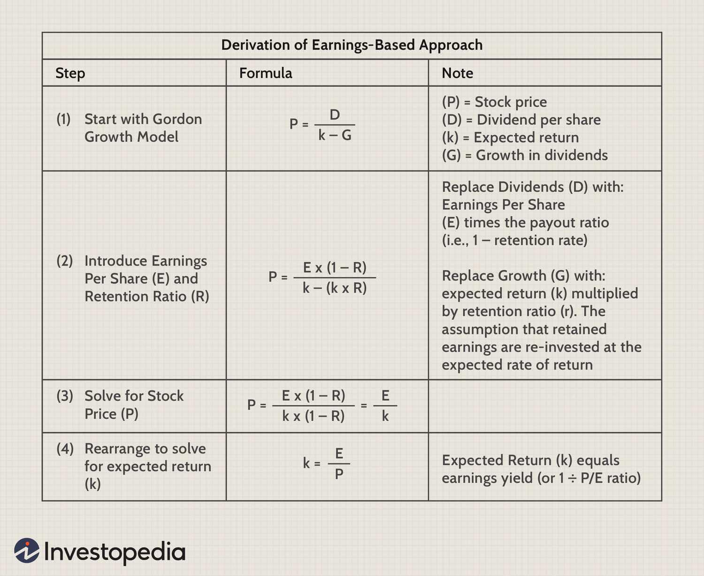

In the evolving landscape of finance, key concepts such as the equity risk premium, investment risk, and algorithmic trading are central to informed investment decision-making and maximizing financial returns. The equity risk premium represents the additional return that investors expect from equities over risk-free assets, serving as compensation for the associated risks inherent in the stock market. Understanding the equity risk premium is crucial, as it influences various financial models, including the Capital Asset Pricing Model (CAPM), which helps in determining expected returns on assets and making more informed investment choices.

Investment risk refers to the uncertainties around the expected returns of an investment, which can arise from various sources such as market volatility, credit risk, and liquidity challenges. Recognizing and assessing these risks play a pivotal role in shaping effective investment strategies, particularly in the context of portfolio diversification and selecting the right mix of assets to balance potential returns against risk.



Algorithmic trading, another transformative development in modern finance, leverages sophisticated algorithms to execute trades with precision and speed. This approach minimizes human error, optimizing trading strategies by incorporating comprehensive financial calculations, including the equity risk premium. The ability to analyze vast data sets and execute trades swiftly with reduced error offers substantial benefits in understanding market dynamics and executing informed trades.

This article provides a comprehensive insight into these interconnected concepts, illustrating how their synergy shapes sound investment strategies. By exploring these elements, investors can enhance their capacity to navigate financial markets, refine their trading strategies, and potentially increase the efficiency and effectiveness of their investment portfolios.

## Table of Contents

## Understanding Equity Risk Premium

Equity risk premium (ERP) is a fundamental concept in finance, referring to the excess return that investing in the stock market provides over a risk-free rate. This premium is a critical measure, as it compensates investors for taking on the inherent risks associated with equity investments. The risk-free rate is typically represented by government bond yields, such as U.S. Treasury bills, which are considered to have negligible default risk.

The calculation of the equity risk premium is straightforward. It is the difference between the expected market return and the risk-free rate. Mathematically, it is expressed as:

$$
\text{Equity Risk Premium} = \text{Expected Market Return} - \text{Risk-Free Rate}
$$

Where:
- **Expected Market Return** is the anticipated return from investing in the entire stock market.
- **Risk-Free Rate** is the return on a risk-free asset, often derived from government securities.

Understanding the ERP is vital for investors as it quantifies the return above the safe option, thereby justifying taking additional risk in the pursuit of higher profits. Investors demand this premium as compensation for uncertainties like market [volatility](/wiki/volatility-trading-strategies), macroeconomic factors, and individual business performance that can adversely affect equity returns.

The equity risk premium is also pivotal in financial models, particularly the Capital Asset Pricing Model (CAPM). The CAPM serves as a framework for determining the expected return on an asset based on its systemic risk, as measured by beta ($\beta$). Within the CAPM, the formula for the expected return of a security is given by:

$$
\text{E}(R_i) = R_f + \beta_i (\text{E}(R_m) - R_f)
$$

Where:
- $\text{E}(R_i)$ is the expected return of the investment.
- $R_f$ is the risk-free rate.
- $\beta_i$ measures the sensitivity of the asset's returns relative to the market.
- $\text{E}(R_m)$ is the expected market return.

In this context, the equity risk premium ($\text{E}(R_m) - R_f$) is indispensable for calculating the suitable returns adjusted for risk, helping investors to make informed choices about their portfolios. By considering the ERP, investors can evaluate whether their potential returns justify their exposure to higher volatility and other market risks.

In summary, the equity risk premium is a core concept that bridges the expected market outcomes with the inherent risks of equities. Through its application in models like CAPM, it plays a crucial role in shaping investment strategies, guiding investors on the risk-return trade-offs of their portfolios.

## The Role of Investment Risk

Investment risk is fundamentally about the uncertainties surrounding the anticipated returns of any given investment. This uncertainty can stem from various sources, each categorized into specific types of risks that investors must recognize and manage to optimize their portfolios effectively.

**Market Risk**: This type of risk is associated with fluctuations in market prices that can affect the overall value of an investment. Factors such as economic developments, political events, and changes in investor sentiment contribute to market risk. Investors often manage market risk through diversification, which involves spreading investments across different asset classes to mitigate potential losses.

**Credit Risk**: Credit risk refers to the possibility that a borrower might default on their financial obligations, leading to a loss for the lender or investor. This risk is particularly relevant in fixed-income investments, such as bonds. Understanding and assessing the creditworthiness of issuers is crucial for investors to minimize potential losses. Credit ratings provided by agencies like Moody's or Standard & Poor's are commonly used to evaluate credit risk.

**Liquidity Risk**: Liquidity risk arises when an investor cannot easily convert an asset into cash without significantly affecting its price. This risk is more common in small-cap stocks or real estate investments. Investors should consider the liquidity of assets in their portfolios, particularly if they anticipate needing quick access to cash, to ensure they can meet their financial obligations.

Understanding these risks is critical in shaping an effective investment strategy. By analyzing each type of risk, investors can make informed decisions on asset allocation. For example, a portfolio with a high exposure to market risk might benefit from the inclusion of government bonds, which typically offer lower risk. Similarly, investors concerned about credit risk might focus on assets with higher credit ratings or incorporate credit default swaps as a hedging strategy.

Investment risk also plays a significant role in determining expected returns. Higher risk typically comes with the potential for higher returns, thus influencing how investors select assets to build their portfolios. Ultimately, managing investment risk effectively can lead to more resilient and optimized investment outcomes, aligning with the investor's financial goals and risk tolerance.

## Algorithmic Trading in Modern Finance

Algorithmic trading utilizes computer algorithms to enhance the speed and efficiency of executing trades in financial markets. This sophisticated approach allows traders to process a vast array of data and execute trades at speeds unattainable by human intervention alone. By integrating complex financial calculations, such as the equity risk premium, [algorithmic trading](/wiki/algorithmic-trading) systems can formulate strategies that optimize returns while managing risks.

One of the primary benefits of algorithmic trading is the reduction of human error. Automated systems operate based on pre-defined criteria, ensuring consistent and objective execution devoid of emotional biases that can affect human traders. This characteristic allows for more precise adherence to trading strategies designed to leverage calculations like the equity risk premium.

Additionally, algorithmic trading systems excel in processing large volumes of data. The ability to analyze extensive datasets in real time provides traders with a substantial advantage, enabling them to identify trends and execute trades before opportunities diminish. Moreover, these systems can incorporate a myriad of data points such as historical prices, market indicators, and economic forecasts, allowing for a comprehensive evaluation of investment opportunities.

Python, a popular programming language in the finance industry, offers numerous libraries that facilitate the creation and execution of algorithmic trading strategies. Libraries such as Pandas and NumPy are instrumental in handling data manipulation and numerical computations. Pandas provide data structures that simplify the management of financial time series, while NumPy excels in performing quantitative operations and statistical analysis.

```python
import pandas as pd
import numpy as np

# Example of loading financial data
data = pd.read_csv('financial_data.csv')

# Calculate daily returns
data['Returns'] = data['Close'].pct_change()

# Define a simple moving average strategy
short_window = 10
long_window = 50

# Calculate moving averages
data['Short_MAvg'] = data['Close'].rolling(window=short_window, min_periods=1, center=False).mean()
data['Long_MAvg'] = data['Close'].rolling(window=long_window, min_periods=1, center=False).mean()

# Generate trading signals
data['Signal'] = 0.0
data['Signal'][short_window:] = np.where(data['Short_MAvg'][short_window:] > data['Long_MAvg'][short_window:], 1.0, 0.0)

# Calculate positions
data['Position'] = data['Signal'].diff()
```

In this Python example, financial data is imported and processed to calculate daily returns and moving averages, which are then used to generate trading signals. Such automated strategies enable traders to systematically implement actions based on predefined investment criteria, significantly enhancing the capability to respond to market changes driven by variations in equity risk premium and other financial metrics.

Overall, algorithmic trading represents a revolution in modern finance, with the potential to refine investment strategies and increase the precision of financial forecasting.

## Integrating Equity Risk Premium in Trading Strategies

Integrating the equity risk premium into algorithmic trading strategies can significantly enhance return forecasts by leveraging real-time data and advanced computational techniques. The equity risk premium, which represents the additional return expected from an equity investment over a risk-free rate, plays a pivotal role in refining trading decisions. By dynamically adjusting trades based on real-time risk premium data, traders can optimize their strategies for changing market conditions.

A key component of this integration involves using live data feeds to update the equity risk premium and adjust algorithmic models accordingly. For instance, if the observed equity risk premium increases due to heightened market volatility or improving economic conditions, an algorithm might recommend shifting a portfolio towards more equities to capture the potentially higher returns.

To illustrate, consider a simplified Python script that calculates the equity risk premium using real-time market data. This example assumes access to a data stream providing the current market return and the risk-free rate.

```python
import yfinance as yf  # For more datasets, visit: https://paperswithbacktest.com/datasets

def calculate_equity_risk_premium(market_return, risk_free_rate):
    return market_return - risk_free_rate

# Assume we fetch the latest market return and risk-free rates
market_data = yf.download('^GSPC', period='1d')  # S&P 500
risk_free_rate = 0.015  # Example risk-free rate

latest_close = market_data['Close'].iloc[-1]
previous_close = market_data['Close'].iloc[-2]
market_return = (latest_close - previous_close) / previous_close

equity_risk_premium = calculate_equity_risk_premium(market_return, risk_free_rate)

print(f'Current Equity Risk Premium: {equity_risk_premium:.4f}')

# Use the equity risk premium to adjust portfolio allocations
def adjust_portfolio(equity_risk_premium):
    if equity_risk_premium > 0.05:
        print("Increase equity holdings.")
    else:
        print("Consider reducing equity exposure.")

adjust_portfolio(equity_risk_premium)
```

In this script, the real-time market data for the S&P 500 (^GSPC) is retrieved, and the daily market return is computed. The equity risk premium is then derived by subtracting a predefined risk-free rate from the market return. Based on the calculated premium, the algorithm suggests adjusting equity holdings. 

Integrating equity risk premium data dynamically allows traders to make informed decisions that reflect current market conditions, ensuring more accurate return forecasts and efficient capital allocation. This strategy underscores how algorithmic trading systems can incorporate advanced financial metrics like the equity risk premium to refine their predictive power and adapt to an ever-evolving financial landscape.

## Factors Affecting Equity Risk Premium

Equity risk premium (ERP) is a crucial component in investment decision-making, reflecting the additional return expected by investors for holding equities over risk-free assets. Several external factors can influence the ERP, each affecting the expected market return and, consequently, investment strategies.

**Economic Conditions:** The overall health of an economy significantly impacts the ERP. During periods of economic growth, corporate earnings typically improve, leading to higher expected returns on equities. Conversely, in times of economic downturn, uncertainties increase, prompting investors to demand a higher premium to compensate for the greater risk associated with equities. Changes in gross domestic product (GDP) growth rates, employment figures, and inflation levels are some indicators that influence investor sentiment and, thus, the ERP.

**Interest Rates:** Interest rates, set by central banks, have a direct impact on both risk-free rates and equity valuations. As interest rates rise, the risk-free rate (typically represented by government bond yields) also increases, potentially reducing the ERP since the relative appeal of equities compared to risk-free assets diminishes. Conversely, when interest rates are low, equities become more attractive, potentially increasing the ERP. Investors must regularly assess interest rate trends to adjust their market expectations and investment strategies accordingly.

**Market Volatility:** Volatility in the financial markets, often measured by indices like the VIX, indicates the level of uncertainty or risk perceived by investors. Higher volatility is generally associated with increased risk, prompting investors to demand a higher ERP for holding equities. Market volatility can be driven by geopolitical events, changes in regulation, or unexpected shifts in market trends. This increased demand for risk compensation can lead to adjustments in asset allocation and trading strategies.

By monitoring these factors, investors can better understand the shifting landscape of expected market returns and refine their strategies to optimize portfolio performance. The dynamic nature of ERP necessitates continuous evaluation to navigate the complexities of the financial markets and align investment decisions with prevailing economic and market conditions.

## Calculating Equity Risk Premium

Calculating the equity risk premium (ERP) involves evaluating the additional return investors require to hold equities over risk-free assets. This calculation can be approached using both historical and implied methods.

### Historical Methods

The historical method involves analyzing past performance of stock markets relative to risk-free investments, typically government bonds. The basic formula for calculating the historical equity risk premium is:

$$
\text{ERP} = \overline{R_m} - R_f
$$

where $\overline{R_m}$ represents the average market return over a given period, and $R_f$ is the average risk-free rate during that same period. By assessing past returns, investors can gauge what premium has been historically rewarded for taking additional risk through equity investments.

Historical analysis has its limitations, mainly its reliance on past data, which may not accurately predict future outcomes. Historical conditions may not resemble future market conditions, thus making the historical ERP a potentially unreliable predictor.

### Implied Methods

Implied methods seek to derive the equity risk premium based on current market expectations rather than past data. This approach commonly uses the Gordon Growth Model (a variant of the Dividend Discount Model), expressed as:

$$
\text{ERP} = \frac{D_1}{P_0} + g - R_f
$$

Here, $D_1$ represents the expected dividend per share one year from now, $P_0$ is the current price per share, and $g$ is the expected growth rate of the dividends. The implied ERP thus reflects the difference between the expected return on equities and the current risk-free rate.

The implied approach is forward-looking and reflects current market conditions, but its accuracy is highly sensitive to assumptions about growth rates and future dividends, which can be difficult to estimate precisely.

### Capital Asset Pricing Model (CAPM)

The Capital Asset Pricing Model is a pivotal tool for integrating the equity risk premium into broader financial calculations. The CAPM formula is represented as:

$$
E(R_i) = R_f + \beta_i (E(R_m) - R_f)
$$

In this equation, $E(R_i)$ is the expected return of investment $i$, $R_f$ is the risk-free rate, $\beta_i$ is a measure of the investment's systematic risk relative to the overall market, and $E(R_m)$ is the expected market return.

CAPM uses ERP to account for the additional expected return from bearing market risk. The model helps investors understand the trade-off between the level of risk taken and expected return, allowing for more informed investment decision-making.

Overall, while both historical and implied methods have their advantages and limitations, incorporating CAPM can enhance the calculation of ERP by tying it to a broader context of expected returns and risks across various investments.

## Case Study: Applying Financial Calculations in Real-world Scenarios

In financial settings, applying the equity risk premium (ERP) effectively aids in optimizing portfolios and managing risk. One notable example involves a [hedge fund](/wiki/hedge-fund-trading-strategies) seeking to balance high returns with controlled exposure to market volatility. By utilizing ERP, the fund can anticipate excess returns on stocks compared to risk-free investments, tailoring its strategy to accommodate shifting risk-reward profiles.

Consider a portfolio manager employing the Capital Asset Pricing Model (CAPM), which encompasses the formula:

$$

E(R_i) = R_f + \beta_i (E(R_m) - R_f) 
$$

where $E(R_i)$ is the expected return on investment, $R_f$ is the risk-free rate, $\beta_i$ represents the investment’s volatility relative to the market, and $E(R_m)$ corresponds to the expected market return. The ERP here is $E(R_m) - R_f$. By incorporating ERP into this model, a manager can fine-tune asset allocations under different market conditions, effectively managing risk while pursuing optimal returns.

In algorithmic trading, ERP becomes pivotal for refining predictive models. Algorithms apply historical ERP data to forecast future anomalies in stock pricing. For example, a Python-based trading algorithm might use libraries such as Pandas and NumPy for data analysis, incorporating ERP to adjust trade executions dynamically. Here is a simplified Python code snippet demonstrating how ERP might be integrated:

```python
import numpy as np
import pandas as pd

# Simulated historical returns
market_returns = np.array([0.07, 0.10, 0.05, 0.12])
risk_free_rate = 0.02

# Calculate average market return
average_market_return = np.mean(market_returns)

# Calculate equity risk premium
erp = average_market_return - risk_free_rate

# Simulated asset beta
beta_asset = 1.1

# Calculate expected return using CAPM
expected_return = risk_free_rate + beta_asset * erp

# Output the expected return
print(f"The expected return on the asset: {expected_return:.2f}")
```

In scenarios utilizing [machine learning](/wiki/machine-learning), ERP is integrated into algorithms enhancing predictive accuracy and making real-time trade adjustments. As ERP variables shift due to fluctuating economic indicators, the algorithms adapt strategies to safeguard against potential downturns while capitalizing on favorable conditions.

Consequently, the ERP empowers traders and portfolio managers to better anticipate and react to financial market dynamics, ultimately improving decision-making processes and outcomes.

## Conclusion

Understanding and applying the equity risk premium is essential for sound investment decisions. This metric provides a crucial insight into the extra returns investors expect from equities compared to risk-free assets, compensating for the additional risks associated with the stock market. By accurately calculating the equity risk premium, investors can better assess the trade-off between risk and return, which is fundamental to optimizing portfolio performance.

The integration of equity risk premium calculations into algorithmic trading presents numerous advantages. Algorithmic trading systems utilize these calculations to enhance decision-making processes, reduce human error, and execute trades more efficiently. By incorporating the equity risk premium into these systems, traders can improve the predictive accuracy of their models and make more informed asset allocations. The use of large data sets and advanced computational tools, such as Python libraries like Pandas and NumPy, facilitates the efficient analysis and application of this financial metric.

As financial markets continue to evolve, it’s critical for investors and traders to engage in lifelong learning to keep pace with changes. Advances in technology and shifts in economic conditions constantly affect market dynamics, impacting the equity risk premium and other financial calculations. By staying informed and adaptable, investment professionals can refine their strategies to better navigate these fluctuations and achieve superior investment outcomes.

The understanding and practical application of equity risk premium not only bolster strategic investment but also empower decision-makers to leverage complex financial tools for enhanced market performance. This continual learning approach is key for any investor or trader aiming for long-term success in the ever-evolving financial landscape.

## References & Further Reading

1. **"The Intelligent Investor" by Benjamin Graham** - This classic book offers foundational insights into investment strategies and the consideration of risks and returns, essential for understanding the equity risk premium.

2. **"A Random Walk Down Wall Street" by Burton Malkiel** - Provides a comprehensive view of market theories, including discussions on investment risk which help frame concepts like CAPM and risk premium.

3. **"Principles of Corporate Finance" by Richard Brealey, Stewart Myers, and Franklin Allen** - This textbook covers the crucial concepts of finance, including detailed analysis of risk-return trade-offs and the application of the equity risk premium. 

4. **"Algorithmic Trading: Winning Strategies and Their Rationale" by Ernie Chan** - Offers practical insights into algorithmic trading strategies and emphasizes the importance of data analysis, including the calculation and application of the equity risk premium in trading.

5. **Research Papers by Eugene Fama and Kenneth French** - Their extensive work on the equity risk premium, including the Fama-French Three-Factor Model, provides advanced knowledge on how different factors contribute to expected returns.

6. **"Python for Finance" by Yves Hilpisch** - A hands-on guide to implementing financial theories using programming, particularly Python libraries such as Pandas and NumPy, useful for algorithmic trading strategies and financial calculations.

7. **"Capital Ideas: The Improbable Origins of Modern Wall Street" by Peter L. Bernstein** - Offers an enlightening history of modern financial theories, including the development of CAPM and its implications for the equity risk premium.

8. **The Journal of Finance** - A leading academic journal that publishes significant research on topics like equity risk premium, investment risks, and quantitative finance, offering deep dives into empirical and theoretical studies.

9. **"Quantitative Equity Portfolio Management: Modern Techniques and Applications" by Ludovic Phalippou** - This resource explains in detail the quantitative techniques used in portfolio management, including strategies that integrate equity risk premium evaluations.

10. **Investopedia’s Online Articles and Tutorials** - These provide accessible explanations of key financial concepts, including equity risk premium, investment risk, and algorithmic trading, suitable for both beginners and seasoned investors. 

These resources will provide a robust framework for understanding and applying financial calculations, such as the equity risk premium, in both theoretical and practical investment scenarios.