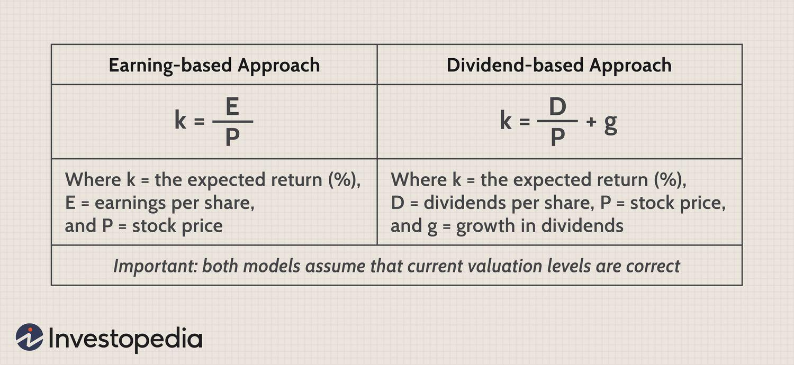

## Table of Contents

## What is the equity risk premium?

The equity risk premium is the extra return that investors expect to earn from investing in stocks compared to risk-free investments like government bonds. It's like a reward for taking on the extra risk that comes with investing in the stock market. If you can get a safe 2% return from a government bond, but stocks are expected to return 8%, the equity risk premium would be 6%. This number helps investors decide if the potential higher returns from stocks are worth the extra risk.

Estimating the equity risk premium isn't an exact science. It can change over time due to things like economic conditions, interest rates, and how investors feel about risk. Some people look at historical data to guess what it might be in the future, while others use models and forecasts. Because it's hard to predict, different experts might give you different numbers for the equity risk premium. But understanding it is important for making smart investment choices.

## Why is the equity risk premium important for investors?

The equity risk premium is important for investors because it helps them decide if investing in stocks is worth the risk. Imagine you have two choices: a safe investment like a government bond that gives you a small but sure return, or stocks that could give you a bigger return but are riskier. The equity risk premium tells you how much more you might earn from stocks compared to the safe investment. If the premium is high, it means stocks could be a good deal because the extra return might be worth the extra risk.

This information is really useful when you're planning your investments. If you know the equity risk premium, you can figure out if stocks are priced fairly or if they're too expensive or too cheap. It also helps you compare the stock market to other kinds of investments. By understanding the equity risk premium, you can make smarter choices about where to put your money, balancing the potential for higher returns against the risk of losing some of your investment.

## How does the equity risk premium affect investment decisions?

The equity risk premium is like a guide that helps investors decide if putting money into stocks is a good idea. Imagine you have a choice between a safe investment, like a government bond, which gives you a small but steady return, or stocks, which could give you a bigger return but are riskier. The equity risk premium shows how much more you might earn from stocks compared to the safe investment. If the premium is high, it means stocks might be a good deal because the extra return could be worth the extra risk.

This information is really important when you're figuring out where to invest your money. If you know the equity risk premium, you can decide if stocks are a good buy or if they're too expensive. It helps you compare stocks to other types of investments too. By understanding the equity risk premium, you can make smarter choices about where to put your money, balancing the chance of higher returns against the risk of losing some of your investment.

## What are the components of the equity risk premium?

The equity risk premium is made up of two main parts: the expected return from stocks and the risk-free rate. The expected return from stocks is what investors think they will earn from the stock market over time. This can change based on how well companies are doing, how the economy is doing, and what investors think will happen in the future. The risk-free rate is the return you get from super safe investments like government bonds. This rate is usually pretty low because it's safe, but it can go up or down depending on what's happening with interest rates and the economy.

When you take the expected return from stocks and subtract the risk-free rate, you get the equity risk premium. This number tells you how much extra return you might get from stocks compared to safe investments. If the equity risk premium is high, it means stocks could be a good deal because the extra return might be worth the extra risk. But if it's low, stocks might not be as attractive because the extra return isn't that big compared to the risk. So, the equity risk premium helps investors decide if the potential rewards from stocks are worth the risks they come with.

## What are the common methods used to calculate the equity risk premium?

One common way to calculate the equity risk premium is by looking at historical data. This method involves figuring out what the average return on stocks has been in the past and comparing it to the average return on risk-free investments like government bonds over the same time. For example, if stocks have returned an average of 10% per year and government bonds have returned an average of 3% per year over the last 50 years, the historical equity risk premium would be 7%. This approach assumes that what happened in the past will be a good guide for what might happen in the future.

Another method is using financial models and forecasts. These models try to predict future stock returns and risk-free rates based on things like current economic conditions, interest rates, and how investors feel about risk. One popular model is the Dividend Discount Model (DDM), which looks at the future dividends a company might pay and discounts them back to today's value. The difference between the expected return from this model and the current risk-free rate gives you the equity risk premium. This approach can be more complex, but it tries to take into account changes in the economy and market conditions that historical data might not capture.

Both methods have their strengths and weaknesses. Historical data is easy to understand and use, but it might not be a good predictor if the future is very different from the past. On the other hand, models and forecasts can be more accurate if they correctly predict future conditions, but they can also be wrong if the assumptions they're based on don't hold true. Investors often use a combination of both methods to get a better sense of the equity risk premium and make more informed investment decisions.

## How does historical data influence the calculation of the equity risk premium?

Historical data is a key way to figure out the equity risk premium. It involves looking at how much money stocks have made in the past compared to safe investments like government bonds. If stocks made an average of 10% a year and government bonds made 3% a year over the last 50 years, the historical equity risk premium would be 7%. This method is simple and easy to understand because it uses real numbers from the past. But it assumes that the future will be a lot like the past, which might not always be true.

Using historical data can be helpful, but it has some downsides. For example, if the economy or the stock market changes a lot, the past might not be a good guide for the future. If there's a big economic crisis or a new technology that changes how companies make money, the equity risk premium could be very different from what historical data suggests. So, while historical data gives us a starting point, investors need to be careful and consider other things like current economic conditions and future forecasts to get a more accurate picture of the equity risk premium.

## What are the differences between the historical and expected equity risk premium?

The historical equity risk premium is based on what has happened in the past. It's calculated by looking at the average returns from stocks over a long period, like 50 years, and subtracting the average returns from safe investments like government bonds during that same time. If stocks returned an average of 10% a year and government bonds returned 3% a year, the historical equity risk premium would be 7%. This method is easy to understand because it uses real numbers, but it assumes that the future will be a lot like the past, which might not always be true.

The expected equity risk premium, on the other hand, tries to predict what might happen in the future. It uses financial models and forecasts to guess what stock returns and risk-free rates might be. For example, the Dividend Discount Model (DDM) looks at future dividends a company might pay and figures out what they're worth today. The difference between the expected return from this model and the current risk-free rate gives you the expected equity risk premium. This approach can be more accurate if it correctly predicts future conditions, but it can also be wrong if the assumptions it's based on don't hold true. So, while historical data gives us a starting point, expected equity risk premium tries to account for changes in the economy and market conditions.

## How do macroeconomic factors impact the equity risk premium?

Macroeconomic factors can really change the equity risk premium. Things like interest rates, inflation, and how the economy is doing can make the equity risk premium go up or down. For example, if interest rates go up, the returns from safe investments like government bonds might get better, making stocks less attractive. This could make the equity risk premium smaller because the difference between what you might earn from stocks and safe investments isn't as big. On the other hand, if the economy is doing really well, people might think stocks will do better too, making the equity risk premium bigger because they expect a higher return from stocks.

Another way macroeconomic factors affect the equity risk premium is through investor confidence. If people feel good about the economy and think it will keep growing, they might be more willing to take risks and invest in stocks. This could make the equity risk premium go up because they expect a higher return for taking that risk. But if there's a lot of uncertainty or bad news about the economy, like a recession, people might want to play it safe and stick to government bonds, making the equity risk premium smaller because they're less willing to take risks on stocks. So, the equity risk premium is always changing based on what's happening in the bigger economic picture.

## What role does the equity risk premium play in asset pricing models like the CAPM?

The equity risk premium is super important in asset pricing models like the Capital Asset Pricing Model (CAPM). In CAPM, it helps figure out how much return an investor should expect from a stock. The model says that the expected return on a stock is the risk-free rate plus a bit extra, which is the stock's beta times the equity risk premium. The beta shows how much the stock's price moves compared to the whole market. So, the equity risk premium is the extra return you get for taking on the risk of investing in the stock market instead of a safe investment like a government bond.

In simple terms, the equity risk premium in CAPM helps investors decide if a stock is a good buy. If the expected return from a stock, calculated using CAPM, is higher than what you can get from a safe investment, the stock might be worth buying. The equity risk premium makes sure that the model takes into account the extra risk of stocks, helping investors make smarter choices about where to put their money.

## How can the equity risk premium vary across different countries and markets?

The equity risk premium can be different in different countries and markets because each place has its own economic conditions, risks, and how investors feel about those risks. For example, a country with a stable economy and low risk might have a smaller equity risk premium because investors feel safe and don't need as much extra return to invest in stocks. But in a country with a lot of political or economic uncertainty, the equity risk premium might be bigger because investors want a higher return to make up for the extra risk they're taking.

Also, different markets within a country can have different equity risk premiums. For instance, the stock market in a big city might have a different equity risk premium than the stock market in a smaller town because the big city's market might have more companies and more trading, making it less risky. Plus, things like taxes, regulations, and how easy it is to buy and sell stocks can change the equity risk premium from one market to another. So, understanding the equity risk premium in different countries and markets helps investors decide where to put their money based on the risks and potential returns in each place.

## What are the criticisms and limitations of using the equity risk premium in financial analysis?

One big problem with using the equity risk premium in financial analysis is that it's hard to guess what it will be in the future. The equity risk premium changes over time because of things like interest rates, how the economy is doing, and how investors feel about risk. If you use historical data to figure it out, you're assuming the future will be a lot like the past, which might not be true. And if you use models to predict it, those models can be wrong if the guesses they're based on don't happen. So, it's tricky to use the equity risk premium to make decisions because it's always moving around.

Another issue is that the equity risk premium can be different in different places and markets. What works for one country might not work for another because each place has its own risks and economic conditions. This makes it hard to compare investments across different countries or to use the same equity risk premium everywhere. Plus, even within one country, different markets might have different equity risk premiums, which adds more confusion. So, while the equity risk premium can help investors make choices, it's important to remember its limits and not rely on it too much.

## How can advanced statistical models improve the accuracy of equity risk premium estimates?

Advanced statistical models can make guesses about the equity risk premium more accurate by looking at a lot of different things at once. These models can use things like interest rates, how the economy is doing, and even how people feel about the market to predict what might happen. By taking all these factors into account, the models can give a better idea of what the equity risk premium might be in the future. For example, a model might use [machine learning](/wiki/machine-learning) to find patterns in past data that help predict what will happen next, making the estimate more reliable.

But even with these fancy models, there are still some problems. The models are only as good as the guesses they're based on, and if those guesses are wrong, the models will be wrong too. Also, the future can be hard to predict because things like new laws or big economic changes can throw everything off. So while advanced statistical models can help make better guesses about the equity risk premium, investors need to be careful and not trust the numbers too much. It's always a good idea to use these models along with other ways of figuring things out to get the best picture possible.

## What is the Understanding of Equity Risk Premium?

Equity risk premium is a critical concept in finance that represents the additional return investors anticipate receiving for choosing equity investments over risk-free securities. This premium is crucial due to the inherent risks associated with equity markets compared to government or other risk-free bonds. For example, equities are subject to market volatility, economic downturns, and company-specific risks that are not present in securities deemed risk-free.

In practical terms, the equity risk premium can be considered as the expected return on the market portfolio minus the risk-free rate of return. The formula can be represented as:

$$
\text{Equity Risk Premium} = E(R_m) - R_f
$$

where $E(R_m)$ is the expected market return, and $R_f$ is the risk-free rate. This calculation is central to the Capital Asset Pricing Model (CAPM), which uses the equity risk premium to determine an asset's expected return. The CAPM formula is:

$$
E(R_i) = R_f + \beta_i \times (E(R_m) - R_f)
$$

where $E(R_i)$ is the expected return of the investment, $\beta_i$ is a measure of the investment's volatility compared to the market, and the term $(E(R_m) - R_f)$ is the equity risk premium.

The importance of the equity risk premium lies in its ability to guide investors in evaluating potential returns from equity investments. It provides insights into whether the potential returns justify the risks undertaken, playing a vital role in portfolio management by helping to balance risk and return. By understanding the equity risk premium, investors can assess the desirability of investing in equities against other investment options.

In addition to aiding individual investment decisions, equity risk premiums are also essential for financial analysts and policy-makers. They influence asset allocation strategies and risk management practices within portfolios. By incorporating equity risk premiums into their models, investors and analysts can better estimate the potential future performance of equity markets.

External Reference:
- Koller, T., Goedhart, M., & Wessels, D. (2010). *Valuation: Measuring and Managing the Value of Companies*. John Wiley & Sons. This book provides a comprehensive guide to valuation techniques, including the use of equity risk premiums in assessing corporate value.

Understanding the equity risk premium is, therefore, a foundational element for anyone involved in investment strategy, offering essential insights into the balancing act between risk and reward.

## What is the Role of Investment Risk?

Investment risk encompasses the uncertainty tied to the anticipated returns of an investment, along with the inherent potential for financial loss. This risk is a crucial consideration in the investment process, as it directly impacts the decision-making related to expected returns and asset distribution across a diversified portfolio.

Several types of investment risks exist, each influencing return expectations and strategic asset allocation differently:

1. **Market Risk**: This is the risk of losses due to changes in market prices. Influences include equity risk, interest rate risk, and currency risk. For example, equity risk pertains to fluctuations in stock prices, impacting stock investments' value.

2. **Credit Risk**: Arising from the possibility that a borrower might default on a repayment, credit risk is critical when dealing with bonds or similar financial instruments. Investors demand higher returns as compensation for taking on higher credit risk, which impacts the pricing of bonds and loans.

3. **Liquidity Risk**: This risk is associated with the difficulty of converting an investment into cash without significant loss in value. Illiquid assets, such as real estate or certain small-cap stocks, often pose higher liquidity risks.

4. **Operational Risk**: Risks stemming from internal processes, systems, or external events that disrupt operations. This includes risk from human error, theft, or fraud, which can lead to significant financial loss.

5. **Inflation Risk**: Also known as purchasing power risk, inflation risk affects the real value of returns. If inflation rates exceed the returns on an investment, the real purchasing power of the investment's gains could be eroded.

Understanding these risks helps investors not only weigh potential rewards but also align their investment choices with their risk tolerance and financial goals. For instance, risk-averse investors may prefer fixed-income securities, whereas risk-tolerant investors might prioritize equities for potentially higher returns. 

Mathematically, investment risk can be quantified using measures such as standard deviation, which assesses the [volatility](/wiki/volatility-trading-strategies) of the investment returns, and the Sharpe ratio, which evaluates the risk-adjusted return of an investment:

$$
\text{Sharpe Ratio} = \frac{E[R_i] - R_f}{\sigma_i}
$$

Where $E[R_i]$ is the expected return of the investment, $R_f$ is the risk-free rate, and $\sigma_i$ is the standard deviation of the investment's excess return.

Choosing the right investment strategy requires a keen understanding of these risks, balancing them against the potential returns to build a portfolio tailored to investor preferences and market conditions. By assessing these risks, investors can make informed decisions, optimizing their portfolios for both risk management and return enhancement.

## What are the factors affecting equity risk premium?

Several factors exert influence on the equity risk premium, reflecting broader economic conditions and specific market dynamics. Understanding these elements is crucial for investors aiming to predict market behavior and adjust their investment strategies accordingly.

**Economic Conditions:** Economic growth or recession significantly affects the equity risk premium. During periods of economic expansion, investor confidence tends to rise, leading to an increased demand for equities, which can, in turn, reduce the equity risk premium. Conversely, in times of economic downturn, the perceived risk associated with equities rises, prompting an increase in the equity risk premium as investors seek higher compensation for the added risk.

**Interest Rates:** The level of interest rates plays a pivotal role in shaping the equity risk premium. When interest rates are low, the opportunity cost of investing in equities is reduced, making stocks more attractive compared to bonds. This scenario generally lowers the equity risk premium. Conversely, high interest rates increase the attractiveness of fixed-income investments, leading to a higher equity risk premium as investors demand greater returns from equities to compensate for the reduced relative risk.

**Market Volatility:** Volatility, measured through indicators such as the VIX index, directly impacts the equity risk premium. High market volatility signifies increased uncertainty, prompting investors to require a larger risk premium for holding equities. On the other hand, stable market conditions with low volatility typically result in a lower equity risk premium, reflecting reduced perceived risk.

Mathematically, the equity risk premium (ERP) can be expressed by the formula:

$$
ERP = E(R_m) - R_f
$$

where $E(R_m)$ represents the expected return of the market portfolio, and $R_f$ is the risk-free rate. Significant shifts in economic conditions, interest rates, or volatility alter the expected market return and risk-free rate, consequently affecting the calculated equity risk premium.

By understanding these factors, investors and traders can form better expectations about future market developments, enabling them to tailor their investment strategies to leverage or hedge against predicted changes effectively.

## How do you calculate the equity risk premium?

The equity risk premium is a critical metric for investors, capturing the additional expected return of investing in stocks over risk-free securities. The standard calculation for the equity risk premium involves subtracting the risk-free rate from the expected market return. Mathematically, it is expressed as:

$$
\text{Equity Risk Premium} = \text{Expected Market Return} - \text{Risk-Free Rate}
$$

### Capital Asset Pricing Model (CAPM)

To enhance the calculation, the Capital Asset Pricing Model (CAPM) is often employed. CAPM introduces the concept of beta ($\beta$), a measure that represents the volatility or systematic risk of a security or portfolio in relation to the market as a whole. The formula for CAPM is as follows:

$$
\text{Expected Return} = \text{Risk-Free Rate} + \beta \times (\text{Market Return} - \text{Risk-Free Rate})
$$

In this context, the market return minus the risk-free rate ($\text{Market Return} - \text{Risk-Free Rate}$) represents the equity risk premium, adjusted for the particular security's risk through the [beta [factor](/wiki/factor-investing)](/wiki/beta-factor).

### Historical and Implied Methods

The equity risk premium can be determined using both historical and implied approaches. 

1. **Historical Methods**: This method involves analyzing historical data of stock returns and risk-free returns to estimate the equity risk premium. This method assumes that past performance can indicate future returns. However, it may not account for future changes in economic conditions or market structures.

2. **Implied Methods**: Implied models use current market data to forecast future returns and derive the equity risk premium. These models often employ forward-looking information, such as analysts' expectations or dividend discount models. While potentially more adaptive to current market conditions, implied methods rely heavily on assumptions and can be sensitive to input variables.

### Conclusion

Calculating the equity risk premium is a fundamental aspect of investment strategy development. Each method, whether historical or implied, has unique benefits and limitations, and choosing the appropriate approach depends on the investor's specific context and goals. Whether utilizing the straightforward subtraction of the risk-free rate from the expected market return or leveraging the CAPM for a nuanced perspective, the equity risk premium remains central to understanding expected compensation for equity risk.

## How can financial calculations be applied in real-world scenarios according to the case study?

In this case study, we examine how the equity risk premium (ERP) is utilized in portfolio optimization and risk management, focusing on its practical applications and the integration of financial calculations within trading algorithms.

### Portfolio Optimization and Risk Management

The equity risk premium is pivotal in determining expected returns on equity investments relative to risk-free assets. By quantifying this premium, investors can make informed decisions to optimize their portfolios. Portfolio optimization involves selecting a mix of assets that maximizes expected returns for a given level of risk, often using models like the Capital Asset Pricing Model (CAPM). The formula for the expected return $E(R_i)$ using CAPM is:

$$
E(R_i) = R_f + \beta_i \times (E(R_m) - R_f)
$$

where:
- $E(R_i)$ is the expected return of the investment,
- $R_f$ is the risk-free rate,
- $\beta_i$ is the beta of the investment (a measure of its volatility relative to the market),
- $E(R_m)$ is the expected market return,
- $(E(R_m) - R_f)$ represents the equity risk premium.

By accurately estimating the ERP, investors can better assess the potential returns of their equity investments compared to risk-free securities, thus fine-tuning their portfolio allocations to align with their risk tolerance and investment objectives.

### Integration of Financial Calculations in Trading Algorithms

Trading algorithms leverage the equity risk premium to enhance their predictive capabilities and refine trading strategies. Algorithms ingest large volumes of financial data, including the ERP, to identify potential market movements and execute trades with higher precision. Incorporating ERP into these algorithms allows for dynamic adjustment of trading parameters in response to market conditions.

For example, an algorithm designed to optimize a portfolio might be programmed to adjust its asset mix based on real-time changes in the ERP, ensuring that the portfolio maintains its optimal risk-return profile. Python, with its robust libraries such as NumPy and pandas, is often used to implement these calculations. Below is a simple illustration of how an algorithm might calculate ERP using historical market data:

```python
import pandas as pd

# Assume market_data is a pandas DataFrame containing historical market returns and risk-free rates
market_data = pd.DataFrame({
    'market_return': [0.08, 0.10, 0.12, 0.11],
    'risk_free_rate': [0.03, 0.04, 0.03, 0.02]
})

# Calculate equity risk premium
market_data['ERP'] = market_data['market_return'] - market_data['risk_free_rate']

# Display the calculated ERP values
print(market_data['ERP'])
```

### Historical Analysis and Real-world Applications

Historically, the application of ERP in portfolio optimization and [algorithmic trading](/wiki/algorithmic-trading) has demonstrated enhanced investment performance. Consider a [hedge fund](/wiki/hedge-fund-trading-strategies) that primarily employs algorithmic strategies. By incorporating ERP into its trading models, the fund can adapt its equity positions based on shifts in market expectations, thereby potentially increasing returns while managing downside risk. Historical analyses reveal that during periods of high market volatility, adjusting portfolios based on ERP movements can significantly cushion against market downturns.

In summary, the practical application of the equity risk premium is a cornerstone in both theoretical models and real-world trading strategies. By integrating ERP into portfolio optimization and algorithmic trading, investors can achieve more precise asset allocations, effectively manage risk, and potentially improve investment returns over time.

## References & Further Reading

[1]: Koller, T., Goedhart, M., & Wessels, D. (2010). ["Valuation: Measuring and Managing the Value of Companies."](https://books.google.com/books/about/Valuation.html?id=fGXjDwAAQBAJ) John Wiley & Sons.

[2]: ["Advances in Financial Machine Learning"](https://www.amazon.com/Advances-Financial-Machine-Learning-Marcos/dp/1119482089) by Marcos Lopez de Prado

[3]: Markovitz, H. (1952). ["Portfolio Selection."](https://www.jstor.org/stable/2975974) The Journal of Finance.

[4]: ["Quantitative Trading: How to Build Your Own Algorithmic Trading Business"](https://www.amazon.com/Quantitative-Trading-Build-Algorithmic-Business/dp/0470284889) by Ernest P. Chan

[5]: Sharpe, W. F. (1964). ["Capital Asset Prices: A Theory of Market Equilibrium under Conditions of Risk."](https://onlinelibrary.wiley.com/doi/full/10.1111/j.1540-6261.1964.tb02865.x) The Journal of Finance.

[6]: Damodaran, A. (2012). ["Investment Valuation: Tools and Techniques for Determining the Value of Any Asset."](https://books.google.com/books/about/Investment_Valuation.html?id=5SRHAAAAQBAJ) John Wiley & Sons.