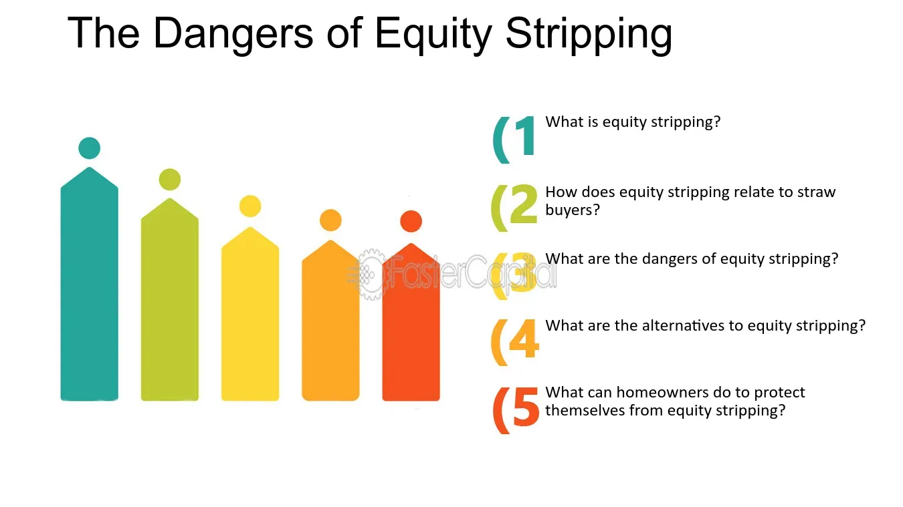

## Table of Contents

## What is equity stripping?

Equity stripping is a way that people or businesses can protect their property from being taken away by someone they owe money to. They do this by borrowing money against the property and using that money to pay for other things. This makes the property have less value, or "equity," because there is now a big loan on it. If someone tries to take the property because of a debt, they might not want it because it's not worth as much.

This method can be risky. If the person or business can't pay back the loan they took out, they could lose the property anyway. Also, it might be hard to get more loans in the future because the property is already used as security for the first loan. Equity stripping is sometimes seen as a last resort when someone is in a lot of financial trouble.

## Why do people use equity stripping?

People use equity stripping when they are in a tough spot with money and want to keep their property safe from people they owe money to. By taking out a big loan on their property, they make it less valuable to others. This means if someone tries to take their property because of a debt, it might not be worth taking because of the big loan on it. It's like making their property less attractive to others who might want to take it away.

However, using equity stripping can be risky. If the person can't pay back the new loan, they could lose their property anyway. It can also make it hard to get more loans in the future because the property is already used to secure the first loan. People usually see equity stripping as a last option when they're in a lot of financial trouble and don't have many other choices.

## What are the common methods of equity stripping?

One common method of equity stripping is taking out a second mortgage or home equity line of credit (HELOC) on a property. When someone does this, they borrow money using their home as collateral. This new loan makes the home have less equity because there's now another debt attached to it. If someone tries to take the home because of another debt, they might not want it because it's not worth as much with the new loan on it.

Another method is selling the property to a family member or a company they control for a very low price. This makes the property's value drop on paper, reducing the equity. Then, the original owner might lease the property back from the new owner, keeping control of it but making it less attractive to creditors. This can be tricky because it might not always work and could lead to legal problems if not done right.

A third way is using the property as collateral for a business loan. If the business takes out a loan and uses the property to secure it, the property's equity is reduced by the amount of the loan. This makes the property less appealing to other creditors because of the existing debt. This method is often used by business owners to protect their personal assets from business debts.

## Can you explain the concept of a second mortgage in relation to equity stripping?

A second mortgage is a type of loan that people take out on their home when they already have a first mortgage. It's called a second mortgage because it comes after the first one. When someone takes out a second mortgage, they are borrowing more money using their home as collateral. This new loan makes the home have less equity because there's now another debt attached to it. In the context of equity stripping, people use a second mortgage to reduce the value of their home on purpose. By doing this, they make their home less attractive to people who might try to take it away because of other debts.

For example, if someone owes money to a creditor and is worried that the creditor might try to take their home, they might take out a second mortgage. This new loan makes the home less valuable to the creditor because they would also have to take on the second mortgage if they took the home. This can be a risky strategy because if the person can't pay back the second mortgage, they could lose their home anyway. But for some people in tough financial situations, using a second mortgage as part of equity stripping might seem like a way to keep their home safe from creditors, at least for a while.

## What are the potential benefits of equity stripping for homeowners?

Equity stripping can help homeowners protect their home from being taken away by people they owe money to. By taking out a second loan on their home, homeowners reduce the value of their home on paper. This makes the home less attractive to people who might want to take it because of other debts. If someone tries to take the home, they might not want it because it comes with a big loan that they would have to pay too.

However, using equity stripping can be risky. If homeowners can't pay back the new loan, they could lose their home anyway. It might also make it hard for them to get more loans in the future because their home is already used to secure the first loan. Still, for some people in tough financial spots, equity stripping might seem like a way to keep their home safe from creditors for a little while.

## What are the risks associated with equity stripping?

Equity stripping can be risky. If you take out a big loan on your home and can't pay it back, you might lose your home. This is because the new loan makes your home worth less on paper, but you still have to pay it back. If you can't, the bank can take your home to get their money back.

Another risk is that it can be hard to get more loans in the future. When you use your home to get a new loan, it's already being used as a promise to pay back that loan. So, if you need more money later, banks might not want to lend it to you because your home is already tied up with the first loan. This can make it tough to handle other money problems you might have.

Also, equity stripping might not always work the way you hope. If you sell your home to a family member or a company you control for a low price to reduce its value, it could lead to legal problems. If you don't do it the right way, you could get in trouble with the law. So, while equity stripping might seem like a way to keep your home safe, it comes with big risks that could make things worse.

## How does equity stripping affect a homeowner's financial situation?

Equity stripping can change a homeowner's financial situation a lot. When someone takes out a big loan on their home to make it less valuable on paper, they have to pay back that loan. If they can't pay it back, they could lose their home. This is a big risk because it might make their money problems even worse. It's like borrowing more money when you're already in debt, which can be very hard to manage.

Also, using equity stripping can make it tough to get more loans in the future. When a home is used to secure a new loan, it's already tied up with that debt. So, if someone needs more money later, banks might not want to lend it to them because their home is already being used as a promise to pay back the first loan. This can make it hard to handle other money problems that might come up. 

In some cases, trying to use equity stripping by selling a home to a family member or a company you control for a low price can lead to legal problems. If it's not done the right way, it could get you in trouble with the law. So, while equity stripping might seem like a way to keep your home safe, it can come with big risks that could make your financial situation even harder.

## What legal considerations should be taken into account when using equity stripping?

When using equity stripping, there are important legal things to think about. If you sell your home to a family member or a company you control for a low price to make it less valuable, you have to be careful. If you don't do it the right way, it could be seen as trying to trick people you owe money to. This can lead to legal problems, like being sued or facing charges for fraud. It's important to talk to a lawyer to make sure you're doing everything legally and not breaking any rules.

Also, taking out a second loan on your home can have legal issues too. You need to make sure you understand all the terms of the loan and that you can pay it back. If you can't pay it back, the bank can take your home, and this can lead to legal battles over who gets the home. It's a good idea to get legal advice before you start equity stripping to understand all the risks and make sure you're following the law.

## Can you provide a real-life example of equity stripping?

Imagine a family who owns a house worth $300,000 but they owe a lot of money to a creditor. They're worried the creditor might try to take their home. So, they decide to use equity stripping to protect their home. They take out a second mortgage on their house for $200,000. Now, their home is worth less on paper because it has a big new loan on it. If the creditor tries to take the house, they might not want it because they would also have to pay back the $200,000 loan.

This family now has to pay back the second mortgage, which can be hard if they're already struggling with money. If they can't make the payments, they could lose their home anyway. But for now, the second mortgage makes their home less attractive to the creditor, and it might give the family some time to figure out their financial problems.

## How does equity stripping impact estate planning?

Equity stripping can change how someone plans for what happens to their stuff after they die. When someone takes out a big loan on their home to make it less valuable, it means there's less money left in the home for their family or other people they want to give it to. If the person dies and still owes money on the loan, the people who get the home might have to pay it back. This can make things harder for them because they might not have the money to do that.

Also, equity stripping can make it tricky to leave the home to someone in a will. If the home is worth less because of the loan, it might not be as good a gift as the person thought. Plus, if the person who gets the home can't pay back the loan, they might lose the home. So, when planning for the future, it's important to think about how equity stripping could affect what you leave behind for your family or others.

## What are the tax implications of equity stripping?

Equity stripping can change how much tax you have to pay. When you take out a big loan on your home, the interest you pay on that loan might be able to be taken off your taxes. This can help lower the amount of tax you owe. But, if you sell your home to a family member or a company you control for a low price, it could be seen as a gift. If it's seen as a gift, you might have to pay gift tax on it. So, it's important to think about how equity stripping could affect your taxes.

Also, if you use the money from the loan for things that don't help you make more money, like paying off other debts or buying things you want, you might not be able to take the interest off your taxes. This means you could end up paying more in taxes than you thought. Talking to a tax expert before you start equity stripping can help you understand all the tax rules and make sure you're doing everything right.

## How can financial advisors help in managing the complexities of equity stripping?

Financial advisors can help a lot when someone is thinking about using equity stripping. They can explain all the risks and benefits in a way that's easy to understand. They'll look at the person's whole money situation to see if equity stripping is a good idea or if there are better ways to solve their problems. They can also help plan out how to pay back the new loan so the person doesn't lose their home.

Talking to a financial advisor can also help with the legal and tax parts of equity stripping. They can work with lawyers and tax experts to make sure everything is done the right way. This can help avoid legal problems and make sure the person doesn't have to pay more in taxes than they need to. A good financial advisor can guide someone through all the steps and help them make smart choices about their money.

## Is Equity Stripping an Effective Asset Protection Strategy?

Equity stripping is a strategic approach designed to shield assets from the reach of creditors by reducing their accessible equity value. The core idea is to make an asset less appealing to creditors, thereby safeguarding it from potential claims. This strategy is achieved by increasing the liabilities associated with the asset, effectively lowering the net equity available for creditors to target.

One common method of equity stripping is through the reallocation of ownership rights. For instance, asset holders might engage in spousal transfers, where ownership is legally transferred to a spouse, effectively removing the asset from the direct reach of one partner's creditors. By understanding the legal frameworks governing such transfers, individuals can better navigate potential risks and benefits.

Another technique involves securing significant loans against the property. By increasing the debt obligations tied to an asset, such as a real estate property, its equity value is decreased. This can be illustrated using the basic formula for equity:

$$
\text{Equity} = \text{Asset Value} - \text{Liabilities}
$$

When liabilities increase, the equity decreases, thereby diminishing the asset's attractiveness to creditors. Property owners may engage financial institutions to issue loans equal to or exceeding the asset's value, encumbering the asset and effectively shielding it from claims.

The legal and ethical ramifications of equity stripping warrant careful consideration. It's critical to differentiate between legitimate asset protection and activities perceived as fraudulent conveyance, which involves the deliberate transfer of assets to avoid lawful debts and can lead to legal sanctions. Compliance with prevailing legal standards ensures the viability and effectiveness of equity stripping as a legitimate strategy. Jurisdictions may have varying regulations regarding asset transfers and debt structuring, necessitating thorough legal consultation to avoid unintended legal repercussions.

In summary, equity stripping serves as a potent asset protection mechanism by legally reducing the accessible equity in an asset. Through strategies like spousal transfers and leveraging against property, individuals can protect their assets from creditors while adhering to legal and ethical standards.

## References & Further Reading

[1]: ["Asset Protection: Concepts & Strategies for Protecting Your Wealth"](https://www.amazon.com/Asset-Protection-Concepts-Strategies-Protecting/dp/0071432167) by Jay Adkisson and Chris Riser

[2]: Bergstra, J., Bardenet, R., Bengio, Y., & Kégl, B. (2011). ["Algorithms for Hyper-Parameter Optimization."](https://dl.acm.org/doi/10.5555/2986459.2986743) Advances in Neural Information Processing Systems 24.

[3]: ["Advances in Financial Machine Learning"](https://www.amazon.com/Advances-Financial-Machine-Learning-Marcos/dp/1119482089) by Marcos Lopez de Prado

[4]: ["Quantitative Trading: How to Build Your Own Algorithmic Trading Business"](https://www.amazon.com/Quantitative-Trading-Build-Algorithmic-Business/dp/1119800064) by Ernest P. Chan

[5]: ["Machine Learning for Algorithmic Trading"](https://github.com/stefan-jansen/machine-learning-for-trading) by Stefan Jansen