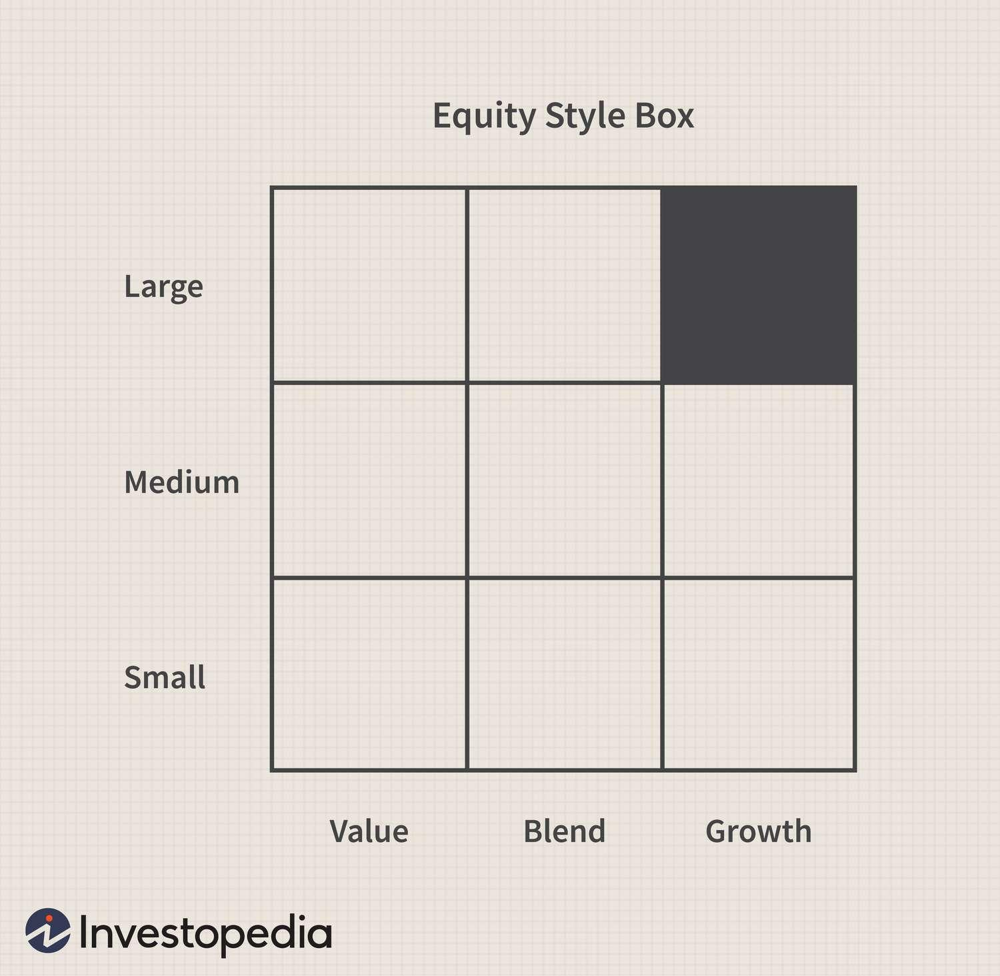

In the ever-evolving world of finance, investors constantly seek strategies that not only optimize returns but also effectively manage risk. Two prominent approaches that have garnered attention in recent years are the equity style box model and algorithmic trading. Each of these methodologies offers distinct advantages that investors can leverage to enhance their investment strategies.

The equity style box, introduced by Morningstar, provides a visual framework that categorizes stocks or mutual funds based on two key dimensions: market capitalization and investment style. This tool aids investors in understanding the risk-return profile of different investments by classifying them into nine distinct categories. This classification allows investors to construct a diversified portfolio that aligns with their risk tolerance and financial goals, thereby facilitating strategic asset allocation.



On the other hand, algorithmic trading has transformed traditional trading practices by utilizing complex algorithms to execute trades with unprecedented speed and accuracy. This technology-driven approach minimizes human error and improves trading efficiency, allowing for swift responses to market conditions. By analyzing vast amounts of data, algorithms can execute trades based on predefined criteria, offering a significant competitive edge in today's fast-paced financial markets.

This article provides a comprehensive analysis of how investment strategies can be enhanced through the integration of the equity style box model with algorithmic trading. By appreciating the significance of these tools, investors can make more informed decisions, aligning their strategies with their financial objectives and navigating the complexities of modern financial markets with greater confidence.

## Table of Contents

## Understanding the Equity Style Box

The equity style box is a straightforward yet effective tool developed by Morningstar to assist investors in categorizing stocks or mutual funds based on market capitalization and investment style. The primary goal of this tool is to aid in understanding the risk-return profile of different investments. By using the style box, investors can visualize how these two factors interact, enabling more informed decision-making regarding portfolio composition.

The equity style box is divided into nine classifications. The vertical axis represents market capitalization, segmented into large-cap, mid-cap, and small-cap stocks. These represent the size of the companies or funds, generally reflected by the total market value of their outstanding shares. Larger companies typically offer greater stability but potentially lower growth prospects compared to their smaller counterparts.

The horizontal axis captures the investment style, distinguished into value, blend, and growth. Value investments or funds usually focus on stocks perceived to be undervalued by the market, often characterized by lower price-to-earnings ratios or higher dividend yields. Growth investments target stocks expected to grow at an above-average rate compared to their peers, often reinvesting earnings to fuel further expansion rather than paying dividends. Blend represents a mixture of both value and growth approaches, providing a balanced investment strategy.

Incorporating the equity style box concept into portfolio management allows investors to achieve strategic asset allocation. By positioning their investments across different categories within the style box, investors can align their portfolios with personal risk tolerance levels and specific financial objectives. For example, an investor seeking capital appreciation might favor mid-cap [growth stocks](/wiki/growth-stocks), while one prioritizing income may opt for large-cap value stocks.

By visualizing how investments are distributed across these classifications, the equity style box serves as a powerful tool to ensure that portfolios are well-diversified. This diversification can reduce risk and enhance the potential for optimal returns by spreading investments across various asset categories with different risk and return characteristics. As such, the equity style box is a fundamental component for investors seeking to deploy effective portfolio management strategies in alignment with their individual investment goals.

## In-Depth Financial Analysis with Equity Style Box

Financial analysis through the equity style box framework empowers investors to comprehensively assess the performance of investments across diverse style categories. This analysis is primarily underpinned by key quantitative measures that are crucial in [fundamental analysis](/wiki/fundamental-analysis).

One of the pivotal metrics is the Price-to-Earnings (P/E) ratio, which serves as an indicator of how much investors are willing to pay per dollar of earnings. The P/E ratio is expressed as:

$$
\text{P/E Ratio} = \frac{\text{Market Price per Share}}{\text{Earnings per Share (EPS)}}
$$

A high P/E ratio may suggest that a stock is overvalued, or investors expect high growth rates in the future. In contrast, a low P/E might indicate undervaluation or potential issues within the company. Within the style box, comparing P/E ratios across categories helps investors identify investment patterns typical of growth or value stocks.

Another critical measure is beta ($\beta$), which estimates the [volatility](/wiki/volatility-trading-strategies) of a stock relative to the market. A beta greater than 1 indicates that the stock is more volatile than the market, whereas a beta less than 1 suggests less volatility. Incorporating beta into the style box analysis aids in understanding the systematic risk associated with different investments and aligns them with the investor’s risk preferences.

The Price-to-Book (P/B) ratio offers additional insight by comparing a company's market value to its book value. It is calculated as:

$$
\text{P/B Ratio} = \frac{\text{Market Price per Share}}{\text{Book Value per Share}}
$$

A lower P/B ratio might suggest undervaluation, presenting potential investment opportunities particularly within the value category of the style box. Conversely, a higher P/B ratio in the growth category might reflect investor confidence in future earnings expansion.

Dividend yield is another vital metric, representing the dividend income a stock generates relative to its price. It can be expressed as:

$$
\text{Dividend Yield} = \frac{\text{Annual Dividends per Share}}{\text{Market Price per Share}}
$$

High dividend yields could signify a steady income stream and stability, often aligned with large-cap value stocks. Meanwhile, lower yields might be acceptable in growth-oriented small-cap stocks if reinvestment prospects are high.

Integrating these metrics within the equity style box framework allows investors to pinpoint which investments align with their expectations regarding risk, growth potential, and income. This analysis facilitates a nuanced view of the attractiveness and risks of various investments, paving the way for more strategic asset allocation tailored to specific investment goals.

 to Algorithmic Trading

Algorithmic trading, commonly referred to as algo-trading, utilizes sophisticated algorithms to automate and execute trades at a remarkable speed and frequency that surpasses human capabilities. This advancement in technology has ushered in a paradigm shift in traditional trading methodologies by significantly reducing human error and enhancing trade execution efficiency and speed. 

These algorithms are designed to process vast amounts of data instantaneously, enabling traders to analyze market conditions and execute trades based on predefined criteria. This capability offers a substantial competitive edge in the dynamic and fast-paced financial markets. Algorithms can incorporate a range of decision-making parameters, including price, timing, and [volume](/wiki/volume-trading-strategy), to optimize trade execution. 

The primary advantage of [algorithmic trading](/wiki/algorithmic-trading) lies in its ability to integrate complex mathematical models and make split-second decisions, which is crucial for capitalizing on short-lived market opportunities. For example, a simple strategy could use a moving average crossover: 

```python
def moving_average(prices, window_size):
    return sum(prices[-window_size:]) / window_size

def should_buy(short_window, long_window, current_price):
    if short_window > long_window:
        return True
    return False

# Example usage
prices = [100, 102, 104, 101, 98, 105, 107, 106]
short_window_size = 3
long_window_size = 5

short_window = moving_average(prices, short_window_size)
long_window = moving_average(prices, long_window_size)

if should_buy(short_window, long_window, prices[-1]):
    print("Buy signal")
else:
    print("Hold or sell")
```

This script calculates the short and long moving averages to determine a buy signal based on predefined conditions. Such strategies can be scaled and refined to handle more significant market data, incorporating various technical indicators and historical patterns.

Apart from execution speed and data handling capabilities, algorithmic trading reduces market impact by breaking down large orders into smaller, strategically timed trades. This approach helps maintain favorable prices while preserving [liquidity](/wiki/liquidity-risk-premium). Additionally, it offers [backtesting](/wiki/backtesting) potential, allowing strategies to be rigorously examined against historical data, ensuring robustness before actual deployment. 

By leveraging these capabilities, algorithmic trading not only streamlines operations but also enables traders to focus on developing advanced strategies that align with their financial goals, thereby transforming how trading is conducted in modern financial markets.

## Integrating Style Box Analysis with Algorithmic Trading

Combining equity style box analysis with algorithmic trading provides investors with a potent strategy, harmonizing the evaluative capabilities of the style box with the precision and efficiency of algorithmic trading. This amalgamation facilitates a systematic and disciplined trading approach, enabling investors to adapt their portfolio allocations dynamically based on market conditions identified by algorithms. By doing so, investors can align their portfolios more closely with their risk tolerance and investment objectives.

The equity style box offers a framework for categorizing investments based on market capitalization and investment style. Incorporating this framework into algorithmic trading systems allows for real-time adjustments in portfolio allocations. Algorithms can monitor market data continuously, executing trades that maintain optimal distribution across style box quadrants, such as large-cap growth or mid-cap value, in response to evolving market dynamics.

For example, Python's `pandas` and `numpy` libraries could be utilized in algorithmic scripts to calculate and adjust asset allocation weights. Consider the following Python snippet demonstrating a simple allocation adjustment strategy:

```python
import pandas as pd
import numpy as np

# Sample data: Style box categories and initial allocations
categories = ['Large-Cap Growth', 'Mid-Cap Value', 'Small-Cap Blend']
initial_allocations = np.array([0.4, 0.3, 0.3])

# Simulated market adjustments impacting style categories
market_impact = np.array([0.05, -0.02, 0.01])  # percentage changes in each category

# Adjusting allocations based on market impact
adjusted_allocations = initial_allocations + market_impact
# Normalize to ensure total allocation sums to 1
adjusted_allocations /= adjusted_allocations.sum()

allocation_df = pd.DataFrame({'Category': categories, 
                              'Initial': initial_allocations, 
                              'Adjusted': adjusted_allocations})

print(allocation_df)
```

This script demonstrates how investments can be redistributed across different style categories by applying real-time market data, ensuring the portfolio remains diversified and aligns with expected risk/return profiles. Properly constructed algorithms benefit from the quantitative insight offered by the equity style box, applying this information to reinforce resilience against market volatility.

Additionally, algorithmic trading reduces emotional bias and enforces discipline by adhering to predefined rules and criteria for asset selection and allocation. This systematized approach enables investors to potentially achieve superior risk-adjusted returns while ensuring that portfolios remain well-diversified across the style box's categories.

Ultimately, the integration of style box analysis with algorithmic trading represents a forward-thinking approach, allowing investors to optimize their portfolios by responding swiftly and strategically to market shifts, thereby enhancing risk management and return potential.

## Advantages of Algorithmic Trading in Investment Strategies

Algorithmic trading offers numerous advantages in modern investment strategies, providing traders with tools to enhance efficiency and effectiveness. One of the primary benefits of algorithmic trading is its ability to execute trades at heightened speed and with precision. Unlike human traders, algorithms can perform trades in milliseconds, minimizing the time between decision-making and execution, which is crucial in fast-moving markets. This speed not only capitalizes on fleeting market opportunities but also reduces the risk of price slippage, where the execution price differs from the intended price due to market fluctuations.

Precision is another critical advantage of algorithmic trading. Algorithms are designed to reduce human errors, ensuring that trades are executed exactly as intended according to predefined criteria. This reduces the likelihood of costly mistakes that can occur with manual trading, such as misinterpreting data or entering incorrect trade amounts.

Backtesting capabilities are also a significant benefit of algorithmic trading. Traders can develop and test strategies using historical data to evaluate their potential success before deploying them in live markets. This process helps in refining strategies, improving their robustness, and understanding their behavior under various market conditions. By analyzing past performance, traders can adjust algorithm parameters for optimal future outcomes.

Another significant advantage of algorithmic trading is its positive impact on liquidity and price discovery. Since algorithms can process and analyze large volumes of data instantly, they facilitate greater market liquidity by matching buy and sell orders efficiently. This improved liquidity ensures that large trades can be executed without causing significant price movements, thereby minimizing market impact. Enhanced price discovery is achieved as algorithms rapidly adjust to new market information, leading to more accurate and timely pricing of securities.

In the context of mutual fund investments and portfolio strategies, the advantages of algorithmic trading can be harnessed effectively. For mutual funds, algorithmic trading can streamline the rebalancing process, maintaining target allocations across different market segments. This is particularly beneficial when incorporating diverse assets and strategies, such as those defined by the equity style box model. By automating portfolio adjustments, fund managers can maintain desired exposure to different investment styles and capitalizations with minimal delay.

Furthermore, for portfolio strategies, algorithmic trading enables the efficient implementation of complex investment strategies that require precise timing and order placement. Algorithms can be programmed to employ sophisticated risk management techniques, adjusting investment positions in real-time based on market developments. This allows for a proactive approach in managing volatility and capturing alpha, the excess return on an investment relative to the return of a benchmark index.

In conclusion, algorithmic trading significantly strengthens investment strategies by offering speed, precision, and robust testing capabilities. Its role in enhancing liquidity and price discovery, along with the ability to efficiently manage mutual funds and portfolios, underscores its importance in today's highly dynamic financial markets. As technology and data analytics continue to advance, the capabilities and reach of algorithmic trading are likely to expand, offering even greater benefits to investors.

## Challenges and Considerations

Algorithmic trading, despite its numerous benefits, comes with several challenges that investors must address to ensure effective implementation and alignment with their investment strategies. These challenges encompass technology dependency, market impact, and regulatory compliance issues, each of which can significantly influence trading outcomes and operational integrity.

**Technology Dependency**

The reliance on technology is a fundamental aspect of algorithmic trading. High-speed internet, sophisticated trading platforms, and powerful computational resources are essential to execute trades efficiently. However, this dependency introduces vulnerabilities such as system failures, software bugs, and cyber threats. Investors must prioritize robust IT infrastructure and maintain regular updates and audits to mitigate these risks. Employing redundancy solutions, such as backup systems and alternative communication networks, can further safeguard against technical disruptions.

**Market Impact**

While algorithmic trading offers improved liquidity and execution speed, it can also contribute to market destabilization. The sheer volume and rapid execution of trades can exacerbate market volatility, potentially leading to events like flash crashes. To manage this, traders should implement measures such as throttling mechanisms and staggered order executions to alleviate potential market stress. Understanding the market impact of specific algorithms is crucial, and continuous monitoring can help adjust strategies dynamically in response to market conditions.

**Regulatory Compliance**

The regulatory landscape governing algorithmic trading is complex and evolving. Compliance with regulations such as the Markets in Financial Instruments Directive II (MiFID II) in Europe and the Financial Industry Regulatory Authority (FINRA) rules in the United States is mandatory. These regulations address issues like market transparency, trade reporting, and risk controls. Investors must ensure their trading systems are compliant by integrating regulatory updates into their algorithms and maintaining thorough documentation and audit trails of their trading activities.

**Risk Management Protocols**

A comprehensive risk management framework is essential to address these challenges effectively. Protocols should include regular stress testing, scenario analysis, and adherence to pre-defined risk limits. Employing diversified strategies can also mitigate risks associated with specific trading algorithms. Additionally, investors should consider the transparency of their algorithmic models. Clear documentation and understanding of how models function can help maintain investor trust and ensure that the algorithms align with the broader investment objectives.

By addressing these challenges, investors can harness the full potential of algorithmic trading while maintaining the integrity and trustworthiness of their investment strategies. Enhanced transparency, robust technology infrastructure, and vigilant regulatory compliance are pivotal in navigating the complexities of modern trading environments.

## Conclusion and Future Outlook

The combination of equity style box analysis and algorithmic trading offers a compelling strategy in today's fast-paced financial environment, providing investors with a framework to better manage risk and achieve superior returns. By categorizing assets using style boxes, investors gain clarity on market capitalization and investment style, facilitating strategic allocations that align with individual risk profiles and financial goals.

Algorithmic trading complements this approach by leveraging automation to execute trades rapidly and accurately based on complex algorithms. This enables investors to respond to market fluctuations promptly, ensuring optimal portfolio adjustments without the delay inherent in manual trading processes.

As the technology underpinning algorithmic trading continues to advance, we can expect even greater integration of traditional financial analysis tools like the equity style box with cutting-edge trading techniques. This convergence will likely usher in a new era where investors are equipped with enhanced capabilities to not only analyze but also predict market trends, ultimately leading to data-driven investment decisions that are both agile and informed.

Investors who incorporate these tools into their strategies are positioned to benefit from a more robust investment process that aligns with both current market conditions and long-term financial objectives. In an age where rapid technological evolution is the norm, remaining adaptable and embracing these innovations is critical for success in portfolio management. As such, the ongoing blending of time-tested analytical methods with modern technological advancements is poised to become a fundamental aspect of investment strategy development, helping investors to navigate the complexities of the financial landscape more effectively.

## References & Further Reading

[1]: Bergstra, J., Bardenet, R., Bengio, Y., & Kégl, B. (2011). ["Algorithms for Hyper-Parameter Optimization."](https://dl.acm.org/doi/10.5555/2986459.2986743) Advances in Neural Information Processing Systems 24.

[2]: ["Advances in Financial Machine Learning"](https://www.amazon.com/Advances-Financial-Machine-Learning-Marcos/dp/1119482089) by Marcos Lopez de Prado

[3]: ["Evidence-Based Technical Analysis: Applying the Scientific Method and Statistical Inference to Trading Signals"](https://www.amazon.com/Evidence-Based-Technical-Analysis-Scientific-Statistical/dp/0470008741) by David Aronson

[4]: ["Machine Learning for Algorithmic Trading"](https://github.com/stefan-jansen/machine-learning-for-trading) by Stefan Jansen

[5]: ["Quantitative Trading: How to Build Your Own Algorithmic Trading Business"](https://www.amazon.com/Quantitative-Trading-Build-Algorithmic-Business/dp/1119800064) by Ernest P. Chan