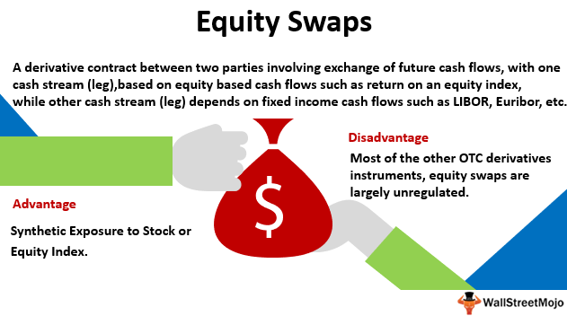

Financial derivatives have fundamentally changed modern investment strategies, offering investors a suite of instruments to manage risk and improve returns. These financial contracts, which derive their value from underlying assets such as equities, commodities, or interest rates, provide flexibility and precision in portfolio management. Among the variety of derivatives available, equity swaps have gained significant traction in sophisticated investment portfolios. An equity swap allows institutions and investors to exchange cash flows based on the performance of equity indices or individual stocks, providing exposure to market movements without direct ownership of the underlying securities.

In addition to derivatives, algorithmic trading—or algo trading—has transformed the trading landscape. This technology uses complex algorithms to execute trades at speeds and frequencies unreachable by human traders. The precision and efficiency introduced by algorithmic trading have enabled market participants to exploit price inefficiencies and execute sophisticated trading strategies that integrate seamlessly with financial derivatives.



Together, financial derivatives, with a focus on equity swaps, and algorithmic trading have reshaped investment approaches. This article will explore the intersection of these elements, providing a comprehensive guide to understanding their functionalities, advantages, and the strategic opportunities they present in modern finance.

## Table of Contents

## Understanding Financial Derivatives

Financial derivatives are complex financial instruments whose value is derived from an underlying asset, index, or interest rate. This intrinsic connection allows them to be inherently linked to the fluctuations and movements within financial markets. Common forms of financial derivatives include options, futures, and swaps. These instruments provide a dynamic approach to investment strategies, offering various applications in risk management, speculation, and portfolio optimization.

Derivatives are particularly vital for hedging risk. For example, a futures contract can be used by a commodities producer to lock in a price today for a product sold in the future, thereby mitigating the risk of price fluctuations. Similarly, options can allow investors to hedge against potential losses in a stock position by purchasing the right, but not the obligation, to sell the stock at a predetermined price.

Besides managing risk, derivatives also serve investors who wish to speculate on price movements without holding the underlying asset directly. This characteristic makes them popular among traders looking to leverage positions and potentially enhance returns. For instance, through leverage, a trader can control a large position in the market with a relatively small amount of capital, magnifying both potential gains and losses.

Equity swaps, a subclass of swaps, exemplify the customizable nature of derivatives. An equity swap is a derivative contract where two parties exchange cash flows based on the performance of equity indices or individual stocks, without directly owning the underlying equities. This structure can provide investors with exposure to specific sectors or indices, offering a tailored investment approach that aligns with their unique asset allocation needs or sector preferences.

Moreover, equity swaps can offer tax advantages. By exchanging returns through derivatives rather than direct ownership, investors may defer capital gains taxes and potentially enhance after-tax returns. However, it is crucial to consider the risks involved, such as credit risk, which arises from the potential default of the counterparty. 

Overall, the versatility of financial derivatives like equity swaps allows for precise and personalized financial strategies, accommodating a broad spectrum of risk appetite and investment objectives. This adaptability makes them indispensable in the toolkit of modern investors seeking to navigate and capitalize on market opportunities.

## What is an Equity Swap?

An equity swap is a financial derivative contract in which two parties agree to exchange a series of cash flows over a specified period. These cash flows are typically based on the performance of a specified equity index or asset. The primary purpose of an equity swap is to enable participants to gain exposure to equity markets without the need for direct ownership of the underlying securities.

In a typical equity swap arrangement, one party (the equity payer) agrees to provide returns equivalent to those generated by a specific equity asset, index, or portfolio of stocks. In exchange, the other party (the counterparty) pays a floating or fixed [interest rate](/wiki/interest-rate-trading-strategies), commonly linked to benchmarks such as the London Interbank Offered Rate (LIBOR). This structure allows the equity payer to benefit from any appreciation in the equity's value, while the counterparty receives predictable interest payments.

Equity swaps offer several advantages to institutions. They are often used as tools for diversification, as they enable participants to gain access to different sectors or geographic markets without having to acquire individual securities outright. Additionally, equity swaps can provide tax efficiencies. For example, by avoiding direct ownership, participants may defer taxation on capital gains until the swap contract is settled, potentially leading to favorable tax treatment.

However, engaging in equity swaps does come with inherent risks. One significant risk is counterparty risk, which arises from the potential default of one of the contractual parties. To mitigate this risk, parties often require collateral or engage with reputable financial institutions as counterparties.

Equity swaps are versatile and customizable, tailored to fit specific investment strategies and risk tolerances. Their flexibility and efficiency have made them a popular instrument among institutional investors seeking strategic equity exposure at reduced costs.

## How Equity Swaps Work

Equity swaps are financial derivatives that facilitate the exchange of cash flows between two parties. In a typical equity swap, one party agrees to pay a floating interest rate, often tied to a benchmark like the London Interbank Offered Rate (LIBOR), in exchange for receiving the returns of a specified equity index. This agreement allows investors to gain exposure to equity market movements without the need for direct ownership of the underlying stocks.

The customizable nature of equity swaps is one of their prominent features. Parties involved can negotiate terms to align with their specific investment preferences and risk profiles. Such terms may include the choice of equity index, the duration of the swap, and the frequency of cash flow exchanges. This flexibility is pivotal in crafting tailored investment strategies that meet individual or institutional objectives.

To illustrate how an equity swap might function, consider the scenario where Party A agrees to pay a floating rate, say LIBOR + 1%, to Party B. In return, Party A receives the returns of an equity index like the S&P 500. If the S&P 500 appreciates by 5% over the swap period, Party A gains a 5% return on the notional amount, whereas if the index falls by 2%, Party A bears that 2% loss, offsetting it against the floating rate payment to Party B.

Investors employ equity swaps to benefit from the performance of equity indices without actually purchasing the stocks that constitute the index. This can be advantageous for achieving diversification, managing exposure, or achieving tax efficiencies. However, such swaps also involve risks, particularly counterparty risk, where the possibility exists that one party may not fulfill their obligations under the contract.

By enabling indirect participation in the equity markets, equity swaps serve as a versatile tool for investors looking to optimize their financial operations, manage various risk factors, and potentially enhance portfolio returns.

## Algorithmic Trading and its Role in Derivatives Markets

Algorithmic trading, commonly referred to as algo trading, employs complex algorithms to execute trades at speeds and frequencies beyond the capability of human traders. These algorithms are pre-programmed with specific criteria such as timing, price, and [volume](/wiki/volume-trading-strategy), ensuring precision and minimizing human error. The automation provided by algo trading is particularly crucial in derivatives markets, where speed and accuracy can significantly affect a trader's ability to capitalize on short-lived opportunities.

In derivatives markets, where instruments like options, futures, and swaps dominate, algo trading enhances the ability to uncover and exploit [arbitrage](/wiki/arbitrage) opportunities. Arbitrage involves buying and selling equivalent assets to profit from price differences in various markets or forms, typically relying on minute discrepancies. With the precision and rapid execution facilitated by algorithmic systems, traders can execute these strategies almost instantaneously, maintaining a competitive edge.

Moreover, algo trading supports a variety of sophisticated strategies instrumental in derivatives markets. Trend-following strategies, for example, involve algorithms designed to identify and act on emerging market trends, making trades aligned with the direction of movement. This strategy is enhanced by the ability to process large volumes of data in real-time, allowing traders to react swiftly to changes.

Mean reversion strategies are another approach widely executed through [algorithmic trading](/wiki/algorithmic-trading). These strategies assume that prices will revert to their historical mean over time. Algorithms tracking price movements can execute trades by identifying and acting when prices deviate significantly from this mean, offering profitable opportunities for traders when executed promptly.

Market making—a strategy where [liquidity](/wiki/liquidity-risk-premium) is provided by continuously offering to buy and sell at quoted prices—also benefits from algorithmic systems. By maintaining updated bid and ask quotes, algorithms enable market makers to adjust quickly to market conditions, maintaining liquidity while profiting from the spread between buy and sell prices.

The implementation of algorithmic trading in derivatives markets is not without its challenges. Traders must be astute in developing and tuning algorithms to avoid potential pitfalls such as overfitting, where a model becomes too complex and performs poorly on unseen data. Regular [backtesting](/wiki/backtesting) against historical data is essential to refine these models, ensuring robust and adaptable strategies.

Overall, algorithmic trading is indispensable in modern derivatives markets, enabling the execution of intricate trading strategies that enhance market efficiency and liquidity. Through the automation of trade execution, it optimizes the speed and precision necessary to navigate the ever-evolving landscape of financial derivatives.

## Advantages and Risks of Algorithmic Trading

Algorithmic trading has transformed the financial markets by eliminating emotional bias and enabling trades to be executed at speeds far beyond the capabilities of human traders. This precision and speed provide a significant competitive advantage to traders and investors utilizing this technology. Through algorithms, decisions are made based on data-driven analysis and predefined criteria, reducing the potential for human error and emotional decision-making that can adversely affect trading outcomes.

A key advantage of algorithmic trading is its ability to conduct backtesting. Backtesting involves running trading algorithms against historical market data to evaluate their performance in past market conditions. This process helps traders develop better-informed trading strategies as they can refine their algorithms based on insights gained from historical data. By simulating trades over historical periods, traders can optimize their strategies to enhance profitability while minimizing risks.

Despite its numerous advantages, algorithmic trading is not without risks. One of the primary concerns is technical failure. As reliance on computer systems increases, so does the risk of software malfunctions, platform glitches, and connectivity issues, which can lead to significant financial losses. Therefore, robust technical infrastructure and frequent system checks are crucial to mitigate such risks.

Another risk is market impact. Large algorithmic trades can affect market prices, potentially leading to adverse price movements that negatively impact the trading strategy. Hence, algorithms need to be designed meticulously to minimize their impact on the market.

Overfitting is another potential pitfall in algorithmic trading. Overfitting occurs when an algorithm is excessively tailored to historical data to the extent that it loses the ability to perform well in real-time market conditions. It can be thought of as a model that is too complex, capturing noise rather than the underlying patterns. To avoid overfitting, it is essential to strike a balance between model complexity and generalization through techniques like cross-validation and regularization. 

To manage these risks effectively, continuous tuning and oversight of algorithms are necessary. Traders must regularly update and monitor their algorithms to adapt to changing market conditions and incorporate new information. Additionally, risk management protocols should be in place to address unforeseen events swiftly, such as automated trading halts in the case of significant market disruption.

By combining rigorous testing, monitoring, and adaptive strategy development, algorithmic trading continues to offer a powerful mechanism for participants looking to navigate the fast-paced environment of modern financial markets.

## Integration of Equity Swaps and Algorithmic Trading

Integrating equity swaps and algorithmic trading has transformed the landscape of modern finance by enabling the automated execution of sophisticated strategies that effectively hedge risks and optimize returns. This synergy provides institutional investors with advanced tools to enhance overall portfolio performance while meticulously managing risk levels.

Equity swaps, by their very nature, offer investors exposure to equities without owning the underlying assets. When combined with algorithmic trading, these swaps can be executed with greater precision and speed, facilitating the deployment of complex investment strategies that were previously impractical. The standard structure of an equity swap involves one party receiving equity index returns while paying a floating interest rate, typically linked to the London Interbank Offered Rate (LIBOR). This framework can be adapted algorithmically to align with dynamic market conditions.

Algorithmic trading utilizes sophisticated algorithms to trigger automated trading decisions based on quantifiable parameters and models. By integrating this technology with equity swaps, institutional investors can not only customize their exposure to desired equity assets but also react instantaneously to market shifts, efficiently capturing arbitrage opportunities and adjusting hedging positions as necessary.

For instance, consider a scenario wherein an algorithm detects a favorable shift in market [volatility](/wiki/volatility-trading-strategies). The system can automatically adjust the terms of equity swaps—such as modifying the exposure to certain indices—to capitalize on this market movement. Python, a popular language for financial analytics, facilitates such functionalities with libraries like NumPy and pandas. Below is an example code snippet showing how a simple swap transaction could be modeled to react to market changes:

```python
import numpy as np

# Hypothetical equity swap return data
equity_index_returns = np.array([0.02, 0.015, -0.01, 0.03])
interest_rate = 0.01  # LIBOR rate

# Calculate net returns from swap
def calculate_swap_returns(returns, rate):
    return [r - rate for r in returns]

net_returns = calculate_swap_returns(equity_index_returns, interest_rate)
print("Net returns from equity swap:", net_returns)
```

The integration of these two powerful financial instruments also leads to enhanced market tactical opportunities. For instance, the ability to rapidly recalibrate a portfolio's exposure in response to market data inputs is a significant advantage that allows for real-time optimization and risk management. This real-time adaptability could prevent losses that might otherwise occur due to delayed manual trading decisions.

Moreover, institutional investors harnessing these technologies benefit from reduced transaction costs due to the high speed and precision of algorithmically executed trades. These automated systems can simultaneously monitor vast amounts of data across multiple sources, making timely and efficient adjustments far beyond the capability of traditional manual trading methods.

In conclusion, the combined use of equity swaps and algorithmic trading represents a sophisticated evolution in trading strategies, providing investors with unparalleled avenues for optimizing returns while maintaining controlled risk exposure. Institutional investors leveraging these tools are uniquely positioned to navigate complex and rapidly changing financial landscapes.

## Conclusion

The strategic use of equity swaps and algorithmic trading is revolutionizing financial markets by opening unprecedented opportunities for investors. These investment instruments allow for sophisticated risk management and enhanced return strategies that were previously unattainable through traditional means. With equity swaps, investors can gain market exposure efficiently and benefit from practices such as diversification and tax optimization, all while avoiding the complexities and costs associated with direct equity ownership. Simultaneously, algorithmic trading empowers traders and institutions to execute trades with remarkable speed and precision, capitalizing on market inefficiencies and minimizing human error.

To fully harness the potential of these advanced financial tools, it's imperative for traders and investment firms to understand and implement them effectively. This means developing a strong grasp of the underlying principles and dynamics that drive equity swaps and algorithmic trading. Furthermore, successful integration of these instruments requires continual education and adaptation to the ever-evolving market landscape. By investing in knowledge and technical skills, market participants can adeptly navigate complex market conditions and enhance their portfolios' long-term performance.

Ultimately, the continuous innovation in financial technologies underscores the need for a forward-thinking approach to investment strategies. As equity swaps and algorithmic trading become more ingrained in the fabric of financial markets, they promise to redefine investment methodologies and yield greater opportunities for those equipped with the proper tools and insights.

## References & Further Reading

[1]: ["Options, Futures, and Other Derivatives"](https://www.amazon.com/Options-Futures-Other-Derivatives-10th/dp/013447208X) by John C. Hull

[2]: ["The Handbook of Equity Derivatives"](https://www.amazon.com/Handbook-Derivatives-Revised-Financial-Engineering/dp/0471326038) by Jack Clark Francis, William W. Toy, and J. Gregg Whittaker

[3]: Bouchaud, J.-P., & Potters, M. (2003). ["Theory of Financial Risk and Derivative Pricing: From Statistical Physics to Risk Management"](https://www.cambridge.org/core/books/theory-of-financial-risk-and-derivative-pricing/5BBBA04CE72ED9E5E7C1C028D9A94FCB). Cambridge University Press.

[4]: ["Algorithmic Trading and DMA: An Introduction to Direct Access Trading Strategies"](https://archive.org/details/algorithmictradi0000john) by Barry Johnson

[5]: Aldridge, I. (2013). ["High-Frequency Trading: A Practical Guide to Algorithmic Strategies and Trading Systems"](https://www.amazon.com/High-Frequency-Trading-Practical-Algorithmic-Strategies/dp/1118343506). Wiley Finance.

[6]: ["Swap Credit Risk"](https://link.springer.com/content/pdf/10.1007/978-1-349-14484-6_6.pdf) by Manuel Ammann in Financial Derivatives: Pricing, Applications, and Mathematics

[7]: Jarnecic, E., & Snape, M. (2015). ["The Provision of Liquidity by High-Frequency Participants."](https://onlinelibrary.wiley.com/doi/10.1111/fire.12040) The Review of Financial Studies, 28(7), 1983-2015.