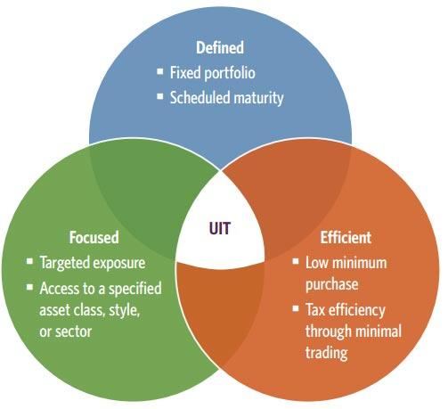

## Table of Contents

## What is an Equity Unit Investment Trust (EUIT)?

An Equity Unit Investment Trust (EUIT) is a type of investment fund that pools money from many investors to buy a variety of stocks. It's like a basket where you put different kinds of fruits, but in this case, the fruits are shares of different companies. The goal of an EUIT is to give investors a chance to own a piece of many companies at once, which can help spread out the risk. Instead of buying stocks one by one, which can be risky if one company does badly, an EUIT lets you own a little bit of many companies.

EUITs are managed by professionals who decide which stocks to buy and sell. This means you don't have to pick the stocks yourself, which can be hard and time-consuming. The professionals aim to choose stocks that will grow in value over time, helping your investment grow too. However, like all investments, EUITs can go up or down in value, so there's always some risk involved. But because they hold a mix of stocks, they can be a good way to invest in the stock market without putting all your money into just one or two companies.

## How does an Equity Unit Investment Trust function?

An Equity Unit Investment Trust (EUIT) works by taking money from many investors and using it to buy a collection of stocks. Think of it as a big shopping basket where the manager of the EUIT picks out different stocks to put inside. These stocks can be from all sorts of companies, big and small, and from different industries. The idea is to spread out the risk so that if one company does poorly, the others might do well and balance it out. The EUIT manager keeps an eye on these stocks, deciding when to buy more or sell some, always trying to make the basket grow in value over time.

When you invest in an EUIT, you're buying a small piece of this big basket of stocks. Your money is mixed with everyone else's, and together, it's used to own parts of many companies. This means you don't have to worry about [picking](/wiki/asset-class-picking) individual stocks yourself. The value of your investment in the EUIT goes up or down based on how well the stocks inside the basket are doing. If the stocks go up in value, so does your investment. But if they go down, so does your investment. This way, an EUIT lets you join the stock market in a way that's easier and can be less risky than buying stocks on your own.

## What are the main components of an EUIT?

An Equity Unit Investment Trust (EUIT) has a few key parts that make it work. The first part is the money that comes from investors. People put their money into the EUIT, and this money is what the trust uses to buy stocks. The more money the EUIT gets, the more stocks it can buy, which means it can own a bigger and more diverse collection of companies.

The second important part is the basket of stocks itself. The EUIT manager picks out different stocks to put into this basket. These stocks can come from all kinds of companies and industries. The goal is to have a mix of stocks so that if one company doesn't do well, others might do better and help balance things out. The value of the EUIT goes up or down based on how these stocks perform.

Lastly, there's the management team. These are the professionals who decide which stocks to buy and sell. They keep an eye on the market and make choices to try and make the EUIT grow in value over time. Their job is to manage the basket of stocks in a way that's good for all the investors who have put their money into the EUIT.

## Who can invest in an Equity Unit Investment Trust?

Anyone who wants to invest in the stock market can put their money into an Equity Unit Investment Trust (EUIT). You don't need to be rich or a stock market expert. As long as you have some money to invest, you can join an EUIT. It's a good choice for people who want to own a piece of many companies without having to pick the stocks themselves.

EUITs are popular with both new and experienced investors. If you're new to investing, an EUIT can be a simple way to start because the professionals manage the stocks for you. If you're already experienced, an EUIT can be a way to spread your money across many stocks without having to manage them all on your own. Either way, an EUIT can be a helpful tool for anyone looking to grow their money in the stock market.

## What are the benefits of investing in an EUIT for beginners?

Investing in an Equity Unit Investment Trust (EUIT) can be really helpful for beginners. It's like buying a little bit of a lot of different companies all at once. This way, you don't have to worry about picking the right stocks yourself. The EUIT has professionals who do that for you. They choose a mix of stocks from different companies and industries, which helps spread out the risk. If one company doesn't do well, others might do better and balance it out.

Another big benefit for beginners is that EUITs are easy to understand and manage. You don't need to spend a lot of time watching the stock market or learning how to buy and sell stocks. Once you put your money into an EUIT, the professionals take care of everything. This makes it a simple way to start investing in the stock market without feeling overwhelmed. Plus, because EUITs own many different stocks, they can be a safer way to invest than putting all your money into just one or two companies.

## How does an EUIT differ from other types of investment trusts?

An Equity Unit Investment Trust (EUIT) is different from other types of investment trusts mainly because it focuses only on stocks. While other investment trusts might put money into bonds, real estate, or other kinds of investments, an EUIT sticks to buying shares in companies. This makes it a good choice for people who want to invest in the stock market but don't want to pick individual stocks themselves. The EUIT's professionals manage the basket of stocks, trying to pick ones that will grow in value over time.

Another way EUITs differ is in how they are managed. Some other investment trusts, like mutual funds, might have active managers who buy and sell stocks more often, trying to beat the market. EUITs usually have a more set approach. They buy a mix of stocks and hold onto them, aiming to grow steadily over the long term. This can make EUITs a bit less risky than some other trusts because they don't change their investments as much. For beginners, this can be a simpler and less stressful way to start investing in stocks.

## What are the risks associated with investing in an EUIT?

Investing in an Equity Unit Investment Trust (EUIT) comes with some risks that you should know about. One big risk is that the value of the stocks inside the EUIT can go down. Since the EUIT is made up of a bunch of different stocks, if the stock market as a whole has a bad day, week, or even year, the value of your investment could drop. This is called market risk, and it's something all stock investors have to deal with. Even though the EUIT tries to spread out the risk by holding many different stocks, it can't protect you completely from the ups and downs of the market.

Another risk is that the professionals who manage the EUIT might not pick the best stocks. They try their best to choose stocks that will grow in value, but they can make mistakes. If the stocks they pick don't do well, the value of the EUIT could go down. This is called management risk. It's important to remember that no investment is completely safe, and while EUITs can help spread out risk, they can still lose value. So, it's a good idea to think carefully and maybe talk to a financial advisor before putting your money into an EUIT.

## How is the performance of an EUIT measured and evaluated?

The performance of an Equity Unit Investment Trust (EUIT) is measured by looking at how much the value of the stocks it holds goes up or down over time. This is usually shown as a percentage change, like if the value of the EUIT went up by 5% in a year. People also look at something called the total return, which includes any money the EUIT makes from dividends, which are payments companies make to their shareholders. If you want to see how well the EUIT is doing compared to the overall stock market, you can compare its performance to a stock market index, like the S&P 500. If the EUIT does better than the index, it's doing a good job.

To evaluate an EUIT, investors also look at how much risk they're taking on. This is often measured by something called [volatility](/wiki/volatility-trading-strategies), which is how much the EUIT's value goes up and down. A high volatility means the EUIT's value can change a lot, which is riskier. Another way to evaluate an EUIT is to look at its expense ratio, which is how much it costs to manage the trust. A lower expense ratio means more of your money stays invested, which can help the EUIT perform better over time. By looking at these things, investors can decide if an EUIT is a good fit for their investment goals and how comfortable they are with the risks involved.

## What role do trustees play in managing an EUIT?

Trustees play a very important role in managing an Equity Unit Investment Trust (EUIT). They are like the guardians of the trust, making sure everything is done correctly and fairly. The trustees keep an eye on the professionals who manage the stocks inside the EUIT. They make sure these professionals are following the rules and doing what's best for the investors. If the managers aren't doing a good job, the trustees can step in and make changes to protect the investors' money.

The trustees also handle the paperwork and legal stuff for the EUIT. They make sure all the reports and documents are correct and that the EUIT follows all the laws and regulations. This helps keep the EUIT honest and trustworthy. By doing these things, the trustees help make sure that the EUIT runs smoothly and that the investors' interests are always looked after.

## How can advanced investors use EUITs to diversify their portfolios?

Advanced investors can use Equity Unit Investment Trusts (EUITs) to diversify their portfolios by adding a broad range of stocks from different companies and industries. Since EUITs hold a basket of stocks, they can help spread out the risk that comes with investing in just a few companies. For example, if an advanced investor already has a lot of money in tech stocks, they might choose an EUIT that focuses on other sectors like healthcare or energy. This way, if the tech market takes a hit, the other parts of their portfolio might do better and balance things out.

Another way advanced investors can use EUITs is to get exposure to stocks they might not have time to research on their own. EUITs are managed by professionals who keep an eye on the market and pick stocks they think will do well. This can save advanced investors a lot of time and effort. Plus, EUITs often have lower costs than actively managed funds, which can be a big plus for investors looking to keep their expenses down while still getting a diversified investment. By adding EUITs to their portfolios, advanced investors can enjoy the benefits of diversification and professional management without having to do all the work themselves.

## What are the tax implications of investing in an EUIT?

When you invest in an Equity Unit Investment Trust (EUIT), you need to think about taxes. The main tax you'll deal with is capital gains tax. This tax comes into play when you sell your shares in the EUIT for more than you paid for them. The profit you make is called a capital gain, and you'll have to pay tax on it. How much tax you pay depends on how long you held the shares. If you held them for more than a year, it's a long-term capital gain, and the tax rate is usually lower. If you held them for a year or less, it's a short-term capital gain, and you'll pay your regular income tax rate on it.

Another tax to keep in mind is the tax on dividends. If the companies in the EUIT pay out dividends, those dividends are usually passed on to you. You'll have to pay tax on these dividends, too. The tax rate on dividends can be different from your regular income tax rate, so it's good to know what it is. Remember, tax laws can change, and they can be different depending on where you live. It's always a smart idea to talk to a tax advisor to understand how investing in an EUIT will affect your taxes.

## How have regulatory changes affected the structure and operations of EUITs in recent years?

In recent years, regulatory changes have had a big impact on how Equity Unit Investment Trusts (EUITs) are set up and run. One big change is that regulators now want more transparency. This means EUITs have to tell investors more about what stocks they are buying and selling, and how much it costs to manage the trust. This helps investors make better choices about where to put their money. Another change is about how EUITs report their performance. They have to follow stricter rules now, so investors can see more clearly how well the EUIT is doing compared to other investments.

These changes have also made EUITs safer for investors. Regulators have put in place new rules to make sure the professionals who manage the EUITs are doing their job well and not taking too many risks. This means EUITs have to stick to certain limits on what they can invest in, which helps protect the money that investors put in. Overall, these regulatory changes have made EUITs more open and secure, helping investors feel more confident about putting their money into them.

## References & Further Reading

[1]: Bergstra, J., Bardenet, R., Bengio, Y., & Kégl, B. (2011). ["Algorithms for Hyper-Parameter Optimization."](https://dl.acm.org/doi/10.5555/2986459.2986743) Advances in Neural Information Processing Systems 24.

[2]: ["Advances in Financial Machine Learning"](https://www.amazon.com/Advances-Financial-Machine-Learning-Marcos/dp/1119482089) by Marcos Lopez de Prado

[3]: ["Evidence-Based Technical Analysis: Applying the Scientific Method and Statistical Inference to Trading Signals"](https://www.amazon.com/Evidence-Based-Technical-Analysis-Scientific-Statistical/dp/0470008741) by David Aronson

[4]: ["Machine Learning for Algorithmic Trading: Predictive models to extract signals from market and alternative data for systematic trading strategies with Python"](https://github.com/stefan-jansen/machine-learning-for-trading) by Stefan Jansen

[5]: ["Quantitative Trading: How to Build Your Own Algorithmic Trading Business"](https://www.amazon.com/Quantitative-Trading-Build-Algorithmic-Business/dp/1119800064) by Ernest P. Chan